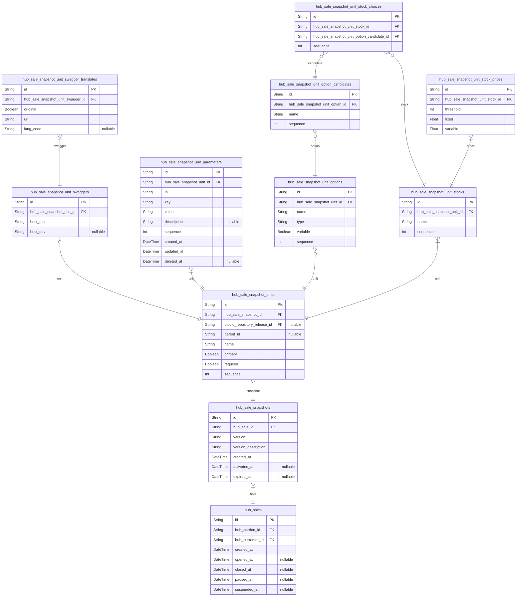

# Prisma Markdown
> Generated by [`prisma-markdown`](https://github.com/samchon/prisma-markdown)

- [Articles](#articles)
- [Systematic](#systematic)
- [Actors](#actors)
- [Sales](#sales)
- [SaleContents](#salecontents)
- [Audits](#audits)
- [Inquiries](#inquiries)
- [Orders](#orders)
- [Issues](#issues)
- [Deposits](#deposits)
- [Coupons](#coupons)
- [PushMessage](#pushmessage)
- [Account](#account)
- [Repositories](#repositories)
- [Workflows](#workflows)
- [Releases](#releases)
- [Meta](#meta)
- [default](#default)

## Articles


### `attachment_files`
Attachments.

Attachment entities used everywhere in this DB.

**Properties**
  - `id`: 
  - `name`: File name, excluding extension.
  - `extension`: Extension.
  - `url`: URL path to the file.
  - `created_at`: The date and time the record was created.

### `bbs_articles`
Article entity.

`bbs_articles` is a supertype entity for all types of articles existing 
in the current exchange system, and literally embodies individual articles 
on the bulletin board.

And elements such as titles and texts that must exist in articles do not exist 
in this `bbs_articles`, but exist in a 1:N relationship in the lower entity, 
[bbs_article_snapshots](#bbs_article_snapshots), because a new snapshot record is issued every time 
an article is modified.

The reason for issuing a new snapshot record every time an article is modified 
is to preserve evidence. Due to the nature of e-commerce, there is always 
a threat of conflict between participants.

And disputes can arise through articles or comments on them, and in this case, 
articles are designed in this structure to prevent manipulation of the situation 
by modifying existing articles.

To prevent so-called 'undercutting', keeping evidence and preventing fraud.

**Properties**
  - `id`: 
  - `type`: The type of subtype.
  - `created_at`: The date and time the article was created.
  - `deleted_at`: Date and time of article deletion.

### `bbs_article_snapshots`
Article Snapshots

`bbs_article_snapshots` is a snapshot entity that contains the content of 
an article. As explained in [bbs_articles](#bbs_articles), the content is separated 
from the article record to prevent undercutting.

**Properties**
  - `id`: Primary Key.
  - `bbs_article_id`: [bbs_articles.id](#bbs_articles) of the attached article
  - `format`
    > Format of the body.
    > 
    > Similar meanings of extensions: html, md, txt, etc.
  - `title`: Title of the article
  - `body`: Article body content
  - `created_at`
    > Record creation date.
    > 
    > When the article was first created or edited.

### `bbs_article_snapshot_files`
Attachment files of article snapshots.

`bbs_article_snapshot_files` is an entity that visualizes attachment files 
of article snapshots.

`bbs_article_snapshot_files` is a typical pair relationship table that 
resolves the M: N relationship between [bbs_article_snapshots](#bbs_article_snapshots) and
[attachment_files](#attachment_files). And to ensure the order of attachment files, it has 
an additional property, [bbs_article_snapshot_files.sequence](#bbs_article_snapshot_files). 

This is a pattern that we will continue to see in the future, so let's get 
used to it in advance.

**Properties**
  - `id`: 
  - `bbs_article_snapshot_id`: [bbs_article_snapshots.id](#bbs_article_snapshots) of the attributed article snapshot
  - `attachment_file_id`: [attachment_files.id](#attachment_files)
  - `sequence`: The order in which attachments are placed in the article snapshot.

### `bbs_article_comments`
Comments written on an article.

`bbs_article_comments` is an entity that visualizes comments written on an article.

And this comment, as in the relationship between [bbs_articles](#bbs_articles) 
and [bbs_article_snapshots](#bbs_article_snapshots), is stored in the subordinate
[bbs_article_comment_snapshots](#bbs_article_comment_snapshots) for evidentialism, and a new snapshot 
record is issued whenever a comment is modified.

In addition, the relationship between replies is expressed through the 
[bbs_article_comments.parent_id](#bbs_article_comments) property.

**Properties**
  - `id`: 
  - `bbs_article_id`: [bbs_articles.id](#bbs_articles) of the attached article.
  - `parent_id`
    > The ID of the parent comment.
    > 
    > Used when writing a reply.
  - `type`: The type of subtype.
  - `created_at`: Comment creation date and time.
  - `deleted_at`: Comment deletion date and time.

### `bbs_article_comment_snapshots`
Comment snapshots.

`bbs_article_comment_snapshots` is a snapshot entity that contains 
the main content of the comment.

As explained in [bbs_article_comments](#bbs_article_comments) above, to prevent undercutting.

**Properties**
  - `id`: 
  - `bbs_article_comment_id`: [bbs_article_comments.id](#bbs_article_comments) of the comment on the attached article.
  - `format`
    > Format of the body.
    > 
    > Similar meanings of extensions: html, md, txt, etc.
  - `body`: Comment body.
  - `created_at`: Record creation date and time (when the comment was first created or edited)

### `bbs_article_comment_snapshot_files`
Attachments to comment snapshots.

[bbs_article_comment_snapshots](#bbs_article_comment_snapshots) [attachment_files](#attachment_files)

M: N relationship resolution.

**Properties**
  - `id`: 
  - `bbs_article_comment_snapshot_id`: [bbs_article_comment_snapshots.id](#bbs_article_comment_snapshots) of the attributed comment snapshot
  - `attachment_file_id`: [attachment_files.id](#attachment_files)
  - `sequence`
    > Batch order.
    > 
    > The order in which the files attached to the comment snapshot are placed.

### `hub_external_swagger_documents`
URL Swagger Information.

Table that stores URL Swagger Information.

**Properties**
  - `id`: Primary Key.
  - `src_url`: Swagger URL.
  - `version`: Swagger version.
  - `created_at`: The date and time the record was created.

### `hub_external_swagger_document_translates`
URL Swagger Translation Information.

Table that stores URL Swagger Translation Information.

**Properties**
  - `id`: Primary Key.
  - `url_swagger_id`: swagger의 [url_swagger.id](#url_swagger)
  - `original`: Whether it's original swagger or not.
  - `url`: Swagger's S3 URL.
  - `lang_code`: Swagger language code.


## Systematic


### `hub_channels`
Hub channel information.

`hub_channels` is a concept that visualizes distribution channels in the 
API brokerage market. In this system, a different channel means a different site or 
application. Therefore, Wrtn Generative Hub (https://hub.wrtn.com, tentative name) 
is also a channel. 

Of course, Generative Hub currently has only one channel, but it is prepared in 
advance for future scalability. Like [hub_external_users](#hub_external_users), it is a concept 
designed in advance for possible future partnerships. For reference, if Wrtn launches 
another site (application) with a different brand name other than Generative Hub, or 
Wrtn uses it for embedding (`<iframe/>`) when you are launching a simple hub site and 
distributing it to partners, you will also need a new channel.

> The basic code is `wrtn`

**Properties**
  - `id`: 
  - `code`: Identifier code.
  - `name`: Channel name.
  - `exclusive`
    > Exclusivity.
    > 
    > If this value is `true`, the channel is isolated from other channels,
    > and does not share customer information.
  - `created_at`: The date and time the record was created.
  - `updated_at`: Date and time of record edit.
  - `deleted_at`: Date and time of record deletion.

### `hub_channel_categories`
Channel category information.

`hub_channel_categories` is a concept that means a classification category 
within a specific channel, and it is exactly the same as the concept that is 
usually referred to as "category" in shopping malls.

And `hub_channel_categories` means a "corner", which is an independent spatial 
information in offline markets, and unlike [items](#hub_sales), which cannot 
be simultaneously classified, one item can be simultaneously classified in 
multiple categories.

For example, beef and grapes can belong to the fruit corner and the meat corner, 
respectively, but they do not belong to any of the categories, and can form 
independent M: N relationships with various categories according to the 
characteristics of each product.

Product | Corner | Category
-------|---------|------------------------
Beef | Meat Corner | Frozen Food, Meat, Specialty Food
Grapes | Fruit Corner | Fresh food, convenience food

In addition, categories have a 1: N recursive structure, so hierarchical 
expressions are possible as shown below. Also, categories can be set differently 
for each [channel](#hub_channels), so each [channel](#hub_channels) can 
freely set the category classification they want.

- Grocery > Meat > Frozen
- Electronic devices > Laptop > 15-inch
- Miscellaneous goods > Wallets

For reference, since the API supports (or plans to support) a merge function 
between multiple categories, there will be no particular burden in constantly
editing categories.

**Properties**
  - `id`: Primary Key.
  - `hub_channel_id`: [hub_channels.id](#hub_channels) of the affiliated channel.
  - `parent_id`
    > [hub_channel_categories.id](#hub_channel_categories) of the parent category.
    > 
    > If it corresponds to a subcategory of a specific category.
  - `name`
    > English name.
    > 
    > English name participates in the unique constraint.
  - `background_color`: Category background color.
  - `background_image_url`: Category background image.
  - `created_at`: The date and time the record was created.
  - `updated_at`: Date and time the record was modified.
  - `deleted_at`: Date and time of record deletion.

### `hub_sections`
Section information.

`hub_sections` is an entity designed to express section information in the market.

If we compare the section mentioned here to a mart, it means a spatially 
separated area in the store, such as "fruit corner" or "meat corner." Currently, 
the only section that exists in Luton's Generative Hub is "API Market", 
but it is a concept designed in advance for future expansion.

And unlike [listing](#hub_sales), which can be simultaneously classified,
sections can only be classified for one listing. In other words, one listing 
can only belong to one section.

> The basic code is `generative`

**Properties**
  - `id`: 
  - `code`: Identifier code.
  - `name`: Section name.
  - `created_at`: The date and time the record was created.
  - `updated_at`: Date and time the record was modified.
  - `deleted_at`: Date and time of record deletion.

### `studio_channel_categories`
Channel-specific category information of the studio.

`studio_channel_categories` is an entity that visualizes the channel-specific 
classification categories in the studio, and it is exactly the same as the 
concept of "category" that is commonly referred to in shopping malls.

And compared to [hub_channel_categories](#hub_channel_categories), the only difference is whether 
the target is an API brokerage exchange or a studio asset, but their roles are 
the same.

**Properties**
  - `id`: Primary Key.
  - `hub_channel_id`: [hub_channels.id](#hub_channels) of the affiliated channel.
  - `parent_id`
    > [studio_channel_categories.id](#studio_channel_categories) of the parent category.
    > 
    > If it corresponds to a subcategory of a specific category.
  - `name`: Category name.
  - `created_at`: The date and time the record was created.
  - `updated_at`: Date and time the record was modified.
  - `deleted_at`: Date and time of record deletion.


## Actors


### `hub_customers`
Customer information, but based on access criteria, not people.

`hub_customers` is an entity that literally embodies the information of 
those who participated in the market as customers. `hub_customers` issues 
a new record for each access, even if they are the same person.

The first purpose is to track the customer inflow path in detail, 
and the second is to prevent cases where the same person enters as a non-member, 
diligently puts [items](#hub_sales) in the 
[shopping cart](#hub_cart_commodities) in advance, and only then does 
[real name verification](#hub_citizens) or 
[membership registration/login](#hub_members) at the moment of payment. 
Lastly, the same person also accesses [external service](#hub_external_users),
purchases [hub_orders](#hub_orders), creates multiple [accounts](#hub_members) 
to make purchases, purchases after only authenticating their real names as 
non-members, and sometimes acts as a [seller](#hub_sellers) or 
[administrator](#hub_administrators), to accurately track the activities that 
one person does on the exchange in various ways.

Therefore, `hub_customers` can have multiple records with the same 
[hub_citizens](#hub_citizens) or [hub_members](#hub_members) and [hub_external_users](#hub_external_users). 
Also, if a customer signs up for membership after authenticating their real name, 
or signs up for our service after being an external service user, all related 
records are changed at once. Therefore, customer identification and tracking 
can be done very systematically.

**Properties**
  - `id`: 
  - `hub_channel_id`: [hub_channels.id](#hub_channels) of the affiliate channel
  - `hub_member_id`: [hub_members.id](#hub_members) of affiliated members
  - `hub_external_user_id`: [hub_external_users.id](#hub_external_users)
  - `hub_citizen_id`: [hub_citizens.id](#hub_citizens) of the citizenship
  - `href`
    > Access address
    > 
    > Use [window.location.href](#window)
  - `referrer`
    > Referrer URL on browser.
    > 
    > Use [window.document.referrer](#window)
  - `ip`: IP 주소.
  - `readonly`: Whether read-only or not.
  - `lang_code`: 
  - `created_at`: The date and time the record was created.

### `hub_authenticate_tokens`
A personal API KEY that can access the API.

**Properties**
  - `id`: 
  - `hub_channel_id`: [hub_channels.id](#hub_channels) of the affiliate channel
  - `hub_customer_id`: Affiliate member's [hub_customers.id](#hub_customers)
  - `title`: API KEY title.
  - `value`: API KEY value.
  - `expired_at`
    > KEY expiration date.
    > 
    > If null, unlimited KEY with no expiration date.
  - `created_at`: Record creation date and time
  - `deleted_at`: Record deletion date

### `hub_external_users`
External user information.

An entity for when this system is linked to an external service and 
their users are accepted as customers of this service.

For reference, customers who access from an external service must have 
this record, and the external service user is identified through the 
two attributes `application` and `uid`. If a customer who accessed from 
an external service completes [real-name authentication](#hub_citizens) 
from this service, the external service user starts with the real-name 
authentication completed whenever he or she re-accesses this service and 
issues a new [customer](#hub_customers) authentication token. 
This is also the case for [membership](#hub_members) registration.

And `password` is a password issued to the user by the external service system
(so-called user permanent authentication token), and is never an actual user 
password. However, it is used to determine whether a customer who entered the 
same `application` and `uid` as the current external system user is 
a correct external system user or a violation.

In addition, additional information received from external services can be 
recorded in the `data` field in JSON format.

**Properties**
  - `id`: 
  - `hub_channel_id`: [hub_channels.id](#hub_channels) of the affiliated channel
  - `hub_citizen_id`: [hub_citizens.id](#hub_citizens) of the citizens
  - `hub_member_id`: [hub_members.id](#hub_members) of affiliated members
  - `hub_external_user_content_id`: [hub_external_user_contents.id](#hub_external_user_contents)
  - `application`
    > The identifier code of the external service.
    > 
    > It is most likely the same as [hub_channels.code](#hub_channels).
  - `uid`: An identifier key for that user in an external service.
  - `nickname`: User nickname on external services.
  - `data`: Additional information from external services.
  - `password`
    > System password for external service users.
    > 
    > This is a password issued by the external service to the user, 
    > and is never the actual user password. However, it is used to determine 
    > whether a customer who entered the same `application` and `code` as the 
    > current external system user is considered a valid external system user 
    > or a violation.
  - `created_at`: Record creation date and time (first external user authentication date and time)

### `hub_external_user_contents`
Additional information for external user content.

`hub_external_user_contents` is an entity that records additional information for [external user content](#hub_external_users).

**Properties**
  - `id`: 
  - `jobs`: List of user job information.
  - `gender`: User gender information.
  - `birthYear`: User's date of birth.
  - `interests`: User interest information.
  - `provider`: User's primary provider information.
  - `purposes`: User Key Consumer Information.
  - `created_at`: The date and time the record was created.

### `beta_user`
Beta Tester User Information.

**Properties**
  - `id`: ---
  - `email`: Email address.
  - `created_at`: The date and time the record was created.

### `hub_citizens`
Citizen authentication information.

`hub_citizens` is an entity that records the user's real name and 
mobile phone input information.

For reference, in Korea, real name authentication is required for e-commerce 
participants, so the `name` attribute is important. However, the situation is 
different overseas, so in reality, the `mobile` attribute is the most important, 
and individual user identification is also based on this `mobile`.

Of course, real name and mobile phone authentication information are encrypted 
and stored.

**Properties**
  - `id`: 
  - `hub_channel_id`
    > [hub_channels.id](#hub_channels) of the affiliated channel
    > 
    > This is to manage personal information separately for each channel, 
    > and also to recognize cases where the same citizen is authenticated 
    > on different channels.
  - `mobile`
    > Mobile phone number.
    > 
    > It is stored encrypted, so like searches are not possible.
  - `name`
    > Real name or a similar name.
    > 
    > It is stored encrypted, so like searches are absolutely impossible.
  - `created_at`: The date and time the record was created.
  - `deleted_at`
    > Date of record deletion.
    > 
    > This is mainly due to destruction of personal information.

### `hub_members`
General member account.

`hub_members` is an entity that represents a case where 
[customers](#hub_customers) register as general members in this system.

If there are records such as [hub_sellers](#hub_sellers) or
[hub_administrators](#hub_administrators) that refer to this `hub_members`, the customer is 
a person who also registers and acts as a seller and administrator member.

**Properties**
  - `id`: 
  - `hub_channel_id`: [hub_channels.id](#hub_channels) of the affiliate channel
  - `hub_citizen_id`: [hub_citizens.id](#hub_citizens) of the citizenship
  - `nickname`: nickname.
  - `password`: Login password.
  - `profile_background_color`: 
  - `created_at`: Date and time of membership registration.
  - `updated_at`: Date and time of member information modification.
  - `withdrawn_at`: Date and time of membership withdrawal.

### `hub_member_emails`
Member's email address.

This hub system allows one member to have multiple email accounts.

This is because market participants are corporate entities and there is 
room for them to work as freelancers for multiple companies.

**Properties**
  - `id`: 
  - `hub_channel_id`
    > [hub_channels.id](#hub_channels) of the affiliated channel
    > 
    > This is information that can be obtained from [hub_members.channel_id](#hub_members),
    > but it is being recorded in duplicate to form a unique key constraint.
  - `hub_member_id`: [hub_members.id](#hub_members) of affiliated members
  - `value`: Email address.
  - `created_at`: The date and time the record was created.

### `hub_sellers`
Seller information.

`hub_sellers` is an entity that literally means a seller, and refers to 
a person who registers as a [member](#hub_members) in this system, 
registers [API items](#hub_sales), and conducts [sales](#hub_orders) 
activities.

Note that `hub_sellers`, unlike [external users](#hub_external_users) 
or [hub_customers](#hub_customers), where non-member activities are possible, only those 
who have registered as members can conduct sales activities. And 
[real name authentication](#hub_citizens) is also required.

**Properties**
  - `id`: 
  - `hub_member_id`: [hub_members.id](#hub_members) of affiliated members
  - `created_at`
    > Seller membership registration date.
    > 
    > May be different from membership registration date.
  - `deleted_at`
    > Seller membership withdrawal date.
    > 
    > It may be different from the membership withdrawal date.

### `hub_administrators`
Administrator.

`hub_administrators` is an entity that literally means administrator, 
and refers to those who have registered as a [member](#hub_administrators) 
in this system and perform management activities such as 
[audit](#hub_sale_audits).

Note that `hub_administrators` is different from 
[external users](#hub_external_users) or [hub_customers](#hub_customers), which can 
perform non-member activities, and only those who have registered as members 
can perform management activities. 

In addition, [real name authentication](#hub_citizens) is also required.

**Properties**
  - `id`: 
  - `hub_member_id`: [hub_members.id](#hub_members) of affiliated members
  - `created_at`
    > Date of registration as administrator.
    > 
    > Different from the date of membership registration.

### `hub_member_elites`
Elite Member

`hub_member_elites` is an entity that literally means elite member, 
and refers to those who join this system as a [member](#hub_members) and 
perform privileged activities such as the [whitelist](#hub_member_elites).

**Properties**
  - `id`: 
  - `hub_member_id`: [hub_members.id](#hub_members) of affiliated members
  - `hub_channel_id`: [hub_channels.id](#hub_channels) of the affiliate channel
  - `hub_customer_id`: Whitelist grantor's [hub_administrator.id](#hub_administrator)
  - `reason`: Reason for whitelisting the user.
  - `created_at`: The date and time the record was created.
  - `deleted_at`: Date and time of record deletion.

### `hub_member_villains`
Villain Member

`hub_member_villains` is an entity that literally means a villain member. 
It refers to a person who has joined this system as a 
[member](#hub_members) and has committed misdeeds such as 
[blacklist](#hub_member_villains).

**Properties**
  - `id`: 
  - `hub_member_id`: [hub_members.id](#hub_members) of affiliated members
  - `hub_channel_id`: [hub_channels.id](#hub_channels) of the affiliate channel
  - `hub_customer_id`: [hub_administrator.id](#hub_administrator) of the blacklist grantor
  - `reason`: Reason for blacklisting the user.
  - `created_at`: The date and time the record was created.
  - `deleted_at`: Date and time of record deletion.


## Sales


### `hub_sales`
Seller **sales** products (API).

`hub_sales` is an entity that embodies the "API product sales" (sales) 
information registered by [Seller](#hub_sellers).

And the main information of the listing is not recorded in the main 
`hub_sales`, but in the subordinate [hub_sale_snapshots](#hub_sale_snapshots). When the 
seller changes the listing that has already been registered, the existing 
`hub_sales` record is not changed, but a new snapshot record is created. 

This is to preserve the customer's purchase history at that time without any 
flaws, even if the seller changes the 
[stocks](#hub_sale_snapshot_unit_stocks) or price of a specific listing 
after [customer](#hub_customers) has purchased it. 

In addition, it is to support the seller to perform so-called A/B tests, 
which measure the performance of each case by changing the stocks or price.

**Properties**
  - `id`: Primary Key.
  - `hub_section_id`: [hub_sections.id](#hub_sections) in the attributed section
  - `hub_customer_id`: [hub_customers.id](#hub_customers) of the seller customer who registered the item
  - `created_at`: The date and time the record was created.
  - `opened_at`
    > Sales start date.
    > 
    > If this value is NULL, sales have not started yet.
  - `closed_at`
    > The sale ends when.
    > 
    > If this value is NULL, the sale will continue forever.
  - `paused_at`
    > Suspended.
    > 
    > The seller has temporarily suspended API sales for some reason.
    > 
    > Customers can still view the listing on the listing and details page,
    > but the listing will be labeled "This listing is suspended by the seller."
  - `suspended_at`
    > Stopped selling.
    > 
    > The seller has stopped selling for some reason.
    > 
    > Customers cannot view the listing or details page at all.
    > 
    > At first glance, it looks similar to a soft delete, but the difference 
    > is that the seller and the manager can still view it and resume selling 
    > at any time.

### `hub_sale_snapshots`
Listing snapshot information.

`hub_sale_snapshots` is an entity that represents snapshots of 
[listings](#hub_sales). And `hub_sale_snapshots` records are created 
whenever a new listing is created or an existing listing is modified.

Note that listing editing (creating a new snapshot record) is possible 
not only by [sellers](#hub_sellers) but also by 
[administrators](#hub_administrators). This is the case when 
an administrator [reviews](#hub_sale_audits) the listing and adds 
[hub_sale_audit_emendations](#hub_sale_audit_emendations).

**Properties**
  - `id`: 
  - `hub_sale_id`: [hub_sales.id](#hub_sales) of the property
  - `version`
    > Version name.
    > 
    > You can set a different value than `ISwaggerInfo.version`.
    > 
    > That is, the version name in the server spec (Swagger document) 
    > and the version name in the product may be different.
  - `version_description`
    > Version Description.
    > 
    > You can record information about the version description.
  - `created_at`: The date and time the record was created.
  - `activated_at`
    > Activation time of the snapshot.
    > 
    > The time when the audit for this snapshot was approved and first activated.
    > 
    > This information can be inferred from [hub_sale_audit_approvals](#hub_sale_audit_approvals), 
    > but is recorded in duplicate for quick record search.
  - `expired_at`: Expiration point for all APIs within the snapshot.

### `hub_sale_snapshot_units`
Product composition information handled by the listing.

`hub_sale_snapshot_units` is an entity that visualizes the "individual product" 
information handled by the listing. And the "individual product" mentioned here 
is a concept corresponding to the individual server unit in the hub system, 
that is, the Swagger document.

For reference, the reason why `hub_sale_snapshot_units` is separated from 
[hub_sale_snapshots](#hub_sale_snapshots) by a 1: N logarithmic relationship is because 
there are often cases where multiple products are sold in one listing. 
This is the case with the so-called "bundled products".

- Bundled products in general products (laptop set)
- Body
- Keyboard
- Mouse
- Apple Care (free A/S rights)
- Bundled products in hub system (writer AI set)
- Writing server
- Image generation server
- Logo/cover generation server

And `hub_sale_snapshot_units` does not mean the final stocks that the 
customer will purchase in itself.

The final stocks can only be seen after selecting all of the given 
[options](#hub_sale_snapshot_unit_options) and their 
[candidate values](#hub_sale_snapshot_unit_option_candidates).

For example, even if you buy a laptop, the final stocks are determined 
only after selecting all of the options (CPU / RAM / SSD) in it.

**Properties**
  - `id`: 
  - `hub_sale_snapshot_id`: [hub_sale_snapshots.id](#hub_sale_snapshots) of the attributed snapshot
  - `studio_repository_release_id`
    > [studio_repository_release.id](#studio_repository_release) of the release
    > 
    > @format uuid
    > Use this field to determine if this Unit is a Workflow or an API.
  - `parent_id`
    > [hub_sale_snapshot_units.id](#hub_sale_snapshot_units) of the parent unit
    > 
    > Customers who purchased the parent unit can continue to use the API 
    > of the current unit.
  - `name`: The representative name of the unit.
  - `primary`
    > Whether primary/secondary.
    > 
    > Simple notation attribute.
  - `required`
    > Required or not.
    > 
    > For required units, you cannot purchase them without excluding them.
  - `sequence`: The order of placement within the attributed snapshots.

### `hub_sale_snapshot_unit_swaggers`
Swagger information for API units in the listing snapshot.

**Properties**
  - `id`: 
  - `hub_sale_snapshot_unit_id`: [hub_sale_snapshot_units.id](#hub_sale_snapshot_units) of the affiliated unit
  - `host_real`: The actual server address.
  - `host_dev`: Test server address.

### `hub_sale_snapshot_unit_swagger_translates`
Swagger information for API units in the listing snapshot.

**Properties**
  - `id`: 
  - `hub_sale_snapshot_unit_swagger_id`: [hub_sale_snapshot_unit_swaggers.id](#hub_sale_snapshot_unit_swaggers)
  - `original`: Whether it's original swagger or not.
  - `url`: Swagger's S3 URL.
  - `lang_code`: Swagger language code.

### `hub_sale_snapshot_unit_parameters`
Parameter information for the listing unit.

Definition of additional parameters to be sent to the seller server.

**Properties**
  - `id`: 
  - `hub_sale_snapshot_unit_id`: [hub_sale_snapshot_units.id](#hub_sale_snapshot_units)
  - `in`
    > Type of parameter.
    > 
    > Currently, this system supports two types of parameters.
    > 
    > - query
    > - header
  - `key`: Key value, i.e. variable name.
  - `value`: Value, i.e. variable value.
  - `description`: 
  - `sequence`: 
  - `created_at`: 
  - `updated_at`: 
  - `deleted_at`: 

### `hub_sale_snapshot_unit_options`
Individual option information in the listing unit.

`hub_sale_snapshot_unit_options` is a sub-entity of 
[hub_sale_snapshot_units](#hub_sale_snapshot_units) that visualizes individual products in the 
listing, and is an entity designed to visualize individual option information 
of the corresponding unit.

- Examples
- Selectable options
- Computer performance: CPU, GPU, RAM, etc.
- Image generation AI: Rendering quality, license type, theme, etc.
- Descriptive options
- Labeling
- Purpose of use (survey)

If the type of option is true for the variable value in select, the 
[candidate value](#hub_sale_snapshot_unit_option_candidates) selection,
depending on the [final stock](#hub_sale_snapshot_unit_stocks) that 
the customer will purchase, changes.

On the other hand, if the type is other than select, or if the type is select 
but the variable is false, this is an option that has no meaning beyond 
simple information transmission. Therefore, when a customer purchases this,
no matter what value is entered and selected, this option in this case does not 
affect the final stock.

**Properties**
  - `id`: 
  - `hub_sale_snapshot_unit_id`: [hub_sale_snapshot_units.id](#hub_sale_snapshot_units)
  - `name`: The name of the option.
  - `type`
    > Type of option.
    > 
    > - select: How to select one of the candidate items
    > - boolean
    > - number
    > - string
  - `variable`
    > Whether it is variable.
    > 
    > Whether selecting a different candidate value when the current option 
    > type is "select" will change the final stock.
  - `sequence`: Deployment order within the unit.

### `hub_sale_snapshot_unit_option_candidates`
Candidate values that can be selected in the option.

`hub_sale_snapshot_unit_option_candidates` is an entity that visualizes 
individual candidate values that can be selected in the 
[option](#hub_sale_snapshot_unit_options) of type "select".

- Case
- Option) RAM: 8GB, 16GB, 32GB
- Option) GPU: RTX 3060, RTX 4080, TESLA
- Option) License type: Personal, Commercial, Education

However, if the type of the attribution option is not "select", this entity 
is not needed.

**Properties**
  - `id`: 
  - `hub_sale_snapshot_unit_option_id`: [hub_sale_snapshot_unit_options.id](#hub_sale_snapshot_unit_options) of the attribution option
  - `name`: Representative name of the candidate value.
  - `sequence`: The order of placement within the Attribution Options.

### `hub_sale_snapshot_unit_stocks`
Final stock information in the listing unit.

`hub_sale_snapshot_unit_stocks` is a sub-entity of
[hub_sale_snapshot_units](#hub_sale_snapshot_units) that visualizes the product catalog in 
the listing, and is a kind of final stock that is composed by selecting all
[options](#hub_sale_snapshot_unit_options) (variable "select" type) 
and their [candidate values](#hub_sale_snapshot_unit_option_candidates) 
in the belonging unit. It is the "goods"

that the customer actually purchases.

- Unit name) MacBook body
- Options
- CPU: \{ i3, i5, i7, i9 }
- RAM: \{ 8GB, 16GB, 32GB, 64GB, 96GB }
- SSD: \{ 256GB, 512GB, 1TB }
- Final number of stocks: 4 * 5 * 3 = 60

For reference, the total number of `hub_sale_snapshot_unit_stocks` records 
in the belonging unit can be obtained by the Cartesian Sale. In other words, 
the product of all the candidate values that each (variable "select" type)
option can have by the number of cases is the total number of final stocks 
in the unit. Of course, if there is not a single variable "select" type option,
the final number of stocks in the unit is only 1.

**Properties**
  - `id`: 
  - `hub_sale_snapshot_unit_id`: [hub_sale_snapshot_units.id](#hub_sale_snapshot_units)
  - `name`: The name of the final stock.
  - `sequence`: Deployment order within the unit.

### `hub_sale_snapshot_unit_stock_choices`
Final stock selection information.

`hub_sale_snapshot_unit_stock_choices` is an entity that visualizes which of the variable `select` type [options](#hub_sale_snapshot_unit_options) of the attributable
[stock](#hub_sale_snapshot_unit_stocks) is selected, and which of the
[candidates](#hub_sale_snapshot_unit_option_candidates) is selected within them.

Of course, if the attributable [unit](#hub_sale_snapshot_units) does not have any options,
this entity can also be ignored.

**Properties**
  - `id`: 
  - `hub_sale_snapshot_unit_stock_id`: [hub_sale_snapshot_unit_stocks.id](#hub_sale_snapshot_unit_stocks) of the stock
  - `hub_sale_snapshot_unit_option_candidate_id`: [hub_sale_snapshot_unit_option_candidates.id](#hub_sale_snapshot_unit_option_candidates)
  - `sequence`: The order of placement within the assigned stock.

### `hub_sale_snapshot_unit_stock_prices`
Stock price information.

`hub_sale_snapshot_unit_stock_prices` is an entity that visualizes the step 
price information of stock. And the step price mentioned here means that 
each includes both fixed costs and variable costs, and there are multiple 
such sections.

You can easily understand what step price information is by looking at 
the examples below.

1. Fixed cost 50,000 won, free up to 1,000 APIs, 100 won per excess
2. Fixed cost 100,000 won, free up to 2,500 APIs, 75 won per excess
3. Fixed cost 150,000 won, free up to 4,000 APIs, 50 won per excess

**Properties**
  - `id`: 
  - `hub_sale_snapshot_unit_stock_id`: [hub_sale_snapshot_unit_stocks](#hub_sale_snapshot_unit_stocks) of the attributable stock
  - `threshold`: Free quantity within a fixed amount.
  - `fixed`: Fixed amount.
  - `variable`
    > Variable amount.
    > 
    > Cost per API usage exceeding the limit quantity.


## SaleContents


### `hub_sale_snapshot_contents`
Content information of the listing snapshot.

`hub_sale_snapshot_contents` is an entity that visualizes the main content of 
[listing snapshot](#hub_sale_snapshots). It is in charge of the title, 
main content, and attached files or thumbnails, etc.

For reference, the title or main content described in the listing has a 
decisive influence on the customer's purchase decision. Therefore, when 
modifying the listing, the API server spec does not change at all, and 
even if only the title or main text has changed, a new snapshot must be issued, 
reviewed again, and the version must be changed.

In other words, since changes in content are considered as important as changes 
in the API, the structure of the listing snapshot and its contents is fixed 
as 1:1, not 1:N.

**Properties**
  - `id`: Primary Key.
  - `hub_sale_snapshot_id`: [hub_sale_snapshots.id](#hub_sale_snapshots) of the attributed snapshot
  - `title`: title.
  - `summary`: Summary Description
  - `format`
    > The format of the body, almost the extension.
    > 
    > Use txt or html or md.
  - `body`: Body content.

### `hub_sale_snapshot_content_thumbnails`
Thumbnail image of the listing snapshot content.

**Properties**
  - `id`: 
  - `hub_sale_snapshot_content_id`: [hub_sale_snapshot_contents.id](#hub_sale_snapshot_contents)
  - `attachment_file_id`: [hub_attachment_files.id](#hub_attachment_files) of the attached file
  - `sequence`: Batch order.

### `hub_sale_snapshot_content_icons`
Representative image of the listing snapshot content.

**Properties**
  - `id`: 
  - `hub_sale_snapshot_content_id`: [hub_sale_snapshot_contents.id](#hub_sale_snapshot_contents)
  - `attachment_file_id`: [hub_attachment_files.id](#hub_attachment_files) of the attached file
  - `sequence`: Batch order.

### `hub_sale_snapshot_content_files`
Attachments to the listing snapshot content.

`hub_sale_snapshot_content_files` is an entity that represents attachments 
to the posting snapshot content.

**Properties**
  - `id`: 
  - `hub_sale_snapshot_content_id`: [hub_sale_snapshot_contents.id](#hub_sale_snapshot_contents)
  - `attachment_file_id`: [hub_attachment_files.id](#hub_attachment_files) of the attached file
  - `sequence`: Batch order.

### `hub_sale_snapshot_tags`
Search tags for the listing snapshot.

`hub_sale_snapshot_tags` is an entity that visualizes the search tags for 
the listing snapshot.

**Properties**
  - `id`: 
  - `hub_sale_snapshot_id`: [hub_sale_snapshots.id](#hub_sale_snapshots) of the attributed snapshot
  - `value`: Search tag value.
  - `sequence`: Batch order.

### `hub_sale_snapshot_channels`
Sales channel information for the listing snapshot.

`hub_sale_snapshot_channels` is an entity that represents which 
[listing snapshot](#hub_sale_snapshots) is sold on which 
[channels](#hub_channels), and is designed to resolve the M:N relationship 
between the two tables.

**Properties**
  - `id`: 
  - `hub_sale_snapshot_id`: [hub_sale_snapshots.id](#hub_sale_snapshots) of the attributed listing snapshots.
  - `hub_channel_id`: [hub_channels.id](#hub_channels) of the affiliated channel.
  - `sequence`: Batch order.

### `hub_sale_snapshot_channel_categories`
Channel category classification information of the listing snapshot.

`hub_sale_snapshot_channel_categories` is an entity that represents which 
[listing snapshot](#hub_sale_snapshots) is classified into which 
[category](#hub_channel_categories) in each sales [channel](#hub_channels).

It is designed to resolve the M: N relationship between [hub_sale_snapshots](#hub_sale_snapshots) 
and [hub_channel_categories](#hub_channel_categories). Of course, if the target category being 
referenced is a major category, all of the subcategories belonging to it are 
also available.

**Properties**
  - `id`: 
  - `hub_sale_snapshot_channel_id`: [hub_sale_snapshot_channels.id](#hub_sale_snapshot_channels) of the assigned listing snapshot channel
  - `hub_channel_category_id`: [hub_channel_categories.id](#hub_channel_categories) of the category of affiliation
  - `sequence`: Batch order.

### `hub_sale_replicas`
Duplicate history of the listing.

**Properties**
  - `id`: 
  - `hub_sale_id`: [hub_sales.id](#hub_sales) of the newly created listing by duplicating it
  - `hub_sale_snapshot_id`: [hub_sale_snapshots.id](#hub_sale_snapshots)


## Audits


### `hub_sale_audits`
Audit information for listing snapshots.

Whenever [sellers](#hub_sellers) register and modify listings 
(whenever a new listing [snapshot](#hub_sale_snapshots) record is created),
it requires an audit by [administrators](#hub_administrators), and if 
it fails, the sale itself is impossible. `hub_sale_audits` is an entity 
that visualizes the audit of listing snapshots.

And the administrator can write the audit matters as a kind of 
[article](#bbs_articles), and the seller and the administrator can 
continuously communicate through comments about the audit process or its results.
Therefore, this `hub_sale_audits` was designed as a subtype entity of 
[bbs_articles](#bbs_articles).

In addition, this audit article records all the modifications whenever 
the administrator modifies it, so that both the seller and the administrator 
can view it. Due to the nature of electronic commerce where money is involved, 
the potential for disputes is always prevalent, and administrators are no 
exception. This is to prevent administrators from manipulating the situation by 
changing their claims and editing articles in the event of a dispute.

In addition, it is possible for administrators to reject a review and then 
reverse it and approve it, but it is impossible to reverse and reject an already 
approved review. This is because the sale of the item has already begun the 
moment the review is approved.

**Properties**
  - `id`: 
  - `hub_sale_snapshot_id`: [hub_sale_snapshots.id](#hub_sale_snapshots) of the attached listing snapshots
  - `hub_customer_id`: [hub_customers.id](#hub_customers)

### `hub_sale_audit_emendations`
Information on the revision of listings.

This exchange requires [listings](#hub_sales) registered or modified by 
[hub_sellers](#hub_sellers) to be reviewed by [hub_sale_administrators](#hub_sale_administrators). 
During the review, the administrator and the seller can exchange 
[comments](#hub_sale_audit_comments) and revise and modify the listing.

This entity `hub_sale_audit_emendations` is an entity that embodies 
these revisions, and has information on which [snapshot](#hub_sale_snapshots) 
the administrator or seller revised, and what the newly created snapshot is.

The revision target does not necessarily have to be the most recent snapshot, 
and in some cases, it is possible to roll back or branch by revising a previous 
snapshot. Of course, the snapshot to be revised must be related to the current 
audit, and revisions cannot be made at all for snapshots that have passed 
the previous audit.

In addition, revisions are only possible during the audit process, and once 
the audit is [approved](#hub_sale_audit_approvals), no further revisions 
are possible. However, if the administrator rejects the audit 
[hub_sale_audit_rejections](#hub_sale_audit_rejections), the seller can make revisions and supplements 
on his own and request a re-review from the administrator.

**Properties**
  - `id`: 
  - `hub_sale_audit_id`: [hub_sale_audits.id](#hub_sale_audits)
  - `hub_customer_id`: [hub_customers.id](#hub_customers) of the customer who performed the correction.
  - `previous_hub_sale_snapshot_id`
    > [hub_sale_snapshots.id](#hub_sale_snapshots) of the listing snapshot before revision.
    > 
    > The revision target snapshot does not necessarily have to be the snapshot 
    > at the time of the review start. It is possible to make additional revisions 
    > to the results of another revision, and it is also possible to go back to 
    > a previous revision and make revisions again.
  - `after_hub_sale_snapshot_id`
    > Snapshot of the revised results [hub_sale_snapshots.id](#hub_sale_snapshots).
    > 
    > A new snapshot created as a result of the revision by the seller or administrator.
  - `actor_type`
    > Types of customers who have made corrections
    > 
    > - administrator: administrator
    > - seller: seller
  - `description`
    > Additional description for revisions.
    > 
    > When there is something to explain separately about this revision.
  - `created_at`: The date and time the record was created.

### `hub_sale_audit_rejections`
Rejection of listing snapshot review.

`hub_sale_auditsRejection` is an entity that represents the history of 
rejection of [hub_administrators](#hub_administrators) for [listing review](#hub_sale_audits).

Note that the administrator who [initiated](#hub_sale_audits) listing 
snapshot review and the administrator who processes the rejection can be 
different people. Also, if [hub_sellers](#hub_sellers) requests a re-review with 
[comments](#hub_sale_audit_comments), the administrator can repeatedly
process the rejection.

**Properties**
  - `id`: 
  - `hub_sale_audit_id`: [hub_sale_audits.id](#hub_sale_audits) of the attribution audit.
  - `hub_customer_id`: [hub_customers.id](#hub_customers) of the rejected admin customer.
  - `reversible`
    > Whether or not to reverse.
    > 
    > Whether to confirm the current rejection and not to reverse it.
    > 
    > However, this is only an expression of intent to the judge that the current 
    > rejection is confirmed and that there will be no future reversal and approval. 
    > In reality, it is possible to express intent in this way and then later 
    > reverse and approve it.
  - `created_at`: The date and time the record was created.

### `hub_sale_audit_approvals`
Approval for listing snapshot audit.

`hub_sale_audit_approvals` is an entity that embodies the action of 
[administrators](#hub_administrators) approving 
[listing audit](#hub_sale_audits).

Note that the administrator who initiated the listing snapshot audit and the 
administrator who processes the approval can be different people. Also, it is 
possible to reject an audit and then reverse and approve it. However, it is 
impossible to reverse and reverse an audit that has already been approved. 
This is because when it is approved, [listing](#hub_sales) is actually 
put on sale.

**Properties**
  - `id`: 
  - `hub_sale_audit_id`: [hub_sale_audits.id](#hub_sale_audits) of the attribution audit.
  - `hub_sale_snapshot_id`
    > [hub_sale_snapshots.id](#hub_sale_snapshots) of the snapshots to be approved for audit.
    > 
    > When approving an audit, it is not necessary to approve only the last [annotations](#hub_sale_audit_emendations). In some cases, the original snapshot or a previous annotation can be approved and [activated](#hub_sale_snapshots).
  - `hub_customer_id`: [hub_customers.id](#hub_customers) of the approved admin customer.
  - `fee_ratio`: 수수료율.
  - `created_at`: The date and time the record was created.

### `hub_sale_audit_comments`
Comments written on the review article.

`hub_sale_audit_comments` is a subtype entity of [bbs_article_comments](#bbs_article_comments), 
and is used when the administrator and [sellers](#hub_sellers) communicate 
with each other regarding the [review](#hub_sale_audits) initiated by 
[administrators](#hub_administrators).

This also applies after the review is completed, and even for a review that 
has been rejected once, the seller can request a re-review by leaving a comment. 
Of course, most sellers will follow the administrator's guide before requesting 
a re-review and do their own editing.

**Properties**
  - `id`: 
  - `hub_customer_id`: [hub_customers.id](#hub_customers) of the customer who wrote the comment.
  - `actor_type`
    > The type of customer who wrote the comment.
    > 
    > - administrator: administrator
    > - seller: seller


## Inquiries


### `hub_sale_snapshot_inquiries`
Inquiry about listing snapshots.

`hub_sale_snapshot_inquiries` is a subtype entity of [bbs_articles](#bbs_articles), 
and it embodies the inquiry written by [customers](#hub_customers) 
about listings registered by [sellers](#hub_sellers) 
(only in units of [snapshots](#hub_sale_snapshots) for accurate tracking).

In addition, since customers are waiting for the seller's response after writing 
an inquiry, it provides a reference for whether the seller has read the inquiry 
written by the customer. Of course, since the inquiry itself is a subtype of 
an article, it is also possible for sellers to communicate with each other as 
[comments](#hub_sale_snapshot_inquiry_comments) before an official response.

However, comments themselves are only possible for customers, even if they 
are not the ones who wrote the article. Of course, sellers cannot write if they 
are not the ones who wrote the inquiry.

**Properties**
  - `id`: PK + FK.
  - `hub_sale_snapshot_id`: [hub_sale_snapshots](#hub_sale_snapshots) of the belonging listing snapshots
  - `hub_customer_id`: Customer writing the query [hub_customers.id](#hub_customers)
  - `type`
    > The type of the question article.
    > 
    > - `question`: question
    > - `review`: review
  - `read_by_seller_at`: The date and time the seller first viewed the inquiry.

### `hub_sale_snapshot_questions`
Questions about listing snapshots.

`hub_sale_snapshot_questions` is a subtype entity of 
[hub_sale_snapshot_inquiries](#hub_sale_snapshot_inquiries), and is used when a 
[customer](#hub_customers) wants to ask something about a listing 
(the [snapshot at that time](#hub_salesnapshots)) registered by a 
[seller](#hub_sellers).

And like most exchanges, `hub_sale_snapshot_questions` also provides a `secret`
attribute, which allows you to write a "secret message" that can only be viewed 
by the customer who wrote the question and the seller.

**Properties**
  - `id`: PK + FK.
  - `secret`: Whether it is a secret or not.

### `hub_sale_snapshot_reviews`
Reviews for the listing snapshot.

`hub_sale_snapshot_reviews` is a subtype entity of 
[hub_sale_snapshot_inquiries](#hub_sale_snapshot_inquiries), and is used when 
[customers](#hub_customers) purchase a listing 
([snapshot at that time](#hub_sale_snapshots)) registered by 
[sellers](#hub_sellers) as a [product](#hub_order_goods) and want to 
leave a review and evaluation for it.

Note that `hub_sale_snapshot_reviews` and [hub_order_goods](#hub_order_goods) are in 
a logarithmic relationship of N: 1, but that does not mean that customers 
can continue to write reviews for the same product indefinitely. Perhaps 
there is a restriction that if they write a review once, they can write 
an additional review after a month?

**Properties**
  - `id`: PK + FK.
  - `hub_order_good_id`: [hub_order_goods.id](#hub_order_goods)

### `hub_sale_snapshot_review_snapshots`
Content snapshot of reviews for a listing snapshot.

`hub_sale_snapshot_review_snapshots` is a subtype entity of 
[bbs_article_snapshots](#bbs_article_snapshots), designed to add a "review score" item to the 
content of [review articles](#hub_sale_snapshot_reviews).

That is, after a customer writes a review article, he or she can edit it and 
change the review score at any time.

**Properties**
  - `id`: PK + FK.
  - `score`: Evaluation score.

### `hub_sale_snapshot_inquiry_answers`
Answers to inquiries in the listing snapshot.

`hub_sale_snapshot_inquiry_answers` is an entity that embodies the official 
answers written by [sellers](#hub_sellers) to the 
[inquiries](#hub_sale_snapshot_inquiries) written by 
[customers](#hub_customers).

Of course, in addition to the sellers writing official answers like this, 
they can also communicate with the inquirer and other customers through 
[comments](#bbs_article_comments) in the attributed inquiries.

> Comments on answers are not allowed. Encourage them to write comments on inquiries.

**Properties**
  - `id`: PK + FK
  - `hub_sale_snapshot_inquiry_id`: Inquiry for Attribution [hub_sale_snapshot_inquiries.id](#hub_sale_snapshot_inquiries)
  - `hub_customer_id`: Answer author Customer [hub_customers.id](#hub_customers)

### `hub_sale_snapshot_inquiry_comments`
Comments on the inquiry.

Comments on the inquiry can be freely written by anyone, even if they are not 
the parties involved.

**Properties**
  - `id`: PK + FK
  - `hub_customer_id`: Commenter Customer [hub_customers.id](#hub_customers)
  - `actor_type`
    > Type of commenter
    > 
    > - customer: customer
    > - seller: seller

### `hub_sale_snapshot_inquiry_likes`
Like the inquiry.

You can freely write a like for the inquiry, even if you are not a party to it.

**Properties**
  - `id`: PK + FK
  - `hub_sale_snapshot_inquiry_id`: Liked Inquiry [hub_sale_snapshot_inquiries.id](#hub_sale_snapshot_inquiries)
  - `hub_customer_id`: Customers who liked [hub_customers.id](#hub_customers)
  - `created_at`: The date and time the record was created.


## Orders


### `hub_carts`
Shopping cart.

The shopping cart `hub_carts` is literally a space where 
[customers](#hub_customers) temporarily store products before purchasing 
them [hub_orders](#hub_orders).

However, `hub_carts` here does not necessarily mean that the target of 
putting products in the shopping cart is consumers. [sellers](#hub_sellers) 
and [administrators](#hub_administrators) can also configure their own 
shopping carts, but the purpose is not to purchase products themselves,
but to pre-configure shopping cart templates to be provided to customers.

**Properties**
  - `id`: 
  - `hub_customer_id`: [hub_customers.id](#hub_customers) of the cart creator customer
  - `actor_type`: Type of shopping cart constructor.
  - `created_at`: The date and time the record was created.
  - `deleted_at`: Date and time of record deletion.

### `hub_cart_commodities`
Products (raw materials) in the cart.

`hub_cart_commodities` is an entity that visualizes 
[product snapshots](#hub_sale_snapshots) that [customers](#hub_customers) 
have in mind for [purchases](#hub_orders).

And if the customer actually orders this in the future, the unit will be 
[hub_order_goods](#hub_order_goods) in `hub_cart_commodities`.

And when putting product snapshots in the cart, the customer inevitably selects 
specific [units](#hub_sale_snapshot_units) and 
[final stocks](#hub_sale_snapshot_unit_stocks) within the product snapshots.

Information about these units and stocks is recorded in the sub-entity 
[hub_cart_commodity_stocks](#hub_cart_commodity_stocks).

**Properties**
  - `id`: 
  - `hub_cart_id`: [hub_carts.id](#hub_carts) of your cart
  - `hub_sale_snapshot_id`: [hub_sale_snapshots](#hub_sale_snapshots) of target listing snapshots
  - `created_at`: The date and time the record was created.
  - `deleted_at`: Date and time of record deletion.
  - `published`
    > Whether published.
    > 
    > Ordered and paid for with current cart items.
    > 
    > Until order completion, cart items can be recycled to continue creating 
    > new order request records.
    > 
    > As part of reverse normalization, this is actually a computable attribute, 
    > but only for performance.

### `hub_cart_commodity_stocks`
Final stock information of the item in the cart.

`hub_cart_commodity_stocks` is a sub-entity of [hub_cart_commodities](#hub_cart_commodities)
that embodies the information of the [item snapshots](#hub_sale_snapshots) 
in the cart, and corresponds to the individual 
[units](#hub_sale_snapshot_units) in the target item snapshot and the 
stocks selected among those units.

Therefore, if a customer selects multiple units and stocks from the target 
item snapshot, the [hub_cart_commodities](#hub_cart_commodities) record will also have multiple 
corresponding `hub_cart_commodity_stocks` records.

**Properties**
  - `id`: 
  - `hub_cart_commodity_id`: [hub_cart_commodities](#hub_cart_commodities) of the belonging cart
  - `hub_sale_snapshot_unit_id`: [hub_sale_snapshot_units.id](#hub_sale_snapshot_units)
  - `hub_sale_snapshot_unit_stock_id`: [hub_sale_snapshot_unit_stocks](#hub_sale_snapshot_unit_stocks) of target final stock
  - `hub_sale_snapshot_unit_stock_price_id`: [hub_sale_snapshot_unit_stock_prices](#hub_sale_snapshot_unit_stock_prices) of the selected price model
  - `sequence`: The order in which the products are placed in the cart.

### `hub_cart_commodity_stock_choices`
Information about the final stock options in the cart.

`hub_cart_commodity_stock_choices` is a sub-entity of 
[hub_cart_commodity_stocks](#hub_cart_commodity_stocks) that records which 
[customers](#hub_customers) used when adding 
[units](#hub_sale_snapshot_units) of 
[listing snapshots](#hub_sale_snapshots) and 
[stocks](#hub_sale_snapshot_unit_stocks)) to their 
[cart](#hub_carts), and which [options](#hub_sale_snapshot_unit_options)) 
were used and which [candidate items](#hub_sale_snapshot_unit_option_candidates) 
were selected or entered within them.

Therefore, `hub_cart_commodity_stock_choices` has a reference property to the
[candidate items](#hub_sale_snapshot_unit_option_candidates) and a
description property, in addition to the reference to the
[option](#hub_sale_snapshot_unit_options)), if the type of the target [option](#hub_sale_snapshot_unit_options) is
select, enter the
[candidate items](#hub_sale_snapshot_unit_option_candidates) selected by the [customer](#hub_customers), and if not, enter the value entered by the [customer](#hub_customers).

**Properties**
  - `id`: 
  - `hub_cart_commodity_stock_id`: [hub_cart_commodity_stocks.id](#hub_cart_commodity_stocks)
  - `hub_sale_snapshot_unit_option_id`: [hub_sale_snapshot_unit_options.id](#hub_sale_snapshot_unit_options) of target options
  - `hub_sale_snapshot_unit_option_candidate_id`
    > The customer's selected candidate values for the selected option
    > [hub_sale_snapshot_unit_option_candidates.id](#hub_sale_snapshot_unit_option_candidates)
  - `value`: The value provided by the customer for the descriptive option.
  - `sequence`: The order in which the products are placed in the cart.

### `hub_orders`
Order information.

`hub_orders` is an entity that visualizes the order information of 
[customers](#hub_customers).

And as soon as a customer places an order, all 
[shopping cart products](#hub_cart_commodities) in the target 
[shopping cart](#hub_carts) are promoted to 
[order products](#hub_order_goods), and a [hub_order_goods](#hub_order_goods) record is 
created under `hub_orders`.

Of course, not all raw materials in the target shopping cart become order 
products, and only those selected by the customer become [hub_order_goods](#hub_order_goods).

**Properties**
  - `id`: 
  - `hub_customer_id`: [hub_customers.id](#hub_customers) of the customer you are affiliated with
  - `created_at`: The date and time the record was created.
  - `cancelled_at`: Order cancellation date and time.

### `hub_order_goods`
Individual product information that constitutes an order.

`hub_order_goods` is an entity that represents each product ordered by 
[customers](#hub_customers), and the record is created when 
[raw materials](#hub_cart_commodities) in [shopping cart](#hub_carts) 
are upgraded to products due to the customer's [order request](#hub_orders).

And `hub_order_goods` is a concept that corresponds to [hub_cart_commodities](#hub_cart_commodities), 
or [sales snapshot](#hub_sale_snapshots) units.

In addition, `hub_order_goods` is the most basic unit for the process after 
the order, that is, after-sales processing (A/S). For example, the unit where 
a customer issues [issues](#hub_order_good_issues) for ordered products 
or requests a refund is this `hub_order_goods`.

**Properties**
  - `id`: 
  - `hub_order_id`: [hub_orders.id](#hub_orders) of the order
  - `hub_cart_commodity_id`: [hub_cart_commodities.id](#hub_cart_commodities) of the product in your cart
  - `hub_seller_id`
    > [hub_sellers.id](#hub_sellers) of the affiliated seller
    > 
    > Seller information of the affiliated item, recorded again for quick search.
  - `opened_at`
    > Contract start date.
    > 
    > Unlike the time of order confirmation, the effective date can be pushed back.
    > 
    > And the effective date of the contract can be continuously edited until 
    > it arrives.
    > 
    > Also, the monthly fixed fee is calculated based on the start date.
    > 
    > Please note that after the customer purchases the seller's API, the review 
    > and development process is necessary, so the effective date of the contract 
    > cannot help but be pushed back further than the order confirmation.
  - `closed_at`
    > Contract termination date.
    > 
    > However, the contract termination date cannot be set immediately. From the 
    > contract start date, it can only be cancelled after a period of at least 
    > 1 month has passed. And if the contract has already been started, it can 
    > only be terminated in 1-month increments.
  - `sequence`: The order of placement in the order of the attribution.

### `hub_order_publishes`
Confirmation information of the order.

`hub_order_publishes` is an entity that visualizes the confirmation 
information of the order. Therefore, the existence of this entity means that 
the [order](#hub_orders) requested by [customer](#hub_customers) has 
been established as a contract and confirmed.

However, even if the contract is confirmed, it does not start immediately. 
The initiation of the contract can be set individually for each 
[product](#hub_order_goods), and this is designed so that the initiation 
of the contract can be postponed because the customer needs to analyze and 
develop the API after purchasing the seller.

However, even if the initiation of the contract is later, the fixed cost for 
the first month is converted to a deposit status when the contract becomes 
effective. Of course, the order contract can be canceled and refunded before 
the initiation of the contract.

**Properties**
  - `id`: Primary Key.
  - `hub_order_id`: [hub_orders.id](#hub_orders) of the order
  - `created_at`: The date and time the record was created.

### `hub_order_good_calls`
API call history for ordered products.

An entity that records the API calls made by customers based on the products 
they ordered.

**Properties**
  - `id`: 
  - `hub_order_good_id`: [hub_order_goods.id](#hub_order_goods) of the order goods
  - `hub_sale_snapshot_unit_id`: [hub_sale_snapshot_units.id](#hub_sale_snapshot_units) of the unit corresponding to the called API
  - `arguments`
    > A list of argument values entered.
    > 
    > Encrypted because it may contain personal information.
  - `output`
    > The return value as the execution result.
    > 
    > Encrypted because it may contain personal information.
  - `method`: API call method.
  - `path`: API call path.
  - `status`: Response code from the seller server.
  - `created_at`: The date and time the record was created.
  - `respond_at`: API call completion date and time.


## Issues


### `hub_order_good_issues`
Purchased product related issue posting.

`hub_order_good_issues` is a [bulletin board](#bbs_articles) where 
customers and [sellers](#hub_sellers) can raise issues with respect to 
[products](#hub_order_goods) that [customers](#hub_customers) have 
ordered [hub_orders](#hub_orders) and [completed payment](#hub_order_publishes).

Customers and sellers can write issue postings by topic for products and 
continue discussions with [comments](#hub_order_good_issue_comments).

In addition, among the types of issues, customers can request additional 
work such as customization or modification from sellers. In this case, sellers 
can charge [commission fees](#hub_order_good_issue_fees) to customers and 
claim reasonable costs for additional work.

Finally, the customer or seller who created the issue can close the issue 
after completing it (`closed_at`). However, even after closing the issue, 
comments can continue to be written on the issue, and the seller can also 
charge a fee.

**Properties**
  - `id`: PK + FK.
  - `hub_order_good_id`: [hub_order_goods.id](#hub_order_goods) of the order goods
  - `hub_customer_id`: Issue Author Customer [hub_customers.id](#hub_customers)
  - `actor_type`
    > Type of issue author
    > 
    > - customer: customer
    > - seller: seller
  - `closed_at`: You should be able to tell who closed it later

### `hub_order_good_issue_comments`
Comments written on an issue.

`hub_order_good_issue_comments` is a subtype entity of [bbs_article_comments](#bbs_article_comments), 
and is used when [customers](#hub_customers) and [sellers](#hub_sellers) 
communicate with each other regarding the [issues](#hub_order_issues) 
written for [ordered products](#hub_order_goods).

Note that comments can continue to be written even after an issue is closed.

**Properties**
  - `id`: PK + FK.
  - `hub_customer_id`: [hub_customers.id](#hub_customers) of the customer who wrote the comment
  - `actor_type`
    > Type of customer who wrote the comment
    > 
    > - customer: customer
    > - seller: seller

### `hub_order_good_issue_fees`
Offer a fee for resolving an issue.

`HubOrderItemIssueFee` means the fee that [seller](#hub_sellers) 
offers to [customer](#hub_customers) for resolving 
[issue](#hub_order_issues) for [product](#hub_order_goods) ordered by 
a customer. This is usually caused when a customer requests additional work 
such as customization or modification through an issue.

The customer may [hub_order_good_issue_fee_payments](#hub_order_good_issue_fee_payments) pay the fee, 
or may decline, and in some cases may negotiate the price. If the seller 
wants to adjust the price in response, he/she can delete the current record 
and reissue a new fee record.

**Properties**
  - `id`: 
  - `hub_order_good_issue_id`: [hub_order_good_issues.id](#hub_order_good_issues)
  - `hub_customer_id`: [hub_customers.id](#hub_customers) of the seller customer who submitted the commission
  - `value`: Fee amount.
  - `created_at`: The date and time the record was created.
  - `deleted_at`
    > Record deletion date.
    > 
    > Cannot be deleted after the customer [hub_order_good_issue_fee_accepts](#hub_order_good_issue_fee_accepts) accepts the commission fee.

### `hub_order_good_issue_fee_accepts`
Accepting a fee for an issue.

`hub_order_good_issue_fee_accepts` is an entity that embodies the act of 
[customers](#hub_customers) accepting and accepting the 
[fee](#hub_order_good_issue_fees) charged by [sellers](#hub_sellers).

Note that the moment when the fee is accepted by the customer and the moment 
when it takes effect can be different. That is, the fee is accepted at this 
point and the deposit is withdrawn, but the effect of this can be postponed,
so that the seller can start work on it in the future, or leave room for 
a change of mind in the future.

**Properties**
  - `id`: 
  - `hub_order_good_issue_fee_id`: 
  - `hub_customer_id`: [hub_customers.id](#hub_customers) of the customer who accepted the commission
  - `created_at`: The date and time the record was created.
  - `published_at`: Effective date and time of acceptance of the fee.
  - `cancelled_at`
    > Date of cancellation of acceptance of the fee.
    > 
    > Cannot be cancelled after it has become effective.


## Deposits


### `hub_deposits`
Meta information of deposits.

`hub_deposits` is an entity that visualizes the specifications for 
deposit and withdrawal in the exchange. In other words, `hub_deposits` is not 
a [hub_deposit_histories](#hub_deposit_histories) that indicates the deposit and withdrawal 
history of deposits, but is simply metadata that specifies the specifications 
for the scenario in which deposits and withdrawals occur.

For reference, this generative hub cannot pay cash immediately at the time 
of purchase of goods (API call time) due to the nature of the API as a 
transaction object. Instead, this system charges the deposit to the customer 
and deducts it every time the API is called.

**Properties**
  - `id`: 
  - `hub_customer_id`: [hub_customers.id](#hub_customers)
  - `code`: Identifier code.
  - `source`: The source table that causes deposits and withdrawals of deposits.
  - `direction`
    > Deposit/withdrawal direction.
    > 
    > - `1`: Deposit
    > - `-1`: Deduct
  - `created_at`: The date and time the record was created.
  - `deleted_at`: Date and time of record deletion.

### `hub_deposit_histories`
Customer (Citizen) deposit and withdrawal history.

`hub_deposit_histories` is an entity that visualizes the customer's 
deposit and withdrawal history.

It can be considered a kind of accounting ledger table.

**Properties**
  - `id`: 
  - `hub_deposit_id`: [hub_deposits.id](#hub_deposits) of the deposit meta information
  - `hub_citizen_id`: [hub_citizens.id](#hub_citizens) of the citizenship
  - `source_id`: The ID of the source record that caused the deposit/withdrawal.
  - `value`
    > The amount of deposit and withdrawal.
    > 
    > Must be a positive number, and whether there is a deposit or withdrawal 
    > can be seen in [hub_deposits.direction](#hub_deposits). If you want to express the 
    > figures for deposit and withdrawal as positive/negative numbers, you can 
    > also multiply this field value by the [hub_deposits.direction](#hub_deposits) value.
  - `balance`
    > Deposit balance.
    > 
    > Deposit balance since the current record was issued.
    > 
    > Originally a computable element, but denormalized for faster lookup.
  - `created_at`: The date and time the record was created.
  - `cancelled_at`
    > Record Cancellation Date.
    > 
    > The time when the deposit/withdrawal was canceled for some reason.

### `hub_deposit_charges`
Customer's deposit deposit request.

Deposits refer to the amount that customers have prepaid and charged in advance.

Since this generative hub is an API that is a transaction target, it is impossible 
for customers to pay cash immediately at the time of purchase of goods 
(API call time). Instead, this system charges the customer with a deposit and 
deducts it every time the API is called.

And `hub_deposit_charges` is an entity that visualizes this "deposit request" 
for the deposit. In other words, `hub_deposit_charges` is only the stage where 
the customer expresses his/her intention to deposit the deposit, and it is 
important to note that the deposit has not yet been completed.

**Properties**
  - `id`: 
  - `hub_customer_id`: [hub_deposits.id](#hub_deposits) of the deposit meta information
  - `value`: Recharge amount.
  - `created_at`: Date and time of charging application.
  - `deleted_at`
    > Record deletion date.
    > 
    > If closed during the order application stage.

### `hub_deposit_charge_publishes`
Payment progress information for deposit of deposit.

`hub_deposit_charge_publishes` is an entity that visualizes the process of 
[customers](#hub_customers) requesting [deposit](#hub_deposit_charges) 
and proceeding with payment.

Please note that the existence of the `hub_deposit_charge_publishes` record does 
not mean that the payment has been completed. Payment is only completed when 
the payment is completed. This is what the "process of proceeding with payment" 
mentioned above means.

However, even after the payment has been made, there are cases where it is 
suddenly canceled, so you should also be careful.

**Properties**
  - `id`: 
  - `hub_deposit_charge_id`: [hub_deposit_charges.id](#hub_deposit_charges)
  - `password`
    > Password to be used in the Payment system.
    > 
    > This is a randomly issued password for encryption of payment history by 
    > this system, and has absolutely nothing to do with the user.
  - `created_at`: The date and time the record was created.
  - `paid_at`
    > Payment completion date and time.
    > 
    > The charging application completion date and payment date may be different. 
    > This is the case for "virtual account payment".
  - `cancelled_at`: Payment cancellation/refund date and time.

### `hub_deposit_donations`
Deposit Donations.

`hub_deposit_donations` is an entity that embodies the case where 
[administrators](#hub_administrators) directly donate deposits to specific 
[customer citizens](#hub_citizens).

It is designed assuming that customers will deliver deposits face-to-face, 
rather than through our payment system. In some cases, you could also consider 
signing a postpaid contract with a specific company and granting that company 
an appropriate amount of deposits every month.

**Properties**
  - `id`: 
  - `hub_customer_id`: [hub_customers.id](#hub_customers)
  - `hub_citizen_id`: Citizens who received the deposit [hub_citizens.id](#hub_citizens)
  - `value`: Deposit contribution amount.
  - `reason`
    > Reason for granting the deposit.
    > 
    > Why did the administrator grant the deposit to the citizen?
  - `created_at`: The date and time the record was created.


## Coupons


### `hub_coupons`
Discount coupons.

`hub_coupons` is an entity that embodies discount coupons on the exchange.

However, `hub_coupons` only contains the specification information for 
discount coupons. Please note that this is a different concept from 
[hub_coupon_tickets](#hub_coupon_tickets), which means issuing discount coupons, or 
[hub_coupon_ticket_payments](#hub_coupon_ticket_payments), which means paying them.

In addition, discount coupons are applied to [order](#hub_orders) units, 
but each has its own unique restrictions. For example, a coupon with a 
[seller restriction](#hub_coupon_criteria_of_sellers) can only be used for 
[listing snapshots](#hub_sale_snapshots) registered by the seller, or it 
cannot be used. In addition, there are restrictions such as a minimum amount 
limit for using discount coupons and a maximum discount amount.

In addition, you can set whether to issue discount coupons publicly or 
only to those who know a specific issuance code. In addition, there are 
restrictions such as having an expiration date for issued discount coupons, 
or only issuing them to customers who come in through a specific path.

For more information, please refer to the properties below and the 
sub-entities described later.

**Properties**
  - `id`: 
  - `hub_customer_id`
    > Customers of the seller or administrator who registered the discount coupon 
    > [hub_customers.id](#hub_customers)
  - `actor_type`
    > Type of user who registered the discount coupon.
    > 
    > - seller: seller
    > - administrator: administrator
  - `name`: Representative name of discount coupon.
  - `access`
    > Can discount coupons be viewed publicly?
    > 
    > - public: Coupons available for ordering can be viewed in bulk
    > - private: Unable to view in bulk
    > - Randomly assigned by the seller or administrator
    > - Can only be issued through a one-time link
  - `exclusive`
    > Exclusivity.
    > 
    > An exclusive discount coupon refers to a discount coupon that has an 
    > exclusive relationship with other discount coupons and can only be used alone. 
    > In other words, when an exclusive discount coupon is used, no other discount 
    > coupon can be used for the same [order](#hub_orders) or 
    > [product](#hub_order_goods).
  - `unit`
    > Discount Unit.
    > 
    > If the discount unit is an absolute amount, it is applied only once to
    > [fixed cost](#hub_sale_snapshot_unit_stock_prices),
    > while if the unit is a percentage, it is applied repeatedly every month to 
    > both fixed and variable costs.
    > 
    > - amount: absolute amount
    > - percent: percent
  - `value`
    > Discount amount.
    > 
    > If the discount unit is a percentage, enter 0 to 100, if it is an absolute 
    > amount, enter freely.
  - `threshold`
    > Minimum purchase amount for discount.
    > 
    > If this value is set, the discount coupon cannot be applied to the total 
    > order amount (monthly fixed cost) that falls below this value. Of course, 
    > if this value is `NULL`, there is no condition for the minimum amount.
  - `limit`
    > Maximum amount of discount possible.
    > 
    > If you set this value, no matter how much you order, it will not be discounted 
    > more than this amount.
  - `volume`
    > Issuance quantity limit.
    > 
    > If there is a limit on the issuance quantity, tickets cannot be issued beyond 
    > this value.
    > 
    > In other words, the concept of first-come-first-served N coupons is created.
  - `volume_per_citizen`
    > Limit the issuance quantity per person.
    > 
    > As a limit on the total issuance quantity per person, it is usually assigned 
    > 1 to limit duplicate issuance to the same citizen, or NULL to not impose 
    > a limit.
    > 
    > Of course, you can limit the total issuance quantity to the same citizen by 
    > assigning a value of N.
  - `expired_in`
    > Expiration date.
    > 
    > The concept of expiry after N days after receiving the discount coupon ticket.
    > 
    > Therefore, the customer should consume the ticket within N days after issuing it.
  - `expired_at`
    > Expiration date.
    > 
    > The concept of expiration after YYYY-MM-DD has passed after receiving the 
    > discount coupon ticket.
    > 
    > Double restriction is possible with [hub_coupons.expired_in](#hub_coupons).
  - `opened_at`: Issuance start date.
  - `closed_at`
    > Issuance End Date.
    > 
    > Tickets cannot be issued after this date.
    > 
    > However, previously issued tickets can still be used until their
    > [expiration date](#hub_coupon_tickets).
  - `created_at`: The date and time the record was created.
  - `updated_at`
    > Discount coupon editing date.
    > 
    > Editing is only possible before the issuance start date.
  - `deleted_at`: Discount coupon deletion date.

### `hub_coupon_criterias`
Supertype for the conditions for the application of discount coupons.

`hub_coupon_criterias` is a supertype entity that visualizes the conditions 
for the application of discount coupons. All subtype entities that want to 
impose restrictions on the reference unit of discount coupons are created by 
inheriting this entity. For example, the entity 
[hub_coupon_criteria_of_sections](#hub_coupon_criteria_of_sections), which is designed to restrict the 
application target for a specific [section](#hub_sections), inherits this 
entity, `hub_coupon_criterias`.

In addition, the constraint on the reference unit can be determined through the 
`direction` attribute, whether it proceeds as an inclusion condition or an 
exclusion condition. If the `direction` value is ``include``, the coupon is 
applicable only to the reference target, and on the contrary, if the `direction` 
value is ``exclude``, the coupon is not applicable to the reference target.

**Properties**
  - `id`: 
  - `hub_coupon_id`: [hub_coupons.id](#hub_coupons) of the affiliate discount coupon
  - `type`
    > The type of discount coupon.
    > 
    > Indicates what subtype it has.
  - `direction`
    > Direction in which constraints are applied.
    > 
    > - include: inclusion conditions
    > - exclude: exclusion conditions
  - `sequence`: The order of placement in the affiliate discount coupon.

### `hub_coupon_criteria_of_sections`
Conditions for sections of discount coupons.

`hub_coupon_criteria_of_sections` is a subtype entity of 
[hub_coupon_criterias](#hub_coupon_criterias), and is used to set conditions for specific 
[hub_sections](#hub_sections).

If the [hub_coupon_criterias.direction](#hub_coupon_criterias) value is `"include"`,
the coupon can only be used for the corresponding section, and if it is `"exclude"`,
the coupon cannot be used. And if there are multiple `hub_coupon_criteria_of_sections` 
records in one [coupons](#hub_coupons), then the condition is set for each 
group. It is a coupon that can be applied or not applied to the target sections.

**Properties**
  - `id`: 
  - `hub_section_id`: [hub_coupon_criterias.id](#hub_coupon_criterias) of the affiliate discount coupon

### `hub_coupon_criteria_of_channels`
Conditions for discount coupon channels.

`hub_coupon_criteria_of_channels` is a subtype entity of [hub_coupon_criterias](#hub_coupon_criterias), and is used to set conditions for a specific [channel](#hub_channels) or a category of the corresponding [channel](#hub_channel_categories).

If the value of [hub_coupon_criterias.direction](#hub_coupon_criterias) is `"include"`,
the coupon is usable only for the corresponding channel (or category), and 
if it is `"exclude"`, the coupon is unusable. And if there are multiple 
`hub_coupon_criteria_of_channels` records in one [coupon](#hub_coupons), 
then the condition is applied as a group. For the target channels and categories, 
the coupon is applicable or unapplicable.

**Properties**
  - `id`: 
  - `hub_channel_id`: [hub_channels.id](#hub_channels) of the target channel
  - `hub_channel_category_id`: [hub_channel_categories.id](#hub_channel_categories) of the target channel category

### `hub_coupon_criteria_of_sellers`
Conditions for sellers of discount coupons.

`hub_coupon_criteria_of_sellers` is a subtype entity of 
[hub_coupon_criterias](#hub_coupon_criterias), and is used when setting conditions for specific 
[sellers](#hub_sellers).

If the value of [hub_coupon_criterias.direction](#hub_coupon_criterias) is `"include"`,
the coupon can only be used for the seller, and if it is `"exclude"`,
the coupon cannot be used.

And if there are multiple `hub_coupon_criteria_of_sellers` records in one 
[coupons](#hub_coupons), then the condition is applied as a group. It is a 
coupon that can or cannot be applied to the target sellers.

**Properties**
  - `id`: 
  - `hub_seller_id`: Target seller's [hub_sellers.id](#hub_sellers)

### `hub_coupon_criteria_of_sales`
Conditions for a specific item of a discount coupon.

`hub_coupon_criteria_of_sales` is a subtype entity of [hub_coupon_criterias](#hub_coupon_criterias), 
and is used when setting conditions for a specific [item](#hub_sales).

If the [hub_coupon_criterias.direction](#hub_coupon_criterias) value is `"include"`,
the coupon can only be used for that item, and if it is `"exclude"`,
the coupon cannot be used.

And if there are multiple `hub_coupon_criteria_of_sales` records in a 
[coupon](#hub_coupons), then the condition is applied to the group. It is 
a coupon that can or cannot be applied to the target items.

**Properties**
  - `id`: 
  - `hub_sale_id`: [hub_sales.id](#hub_sales) of the target property

### `hub_coupon_criteria_of_funnels`
Limiting the inflow path of discount coupons.

`hub_coupon_criteria_of_funnels` is a subtype entity of 
[hub_coupon_criterias](#hub_coupon_criterias), and is used when you want to issue or exclude 
[discount coupons](#hub_copuons) only to [customers](#hub_customers) 
who came from a specific path.

There are three ways to limit the inflow path. First is 
[hub_customers.referrer](#hub_customers), and in addition, by parsing 
[hub_customers.href](#hub_customers), which records the customer's access address, you 
can restrict it by specific URL or variable unit.

**Properties**
  - `id`: PK + FK.
  - `kind`
    > What kind of funnel is it?
    > 
    > - path
    > - referrer
    > - variable
  - `key`: The key of the constraint, used when `kind` is "variable".
  - `value`: The value of the constraint.

### `hub_coupon_tickets`
Discount coupon ticket issuance history.

hub_coupon_tickets is an entity that visualizes the discount coupon tickets 
issued to customers.

And if the target [discount coupon specification](#hub_coupons) itself has 
an expiration date,

the expiration date is recorded in `expired_at` and it is automatically discarded 
after that period. Of course, if the discount coupon ticket was used 
[order](#hub_orders) within the expiration date, 
[hub_coupon_ticket_payments](#hub_coupon_ticket_payments) is used.

**Properties**
  - `id`: Primary Key.
  - `hub_customer_id`: [hub_customers.id](#hub_customers) of the customer you are affiliated with
  - `hub_coupon_id`: [hub_coupons.id](#hub_coupons) of the coupon
  - `hub_coupon_disposable_id`
    > [hub_coupon_disposables.id](#hub_coupon_disposables) of the disposable code
    > 
    > Used when this ticket was issued through a disposable code of a private 
    > discount coupon.
  - `created_at`: Ticket issuance date and time.
  - `expired_at`: Ticket expiration date.

### `hub_coupon_ticket_payments`
Discount coupon ticket payment (payment) history.

`hub_coupon_ticket_payments` is an entity that visualizes payment information 
for [hub_coupon_tickets](#hub_coupon_tickets) discount coupon tickets for 
[orders](#hub_orders). It is used when [consumers](#hub_customers) 
use the [discount coupon tickets](#hub_coupon_tickets) they received for 
[orders](#hub_orders) and receive a deduction for the payment amount.

Also, [hub_orders](#hub_orders) itself is not an entity used in the situation where 
an order is completed, but is an entity designed to express the order 
application stage as well. Therefore, even if this `hub_coupon_ticket_payments` 
record is created, the [tickets](#hub_coupon_tickets) that are actually 
attributed do not disappear. Until the customer extends the order, the tickets 
can be understood as a kind of deposit status.

Also, this record can be deleted by the customer himself by reversing the 
payment of the ticket, but the order itself is also canceled and deleted 
together.

**Properties**
  - `id`: Primary Key.
  - `hub_coupon_ticket_id`: [hub_coupon_tickets.id](#hub_coupon_tickets) of the attached ticket
  - `hub_order_id`: [hub_orders.id](#hub_orders) of target order
  - `sequence`: The order of placement in the order of the attribution.
  - `created_at`: The date and time the record was created.

### `hub_coupon_disposables`
Discount coupon issuance code management.

If a discount coupon is not publicly available so that anyone can receive the 
ticket, but must enter a specific password (one-time code) to receive it,
then this `hub_coupon_disposables` entity is used.

And this code is "one-time". That is, if any customer enters the code,
then the code is discarded at the point when the ticket issuance to the customer 
is completed. Therefore, if you want to issue tickets multiple times with a 
discount coupon as a secret code, the issuance code must also be supported in 
the same quantity.

**Properties**
  - `id`: Primary Key.
  - `hub_coupon_id`: [hub_coupons.id](#hub_coupons) of the affiliate discount coupon
  - `code`
    > Identifier code.
    > 
    > One-time issuance code.
  - `created_at`: The date and time the record was created.
  - `expired_at`: The expiration date of the single-use code.


## PushMessage


### `hub_push_messages`
Metadata information for push messages.

**Properties**
  - `id`: Primary Key.
  - `code`: Identifier code.
  - `source`: The name of the source table that generates the push message.
  - `target`
    > The recipient actor type of the push message.
    > 
    > - customer
    > - seller
    > - administrator
  - `created_at`: Creation time of record.
  - `deleted_at`: Deleted time of record.

### `hub_push_message_contents`
Content information of the push message.

**Properties**
  - `id`: Primary Key.
  - `hub_push_message_id`: [hub_push_messages.id](#hub_push_messages) in the attributed push message metadata
  - `title`: Content title.
  - `body`: Body of content.
  - `created_at`
    > Record Creation Date.
    > 
    > The date and time the push message was first created or the content was changed.

### `hub_push_message_histories`
List of push message sending history.

**Properties**
  - `id`: Primary Key.
  - `hub_push_message_content_id`: [hub_push_message_contents.id](#hub_push_message_contents) of the attributed push message content
  - `source_id`: The ID of the source record that generated the push message.
  - `hub_customer_receiver_id`: [hub_customers.id](#hub_customers) of customers who will receive push messages
  - `hub_customer_reader_id`: [hub_customers.id](#hub_customers) of customers who received and read the push message
  - `variables`
    > Bound variable JSON (type `Record<string, string>`)
    > 
    > Encrypted because it may contain personal information.
  - `created_at`: The date and time the record was created.
  - `read_at`: The date and time the push message history was read.


## Account


### `studio_accounts`
Account entity.

`studio_accounts` is an entity that represents an account in the studio system. 
An account is a single entity with a unique identifier code, and can own 
[repositories](#studio_repositories). For example, if the address of a 
specific repository in GitHub is https://github.com/samchon/typia, then `samchon` 
is the identifier of the account and the owner of the repository called `typia`.

And the account referred to here does not necessarily refer to a person.
The account owner may be a [member](#hub_members), but it may also be a 
[company](#studio_enterprises). For example, in the case of
https://github.com/Microsoft/TypeScript, the account owner is not a person, but
Microsoft, a company.

In addition, an account can change its owner. And when the owner changes, 
the subject can also change from an individual to a company. For example, if 
an account and repository that started as an individual becomes successful and 
is later promoted to a company, this is the case.

**Properties**
  - `id`: Primary Key.
  - `hub_channel_id`: [hub_channels.id](#hub_channels) of the affiliated channel
  - `hub_member_id`: Account holder member's [hub_members.id](#hub_members) ID.
  - `studio_enterprise_id`: Account holder company ID [studio_enterprises.id](#studio_enterprises).
  - `code`
    > Identifier code.
    > 
    > In the service, the part corresponding to a part of the URL address path.
  - `created_at`: Account creation date and time.
  - `deleted_at`: Date and time of record deletion.

### `studio_enterprises`
Corporate entity.

`studio_enterprises` is an entity that represents a company, and literally 
means a subject participating in the studio system as a company unit. In the 
case of a company, unlike [members](#hub_members), it must have a 
[account](#studio_accounts).

In addition, a company has [employees](#studio_enterprise_employees) 
as sub-entities, and [teams](#studio_enterprise_teams) composed of them. 
And among these, the [members](#studio_enterprise_team_companions) of 
the team can have the same [access rights](#studio_repository_accesses) 
of the [repository](#studio_repositories) belonging to the company.

**Properties**
  - `id`: Primary Key.
  - `hub_channel_id`: [hub_channels.id](#hub_channels) of the affiliate channel
  - `hub_customer_id`: [hub_customers.id](#hub_customers) of the customer who created the business
  - `name`: Company name.
  - `created_at`: The date and time the record was created.
  - `updated_at`: Date and time of record edit.
  - `deleted_at`: Date and time of record deletion.

### `studio_enterprise_employees`
Employee entity within a company.

`studio_enterprise_employees` is an entity that represents employees belonging 
to a company. Employees belong to each [team](#studio_enterprise_team) 
within the company, and work as [studio_enterprise_team_commpanions](#studio_enterprise_team_commpanions), 
and are granted [permission](#studio_repository_accesses) from the company's 
[repository](#studio_repositories) as a team unit.

Please note that only those who have registered as [members](#hub_members) 
in this studio system can be 
[appointed](#studio_enterprise_employee_appointments), and it is possible 
for one person to belong to multiple companies as an employee at the same time.

**Properties**
  - `id`: Primary Key.
  - `studio_enterprise_id`: [studio_enterprises.id](#studio_enterprises) of the affiliated company
  - `hub_member_id`: Members of the target staff [hub_members.id](#hub_members)
  - `title`
    > Positions.
    > 
    > - `owner`: Owner of the company. Has all privileges
    > - `manager`: Manager of the company, has privileges for general members
    > - `member`: General members
    > - `observer`: Observer, read-only
  - `created_at`: Date and time of first invitation to employees.
  - `updated_at`: Date and time the record was modified.
  - `approved_at`: Date and time of acceptance of employee invitation.
  - `deleted_at`: Date and time of record deletion.

### `studio_enterprise_employee_appointments`
Employee appointment information.

`studio_enterprise_employee_appointments` is an entity that visualizes 
the history of appointment and position change information of 
[employees](#studio_enterprise_employees) within 
[company](#studio_enterprises).

Therefore, this entity record is created once when a company appoints 
an employee, and is accumulated whenever the employee's position is changed.

**Properties**
  - `id`: Primary Key.
  - `studio_enterprise_employee_id`: Target Employee's [studio_enterprise_employees.id](#studio_enterprise_employees)
  - `hub_customer_id`
    > [hub_customers.id](#hub_customers) of customers who have appointed or changed 
    > employees' positions
  - `title`: The position given.
  - `created_at`: The date and time the record was created.

### `studio_enterprise_teams`
Team information within the company.

`studio_enterprise_teams` is an entity that represents a team within the 
[company](#studio_enterprises).

A team is a [member](#studio_enterprise_team_companions), and has 
[employees](#hub_employees), and can be active by receiving 
[permission](#studio_repository_accesses) from the company's 
[repository](#studio_repositories) as a team unit.

**Properties**
  - `id`: Primary Key.
  - `studio_enterprise_id`: [studio_enterprises.id](#studio_enterprises) of the affiliated company
  - `hub_customer_id`: [hub_customers.id](#hub_customers) of the customer who created the team
  - `code`
    > The team identifier code.
    > 
    > Part of the path in the URL address of the team page.
  - `name`: Team name.
  - `created_at`: The date and time the record was created.
  - `updated_at`: Date and time the record was modified.
  - `deleted_at`: Date and time of record deletion.

### `studio_enterprise_team_companions`
Information about the members of a team within a company.

`studio_enterprise_team_companions` is an entity that visualizes which 
[employees](#studio_enterprise_employees) participate as members of 
each [team](#studio_enterprise_teams) that constitutes 
[company](#studio_enterprises).

Note that employees participate as members of a team and are given a 
certain role, which may be different from their original position. Also, 
employees of a company can belong to multiple teams at the same time.

This is similar to how one [member](#hub_members) could be appointed as 
an employee to multiple companies at the same time.

**Properties**
  - `id`: Primary Key.
  - `studio_enterprise_team_id`: [studio_enterprise_teams.id](#studio_enterprise_teams) of the affiliated team
  - `studio_enterprise_employee_id`: Target Employee's [studio_enterprise_employees.id](#studio_enterprise_employees)
  - `role`
    > Assigned roles.
    > 
    > - `chief`: team leader
    > - `manager`: manager, has authority over general members
    > - `member`: general member
    > - `observer`: observer, can only read
  - `created_at`: The date and time the record was created.
  - `updated_at`: Date and time the record was modified.
  - `deleted_at`: Date and time of record deletion.

### `studio_enterprise_team_companion_appointments`
Appointment information for team members within the company.

`studio_enterprise_team_companion_appointments` is an entity that 
visualizes the history of appointments and role changes for team members 
within the [company](#studio_enterprises).

Therefore, this entity record is first created when a team appoints a member, 
and is accumulated whenever the member's role changes.

**Properties**
  - `id`: Primary Key.
  - `studio_enterprise_team_companion_id`: [studio_enterprise_team_companions.id](#studio_enterprise_team_companions) of the target team member
  - `hub_customer_id`
    > Customers who have assigned or changed roles for team members 
    > [hub_customers.id](#hub_customers)
  - `role`: The role assigned.
  - `created_at`: The date and time the record was created.

### `studio_account_secrets`
Secret variable set information registered to the studio account.

`studio_account_secrets` is an entity that visualizes a set of secret 
variables registered to [studio account](#studio_accounts). It is a concept 
that collects multiple [variable values](#studio_account_secret_values) for 
one secret key. And the secret variable referred to here refers to 
authentication keys or passwords used for linking with other applications.

For reference, the main purpose of the secret variable is to be used as a 
parameter or some property inserted into a connector or workflow function 
within the [workflow program](#studio_repository_workflow_snapshots).

It is identified through `IAstWorkflowSecretIdentifier` on the AST expression 
node, and is mainly used to store authentication keys such as Google or Facebook.

And for this purpose, the variable value is encrypted and stored in the DB.

**Properties**
  - `id`: Primary Key.
  - `studio_account_id`: [studio_accounts.id](#studio_accounts) of the account you are affiliated with
  - `hub_customer_id`: [hub_customers.id](#hub_customers) of the customer who created the variable
  - `key`: Variable key.
  - `title`: title.
  - `description`: Descriptive text.
  - `created_at`: The date and time the record was created.
  - `updated_at`: Date and time of record edit.

### `studio_account_secret_values`
Global variable value information registered in the studio account.

`studio_account_secret_values` is an entity that visualizes the individual 
values of the [secret variable set](#studio_account_secrets) registered 
in the [studio account](#studio_accounts).

And the secret variable referred to here refers to authentication keys or 
passwords used for linking with other applications. For reference, the main 
purpose of the secret variable is to be used as a parameter or some property 
inserted into a connector or workflow function within the 
[workflow program](#studio_repository_workflow_snapshots).

It is identified through `IAstWorkflowSecretIdentifier` on the AST expression 
node, and is mainly used to store authentication keys such as Google or Facebook.

And for this purpose, the variable value is encrypted and stored in the DB.

**Properties**
  - `id`: Primary Key.
  - `studio_account_secret_id`: [studio_account_secrets.id](#studio_account_secrets) of the set of attribution secret variables
  - `hub_customer_id`: [hub_customers.id](#hub_customers) of the customer registering the record
  - `code`
    > Identifier code.
    > 
    > Usually used are account emails or IDs of linked target services.
  - `value`: Variable value.
  - `sequence`: Batch order.
  - `created_at`: The date and time the record was created.
  - `updated_at`: Date and time the record was modified.
  - `expired_at`: Record expiration date and time.

### `studio_account_secret_value_scopes`
Scope for the secret global variable value of the studio account.

**Properties**
  - `id`: Primary Key.
  - `studio_account_secret_value_id`: [studio_account_secret_values.id](#studio_account_secret_values) of the attribute secret variable value
  - `value`: Scope value.
  - `sequence`: Batch order.

### `studio_account_schedules`
Schedule information set in the studio account.

`studio_account_schedules` is an entity that visualizes the schedule 
information set in [studio account](#studio_accounts). And the schedule 
here refers to [release nodes](#studio_repository_release_nodes) 
that are repeatedly executed based on a certain cycle.

For reference, the target release node must be of type 
[workflow](#studio_repository_workflow_snapshots), and the belonging 
[release](#studio_repository_releases) can be an old version.

**Properties**
  - `id`: Primary Key.
  - `studio_account_id`: [studio_accounts.id](#studio_accounts) of the account you are affiliated with
  - `studio_repository_release_node_id`: [studio_release_nodes.id](#studio_release_nodes) of the release node to run on
  - `hub_customer_id`: [hub_customers.id](#hub_customers) of the customer who created the schedule
  - `arguments`
    > A list of argument values to be entered for the parameter.
    > 
    > Encrypted because it may contain personal information.
  - `created_at`: The date and time the record was created.
  - `updated_at`: Date and time the record was modified.
  - `deleted_at`: Date and time of record deletion.

### `studio_account_schedule_of_goods`
Schedule information for ordered items set in your studio account.

**Properties**
  - `id`: Primary Key.
  - `hub_order_good_id`: [hub_order_goods.id](#hub_order_goods)
  - `hub_sale_snapshot_unit_id`: [hub_sale_snapshot_units.id](#hub_sale_snapshot_units) of the affiliated unit

### `studio_account_schedule_intervals`
Execution interval information for scheduling information set in the studio account.

**Properties**
  - `id`: Primary Key.
  - `studio_account_schedule_id`: The id of the target scheduler information.
  - `duration`: Scheduler execution interval information.
  - `started_at`: The first start time of the schedule.
  - `paused_at`: Suspend time.
  - `closed_at`: Schedule interruption date.
  - `created_at`: The date and time the record was created.
  - `updated_at`: Date and time the record was modified.
  - `deleted_at`: Date and time of record deletion.

### `studio_account_widgets`
Studio Widget.

In the studio, each [account](#studio_accounts) can create widgets 
according to their purpose, and place [tiles](#studio_account_widget_tiles) 
linked to [release nodes](#studio_repository_release_nodes) in various ways.

The codes for the currently supported widgets are as follows, but may change 
in the future.

- general
- desktop
- mobile

**Properties**
  - `id`: Primary Key.
  - `studio_account_id`: [studio_accounts.id](#studio_accounts) of the account you are affiliated with
  - `hub_customer_id`: [hub_customers.id](#hub_customers) of the customer who created the widget
  - `code`
    > Widget code.
    > 
    > The following codes are currently used as fixed codes, but are not yet confirmed.
    > 
    > - general
    > - desktop
    > - mobile
  - `created_at`: The date and time the record was created.
  - `updated_at`: Date and time the record was modified.
  - `deleted_at`: Date and time of record deletion.

### `studio_account_widget_tiles`
Studio's widget tiles.

`studio_account_widget_tiles` is an entity that visualizes individual 
tiles that are placed in the [widget](#studio_account_widgets) that can 
be configured for each [account](#studio_accounts) in the studio.

When creating a widget record, you can place it by specifying a 
[release node](#studio_repository_release_nodes) or an entity record 
related to it, and when reading it in the application, the most successful 
return value among the 
[function call history](#studio_repository_release_node_histories) of the 
release node linked to the target entity is used.

- [studio_repository_release_node_histories](#studio_repository_release_node_histories)
- [studio_account_schedules](#studio_account_schedules)

In addition, each widget tile has its own geometry system, and therefore 
the API pagination also has a unique characteristic that is performed 
according to the geometry coordinates and size area.

In addition, the placement coordinates can be changed at any time by the API 
push function, even if you do not change them by directly specifying a 
specific widget. The push (bash) mentioned here means that when placing 
a new tile (or moving an existing tile), the overlapping tile is pushed to 
the bottom (Y axis). Of course, it is also possible for other tiles to be 
pushed in a chain by the pushed tile.

**Properties**
  - `id`: Primary Key.
  - `studio_account_widget_id`: [studio_account_widgets.id](#studio_account_widgets) of the attributed widget
  - `hub_customer_id`: [hub_customers.id](#hub_customers) of the customer who created the tile
  - `created_at`: The date and time the record was created.
  - `updated_at`: Date and time of coordinate/size modification.
  - `deleted_at`: Date and time of record deletion.

### `studio_account_widget_tile_components`
Elements placed on the Studio widget tile.

`studio_account_widget_tile_components` is an entity that visualizes the 
components placed on the Studio's [widget tile](#studio_widget_tiles).

And each widget tile can place [release nodes](#studio_repository_release_nodes) 
and [schedule routines](#studio_account_schedules) or
[workflows in progress](#studio_repository_buckets),
which are divided into subtype entities according to their type with the `kind` 
property as a discriminator.

- `release-node`: [studio_account_widget_tile_component_of_release_nodes](#studio_account_widget_tile_component_of_release_nodes)
- `release-node-agent`: [studio_account_widget_tile_component_of_release_nodes](#studio_account_widget_tile_component_of_release_nodes) 
- `schedule`: [studio_account_widget_tile_component_of_schedules](#studio_account_widget_tile_component_of_schedules) 
- `workflow`: [tile_component_of_workflows](#studio_account_widget_) 

**Properties**
  - `id`: Primary Key.
  - `studio_account_widget_tile_id`: [studio_repository_widget_tiles.id](#studio_repository_widget_tiles) of the attributed widget tiles
  - `kind`
    > Type of component.
    > 
    > Discriminator for the type of component placed on the widget tile.
    > 
    > - chatbot: when the workflow is used as a chat agent
    > - routine: when the schedule routine is placed as a component
    > - general: general workflow
    > - snapshot: snapshot of the workflow in progress

### `studio_account_widget_tile_component_of_release_nodes`
Release node information placed on the studio widget tile.

`studio_account_widget_tile_component_of_release_nodes` is a subtype entity of
[studio_account_widget_tile_components](#studio_account_widget_tile_components),
and is an entity that represents
[release nodes](#studio_repository_release_nodes) placed on the studio's 
[widget tile](#studio_account_widget_tiles).

**Properties**
  - `id`: Primary Key.
  - `studio_repository_release_node_id`
    > [studio_repository_release_nodes.id](#studio_repository_release_nodes) of the release nodes placed 
    > on the tile
  - `arguments`
    > A list of arguments to use when executing the release node function.
    > 
    > Encrypted because it may contain personal information.

### `studio_account_widget_tile_component_of_schedules`
Schedule information placed on the studio widget tile.

`studio_account_widget_tile_component_of_schedules` is a subtype entity of
[studio_account_widget_tile_components](#studio_account_widget_tile_components), and is an entity that visualizes
[schedules](#studio_account_schedules) placed on the studio's 
[widget tile](#studio_account_widget_tiles).

**Properties**
  - `id`: Primary Key.
  - `studio_account_schedule_id`: [studio_account_schedules.id](#studio_account_schedules) of the schedules placed on the tile

### `studio_account_widget_tile_component_of_workflows`
Workflow information in progress placed on the Studio widget tile.

`studio_account_widget_tile_component_of_workflows` is a subtype entity of
[studio_account_widget_tile_components](#studio_account_widget_tile_components), which is an entity that 
visualizes [Workflows in Progress](#studio_repository_buckets) placed 
on the Studio's [widget tile](#studio_account_widget_tiles).

**Properties**
  - `id`: Primary Key.
  - `studio_repository_workflow_id`
    > [studio_repository_workflow_snapshots.id](#studio_repository_workflow_snapshots) of the workflow you're 
    > working on, placed on the tile.
  - `arguments`
    > List of arguments.
    > 
    > A list of arguments to use when executing the workflow function being worked on.
    > 
    > Encrypted because it may contain personal information.

### `studio_account_widget_tile_geometries`
Widget tile breakpoint-specific layout information.

`studio_account_widget_tile_geometries` is an entity that visualizes 
layout information for each breakpoint of the 
[widget tile](#studio_account_widget_tile).

And the breakpoints mentioned here mean breakpoints based on the responsive UI.

**Properties**
  - `id`: Primary Key.
  - `studio_account_widget_tile_id`: [studio_repository_widget_tiles.id](#studio_repository_widget_tiles) of the attributed widget tile
  - `breakpoint`
    > Breakpoints based on responsive UI.
    > 
    > - xs: 1 space
    > - sm: 2 spaces
    > - md: 4 spaces
    > - lg: 4 spaces
  - `position_x`: X-axis coordinate.
  - `position_y`: Y-axis coordinate.
  - `scale_x`: X-axis size.
  - `scale_y`: Y axis size.
  - `edge_x`: 
  - `edge_y`: 
  - `pinned`
    > Whether to fix the coordinates.
    > 
    > If this property value is set to `true` and the target tile's coordinates 
    > are fixed, it will not be affected by future pushing of other tiles.
    > 
    > This means that the coordinates are completely fixed.


## Repositories


### `studio_repositories`
Studio Repositories.

`studio_repositories` is an entity that represents individual repositories 
within the studio system, and is similar to GitHub's repositories in online 
services. And physically, it can be likened to a disk drive.

And repositories belong to a specific [account](#studio_accounts), and the 
account owner of each repository can be a [member](#hub_members) or a 
[company](#studio_enterprises). In addition, the account owner who created 
the repository can use the repository with fellow [members](#hub_members) 
or [team members](#studio_enterprise_teams)

through the [access control](#studio_repository_accesses) of the repository.

**Properties**
  - `id`: Primary Key.
  - `studio_account_id`: [studio_accounts.id](#studio_accounts) of the account you are affiliated with
  - `hub_customer_id`: [hub_customers.id](#hub_customers) of the first customer who created the repository
  - `code`
    > Identifier code.
    > 
    > A portion of the path corresponding to the URL address of the service repository.
  - `title`: Repository Title
  - `description`: Detailed description of the repository
  - `disclosure`
    > Publicity level of the repository.
    > 
    > - `public`: A public repository that can be viewed by all members.
    > - `protected`: A protected repository that can be viewed only by staff.
    > - `private`: A private repository that can be viewed only by those who have been granted permission.
  - `created_at`: The date and time the repository was created.
  - `updated_at`: The date and time of the repository edit.
  - `deleted_at`: The date and time of deletion of the repository.

### `studio_repository_commits`
Commit information of the repository.

The act of editing each of the [buckets](#studio_repository_buckets) 
that make up the [repository](#studio_repositories) and recording its 
history is called a commit. And `studio_repository_commits` is an entity 
that visualizes the commit actions made by the [customer](#hub_customers) 
who has the [write permission](#studio_repository_accesses) in the 
repository.

That is, the creation of this commit record means that at least one or more 
buckets have been modified, and 
[snapshot records](#studio_repository_bucket_snapshots) for them have 
been newly created.

However, issuing a commit does not mean that the commit is complete. A commit 
can continue to modify buckets, and even cancel and delete the commit it is 
currently modifying, if its `archived_at` property, which indicates the date 
and time of its record fixation, is `null`.

**Properties**
  - `id`: Primary Key.
  - `studio_repository_id`: [studio_repositories.id](#studio_repositories) of the repository you are in
  - `parent_id`: [id](#studio_repository_commits) of parent commit
  - `hub_customer_id`: [hub_customers.id](#hub_customers) of the customer who pushed the commit
  - `title`: The title of the commit.
  - `description`: A descriptive description of the commit.
  - `created_at`: The date and time the record was created.
  - `updated_at`: Date and time the record was modified.
  - `deleted_at`: Date and time of record deletion.
  - `archived_at`
    > Commit record confirmation date and time.
    > 
    > All changes in the commit are recorded on the server, confirming and finalizing it.
    > 
    > After the commit is recorded, no modification or deletion is possible.

### `studio_repository_buckets`
Bucket information in the repository.

`studio_repository_buckets` is a representation of buckets existing in the 
repository, and the buckets referred to here refer to various folders and 
files placed in the repository.

And when a bucket is first created, and whenever it is modified or the path is 
changed, all of its details are stored in a unit called 
[snapshot](#studio_repository_bucket_snapshots) and tracked. Therefore, the 
main information of the bucket is also recorded in the lower
[studio_repository_bucket_snapshots](#studio_repository_bucket_snapshots) entity, so that in reality, the file 
name, extension, placement folder, and main contents, etc., all belong to the 
snapshot. In addition, all modifications to these buckets are bound to a unit called
[commit](#studio_repository_commits) and are performed at once.

In addition, the files referred to here include not only general files, but also
special-purpose files such as 
[workflow documents](#studio_repository_bucket_snapshots). However, the 
detailed subtypes for these are also derived from the 
[studio_repository_bucket_snapshots](#studio_repository_bucket_snapshots) entity, not the main entity.

**Properties**
  - `id`: Primary Key.
  - `studio_repository_id`: [studio_repositories.id](#studio_repositories) of the repository you are in
  - `hub_customer_id`: [hub_customers.id](#hub_customers) of the customer who created the bucket
  - `studio_repository_buckets_migration_id`: [studio_repository_buckets_migration.id](#studio_repository_buckets_migration) in the Studio1.0 migration table
  - `type`
    > The type of the file.
    > 
    > This property acts as a discriminator regarding the type of the file.
    > 
    > - directory: directory
    > - file: general files, also includes TS source files for connectors
    > - workflow: workflow document
  - `created_at`: The date and time the record was created.
  - `updated_at`: Date and time the record was modified.
  - `deleted_at`: Date and time of record deletion.

### `studio_repository_bucket_snapshots`
Bucket snapshot information.

`studio_repository_bucket_snapshots` is an entity that visualizes snapshots 
of buckets in a repository, and is created whenever [customers](#hub_customers) 
create or edit a [bucket](#studio_repository_buckets) in the 
[repository](#studio_repositories).

Of course, snapshot changes such as bucket creation and modification are not 
performed independently for each individual case, but are grouped into 
[commits](#studio_repository_commits) and performed at once.

Also, just like buckets, snapshots also have subtypes depending on their type.

- [studio_repository_file_snapshots](#studio_repository_file_snapshots): regular files
- [studio_repository_workflow_snapshots](#studio_repository_workflow_snapshots): workflow document files
- Folders do not have separate subtype records

**Properties**
  - `id`: Primary Key.
  - `studio_repository_bucket_id`: [studio_repository_buckets.id](#studio_repository_buckets) of the bucket you are in
  - `studio_repository_commit_id`: [studio_repository_commits.id](#studio_repository_commits) of the commit you are affiliating
  - `path`: The full path to the bucket.
  - `location`
    > The path to the bucket folder.
    > 
    > Note that the path to the folder here means the path excluding the file name and extension.
    > 
    > If there is a file called "foo/bar/baz.tz", the location value is "foo/bar".
  - `name`
    > The name of the file.
    > 
    > For files that omit the file name, such as `LICENSE`, assign the value `""`.
  - `extension`
    > The file's extension.
    > 
    > For files that omit the extension, such as `LICENSE`, assign `null` value.
    > 
    > Of course, this also applies if the bucket type is a directory.
  - `created_at`: The date and time the record was created.
  - `updated_at`: Date and time the record was modified.

### `studio_repository_file_snapshots`
That is, it is a record that is accumulated whenever 
[customers](#hub_customers) create or modify files in the 
[repository](#studio_repositories).

Of course, as with [studio_repository_bucket_snapshots](#studio_repository_bucket_snapshots), file creation 
and modification are not performed independently, but are performed at once, 
bound to [commit](#studio_repository_commits) units.

**Properties**
  - `id`: Primary Key.
  - `url`
    > URL address where the file is located.
    > 
    > The file information is not directly recorded in the DB, but is simply 
    > uploaded to S3, etc., and then the address is shared.
    > 
    > If a file has been updated several times, there will actually be as many files 
    > as there are snapshot records on the S3 server. Of course, if only the location, 
    > not the main content of the file, has been changed in the commit history,
    > the number of files on the S3 server may be slightly less than the snapshot.

### `studio_repository_accesses`
Repository access rights information.

`studio_repository_accesses` is an entity that visualizes the access rights 
information of a repository.

It is an entity recorded when the [account holder](#studio_accounts) shares 
the rights of the [repository](#studio_accounts) to other 
[members](#hub_members) or the [team](#studio_enterprise_teams) 
of the company.

As a reference, the account holder who created the repository is also a target 
recorded in the access rights control. In other words, as soon as the account 
holder creates the repository, one record of this table is created and started.

**Properties**
  - `id`: Primary Key.
  - `studio_repository_id`: [studio_repositories.id](#studio_repositories) of the repository you are in
  - `hub_customer_id`: [hub_customers.id](#hub_customers) of the customer who created the access control
  - `hub_member_id`: [hub_members.id](#hub_members) of the member who was granted the privilege
  - `studio_enterprise_team_id`: [studio_enterprise_teams.id](#studio_enterprise_teams) of the team that was granted the privilege
  - `role`
    > Roles granted.
    > 
    > - `owner`: Owner of the repository. Has all permissions
    > - `manager`: Manager of the repository, has permissions for regular members
    > - `member`: Regular members
    > - `observer`: Viewer of the repository, read-only
  - `created_at`: The date and time the record was created.
  - `updated_at`: Date and time of record edit.
  - `deleted_at`: Date and time of record deletion.
  - `approved_at`: The date and time when the repository invitation was approved.

### `studio_repository_access_assignments`
Repository access grant information.

`studio_repository_access_assignments` is an entity that visualizes the 
[studio_repository_accesses](#studio_repository_accesses) grant history information for the 
[studio_repository_repositories](#studio_repository_repositories).

Therefore, this entity is first created when granting access to a repository 
to a specific [member](#hub_members) or a 
[enterprise team](#studio_enterprise_teams), and is accumulated whenever 
the role of the permission is changed thereafter.

**Properties**
  - `id`: Primary Key.
  - `studio_repository_access_id`: [studio_repository_accesses.id](#studio_repository_accesses)
  - `hub_customer_id`: [hub_customers.id](#hub_customers) of the customer who assigned the new role.
  - `role`: New role.
  - `created_at`: The date and time the record was created.

### `studio_repository_tags`
Repository search tags.

`studio_repository_tags` is an entity that visualizes the search tags of 
a repository.

**Properties**
  - `id`: Primary Key.
  - `studio_repository_id`: [studio_repositories.id](#studio_repositories) in your repository
  - `value`: Tag value.
  - `sequence`: Batch order.

### `studio_repository_forks`
Repository Clone History.

`studio_repository_forks` is an entity that represents a case where a new
[repository](#studio_repositories) is cloned from a specific repository's
[commit](#studio_repository_commits).

**Properties**
  - `id`: Primary Key.
  - `studio_repository_commit_id`
    > [studio_repository_commits.id](#studio_repository_commits) of the target commit
    > 
    > Cloned from.
  - `studio_repository_id`
    > [studio_repositories.id](#studio_repositories) of the newly created repository
    > 
    > Cloned to.
  - `hub_order_good_id`: After downloading, the copied product [hub_order_goods.id](#hub_order_goods)

### `studio_repository_workflow_snapshot_temporaries`
Temporary storage records of workflow documents.

`studio_repository_workflow_snapshot_temporaries` is an entity that 
visualizes the case where 
[workflow documents](#studio_repository_workflow_snapshots) are temporarily 
stored before [commit confirmation](#studio_repository_commits).

Note that the entity that temporarily stores workflow documents is the front 
application, and each temporary storage record is deleted at the moment when the 
[commit](#studio_repository_commits) is confirmed.

Also, if the number of temporary storage records for the attributed commit and 
workflow documents exceeds N, they are automatically deleted.

**Properties**
  - `id`: Primary Key.
  - `hub_customer_id`: [hub_customers.id](#hub_customers) of the customer who issued the temporary record
  - `studio_repository_workflow_snapshot_id`
    > [studio_repository_workflow_snapshots.id](#studio_repository_workflow_snapshots) of the attributed 
    > workflow snapshot
  - `document`
    > Temporarily saved data.
    > 
    > Corresponds to `IStudioWorkflowData.IArchived` type.
  - `created_at`: The date and time the record was created.


## Workflows


### `studio_repository_workflow_snapshots`
Snapshot record of workflow document.

`studio_repository_workflow_snapshots` is an entity that visualizes 
snapshots of workflow document files, and is a subtype of [studio](#studio). 
It literally records the editing history of workflow documents, and is 
created whenever a workflow document file is newly created or modified.

Of course, events that change snapshots, such as the creation and modification 
of workflow document files, are not performed independently, but are grouped 
into [commits](#studio_repository_commits) and performed at once.

**Properties**
  - `id`: Primary Key.
  - `studio_meta_chat_session_connection_message_id`
    > [studio_meta_chat_session_connections.id](#studio_meta_chat_session_connections) of the Meta LLM chat 
    > session message
    > 
    > If this workflow originated from a Meta LLM chat, record the ID of the message
    > [studio_meta_chat_session_connection_messages.id](#studio_meta_chat_session_connection_messages) that constituted the 
    > workflow in that [chat session](#studio_meta_chat_sessions).
  - `meta_version`
    > Metadata version.
    > 
    > It is not the identification version of the snapshot defined by the user. 
    > It is a version of the data structure of the workflow document, and is an 
    > unit directly managed by the Studio system of Luton.
    > 
    > However, as the Studio project is upgraded, the scheduler also updates the 
    > old versions of the workflow documents to the latest version, so the client 
    > developer does not need to worry about this version.
  - `namespace`: Workflow namespace identifier.
  - `valid`
    > Validity.
    > 
    > Indicates whether the workflow is executable.
    > 
    > At least the compile or execute function must be executed to check its validity,
    > and until then, the value of this property is `null`.
    > 
    > Of course, if it is a released workflow, this value must be `true`.
  - `is_chatbot`: Whether this is a workflow for a chatbot.
  - `icon`: Workflow representative icon URL.
  - `thumbnail`
    > Workflow thumbnail image.
    > 
    > Corresponds to the minimap or thumbnail image in the workflow editor.
  - `title`: Workflow title.
  - `summary`: A brief description of the workflow functions.
  - `description`: Detailed description of the workflow function.
  - `data`
    > Document data.
    > 
    > DTO type `IStudioWorkflowData.ICreate`.
    > 
    > Encrypted because it may contain personal information.

### `studio_repository_workflow_snapshot_good_unit`

**Properties**
  - `id`: 
  - `studio_repository_workflow_snapshot_id`: 
  - `hub_sale_snapshot_unit_id`: 
  - `hub_order_good_id`: 
  - `created_at`: 

### `studio_repository_workflow_snapshot_releases`
Connector information for the release function in the workflow.

`studio_repository_workflow_snapshot_releases` is an entity that visualizes 
the release program placed in the 
[workflow document](#studio_repository_workflow_snapshots).

**Properties**
  - `id`: Primary Key.
  - `studio_repository_workflow_snapshot_id`
    > [studio_repository_workflow_snapshots.id](#studio_repository_workflow_snapshots) of the attributed 
    > workflow snapshot record
  - `studio_repository_release_id`: [studio_repository_releases.id](#studio_repository_releases)
  - `sequence`: Batch order.

### `studio_repository_workflow_snapshot_programs`
Output program of workflow snapshot document.

`studio_repository_workflow_snapshot_programs` is an entity that converts
[workflow snapshot document](#studio_repository_workflow_snapshots)
into program code, and stores the results of compiling and bundling it.

Please note that during the build process, connector functions referenced 
by the target workflow snapshot document are also `imported` to be compiled 
and bundled, and are included in the build results. Of course, the results 
of compiling and bundling the workflow snapshot document are a single JS file,
which is stored in the S3 bucket, and only its URL is recorded in this entity.

However, this program is valid only until the 
[commit](#studio_repository_commits) to which the workflow snapshot document 
belongs is released by [studio_repository_release_snapshots](#studio_repository_release_snapshots).

In other words, it is a compilation result for testing purposes before the 
official release.

**Properties**
  - `id`: Primary Key.
  - `studio_repository_workflow_snapshot_id`: [studio_repository_workflow_snapshots.id](#studio_repository_workflow_snapshots) of the attributed snapshot record
  - `meta_version`
    > Meta version of the workflow document at the time of compilation.
    > 
    > The same value as [studio_repository_workflow_snapshots.meta_version](#studio_repository_workflow_snapshots) 
    > at the time of compilation.
    > 
    > Of course, when the studio project is upgraded, the version of the workflow 
    > snapshot document can be upgraded in batches by the scheduler. However, 
    > when the scheduler updates in batches, this compilation result is excluded.
  - `url`
    > URL path to the script code.
    > 
    > URL address where the compiled and bundled script code is stored.
  - `debug_url`
    > Debugging URL path.
    > 
    > URL address where compiled and bundled debugging script code is stored.
  - `metadata`: Type metadata information.
  - `created_at`: The date and time the record was created.

### `studio_repository_workflow_snapshot_program_histories`
Workflow snapshot program execution history.

`studio_repository_workflow_snapshot_program_histories` is an entity that 
visualizes the individual execution history of the
[build programs](#studio_repository_workflow_snapshot_programs) that 
built [workflow snapshots](#studio_repository_workflow_snapshots).

**Properties**
  - `id`: Primary Key.
  - `studio_repository_workflow_snapshot_program_id`: [studio_repository_workflow_snapshot_programs.id](#studio_repository_workflow_snapshot_programs)
  - `hub_customer_id`: [hub_customers.id](#hub_customers) of the customer who executed
  - `success`: Whether the execution was successful or not.
  - `parameters`
    > A list of argument values entered.
    > 
    > Encrypted because it may contain personal information.
  - `output`
    > The return value as the execution result.
    > 
    > Encrypted because it may contain personal information.
  - `error`
    > Error message as a result of execution.
    > 
    > Encrypted because it may contain personal information.
  - `created_at`: The date and time the record was created.
  - `started_at`: Execution date and time.
  - `completed_at`: The execution completion date and time.
  - `terminated_at`: Force shutdown date and time.


## Releases


### `studio_repository_releases`
Information about the distribution program from the repository.

`studio_repository_releases` is an entity that visualizes the program 
distributed from the [repository](#studio_repositories) to the 
[commit](#hub_repository_commits) feature.

Therefore, the `studio_repository_releases` entity consists of 
[studio_repository_release_nodes](#studio_repository_release_nodes) records based on the elements selected by 
[customers](#hub_customers) among the nodes of each file bucket that 
constitutes the repository. And, along with metadata (type) information about 
these, the compiled and bundled results are stored.

The release is what widely distributes these.

**Properties**
  - `id`: Primary Key.
  - `studio_repository_commit_id`: [studio_repository_commits.id](#studio_repository_commits) of the commit to be deployed
  - `hub_customer_id`: [hub_customers.id](#hub_customers) of the customer who made the distribution
  - `version`: Distribution version.
  - `components`
    > JSON Schema component.
    > 
    > A collection of named types.
  - `program_url`
    > URL address of the program.
    > 
    > In the current structure, the s3 uri address where the script corresponding 
    > to the program is stored.
  - `debug_url`: URL address of the debugging program.
  - `created_at`: The date and time the record was created.
  - `opened_at`: Distribution start date and time.
  - `deleted_at`: Date and time of record deletion.

### `studio_repository_release_nodes`
Individual nodes that make up a repository deployment program.

`studio_repository_release_nodes` is an entity that embodies programming 
nodes that the user has specified and exported within the program deployed 
from the repository.

For reference, the types of nodes that can be exported include user-defined 
functions and workflow documents.

Of course, [workflow document](#studio_repository_workflow_snapshots) also
results in a single function as a build result, so nodes ultimately mean reusable 
functions exported from the repository.

In addition, each exported node has its own Rest API endpoint. Therefore,
each node in the repository can be used by `importing` in other programs,
but it is also possible to call it from the outside via the Rest API. It is 
also possible to register and sell it as a [listing](#hub_sales) in 
Generative Hub.

**Properties**
  - `id`: Primary Key.
  - `studio_repository_release_id`: [studio_repository_releases.id](#studio_repository_releases)
  - `studio_repository_bucket_snapshot_id`: [studio_repository_buckets.id](#studio_repository_buckets)
  - `accessor`
    > Accessor to the target function.
    > 
    > The accessor of the object targeted by the node is expressed as an 
    > `IAstExpression` type.
    > 
    > For example, if the name of the target object (function) is "compute" and 
    > it is exported directly from the top-level scope of the file, its type is 
    > `IAstIdentifier. On the other hand, if it is re-exported or exported from 
    > a specific namespace, then it is `IAstPropertyAccessExpression` or something 
    > like that.
    > 
    > ```typescript
    > { type: "Identifier", text: "compute" }
    > {
    > type: "PropertyAccessExpression",
    > expression: { type: "Identifier", text: "Mathmatics" },
    > questionDotToken: null,
    > name: { type: "Identifier", text: "compute" },
    > }
    > ```
  - `summary`: Summary statement.
  - `description`: Detailed description.
  - `metadata`
    > Metadata information.
    > 
    > If the target node is a function, it contains information such as parameters 
    > and return types.
    > 
    > For more information, refer to the related DTO.
  - `sequence`: Deployment order within the release.
  - `purpose`: Extraction Purpose

### `studio_repository_release_channel_categories`
The classification category of the distribution program.

`studio_repository_release_channel_categories` is an entity that visualizes 
the classification information of the category of the 
[program](#studio_repository_releases) distributed by the 
[repository](#studio_repositories).

And `studio_repository_release_channel_categories` is designed to resolve 
the M: N relationship between the repository [studio_repositories](#studio_repositories) and 
[hub_channel_categories](#hub_channel_categories), which means that each release program in the 
repository can be classified into multiple categories at the same time.

For reference, when registering a repository distribution program as a 
[listing](#hub_sales), it is recommended to use the same classification 
category as [hub_sale_snapshot_channel_categories](#hub_sale_snapshot_channel_categories).

Examples of specific distribution programs:

1. Document automation -> Excel automation
2. Office automation -> Accounting automation
3. Administrative automation -> Automatic reporting

**Properties**
  - `id`: Primary Key.
  - `studio_repository_release_id`: [hub_channel_categories.id](#hub_channel_categories) of the release.
  - `hub_channel_category_id`: [hub_categories.id](#hub_categories) of the category you are affiliated with.
  - `sequence`: Batch order.

### `studio_repository_release_documents`
Documents of the repository distribution program.

`studio_repository_release_documents` is an entity that visualizes documents 
written about programs distributed by the repository. It is responsible for the 
title, body, and descriptive information such as attached files or thumbnail images.

For reference, the title or body contents described in 
[distribution program](#studio_repsitory_releases) significantly affect the 
hit rate of the LLM (Large Language Model). In addition, the distribution program 
originally allows each of the [nodes](#studio_repository_release_nodes) to be 
reused or a bundle of them to be registered as a [listing](#hub_sales) and 
sold, and the descriptive part in this case tends to have a great influence on 
the customer's purchasing decision.

This is why a new distribution record must be issued and the version must be 
changed, even if the internal node or connector configuration information of 
the document has not changed at all from the previous release, and even if 
the target [commit](#studio_repository_commits) is completely the same, 
and only the title or description text has changed.

That is, because the content of the description is considered as important 
as the changes in the internal files and nodes, the distribution program and 
the description content structure are fixed to 1:1, not 1:N.

**Properties**
  - `id`: Primary Key.
  - `studio_repository_release_id`: [studio_repository_releases.id](#studio_repository_releases)
  - `title`: Document title.
  - `format`: Document format (extension).
  - `body`: Document body content.

### `studio_repository_release_document_files`
Attachments to the documentation of the repository distribution program.

**Properties**
  - `id`: Primary Key.
  - `studio_repository_release_document_id`: [studio_repository_release_documents.id](#studio_repository_release_documents) of the content you own
  - `attachment_file_id`: [attachment_files.id](#attachment_files) of target attachments
  - `sequence`: The order of placement within the content.

### `studio_repository_release_tags`
Search tags for the repository release program.

`studio_repository_release_tags` is an entity that embodies the search tags 
for the repository release program.

**Properties**
  - `id`: Primary Key.
  - `studio_repository_release_id`: [studio_repository_releases.id](#studio_repository_releases)
  - `value`: Search tag value.
  - `sequence`: Deployment order within the release.

### `studio_repository_release_node_histories`
Function execution history of the release node.

`studio_repository_release_node_histories` is an entity that visualizes the 
individual function execution history of the 
[release node](#studio_repository_release_nodes), and records the execution 
time of the function, parameters used, success or failure, and return/error values.

**Properties**
  - `id`: Primary Key.
  - `studio_repository_release_node_id`: [studio_repository_release_nodes.id](#studio_repository_release_nodes) of the release node you are affiliating
  - `studio_account_schedule_id`: [studio_account_schedules.id](#studio_account_schedules) of the scheduler interval that was run
  - `hub_customer_id`: [hub_customers.id](#hub_customers) of the customer who executed
  - `success`: Whether the execution was successful or not.
  - `parameters`
    > A list of argument values entered.
    > 
    > Encrypted because it may contain personal information.
  - `output`
    > The return value as the execution result.
    > 
    > Encrypted because it may contain personal information.
  - `error`
    > Error message as a result of execution.
    > 
    > Encrypted because it may contain personal information.
  - `created_at`: The date and time the record was created.
  - `started_at`: Execution date and time.
  - `completed_at`: The execution completion date and time.
  - `terminated_at`: Force shutdown date and time.


## Meta


### `studio_meta_chat_sessions`
Meta LLM chat session information.

`studio_meta_chat_sessions` is an entity that visualizes Meta LLM chat sessions 
and their history.

Therefore, `studio_meta_chat_sessions` contains the most basic information of 
the chat session, such as the [initiator customer](#hub_customers) and the 
time, and the sub-entities [studio_meta_chat_session_connections](#studio_meta_chat_session_connections) and
[studio_meta_chat_session_connection_messages](#studio_meta_chat_session_connection_messages) contain the session 
connection information and the history of mutually transmitted messages.

For reference, our Meta LLM chat session uses the WebSocket protocol and the 
RPC (Remote Procedure Call) concept of 
[TGrid](https://tgrid.com/docs/remote-procedure-call/). Therefore, the sub-entity
[studio_meta_chat_session_connections](#studio_meta_chat_session_connections) records the client's 
connection/disconnection information to the websocket server, and 
[studio_meta_chat_session_connection_messages](#studio_meta_chat_session_connection_messages) records the RPC function 
calls and return history between the server and client.

**Properties**
  - `id`: Primary Key.
  - `hub_customer_id`: [hub_customers.id](#hub_customers) of the customer who opened the chat session
  - `title`
    > Chat session title.
    > 
    > Elements that can be set later.
  - `created_at`: The date and time the record was created.
  - `updated_at`: Date and time the record was modified.
  - `deleted_at`: Date and time of record deletion.
  - `pinned_at`: Top fixed date and time.

### `studio_meta_chat_session_connections`
Connection information to Meta LLM chat sessions.

`studio_meta_chat_session_connections` is an entity that visualizes the 
connection information of [customers](#hub_customers) to the
[Meta LLM chat sessions](#studio_meta_chat_sessions).

That is, whenever a customer connects to a Meta LLM chat session using the 
WebSocket protocol, a `studio_meta_chat_session_connections` record is created 
for that session, and when a customer disconnects the WebSocket connection, 
the time is recorded in `disconnected_at`.

**Properties**
  - `id`: Primary Key.
  - `studio_meta_chat_session_id`: [studio_meta_chat_sessions.id](#studio_meta_chat_sessions) of the attached chat session
  - `hub_customer_id`: [hub_customers.id](#hub_customers) of the customer who connected to the chat session
  - `connected_at`: Connection time.
  - `survived_at`: Time of survival confirmation.
  - `disconnected_at`: Disconnection time.

### `studio_meta_chat_session_connection_messages`
Speech data during a Meta LLM chat session connection.

`studio_meta_chat_session_connection_messages` is an entity that visualizes 
messages that occurred in a [Meta LLM chat session](#studio_meta_chat_sessions). 
To be precise, it records which 
[WebSocket connection](#studio_meta_chat_session_connections) within the 
chat session they occurred in.

And since our Meta LLM chat session uses TGrid's 
[RPC (Remote Procedure Call)](https://tgrid.com/docs/remote-procedure-call/) 
concept in the WebSocket protocol, this `studio_meta_chat_session_connection_messages` 
is also an entity that encompasses the history information `data` for RPC 
function calls.

**Properties**
  - `id`: Primary Key.
  - `studio_meta_chat_session_connection_id`: [studio_meta_chat_session_connections.id](#studio_meta_chat_session_connections)
  - `speaker`
    > Who is the speaker?
    > 
    > - customer: customer (human)
    > - agent: LLM agent (robot)
  - `kind`: Kind of the message.
  - `data`
    > Detailed data.
    > 
    > Detailed data of the message, or in other words, detailed history information 
    > about the RPC function call.
    > 
    > For more information, see `IStudioMetaChatSessionMessageData` on the DTO.
    > 
    > Encrypted because it may contain personal information.
  - `created_at`: Time of ignition.
  - `completed_at`: Return time after receiving the message from the other party.

### `studio_meta_chat_session_shares`
Sharing of Meta LLM chat sessions.

**Properties**
  - `id`: Primary Key.
  - `hub_customer_id`: [hub_customers.id](#hub_customers) who've shared the chat session.
  - `studio_meta_chat_session_id`: [studio_meta_chat_sessions.id](#studio_meta_chat_sessions) of the chat session shared.
  - `studio_meta_chat_session_connection_message_id`
    > [studio_meta_chat_session_connection_messages.id](#studio_meta_chat_session_connection_messages) of the message shared.
    > 
    > If you specify the message, the chat session will be shared to that message.
  - `title`: Title of the shared chat session.
  - `created_at`: Time of sharing record creation.
  - `updated_at`: Time of sharing record modification.
  - `deleted_at`: Time of deletion.


## default


### `hub_channel_category_names`

**Properties**
  - `id`: 
  - `hub_channel_category_id`: 
  - `name`: 
  - `lang_code`: 