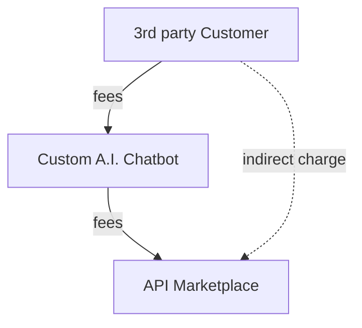

## New Era of A.I. Chatbot

The days of creating full page applications that took a long time and effort are over. It's the age of A.I. Chatbot. When user inputs a conversation to an A.I. Chatbot, A.I. Chatbot will do everything.

And if you come to our "Wrtn Studio Pro", you can create that A.I. Chatbot with just a few mouse clicks. Visit our API Marketplace, select the features you want, and click the "Launch my A.I. App" button. An A.I. Chatbot Application that can be ported immediately will be created.

Through "Application Creator" of "Wrtn Studio Pro", you can turn your business into a product and launch it faster than anyone else. We will make your bright idea come true right now.

## Application Creator

"Application Creator" is a service providing [Meta LLM (A.I. Chatbot)](/tech-specs/meta/preface) as an embeddable application.

When a customer purchases some OpenAPI goods from the "API marketplace" and publish them as a "Application Creator", the purchased OpenAPI operations would be utilized by the A.I. Chatbot's LLM (Large Language Model) function calling. It is the way to make a custom A.I. Chatbot with isolated sandbox environment.

Also, the "Application Creator" is an embeddable application that can be ported to the user's website or application. Therefore, the "Application Creator" is the superfast way to make a custom A.I. Chatbot. Considering the fact that the A.I. Chatbot is the most popular and useful application in the current era, the "Application Creator" is the most valuable service in the "Wrtn Studio Pro" saving costs and times for business development.

## Pricing Model

When configuring the "Application Creator" and building up a "custom A.I. Chatbot", if there are some OpenAPI goods that is not free but commercial, the customer who've created the A.I. Chatbot must pay every fees occured in the "custom A.I. Chatbot" by the API calls.

Considering aspects of the [marketplace schema](/tech-specs/marketplace/schema) and [pricing model](/tech-specs/marketplace/price) of the "API marketplace", the fee structure will be determined based on the stock and price band selected by the customer when making the final purchase, and actual charges will be made based on the number of API calls made by [LLM (Large Language Model) function calling](/tech-specs/meta/preface) in the A.I. chatbot.

For reference, the custom A.I. chatbot applications created by "Application Creator" can be resold without licensing restrictions, so if the cost of purchased OpenAPI products is burdensome for you, consider a way to pass this on to end customers.

No | Fixed Cost           | Variable cost
---|----------------------|-----------------------------
 1 |   $500 for 100 calls | $10 per a call for the rest
 2 | $1,000 for 250 calls |  $5 per a call for the rest
 3 | $1,500 for 600 calls |  $2 per a call for the rest
 4 | $2,000 for 900 calls |  $1 per a call for the rest