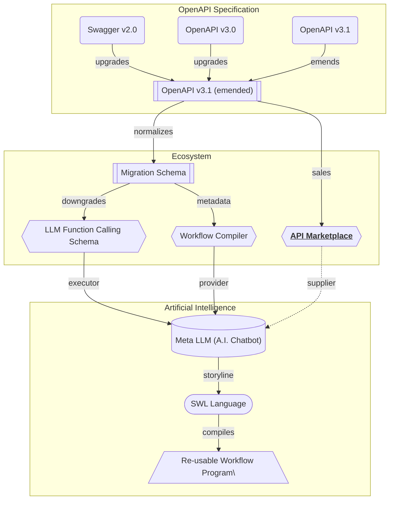

## OpenAPI Marketplace

Marketplace of OpenAPI documents for Meta LLM.

"Wrtn Studio Pro" operates an "OpenAPI Marketplace" to provide [OpenAPI documents](/tech-specs/openapi/preface) for the ["Meta LLM (A.I. Chatbot)"](/tech-specs/meta/preface) from the market. Participants of the "OpenAPI Marketplace" can trade the OpenAPI document, so that customers can obtain functions to call by LLM (Large Language Model). And the providers can earn money by selling the OpenAPI documents.

For reference, when seller uploads an OpenAPI document, "Wrtn Studio Pro" converts it to the [OpenAPI v3.1 (emended) format](/tech-specs/openapi/preface). It is to unify the OpenAPI document to the latest version, and make the specification more concise by emendation. The emended OpenAPI v3.1 document would be utilized for [LLM function calling](/tech-specs/meta/preface) bypass the [migration process](/tech-specs/meta/migrate).

## Marketplace Schema

Descrition of the marketplace schema.

Here is the summary of some entities written in the marketplace schema chapter.

The schema of marketplace sale has defined SKU (Stock Keepting Unit) structured OpenAPI produces. It starts from the [`hub_sales`](/tech-specs/marketplace/schema/#hub_sales) (or [`hub_sale_snapshots`](/tech-specs/marketplace/schema/#hub_sale_snapshots)) entity, and its final goal is to reaching to the target [`stock`](/tech-specs/marketplace/schema/#hub_sale_snapshot_unit_stocks) by configuring each [`candidate value`](/tech-specs/marketplace/schema/#hub_sale_snapshot_unit_option_candidates) for each [`option`](/tech-specs/marketplace/schema/#hub_sale_snapshot_unit_options) of each [`unit`](/tech-specs/marketplace/schema/#hub_sale_snapshot_units). After reaching to the target [`stock`](/tech-specs/marketplace/schema/#hub_sale_snapshot_unit_stocks) record, the customer may purchase the product with [`price model`](/tech-specs/marketplace/schema/#hub_sale_snapshot_unit_stock_prices) specification.

When customer wants to buy a sale from the marketplace, he or she may specify the stocks from the sale and put them into the cart as a [`commodity`](/tech-specs/marketplace/schema/#hub_cart_commodities). After that, customer can proceed the [`order`](/tech-specs/marketplace/schema/#hub_orders) from the prepared cart. When the cart is submitted as an order, its children commodities are changed to [`goods`](/tech-specs/marketplace/schema/#hub_order_goods). When customer wants to complete the order as a formal contract, the order be [`published`](/tech-specs/marketplace/schema/#hub_order_good_publishes).

## Pricing Model
Step pricing model with fixed/variable const combinations.

"Wrtn Studio Pro" has adopted step pricing model for the marketplace with fixed/variable cost combinations. 

It means that there are many fixed and variable combinated costs into a product (especially into a stock). For example, let's imagine that there is a stock that has 4 steps of pricing model as below. As you can see, if you pay $500 fixed cost, you can call 100 times of the API without any additional cost. However, if the number of API calls overs the 100, you should pay $10 per a call for the rest.

Such stepping but fixed/variable separated pricing model is what "Wrtn Stdio Pro" has adopted. Also, the fixed and variable costs are inversely proportional. If a customer selects a higher fixed cost, the variable cost will be lower. Otherwise a customer selects a lower fixed cost, the variable cost would be higher. Of course, the quantity that can be used without additional charges is proportional to the fixed cost.

No | Fixed Cost           | Variable cost
---|----------------------|-----------------------------
 1 |   $500 for 100 calls | $10 per a call for the rest
 2 | $1,000 for 250 calls |  $5 per a call for the rest
 3 | $1,500 for 600 calls |  $2 per a call for the rest
 4 | $2,000 for 900 calls |  $1 per a call for the rest

## Application Creator

Make A.I. Chatbot superfast from the API marketplace.

"Wrtn Studio Pro" provides an Application Creator, which can make a custom A.I. Chatbot performing the LLM function calling that is obtained by the API Marketplace. The A.I. Chatbot can be embedded to the user's website or application, so that it is the superfast way to make an A.I. Chatbot.

This is the agenda of the "Application Creator":

> The days of creating full page applications that took a long time and effort are over. It's the age of A.I. Chatbot. When user inputs a conversation to an A.I. Chatbot, A.I. Chatbot will do everything.
>
> And if you come to our "Wrtn Studio Pro", you can create that A.I. Chatbot with just a few mouse clicks. Visit our API Marketplace, select the features you want, and click the "Launch my A.I. App" button. An A.I. Chatbot Application that can be ported immediately will be created.
>
> Through "Application Creator" of "Wrtn Studio Pro", you can turn your business into a product and launch it faster than anyone else. We will make your bright idea come true right now.

## Example Projects
"Wrtn Studio Pro" provides some example OpenAPI projects/products.

The `connector` is an example project made by "Wrtn Studio Pro" team. It is a representative and default OpenAPI product in the marketplace. If a new customer has not purchased anything in the API marketplace, only the `connector` belonged API functions would be utilized in the ["Meta LLM (A.I. Chatbot)"](/tech-specs/meta/llm).

Also, the `connector` is a good example to learn how to make a well-structured OpenAPI based project disclosured in the Github repository with open source license. The `connector` has been  developed with NestJS framework, and its Restful API functions are always 100% synchronized with the OpenAPI document without any type error. 

  - Github Repository: https://github.com/wrtnio/connectors
  - Swagger UI: https://wrtnio.github.io/connectors/swagger/