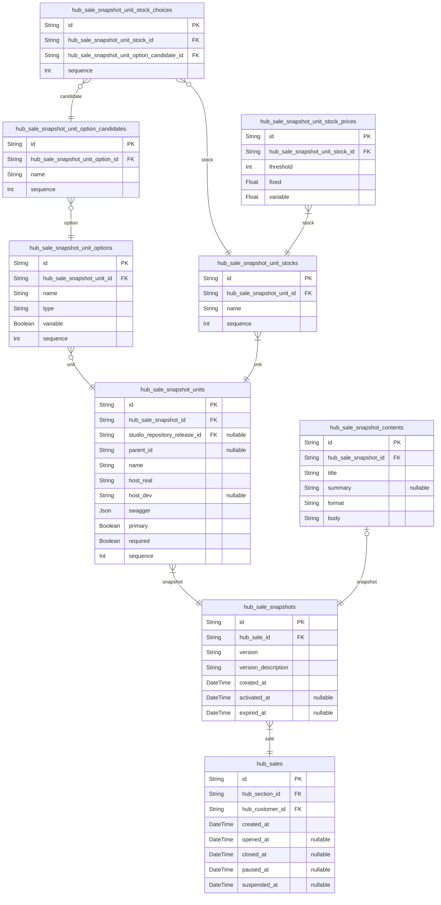
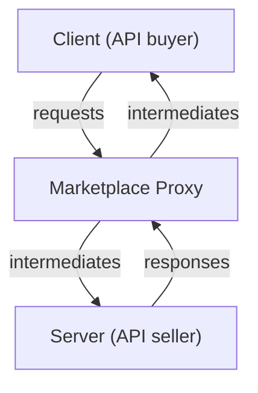

## Step Pricing Model
Step pricing model with fixed/variable const combinations.

"Wrtn Studio Pro" has adopted step pricing model for the marketplace with fixed/variable cost combinations. 

It means that there are many fixed and variable combinated costs into a product (especially into a stock). For example, let's imagine that there is a stock that has 4 steps of pricing model as below. As you can see, if you pay $500 fixed cost, you can call 100 times of the API without any additional cost. However, if the number of API calls overs the 100, you should pay $10 per a call for the rest.

Such stepping but fixed/variable separated pricing model is what "Wrtn Stdio Pro" has adopted. Also, the fixed and variable costs are inversely proportional. If a customer selects a higher fixed cost, the variable cost will be lower. Otherwise a customer selects a lower fixed cost, the variable cost would be higher. Of course, the quantity that can be used without additional charges is proportional to the fixed cost.

No | Fixed Cost           | Variable cost
---|----------------------|-----------------------------
 1 |   $500 for 100 calls | $10 per a call for the rest
 2 | $1,000 for 250 calls |  $5 per a call for the rest
 3 | $1,500 for 600 calls |  $2 per a call for the rest
 4 | $2,000 for 900 calls |  $1 per a call for the rest

## Price on the Stock

The stepping pricing model is defined in the stock level.

Do you remember? "API Marketplace" supports the SKU (Stock Keeping Unit) concept, so that the final good to purchase by the customer is the stock. Here is the concept of the stock in the "API Marketplace". If you have not read the previous [**Marketplace Schema**](/tech-specs/marketplace/schema) chapter or have forgotten it, read the below summarized paragraph.

> As you can see, the schema of the marketplace starts from the [**Marketplace Schema > Sales**](/tech-specs/marketplace/schema/#sales) section. In the [**Marketplace Schema > Sales**](/tech-specs/marketplace/schema/#sales) section, it has defined SKU (Stock Keeping Unit) structured OpenAPI products. It starts from the [`hub_sales`](/tech-specs/marketplace/schema/#hub_sales) (or [`hub_sale_snapshots`](/tech-specs/marketplace/schema/#hub_sale_snapshots)) entity, and its final goal is to reaching to the target [`stock`](/tech-specs/marketplace/schema/#hub_sale_snapshot_unit_stocks) by configuring each [`candidate value`](/tech-specs/marketplace/schema/#hub_sale_snapshot_unit_option_candidates) for each [`option`](/tech-specs/marketplace/schema/#hub_sale_snapshot_unit_options) of each [`unit`](/tech-specs/marketplace/schema/#hub_sale_snapshot_units). After reaching to the target [`stock`](/tech-specs/marketplace/schema/#hub_sale_snapshot_unit_stocks) record, the customer may purchase the product with [`price model`](/tech-specs/marketplace/schema/#hub_sale_snapshot_unit_stock_prices) specification.

Also, the stepping pricing model is defined in the stock level. It means that a [sale unit](/tech-specs/marketplace/schema/#hub_sale_snapshot_units) can have multiple stepping pricing models per each [`stock`](/tech-specs/marketplace/schema/#hub_sale_snapshot_unit_stocks). Each [`stock`](/tech-specs/marketplace/schema/#hub_sale_snapshot_unit_stocks) can have different pricing models, even though they are in the same sale unit with the same OpenAPI document.

The represenative example case of multiple stocks in a sale unit (in a same OpenAPI document) is the different device environments. Let's imagine that there is a sale unit that has (CPU, GPU, RAM) options like below. Every customeres who has purchased the sale unit may have the same API specification, but the price of the API call must be different according to the device environments. 

High-end stock buyers pay more, that's the pricing model of the "API Marketplace".

  - CPU: (i5, i7, i9)
  - GPU: (GTX 2050, GTX 3060, GTX 4070)
  - RAM: (8GB, 16GB, 32GB)

## Predication

Only 2xx status codes are valid and will be payed.

When a seller uploads an OpenAPI product, and customer buys it and calls the API, the marketplace proxy server intermediates the request and response between the client and the server. In the intermediation process, the proxy server checks the status code of the response. 

If the status code is not 2xx, the proxy server will not count the API call and will not charge from the customer. Only the 2xx status code responses are valid and will be payed. By the way, do not abuse the 2xx status code. If a seller abuses the 2xx status code even when the actual error case, the seller will be punished by the marketplace.
