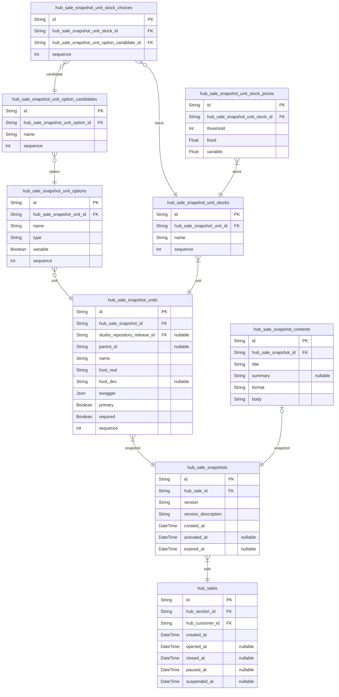
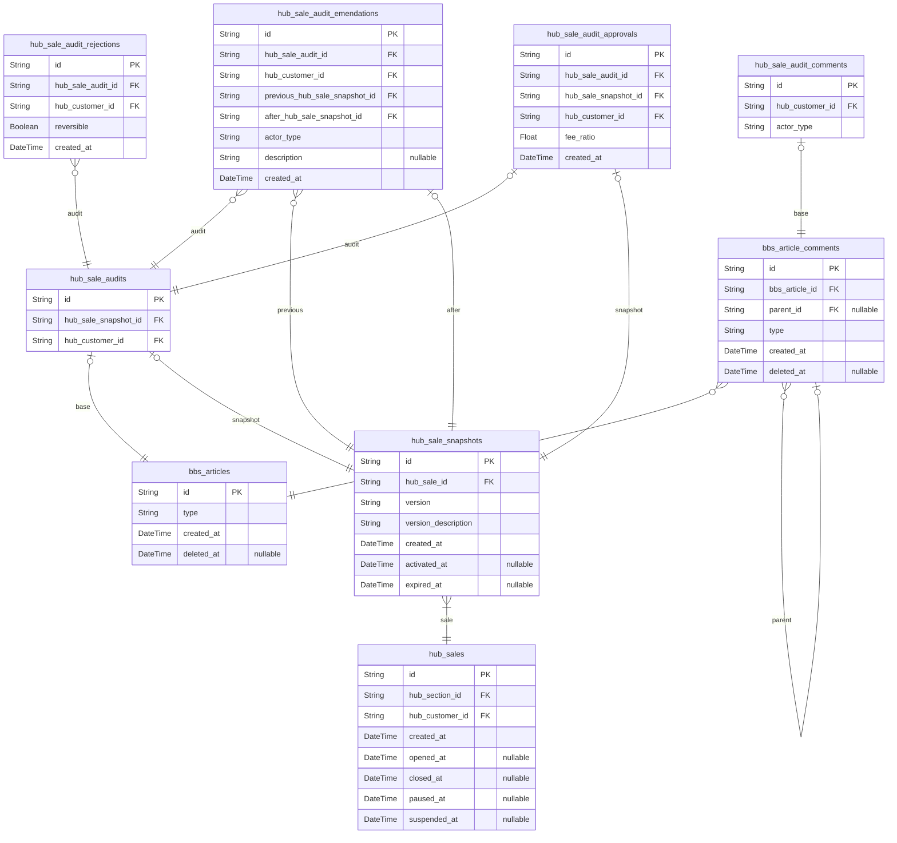
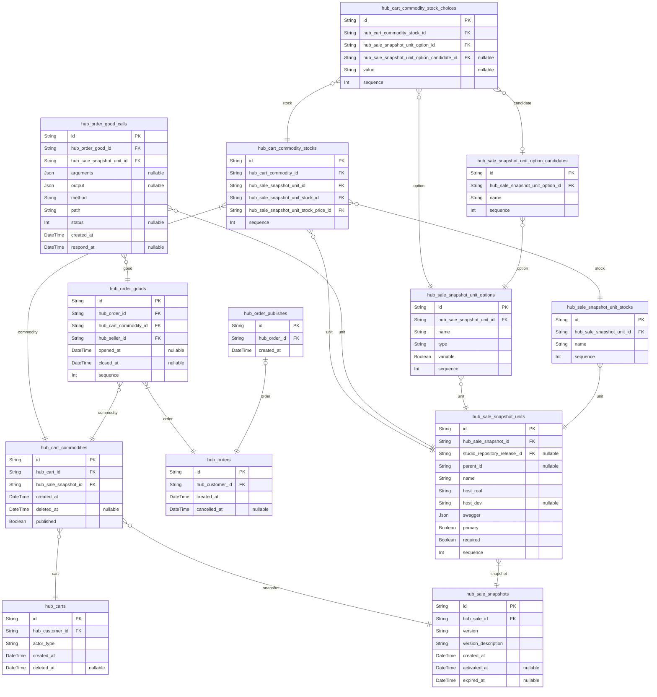
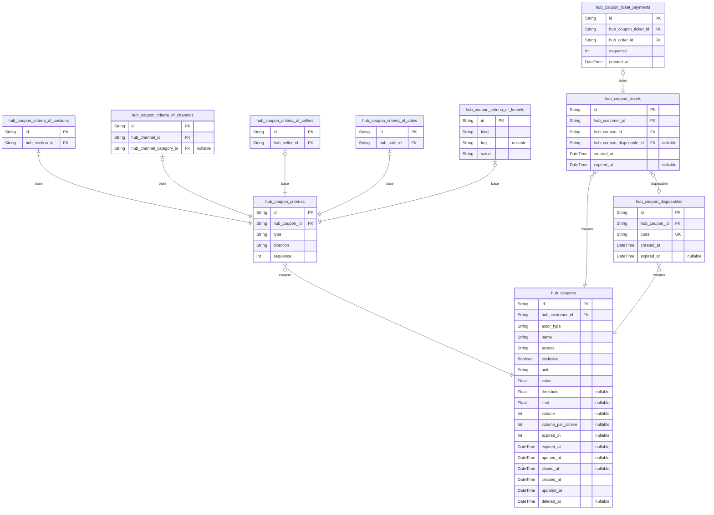
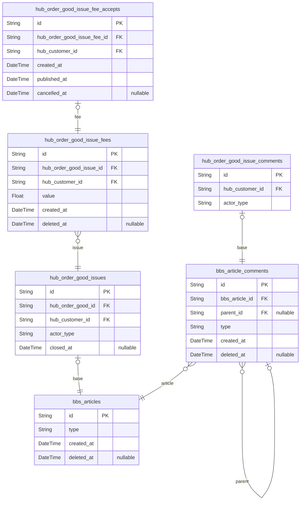

## Summary
In here chapter, we will learn about the schema of the marketplace.

As you can see, the schema of the marketplace starts from the [**Sales**](#sales) section. In the [**Sales**](#sales) section, it has defined SKU (Stock Keeping Unit) structured OpenAPI products. It starts from the [`hub_sales`](#hub_sales) (or [`hub_sale_snapshots`](#hub_sale_snapshots)) entity, and its final goal is to reaching to the target [`stock`](#hub_sale_snapshot_unit_stocks) by configuring each [`candidate value`](#hub_sale_snapshot_unit_option_candidates) for each [`option`](#hub_sale_snapshot_unit_options) of each [`unit`](#hub_sale_snapshot_units). After reaching to the target [`stock`](#hub_sale_snapshot_unit_stocks) record, the customer may purchase the product with [`price model`](#hub_sale_snapshot_unit_stock_prices) specification.

In the next [**Audit**](#audit) section, we will learn about the audit process of the sale. Whenever seller newly creates a sale or updates ordinary one, administrator may write an [`audit article`](#hub_sale_audits) issuing the audit process. In the audit process, both administrator and seller can [`emend`](#hub_sale_audit_emends) the sale content, and administrator may determine to [`approve`](#hub_sale_audit_approvals) or [`reject`](#hub_sale_audit_rejections) the sale. When adminnistrator approves it, the sale would be started and the customer may purchase it. Also, even though administrator has rejected it, seller can request re-audit by [`comment`](#hub_sale_audit_comments), so that it can be reversely approved in sometimes.

When customer wants to buy a sale from the marketplace, he or she may specify the stocks from the sale and put them into the cart as a [`commodity`](#hub_cart_commodities). After that, customer can proceed the [`order`](#hub_orders) from the prepared cart. When the cart is submitted as an order, its children commodities are changed to [`goods`](#hub_order_goods). When customer wants to complete the order as a formal contract, the order be [`published`](#hub_order_good_publishes).

By the way, if administrator or seller hopes to take a discount event, how should do? In this case, [**Coupon**](#coupon) is the answer. Administrator and seller can design a [`discount coupon`](#hub_coupons), and customer take advantage of it by issuing a [ticket](#hub_coupon_tickets) of the coupon and paying it to the order. You can limit the total amount of the coupon by configuring [inventory](#hub_coupon_inventories), and also possible to restrict variable conditions such as the minimum amount of the order or the expiration date of the coupon.

At last, there can be a customer who wants after service about the purchased product. For example, some customer requests additional features to the OpenAPI product seller. In that case, customer can write an [`issue`](#hub_order_good_issues) about the order good to requesting the new features. Communicating with [`reply comments`](#hub_order_good_issues), seller can [charge a fee](#hub_order_good_issue_fees) to the issue, because the new features need additional labor cost. If customer [accepts](#hub_order_good_issue_fee_accepts) the fee charge, the seller must do his/her job and close the issue with completion flag. Otherwise, customer can reject the fee charge and close the issue with cancellation flag.

## Sale

  - [`IHubSale`](/api/interfaces/structures_hub_sales_IHubSale.IHubSale-1.html)
  - [`IHubSaleSnapshot`](/api/interfaces/structures_hub_sales_IHubSaleSnapshot.IHubSaleSnapshot-1.html)
  - [`IHubSaleUnit`](/api/interfaces/structures_hub_sales_IHubSaleUnit.IHubSaleUnit-1.html)
  - [`IHubSaleUnitOption`](/api/interfaces/structures_hub_sales_IHubSaleUnit.IHubSaleUnit-1.html)
  - [`IHubSaleUnitOptionCandidate`](/api/interfaces/structures_hub_sales_IHubSaleUnitOptionCandidate.IHubSaleUnitOptionCandidate-1.html)
  - [`IHubSaleUnitStock`](/api/interfaces/structures_hub_sales_IHubSaleUnitOptionCandidate.IHubSaleUnitOptionCandidate-1.html)
  - [`IHubSaleUnitStockChoice`](/api/interfaces/structures_hub_sales_IHubSaleUnitStockChoice.IHubSaleUnitStockChoice-1.html)
  - [`IHubSaleUnitStockPrice`](/api/interfaces/structures_hub_sales_IHubSaleUnitStockPrice.IHubSaleUnitStockPrice-1.html)

### `hub_sales`
Seller **sales** products (API).

`hub_sales` 는 [판매자](#hub_sellers)가 등록한 "API 제품 판매" (세일즈)
정보를 형상화한 엔티티이다.

그리고 매물의 주 정보는 본 `hub_sales` 가 아닌, 하위  [hub_sale_snapshots](#hub_sale_snapshots) 에
기록된다. 판매자가 기 등록한 매물을 변경하면, 기존의 `hub_sales` 레코드가 변경되는 것이
아니라, 새로운 스냅샷 레코드가 생겨나는 것. 이는 [고객](#hub_customers)이 특정 매물을
[구입](#hub_orders)한 이후, 판매자가 해당 매물의
[구성품](#hub_sale_snapshot_unit_stocks)이나 가격 등을 변경하더라도, 고객의 당시
구매 내역을 무결적으로 보존하기 위함이다. 또한, 판매자가 구성품이나 가격 등을 변경하며
각각의 경우에 대한 성과를 측정하는, 이른바 A/B 테스트를 할 수 있게 지원하기 위함이기도
하다.

**Properties**
  - `id`: Primary Key.
  - `hub_section_id`: 귀속 섹션의 [hub_sections.id](#hub_sections)
  - `hub_customer_id`: 매물을 등록한 판매자 고객의 [hub_customers.id](#hub_customers)
  - `created_at`: 레코드 생성 일시.
  - `opened_at`
    > 판매 개시 일시.
    > 
    > 이 값이 NULL 이거든, 아직 판매를 개시하지 않은 상태.
  - `closed_at`
    > 판매 종료 일시.
    > 
    > 이 값이 NULL 이거든, 영원히 판매가 계속된다.
  - `paused_at`
    > 판매 일시 정지.
    > 
    > 판매자가 모종의 이유로 API 판매를 일시적으로 중단한 상태.
    > 
    > 고객은 여전히 리스트 및 상세 페이지에서 해당 매물을 열람할 수 있으되,
    > 해당 매물에는 "판매자가 일시 중지된 상품입니다" 라는 라벨이 붙는다.
  - `suspended_at`
    > 판매 중단.
    > 
    > 판매자가 모종의 이유로 판매를 중단한 상태.
    > 
    > 고객은 해당 매물을 리스트 및 상세 페이지에서 일절 조회할 수 업다.
    > 언뜻 보면 soft delete 와 비슷해보이나, 판매 당사자와 관리자는 여전히 이를
    > 조회할 수 있고, 언제든지 판매를 재개할 수 있다는 점이 다르다.

### `hub_sale_snapshots`
매물 스냅샷 정보.

`hub_sale_snapshots` 은 [매물](#hub_sales)의 스냅샷을 형상화한
엔티티이다. 그리고 `hub_sale_snapshots` 레코드는 새 매물을 생성 혹은
기존의 매물을 수정할 때마다 생성된다.

참고로 매물을 편집 (새 스냅샷 레코드 생성) 하는 일은,
[판매자](#hub_sellers) 외에 [관리자](#hub_administrators)
또한 가능하다. 관리자가 해당 매물을 [심사](#hub_sale_audits)하는 도중,
[첨삭](#hub_sale_audit_emendations)을 하는 경우가 바로 그러하다.

**Properties**
  - `id`: 
  - `hub_sale_id`: 귀속 매물의 [hub_sales.id](#hub_sales)
  - `version`
    > 버전명.
    > 
    > `ISwaggerInfo.version` 과 다른 값을 설정할 수 있다.
    > 
    > 즉, 서버 스펙 (스웨거 문서) 상 버전명과, 제품상 버전명이 다를 수 있음.
  - `version_description`
    > 버전 설명.
    > 
    > 버전 설명에 대한 정보를 기록할 수 있다.
  - `created_at`: 레코드 생성 일시.
  - `activated_at`
    > 스냅샷의 활성화 시점.
    > 
    > 본 스냅샷에 대한 심사가 승인되어, 최초 활성화된 시각.
    > 
    > 본디 [hub_sale_audit_approvals](#hub_sale_audit_approvals) 를 통하여 유추 가능한 정보이나,
    > 빠른 레코드 탐색을 위하여 중복 기록함.
  - `expired_at`: 스냅샷 내 모든 API 의 만료 시점.

### `hub_sale_snapshot_units`
매물에서 취급하는 제품 구성 정보.

`hub_sale_snapshot_units` 은 매물에서 취급하는 "개별 제품" 정보를
형상화한 엔티티이다. 그리고 여기서 말하는 "개별 제품" 이란, 허브 시스템에서의
개별 서버 단위, 즉 스웨거 문서에 대응하는 개념이다.

참고로 `hub_sale_snapshot_units` 이 [hub_sale_snapshots](#hub_sale_snapshots) 로부터
1: N 의 대수관계로 분리된 이유는 바로, 하나의 매물에서 복수의 제품을 판매하는 경우가
종종 있기 때문이다. 이른바 "묶음 상품" 의 경우가 그러하다.

- 일반 상품에서의 묶음 상품 (노트북 세트)
- 본체
- 키보드
- 마우스
- 애플 케어 (무료 A/S 권)
- 허브 시스템에서의 묶음 상품 (작가 AI 세트)
- 글쓰기 서버
- 이미지 생성 서버
- 로고/표지 생성 서버

그리고 `hub_sale_snapshot_units` 은 다시, 그 자체로써 고객이 구매하게 될
[최종 구성품](#hub_sale_snapshot_unit_stocks)을 의미하지는 않는다.
최종 구성품은 주어진 [옵션](#hub_sale_snapshot_unit_options)과 그
[후보값](#hub_sale_snapshot_unit_option_candidates)들을 모두 선택한
끝에라야, 비로소 만나볼 수 있는 것.

가령 노트북을 한 대 사더라도, 그 안에서 각각 (CPU / RAM / SSD) 등의 옵션을
모두 고른 뒤에야, 최종 구성품이 정해지듯이 말이다.

**Properties**
  - `id`: 
  - `hub_sale_snapshot_id`: 귀속 스냅샷의 [hub_sale_snapshots.id](#hub_sale_snapshots)
  - `studio_repository_release_id`
    > 귀속 릴리즈의 [studio_repository_release.id](#studio_repository_release)
    > 
    > @format uuid
    > 이 필드를 사용하여 이 Unit이 Workflow 인지 API 인지 확인한다.
  - `parent_id`
    > 부모 유닛의 [hub_sale_snapshot_units.id](#hub_sale_snapshot_units)
    > 
    > 부모 유닛을 구매한 고객은, 현 유닛의 API 를 이어서 사용할 수 있다.
  - `name`: 유닛의 대표 이름.
  - `host_real`: 실제 서버 주소.
  - `host_dev`: 테스트 서버 주소.
  - `swagger`
    > 스웨거 문서 데이터.
    > 
    > OpenAPI v3.1 스펙으로 변환하여 사용 중.
  - `primary`
    > 주/부 여부.
    > 
    > 단순 표기상 속성.
  - `required`
    > 필수 여부.
    > 
    > 필수 유닛의 경우, 이를 배제하고 구매할 수 없다.
  - `sequence`: 귀속 스냅샷 내 배치 순서.

### `hub_sale_snapshot_unit_parameters`
매물 유닛의 파라미터 정보.

판매자 서버로 전송될 추가 파라미터에 대한 정의.

**Properties**
  - `id`: 
  - `hub_sale_snapshot_unit_id`: 귀속 유닛의 [hub_sale_snapshot_units.id](#hub_sale_snapshot_units)
  - `in`
    > 파라미터의 유형.
    > 
    > 현재 본 시스템에서는 두 가지 유형의 파라미터를 지원 중.
    > 
    > - query
    > - header
  - `key`: Key 값, 즉 변수명.
  - `value`: Value 값, 즉 변수값.
  - `description`: 
  - `sequence`: 
  - `created_at`: 
  - `updated_at`: 
  - `deleted_at`: 

### `hub_sale_snapshot_unit_options`
매물 유닛에서의 개별 옵션 정보.

`hub_sale_snapshot_unit_options` 은 매물 내 개별 제품을 형상화한
[hub_sale_snapshot_units](#hub_sale_snapshot_units) 의 하위 엔티티로써, 해당 유닛의
개별 옵션 정보를 형상화하기 위하여 설계된 엔티티이다.

- 옵션의 사례
- 선택형 옵션
- 컴퓨터 성능: CPU, GPU, RAM 등
- 이미지 생성 AI: 랜더링 퀄리티, 라이선스 종류, 테마 등
- 서술형 옵션
- 라벨링
- 사용 목적 (설문조사)

만일 옵션의 타입이 select 에 가변값이 참이라면, 그
[후보값](#hub_sale_snapshot_unit_option_candidates)의 선택에 따라,
고객이 구매하게 될 [최종 구성품](#hub_sale_snapshot_unit_stocks)이
달라진다.

반대로 select 이외에 타입이라던가, 타입은 select 이되, 가변 여부가 거짓이라면,
이는 단순 정보 전달 이상의 의미가 없는 옵션이다. 따라서 고객이 이를 구매하며
그 어떠한 값을 기재하고 선택하던, 이 경우의 옵션은 최종 구성품에 영향을 주지 않는다.

**Properties**
  - `id`: 
  - `hub_sale_snapshot_unit_id`: 귀속 유닛의 [hub_sale_snapshot_units.id](#hub_sale_snapshot_units)
  - `name`: 옵션의 이름.
  - `type`
    > 옵션의 타입.
    > 
    > - select: 후보 아이템 중 하나를 선택하는 방식
    > - boolean
    > - number
    > - string
  - `variable`
    > 가변형 여부.
    > 
    > 현 옵션의 타입이 "select" 일 때, 후보값을 다르게 선택하는 것이,
    > 최종 구성품에 변화를 주는지 여부.
  - `sequence`: 귀속 유닛 내 배치 순서.

### `hub_sale_snapshot_unit_option_candidates`
옵션 내 선택 가능 후보 값.

`hub_sale_snapshot_unit_option_candidates` 는 "select" 타입의
[옵션](#hub_sale_snapshot_unit_options)에서 선택할 수 있는,
개개별별 후보값을 형상화한 엔티티이다.

- 사례
- 옵션) RAM: 8GB, 16GB, 32GB
- 옵션) GPU: RTX 3060, RTX 4080, TESLA
- 옵션) 라이선스 종류: 개인용, 상업용, 교육용

다만 귀속 옵션의 타입이 "select" 가 아니라면, 본 엔티티는 필요 없다.

**Properties**
  - `id`: 
  - `hub_sale_snapshot_unit_option_id`: 귀속 옵션의 [hub_sale_snapshot_unit_options.id](#hub_sale_snapshot_unit_options)
  - `name`: 후보값의 대표 이름.
  - `sequence`: 귀속 옵션 내 배치 순서.

### `hub_sale_snapshot_unit_stocks`
매물 유닛에서의 최종 구성품 정보.

`hub_sale_snapshot_unit_stocks` 은 매물 내 제품 카탈로그를 형상화한
[hub_sale_snapshot_units](#hub_sale_snapshot_units) 의 하위 엔티티로써, 귀속 유닛 내 모든
[옵션](#hub_sale_snapshot_unit_options) (가변형 "select" 타입) 및 그
[후보값](#hub_sale_snapshot_unit_option_candidates)들을 모두
선택함으로써 구성되는, 일종의 최종 구성품이다. 고객이 실제로 구매하게 되는 "재화"
그 자체인 셈.

- 유닛명) 맥북 본체
- 옵션
- CPU: \{ i3, i5, i7, i9 }
- RAM: \{ 8GB, 16GB, 32GB, 64GB, 96GB }
- SSD: \{ 256GB, 512GB, 1TB }
- 최종 구성품 수: 4 * 5 * 3 = 60 개

참고로 귀속 유닛 내 `hub_sale_snapshot_unit_stocks` 레코드의 총 수는
카테시안 곱 (Cartesian Sale) 으로 구할 수 있다. 즉, 각각의 (가변형 "select" 타입)
옵션이 가질 수 있는 후보값들을 경우의 수로 모두 곱한 값이 곧, 해당 유닛에서의
최종 구성품의 총 수효인 것. 물론, 단 하나의 가변형 "select" 타입 옵션도 없다면,
해당 유닛에서의 최종 구성품 수는 오직 1 개에 그친다.

**Properties**
  - `id`: 
  - `hub_sale_snapshot_unit_id`: 귀속 유닛의 [hub_sale_snapshot_units.id](#hub_sale_snapshot_units)
  - `name`: 최종 구성품의 이름.
  - `sequence`: 귀속 유닛 내 배치 순서.

### `hub_sale_snapshot_unit_stock_choices`
최종 구성품의 선택 정보.

`hub_sale_snapshot_unit_stock_choices` 는 귀속
[스톡](#hub_sale_snapshot_unit_stocks)이 각각 어느 가변형 `select` 타입의
[옵션](#hub_sale_snapshot_unit_options) 선택하였고, 그 안에서 다시 어떤
[후보값](#hub_sale_snapshot_unit_option_candidates)을 선택하여 구성되었는
지를 형상화한 엔티티이다.

물론, 귀속 [유닛](#hub_sale_snapshot_units)에 그 어떠한 옵션도 없노라면,
이 엔티티 또한 무시해도 좋다.

**Properties**
  - `id`: 
  - `hub_sale_snapshot_unit_stock_id`: 귀속 스톡의 [hub_sale_snapshot_unit_stocks.id](#hub_sale_snapshot_unit_stocks)
  - `hub_sale_snapshot_unit_option_candidate_id`: 귀속 후보값의 [hub_sale_snapshot_unit_option_candidates.id](#hub_sale_snapshot_unit_option_candidates)
  - `sequence`: 귀속 스톡 내 배치 순서.

### `hub_sale_snapshot_unit_stock_prices`
스톡의 가격 정보.

`hub_sale_snapshot_unit_stock_prices` 는 스톡의 계단식 가격 정보를 형상화한 엔티티이다.
그리고 여기서 말하는 계단식 가격이란, 각각이 고정비와 변동비를 모두 아우르며, 그러한 구간이
여럿 있는 것을 뜻한다.

계단형 가격 정보가 무엇인지는, 아래 예시를 보면 쉬이 이해할 수 있을 것이다.

1. 고정비 50,000 원에 API 1,000 건까지 무료, 초과분 1건당 100 원
2. 고정비 100,000 원에 API 2,500 건까지 무료, 초과분 1건당 75 원
3. 고정비 150,000 원에 API 4,000 건까지 무료, 초과분 1건당 50 원

**Properties**
  - `id`: 
  - `hub_sale_snapshot_unit_stock_id`: 귀속 스톡의 [hub_sale_snapshot_unit_stocks](#hub_sale_snapshot_unit_stocks)
  - `threshold`: 고정 금액 내 무료 수량.
  - `fixed`: 고정 금액.
  - `variable`
    > 변동 금액.
    > 
    > 한도 수량을 초과하여 API 가 사용된 경우의 건당 비용.

### `hub_sale_snapshot_contents`
매물 스냅샷의 컨텐츠 정보.

`hub_sale_snapshot_contents` 는 [매물 스냅샷](#hub_sale_snapshots)의
본문 컨텐츠를 형상화한 엔티티이다. 제목과 본문, 그리고 첨부 파일이나 썸네일
등의 서술 정보를 담당하고 있다.

참고로 매물에 기재된 제목이나 본문 컨텐츠 등의 경우, 고객의 구매 의사 결정에
결정적인 영향을 주기 마련이다. 때문에 매물을 수정하며 API 서버 스펙은 전혀
변하지 않고, 그저 제목이나 본문 텍스트 정도나 변했음에도 불구하고, 새로운
스냅샷을 필히 발급해야하며 심사도 다시 받아야하고 버전도 바뀌어야함은 바로 이
때문이다.

즉 API 상 변경사항만큼이나 컨텐츠 상 변경 내용도 중대하게 보기 때문에,
매물 스냅샷과 그 컨텐츠의 구조가 1: N 이 아닌 1: 1 로 고정화 된 것.

**Properties**
  - `id`: Primary Key.
  - `hub_sale_snapshot_id`: 귀속 스냅샷의 [hub_sale_snapshots.id](#hub_sale_snapshots)
  - `title`: 제목.
  - `summary`: 요약 설명
  - `format`
    > 본문의 형식, 거진 확장자.
    > 
    > txt 나 html 또는 md 사용.
  - `body`: 본문 컨텐츠.

## Audit

  - [`IHubSaleAudit`](/api/interfaces/structures_hub_sales_audits_IHubSaleAudit.IHubSaleAudit-1.html)
  - [`IHubSaleAuditEmendation`](/api/interfaces/structures_hub_sales_audits_IHubSaleAuditEmendation.IHubSaleAuditEmendation-1.html)
  - [`IHubSaleAuditRejection`](/api/interfaces/structures_hub_sales_audits_IHubSaleAuditRejection.IHubSaleAuditRejection-1.html)
  - [`IHubSaleAuditApproval`](/api/interfaces/structures_hub_sales_audits_IHubSaleAuditApproval.IHubSaleAuditApproval-1.html)
  - [`IHubSaleAuditComment`](/api/interfaces/structures_hub_sales_audits_IHubSaleAuditComment.IHubSaleAuditComment-1.html)

### `hub_sale_audits`
매물 스냅샷에 대한 심사 정보.

본 거래소는 [판매자](#hub_sellers)가 매물을 등록하고 이를 수정할 때마다
(새로운 매물 [스냅샷](#hub_sale_snapshots) 레코드가 생성될 때마다),
[관리자](#hub_administrators)의 심사를 필요로 하며, 이를 통과하지 못하는 경우에는
판매 행위 자체가 불가능하다. `hub_sale_audits` 는 바로 이러한 매물 스냅샷의 심사를
형상화한 엔티티이다.

그리고 관리자는 심사 사항을 일종의 [게시물](#bbs_articles)로써 작성할 수 있으며,
심사 과정 혹은 그 결과에 대하여, 판매자와 관리자가 댓글을 통하여 지속적으로 소통할 수 있다.
때문에 본 `hub_sale_audits` 는 [bbs_articles](#bbs_articles) 의 서브타입 엔티티로써 설계되었다.

또한, 본 심사 게시물은 관리자가 이를 수정할 때마다, 그 수정 내역을 모두 기록하여
판매자와 관리자가 모두 열람할 수 있도록 하고 있다. 돈이 오가는 전자상거래의 특성상 분쟁의
소지는 늘 만연하며, 관리자 또한 예외가 될 수 없기 때문이다. 분쟁시 관리자가 자신의 주장을
번복하며 게시물을 수정하여 정황을 조작하는 일을 막기 위함이다.

이외에 관리자가 심사를 거절했다가 이를 번복하여 승인하는 것은 가능하되, 이미 승인한
심사 내역을 번복하여 거절하는 것은 불가능하다. 심사를 승인한 순간 이미 매물의 판매가
개시되어버리기 때문.

**Properties**
  - `id`: 
  - `hub_sale_snapshot_id`: 귀속 매물 스냅샷의 [hub_sale_snapshots.id](#hub_sale_snapshots)
  - `hub_customer_id`: 심사를 개시한 관리자 고객의 [hub_customers.id](#hub_customers)

### `hub_sale_audit_emendations`
매물 심사의 첨삭 정보.

본 거래소는 [hub_sellers](#hub_sellers) 가 등록 혹은 수정한
[매물](#hub_sales)에 대하여 [관리자](#hub_administrators)의
[심사](#hub_sale_audits)가 필요하다. 그리고 심사 중에 관리자와
판매자는 상호 [댓글](#hub_sale_audit_comments)을 주고받으며,
해당 매물을 첨삭하고 수정할 수 있다.

본 엔티티 `hub_sale_audit_emendations` 는 이러한 첨삭을 형상화한 엔티티로써,
관리자 혹은 판매자가 어떤 [스냅샷](#hub_sale_snapshots)을 대상으로 첨삭을
행하였고, 그 결과 새로이 탄생한 스냅샷이 무엇인지의 정보를 가지고 있다.

그리고 첨삭 대상은 반드시 가장 최근 스냅샷일 필요는 없으며, 경우에 따라 그 이전
스냅샷에 대한 첨삭을 행함으로써, 롤백 내지 분기 처리하는 것도 가능하다. 물론,
첨삭 대상 스냅샷은 현재의 심사와 관련이 있어야하며, 이전 심사 통과된 스냅샷을
대상으로는 첨삭을 일절 행할 수 없다.

이외에 첨삭은 오직 심사가 진행 중에만 가능하며, 심사가
[승인](#hub_sale_audit_approvals)되거든 더 이상의 첨삭은 불가능하다. 다만
관리자가 심사 [거절](#hub_sale_audit_rejections) 처리를 하는 경우에는,
판매자가 스스로 첨삭하고 보강하며, 관리자에게 재심을 요청할 수 있다.

**Properties**
  - `id`: 
  - `hub_sale_audit_id`: 귀속 심사의 [hub_sale_audits.id](#hub_sale_audits)
  - `hub_customer_id`: 첨삭 수행자 고객의 [hub_customers.id](#hub_customers).
  - `previous_hub_sale_snapshot_id`
    > 첨삭 전 매물 스냅샷의 [hub_sale_snapshots.id](#hub_sale_snapshots).
    > 
    > 첨삭 대상 스냅샷이, 반드시 심사 개시 당시의 스냅샷일 필요는 없다. 또다른
    > 첨삭의 결과물에 대하여 추가로 첨삭하는 것이 가능하며, 이전의 첨삭으로 돌아가
    > 다시 첨삭을 하는 것도 가능하다.
  - `after_hub_sale_snapshot_id`
    > 첨삭 결과물의 스냅샷 [hub_sale_snapshots.id](#hub_sale_snapshots).
    > 
    > 판매자 또는 관리자가 첨삭을 행한 결과로써 탄생한 새 스냅샷.
  - `actor_type`
    > 첨삭을 행한 고객의 유형
    > 
    > - administrator: 관리자
    > - seller: 판매자
  - `description`
    > 첨삭에 대한 부가 서술부.
    > 
    > 본 첨삭에 대하여 따로이 설명할 내용이 있을 때.
  - `created_at`: 레코드 생성 일시.

### `hub_sale_audit_rejections`
매물 스냅샷 심사에 대한 거절.

`hub_sale_auditsRejection` 은 [관리자](#hub_administrators)가
[매물 심사](#hub_sale_audits)를 거절한 이력을 형상화한 엔티티이다.

참고로 매물 스냅샷 [심사를 발제](#hub_sale_audits)한 관리자와, 거절 처리하는
관리자는 서로 다른 사람일 수 있다. 또한, [판매자](#hub_sellers)가
[댓글](#hub_sale_audit_comments)로 재심의를 요청하는 경우, 관리자는 반복하여
거절 처리할 수 있다.

**Properties**
  - `id`: 
  - `hub_sale_audit_id`: 귀속 심사의 [hub_sale_audits.id](#hub_sale_audits).
  - `hub_customer_id`: 거절한 관리자 고객의 [hub_customers.id](#hub_customers).
  - `reversible`
    > 번복 가능 여부.
    > 
    > 현재의 심사 거절을 확정하고, 번복하지 않을지 여부.
    > 
    > 단, 이는 판대자에게 현재의 거절을 확정하고, 향후 번복하여 승인하는 일이 없을
    > 것이라는 의사 표현에 불과할 뿐이다. 실제로는 이렇게 의사를 표현해놓고,
    > 나중에 번복하여 승인 처리하는 것이 가능함.
  - `created_at`: 레코드 생성 일시.

### `hub_sale_audit_approvals`
매물 스냅샷 심사에 대한 승인.

`hub_sale_audit_approvals` 는 [관리자](#hub_administrators)가
[매물 심사](#hub_sale_audits)를 승인하는 행위를 형상화한 엔티티이다.

참고로 매물 스냅샷 심사를 발제한 관리자와, 승인 처리하는 관리자는 서로 다른 사람일 수
있다. 또한, 심사를 거절하였다가 번복하여 승인하는 것이 가능하다. 단, 반대로 이미
승인한 심사를 번복하여 거절하는 것은 불가능하다. 승인시
[매물](#hub_sales)이 실제로 판매 개시되기 때문이다.

**Properties**
  - `id`: 
  - `hub_sale_audit_id`: 귀속 심사의 [hub_sale_audits.id](#hub_sale_audits).
  - `hub_sale_snapshot_id`
    > 심사 승인 대상 스냅샷의 [hub_sale_snapshots.id](#hub_sale_snapshots).
    > 
    > 심사를 승인할 때, 반드시 마지막 [첨삭본](#hub_sale_audit_emendations)만을
    > 대상으로 승인할 필요는 없다. 경우에 따라 원본 스냅샷 내지, 이전 첨삭본을 대상으로
    > 승인하여 [활성화](#hub_sale_snapshots) 가능.
  - `hub_customer_id`: 승인한 관리자 고객의 [hub_customers.id](#hub_customers).
  - `fee_ratio`: 수수료율.
  - `created_at`: 레코드 생성 일시.

### `hub_sale_audit_comments`
심사 게시물에 작성한 댓글.

`hub_sale_audit_comments` 는 [bbs_article_comments](#bbs_article_comments) 의 서브타입 엔티티로써,
[관리자](#hub_administrators)가 발의한 [심사](#hub_sale_audits)에
대하여, 관리자와 [판매자](#hub_sellers)가 상호 소통할 때 사용한다.

이는 심사가 종료된 이후로도 그러하며, 한 번 거절 처리된 심사 건에 대하여도, 판매자가
댓글로써 재심을 요청할 수 있다. 물론, 판매자가 재심을 요청하기 전 관리자의 가이드에 따라
자체 첨삭을 진행하는 경우가 대부분이다.

**Properties**
  - `id`: 
  - `hub_customer_id`: 댓글을 작성한 고객의 [hub_customers.id](#hub_customers).
  - `actor_type`
    > 댓글을 작성한 고객의 유형.
    > 
    > - administrator: 관리자
    > - seller: 판매자

## Order

  - [`IHubCartCommodity`](/api/interfaces/structures_hub_orders_IHubCartCommodity.IHubCartCommodity-1.html)
  - [`IHubOrder`](/api/interfaces/structures_hub_orders_IHubOrder.IHubOrder-1.html)
  - [`IHubOrderGood`](/api/interfaces/structures_hub_orders_IHubOrderGood.IHubOrderGood-1.html)
  - [`IHubOrderPrice`](/api/interfaces/structures_hub_orders_IHubOrderPrice.IHubOrderPrice-1.html)
  - [`IHubOrderPublish`](/api/interfaces/structures_hub_orders_IHubOrderPublish.IHubOrderPublish-1.html)

### `hub_carts`
장바구니.

장바구니 `hub_carts` 는 문자 그대로, [고객](#hub_customers)이 상품을
[구매](#hub_orders)하기 전 잠시 담아두는 공간이다.

다만, 여기서의 `hub_carts` 는 장바구니에 상품을 담는 대상이 반드시 소비자라 정해진 것은
아니다. [판매자](#hub_sellers) 및 [관리자](#hub_administrators) 또한 스스로
장바구니를 구성할 수 있는데, 그 목적은 그들 스스로가 상품을 구매하기 위함은 아니며,
단지 고객에게 제공할 장바구니 템플릿을 미리 구성하기 위함이다.

**Properties**
  - `id`: 
  - `hub_customer_id`: 장바구니 생성자 고객의 [hub_customers.id](#hub_customers)
  - `actor_type`: 장바구니 생성자의 유형.
  - `created_at`: 레코드 생성 일시.
  - `deleted_at`: 레코드 삭제 일시.

### `hub_cart_commodities`
장바구니에 담은 상품 (원재료).

`hub_cart_commodities` 는 [고객](#hub_customers)이 [구매](#hub_orders)를
염두에 두고, 장바구니에 담은 [매물 스냅샷](#hub_sale_snapshots)을 형상화한 엔티티이다.
그리고 향후 고객이 이를 실제 주문으로 이어나간다면, 그 때의 단위는
`hub_cart_commodities` 에서 [hub_order_goods](#hub_order_goods) 이 된다.

그리고 장바구니에 매물 스냅샷을 담으면서, 필연적으로 고객은 매물 스냅샷 내의 특정
[유닛](#hub_sale_snapshot_units) 및
[최종 구성품](#hub_sale_snapshot_unit_stocks) 등을 선택하기 마련이다.
이 유닛 및 구성품에 대한 정보는 하위 엔티티인 [hub_cart_commodity_stocks](#hub_cart_commodity_stocks) 에
기록된다.

**Properties**
  - `id`: 
  - `hub_cart_id`: 귀속 장바구니의 [hub_carts.id](#hub_carts)
  - `hub_sale_snapshot_id`: 대상 매물 스냅샷의 [hub_sale_snapshots](#hub_sale_snapshots)
  - `created_at`: 레코드 생성 일시.
  - `deleted_at`: 레코드 삭제 일시.
  - `published`
    > 출판 여부.
    > 
    > 현 장바구니 상품으로 주문하고 결제 완료되었는가.
    > 
    > 주문 완료 전까지, 장바구니 상품을 재활용하여 신규 주문 신청 레코드 계속 생성 가능.
    > 
    > 역 정규화의 일환으로써, 실제로는 계산 가능한 속성이되, 다만 성능을 위함.

### `hub_cart_commodity_stocks`
장바구니에 담은 매물의 최종 구성품 정보.

`hub_cart_commodity_stocks` 은 장바구니에 담은
[매물 스냅샷](#hub_sale_snapshots)의 정보를 형상화한 [hub_cart_commodities](#hub_cart_commodities)
의 하위 엔티티로써, 대상 매물 스냅샷 내의 개별 [유닛](#hub_sale_snapshot_units) 및
그 유닛 중에 최종 선택하게 된 구성품과 대응되는 개념이다.

/ 따라서 만일 고객이 대상 매물 스냅샷으로부터 복수의 유닛 및 구성품을 선택하였다면,
귀속 [hub_cart_commodities](#hub_cart_commodities) 레코드 또한 복수의 대응되는
`hub_cart_commodity_stocks` 레코드들을 가지게 된다.

**Properties**
  - `id`: 
  - `hub_cart_commodity_id`: 귀속 장바구니 상품의 [hub_cart_commodities](#hub_cart_commodities)
  - `hub_sale_snapshot_unit_id`: 대상 유닛의 [hub_sale_snapshot_units.id](#hub_sale_snapshot_units)
  - `hub_sale_snapshot_unit_stock_id`: 대상 최종 구성품의 [hub_sale_snapshot_unit_stocks](#hub_sale_snapshot_unit_stocks)
  - `hub_sale_snapshot_unit_stock_price_id`: 선택한 가격 모형의 [hub_sale_snapshot_unit_stock_prices](#hub_sale_snapshot_unit_stock_prices)
  - `sequence`: 귀속 장바구니 상품 내 배치 순서.

### `hub_cart_commodity_stock_choices`
장바구니에 담은 최종 구성품의 옵션 선택 정보.

`hub_cart_commodity_stock_choices` 는 [hub_cart_commodity_stocks](#hub_cart_commodity_stocks) 의 하위
엔티티로써, [고객](#hub_customers)이 [장바구니](#hub_carts)에
[매물 스냅샷](#hub_sale_snapshots)의 특정 [유닛](#hub_sale_snapshot_units)
및 특정 [구성품](#hub_sale_snapshot_unit_stocks))을 담으면서, 구체적으로 어떠한
[옵션](#hub_sale_snapshot_unit_options))들을 사용하였으며, 그 안에서 다시 어떠한
[후보 아이템](#hub_sale_snapshot_unit_option_candidates)들을 선택하거나 또는
기재했는지를 기록한다.

따라서 `hub_cart_commodity_stock_choices` 는
[옵션](#hub_sale_snapshot_unit_options))에 대한 참조 외에,
[후보 아이템](#hub_sale_snapshot_unit_option_candidates)에 대한 참조 속성 및
서술부 속성을 가지는데, 대상 [옵션](#hub_sale_snapshot_unit_options))의 타입이
select 이거든 [고객](#hub_customers)이 선택한
[후보 아이템](#hub_sale_snapshot_unit_option_candidates)을 입력하고,
그 외의 것이라면 [고객](#hub_customers)이 기입한 값을 기재하면 된다.

**Properties**
  - `id`: 
  - `hub_cart_commodity_stock_id`: 귀속 장바구니 상품 스톡의 [hub_cart_commodity_stocks.id](#hub_cart_commodity_stocks)
  - `hub_sale_snapshot_unit_option_id`: 대상 옵션의 [hub_sale_snapshot_unit_options.id](#hub_sale_snapshot_unit_options)
  - `hub_sale_snapshot_unit_option_candidate_id`
    > 선택한 옵션에 대하여 고객이 선택한 후보값의
    > [hub_sale_snapshot_unit_option_candidates.id](#hub_sale_snapshot_unit_option_candidates)
  - `value`: 서술형 옵션에 대하여 고객이 기재한 값.
  - `sequence`: 귀속 장바구니 상품 내 배치 순서.

### `hub_orders`
주문 정보.

`hub_orders` 는 [고객](#hub_customers)의 주문 정보를 형상화한 엔티티이다.

그리고 고객이 주문을 행하는 즉시, 대상 [장바구니](#hub_carts)에 들은
[장바구니 상품](#hub_cart_commodities)들이 모두 [주문 상품](#hub_order_goods)으로
격상, `hub_orders` 의 하위에 [hub_order_goods](#hub_order_goods) 레코드를 구성하게 된다.

물론, 대상 장바구니에 들은 모든 상품 원재료가 주문 상품이 되는 것은 아니며, 그 중 고객이
선택한 것만이 [hub_order_goods](#hub_order_goods) 가 된다.

**Properties**
  - `id`: 
  - `hub_customer_id`: 귀속 고객의 [hub_customers.id](#hub_customers)
  - `created_at`: 레코드 생성 일시.
  - `cancelled_at`: 주문 취소 일시.

### `hub_order_goods`
주문을 구성하는 개별 상품 정보.

`hub_order_goods` 은 [고객](#hub_customers)이 주문한 각각의 상품을 뜻하는
엔티티로써, [장바구니](#hub_carts)에 담긴 [상품 원재료](#hub_cart_commodities)가,
고객의 [주문 신청](#hub_orders)으로 인하여 상품으로 격상되는 과정에서 그 레코드가
생성된다.

그리고 `hub_order_goods` 는 [hub_cart_commodities](#hub_cart_commodities) 가 그러하였든,
[매물 스냅샷](#hub_sale_snapshots) 단위에 대응되는 개념이다.

더하여 `hub_order_goods` 은 주문 이후의 과정, 즉 사후 처리 (A/S) 에 대한 가장 기본 단위가
된다. 가령 고객이 주문 상품에 대하여 [이슈](#hub_order_good_issues)를 발행하거나,
환불을 요청하는 단위도 바로 이 `hub_order_goods` 이다.

**Properties**
  - `id`: 
  - `hub_order_id`: 귀속 주문의 [hub_orders.id](#hub_orders)
  - `hub_cart_commodity_id`: 귀속 장바구니 상품의 [hub_cart_commodities.id](#hub_cart_commodities)
  - `hub_seller_id`
    > 귀속 판매자의 [hub_sellers.id](#hub_sellers)
    > 
    > 귀속 매물의 판매자 정보, 빠른 탐색을 위하여 한 번 더 기록함.
  - `opened_at`
    > 계약 개시 일시.
    > 
    > 주문의 확정 시점과 다르게, 효력의 발생 시점을 그보다 뒤로 미룰 수 있다.
    > 그리고 계약 효력의 발생 시점은, 그것이 도래하기 전까지, 계속 편집할 수 있다.
    > 또한 월 고정비 과금은, 본 개시 일자를 기준으로 계상된다.
    > 
    > 참고로 고객이 판매자의 API 를 구입한 후, 이를 검토하고 개발하는 과정이
    > 필요하기에, 본디 계약의 효력 발휘 일시는 주문 확정보다 더 뒤로 밀릴 수밖에
    > 없는 법.
  - `closed_at`
    > 계약 종료 일시.
    > 
    > 단, 계약의 종료 시점을 지금 즉시로 할 수 없다. 계약 개시 시점을 기준으로,
    > 최소 1 개월의 기간이 지나야만 취소할 수 있다. 그리고 이미 계약애 개시된
    > 상태라면, 마찬가지로 1 개월 단위로만 계약 종료가 가능하다.
  - `sequence`: 귀속 주문 내 배치 순서.

### `hub_order_publishes`
주문의 확정 정보.

`hub_order_publishes` 는 주문의 확정 정보를 형상화한 엔티티이다. 따라서
본 엔티티가 존재한다는 것은, [고객](#hub_customers)이
[신청한 주문](#hub_orders)이 계약으로써 성립하였고 확정되었음을 뜻한다.

단, 계약이 확정되었다하여, 그것이 곧바로 개시되는 것은 아니다. 계약의 개시는
각 [상품](#hub_order_goods)마다 각각이 설정할 수 있으며, 이는 고객이
판매자의 API 를 구입한 후, 이를 분석하고 개발하는 과정이 필요하기에,
계약의 개시 시점을 뒤로 미룰 수 있도록 설계한 것.

단 계약의 개시 시점이 나중이더라도, 계약의 효력이 발휘된 시점에서, 첫 달 분의
고정비는 예치 상태로 전환된다. 물론, 계약의 개시 시점 전까지는 주문 계약을
취소하여, 이를 환불할 수 있다.

**Properties**
  - `id`: Primary Key.
  - `hub_order_id`: 귀속 주문의 [hub_orders.id](#hub_orders)
  - `created_at`: 레코드 생성 일시.

### `hub_order_good_calls`
주문 상품에 대한 API 호출 내역.

고객이 자신이 주문한 상품을 토대로, API 를 호출한 내역을 기록한 엔티티.

**Properties**
  - `id`: 
  - `hub_order_good_id`: 귀속 주문 상품의 [hub_order_goods.id](#hub_order_goods)
  - `hub_sale_snapshot_unit_id`: 호출한 API 에 해당하는 유닛의 [hub_sale_snapshot_units.id](#hub_sale_snapshot_units)
  - `arguments`: 입력한 인자값 리스트.
  - `output`: 실행 결과로써의 리턴값.
  - `method`: API 호출 메서드.
  - `path`: API 호출 경로.
  - `status`: 판매자 서버로부터의 응답 코드.
  - `created_at`: 레코드 생성 일시.
  - `respond_at`: API 호출 완료 일시.

## Coupon

  - [`IHubCoupon`](/api/interfaces/structures_hub_coupons_IHubCoupon.IHubCoupon-1.html)
  - [`IHubCouponCriteria`](/api/types/structures_hub_coupons_IHubCouponCriteria.IHubCouponCriteria-1.html)
    - [`IHubCouponCriteriaOfChannel`](/api/interfaces/structures_hub_coupons_IHubCouponCriteriaOfChannel.IHubCouponCriteriaOfChannel-1.html)
    - [`IHubCouponCriteriaOfFunnel`](/api/interfaces/structures_hub_coupons_IHubCouponCriteriaOfFunnel.IHubCouponCriteriaOfFunnel-1.html)
    - [`IHubCouponCriteriaOfSale`](/api/interfaces/structures_hub_coupons_IHubCouponCriteriaOfSale.IHubCouponCriteriaOfSale-1.html)
    - [`IHubCouponCriteriaOfSection`](/api/interfaces/structures_hub_coupons_IHubCouponCriteriaOfSection.IHubCouponCriteriaOfSection-1.html)
    - [`IHubCouponCriteriaOfSeller`](/api/interfaces/structures_hub_coupons_IHubCouponCriteriaOfSeller.IHubCouponCriteriaOfSeller-1.html)
  - [`IHubCouponInventory`](/api/interfaces/structures_hub_coupons_IHubCouponInventory.IHubCouponInventory.html)
  - [`IHubCouponTicket`](/api/interfaces/structures_hub_coupons_IHubCouponTicket.IHubCouponTicket-1.html)
  - [`IHubCouponTicketPayment`](/api/interfaces/structures_hub_coupons_IHubCouponTicketPayment.IHubCouponTicketPayment.html)

### `hub_coupons`
할인 쿠폰.

`hub_coupons` 은 거래소에서의 할인 쿠폰을 형상화한 엔티티이다.

단, `hub_coupons` 은 그저 할인 쿠폰에 대한 명세 (사양) 정보만을 담고 있을
뿐이다. 할인 쿠폰에 대한 발급을 의미하는 [hub_coupon_tickets](#hub_coupon_tickets) 내지
그것의 지급을 의미하는 [hub_coupon_ticket_payments](#hub_coupon_ticket_payments) 와는 다른
개념이니, 이 점 유의하기 바란다.

또한 할인 쿠폰은 [주문](#hub_orders) 단위로 적용하되, 각각이 나름의
고유한 제약사항을 가진다. 예를 들어
[판매자 제약](#hub_coupon_criteria_of_sellers)이 걸린 쿠폰은, 오직 해당
판매자가 등록한 [매물 스냅샷](#hub_sale_snapshots)에 대해서만 사용할
수 있거나 또는 사용할 수 없다. 그리고 할인 쿠폰을 사용하기 위한 최소 금액
제한이라던가, 할인 금액의 최대 한도 등의 제약도 존재한다.

이외에 할인 쿠폰을 공개적으로 발행하냐, 아니면 특정 발급 코드를 아는 사람에게만
줄 것이냐 등을 설정할 수 있다. 더하여 발급받은 할인 쿠폰에 만료 기한이 있다거나,
오직 특정 경로를 통하여 유입된 고객에게만 발행한다던가 하는 제약도 있다.

자세한 내용은 아래의 속성 및 후술할 하위 엔티티들을 참고하기 바란다.

**Properties**
  - `id`: 
  - `hub_customer_id`: 할인 쿠폰을 등록한 판매자 또는 관리자의 고객 [hub_customers.id](#hub_customers)
  - `actor_type`
    > 할인 쿠폰을 등록한 사용자의 유형.
    > f
    > - seller: 판매자
    > - administrator: 관리자
  - `name`: 할인 쿠폰의 대표 이름.
  - `access`
    > 할인 쿠폰을 공개적으로 열람할 수 있는가.
    > 
    > - public: 주문시 사용 가능한 쿠폰으로 일괄 조회 가능
    > - private: 일괄 조회 불가
    > - 판매자 혹은 관리자가 임의 부여해주거나
    > - 일회용 링크를 통해서만 발급 가능
  - `exclusive`
    > 배타성 여부.
    > 
    > 배타적 할인 쿠폰이란, 다른 할인 쿠폰에 대하여 배타적 관계를 가져, 오직 단독
    > 사용만이 가능한 할인 쿠폰을 가르키는 말이다. 즉, 배타적 할인 쿠폰을 사용하는
    > 경우, 동일 [주문](#hub_orders) 내지
    > [상품](#hub_order_goods)에 대하여, 그 어떠한 다른 할인 쿠폰도
    > 사용할 수 없게 된다.
  - `unit`
    > 할인 단위.
    > 
    > 만일 할인 단위가 절대 금액인 경우, 오직
    > [고정비](#hub_sale_snapshot_unit_stock_prices)에 대해서만
    > 1회 적용되며, 반대로 단위가 퍼센트인 경우에는 고정비과 변동비 모두를 대상으로
    > 매달 반복하여 적용된다.
    > 
    > - amount: 절대 금액
    > - percent: 퍼센트
  - `value`
    > 할인 금액.
    > 
    > 할인 단위가 퍼센트일 경우 0 ~ 100, 절대 금액인 경우 자유롭게 기입.
  - `threshold`
    > 할인을 위한 최소 구매 금액.
    > 
    > 이 값을 설정시, 해당 값을 하회하는 주문 총액 (월 고정비) 에 대하여는
    > 할인 쿠폰 적용을 적용할 수 없다. 물론 이 값이 `NULL` 이거든, 최소 금액에
    > 대한 조건이 없다는 것.
  - `limit`
    > 할인 가능 최대 금액.
    > 
    > 이 값을 설정시, 제 아무리 많은 금액을 주문해도, 그 이상 할인되지 아니함.
  - `volume`
    > 발급 수량 제한.
    > 
    > 발급 수량에 제한이 있는 경우, 이 값을 넘어서는 티켓 발행이 불가능해짐.
    > 
    > 즉, 쿠폰에 선착순 N 매 개념이 생긴다는 뜻.
  - `volume_per_citizen`
    > 1 인당 발급 수량 제한.
    > 
    > 1 인 단위의 발급 총량 제한으로써, 동일 시민에게의 중복 발급을 제한하기 위하여
    > 1 을 할당하거나, 아니면 제한을 두지 않고자 NULL 값을 사용하는 게 보통이다.
    > 
    > 물론 N 값을 부여하여, 동일 시민에게로의 발행 총량을 제한할 수 있다.
  - `expired_in`
    > 만료 도래일 수.
    > 
    > 할인 쿠폰 티켓을 발급받은 후, N 일이 지나면 만료되는 개념.
    > 
    > 때문에 고객은 티켓을 발급한 이후로, 가급 N 일 안에 소모해야 함.
  - `expired_at`
    > 만료 도래 날짜.
    > 
    > 할인 쿠폰 티켓을 발급받은 후, YYYY-MM-DD 가 지나면 만료되는 개념.
    > 
    > [hub_coupons.expired_in](#hub_coupons) 과 함께 이중 제약 가능.
  - `opened_at`: 발급 개시 일자.
  - `closed_at`
    > 발급 종료 일자.
    > 
    > 이 시점이 지난 이후로 티켓 발급 불가.
    > 
    > 다만 기 발행된 티켓은 여전히 그들의
    > [만료 도래일](#hub_coupon_tickets)까지 사용 가능.
  - `created_at`: 레코드 생성 일시.
  - `updated_at`
    > 할인 쿠폰 편집 일시.
    > 
    > 발급 개시일 이전까지만 편집 가능하다.
  - `deleted_at`: 할인 쿠폰 삭제 일시.

### `hub_coupon_criterias`
할인 쿠폰의 적용 대상 조건에 대한 슈퍼타입.

`hub_coupon_criterias` 는 할인 쿠폰의 적용 대상 조건을 형상화한 슈퍼타입
엔티티이다. 할인 쿠폰의 참조 단위에 대하여 제약을 가하고자 하는 모든 서브타입
엔티티들이, 이를 상속하여 만들어졌다. 예를 들어,
특정 [섹션](#hub_sections)에 대하여 적용 대상을 제한하기 위하여 설계된
[hub_coupon_criteria_of_sections](#hub_coupon_criteria_of_sections) 엔티티가, 본 엔티티
`hub_coupon_criterias` 를 상속하고 있다.

이외에 참조 단위에 대한 제약은, `direction` 속성을 통하여 포함 조건으로
나아갈 지, 반대로 배제 조건으로 나아갈 지 정할 수 있다. 만약 `direction` 값이
`"include"` 이거든, 해당 참조 대상에 대해서만 적용 가능한 쿠폰이 되는 것이고,
반대로 `direction` 값이 `"exclude"` 이거든, 해당 참조 대상에 대해서는 적용할
수 없는 쿠폰이 되는 것이다.

**Properties**
  - `id`: 
  - `hub_coupon_id`: 귀속 할인 쿠폰의 [hub_coupons.id](#hub_coupons)
  - `type`
    > 할인 쿠폰의 타입.
    > 
    > 어떠한 서브타입을 가지냐를 의미함.
  - `direction`
    > 제약 조건이 적용되는 방향.
    > 
    > - include: 포함 조건
    > - exclude: 배제 조건
  - `sequence`: 귀속 할인 쿠폰 내 배치 순서.

### `hub_coupon_criteria_of_sections`
할인 쿠폰의 섹션에 대한 조건.

`hub_coupon_criteria_of_sections` 는 [hub_coupon_criterias](#hub_coupon_criterias) 의
서브타입 엔티티로써, 특정 [hub_sections](#hub_sections) 에 대하여 조건을 걸 때 사용한다.

만일 [hub_coupon_criterias.direction](#hub_coupon_criterias) 값이 `"include"` 이거든
해당 섹션에 대해서만 사용 가능한 쿠폰이, 반대로 `"exclude"` 이거든 사용 불가능한
쿠폰이 된다. 그리고 한 [쿠폰](#hub_coupons) 내에 복수의
`hub_coupon_criteria_of_sections` 레코드가 존재한다면, 이 때는 묶음 단위로
조건이 걸린다. 대상 섹션들에 대하여 적용 가능 혹은 적용 불가능한 쿠폰이 되는 것.

**Properties**
  - `id`: 
  - `hub_section_id`: 귀속 할인 쿠폰의 [hub_coupon_criterias.id](#hub_coupon_criterias)

### `hub_coupon_criteria_of_channels`
할인 쿠폰의 채널에 대한 조건.

`hub_coupon_criteria_of_channels` 는 [hub_coupon_criterias](#hub_coupon_criterias) 의
서브타입 엔티티로써, 특정 [채널](#hub_channels) 혹은 해당
[채널의 카테고리](#hub_channel_categories)에 대하여 조건을 걸 때 사용한다.

만일 [hub_coupon_criterias.direction](#hub_coupon_criterias) 값이 `"include"` 이거든
해당 채널 (또는 카테고리)에 대해서만 사용 가능한 쿠폰이, 반대로 `"exclude"` 이거든
사용 불가능한 쿠폰이 된다. 그리고 한 [쿠폰](#hub_coupons) 내에 복수의
`hub_coupon_criteria_of_channels` 레코드가 존재한다면, 이 때는 묶음 단위로
조건이 걸린다. 대상 채널 및 카테고리들에 대하여, 적용 가능 혹은 적용 불가능한
쿠폰이 되는 것.

**Properties**
  - `id`: 
  - `hub_channel_id`: 대상 채널의 [hub_channels.id](#hub_channels)
  - `hub_channel_category_id`: 대상 채널 카테고리의 [hub_channel_categories.id](#hub_channel_categories)

### `hub_coupon_criteria_of_sellers`
할인 쿠폰의 판매자에 대한 조건.

`hub_coupon_criteria_of_sellers` 는 [hub_coupon_criterias](#hub_coupon_criterias) 의
서브타입 엔티티로써, 특정 [판매자](#hub_sellers)에 대하여 조건을 걸 때
사용한다.

만일 [hub_coupon_criterias.direction](#hub_coupon_criterias) 값이 `"include"` 이거든
해당 판매자에 대해서만 사용 가능한 쿠폰이, 반대로 `"exclude"` 이거든 사용
불가능한 쿠폰이 된다.

그리고 한 [쿠폰](#hub_coupons) 내에 복수의
`hub_coupon_criteria_of_sellers` 레코드가 존재한다면, 이 때는 묶음 단위로
조건이 걸린다. 대상 판매자들에 대하여 적용 가능 혹은 적용 불가능한 쿠폰이 되는 것.

**Properties**
  - `id`: 
  - `hub_seller_id`: 대상 판매자의 [hub_sellers.id](#hub_sellers)

### `hub_coupon_criteria_of_sales`
할인 쿠폰의 특정 매물에 대한 조건.

`hub_coupon_criteria_of_sales` 는 [hub_coupon_criterias](#hub_coupon_criterias) 의
서브타입 엔티티로써, 특정 [매물](#hub_sales)에 대하여 조건을 걸 때
사용한다.

만일 [hub_coupon_criterias.direction](#hub_coupon_criterias) 값이 `"include"` 이거든
해당 매물에 대해서만 사용 가능한 쿠폰이, 반대로 `"exclude"` 이거든 사용
불가능한 쿠폰이 된다.

그리고 한 [쿠폰](#hub_coupons) 내에 복수의
`hub_coupon_criteria_of_sales` 레코드가 존재한다면, 이 때는 묶음 단위로
조건이 걸린다. 대상 매물들에 대하여 적용 가능 혹은 적용 불가능한 쿠폰이 되는 것.

**Properties**
  - `id`: 
  - `hub_sale_id`: 대상 매물의 [hub_sales.id](#hub_sales)

### `hub_coupon_criteria_of_funnels`
할인 쿠폰의 유입 경로 제한.

`hub_coupon_criteria_of_funnels` 은 [hub_coupon_criterias](#hub_coupon_criterias) 의
서브타입 엔티티로써, [할인 쿠폰](#hub_copuons)을 특정한 경로에서 유입된
[고객](#hub_customers)에게만 발급 또는 배제하고자 할 때 사용한다.

그리고 유입 경로 제한은 다음과 같이 3 가지 방식으로 가능하다. 첫째는
[hub_customers.referrer](#hub_customers) 이며, 이외에 고객의 접속 주소를 기록한
[hub_customers.href](#hub_customers) 를 파싱함으로써, 특정 URL 내지 변수 단위로
제약이 가능하다.

**Properties**
  - `id`: PK + FK.
  - `kind`
    > What kind of funnel is it?
    > 
    > - path
    > - referrer
    > - variable
  - `key`: 제약 조건의 키, `kind` 가 "variable" 일 때 사용.
  - `value`: 제약 조건의 값.

### `hub_coupon_tickets`
할인 쿠폰 티켓 발급 내역.

hub_coupon_tickets 은 고객이 발급받은 할인 쿠폰 티켓을 형상화한 엔티티이다.

그리고 만일 대상 [할인 쿠폰 사양](#hub_coupons) 자체에 유효 기간이 있다면,
이는 `expired_at` 에 그 기한이 기록되고, 그 시일이 지난 후에 자동으로 폐기된다.
물론, 할인 쿠폰 티켓을 기한 내에 [주문](#hub_orders)에
[사용](#hub_coupon_ticket_payments)했다면, 상관없을 이야기다.

**Properties**
  - `id`: Primary Key.
  - `hub_customer_id`: 귀속 고객의 [hub_customers.id](#hub_customers)
  - `hub_coupon_id`: 귀속 쿠폰의 [hub_coupons.id](#hub_coupons)
  - `hub_coupon_disposable_id`
    > 귀속 일회용 코드의 [hub_coupon_disposables.id](#hub_coupon_disposables)
    > 
    > 본 티켓이 private 할인 쿠폰의 일회용 코드를 통하여 발급된 경우에 사용.
  - `created_at`: 티켓 발행 일시.
  - `expired_at`: 티켓 만료 일시.

### `hub_coupon_ticket_payments`
할인 쿠폰 티켓 지불 (결제) 내역.

`hub_coupon_ticket_payments` 는 할인 쿠폰 티켓
[hub_coupon_tickets](#hub_coupon_tickets) 의 [주문](#hub_orders)에 대한
지급 정보를 형상화한 엔티티로써, [소비자](#hub_customers)가 자신이
발급받은 [할인 쿠폰 티켓](#hub_coupon_tickets)을
[주문](#hub_orders)에 사용하여 결제 금액을 차감받았을 때 사용한다.

그리고 [hub_orders](#hub_orders) 자체가 주문이 완료된 상황에 쓰이는 엔티티가 아닌,
주문 신청 단계도 함께 표현하기 위하여 설계된 엔티티인 바, 본
`hub_coupon_ticket_payments` 레코드가 생성되었다하여 실제로 귀속
[티켓](#hub_coupon_tickets)이 사라지는 것은 아니다. 고객이 주문을 확장하기
전까지, 티켓은 일종의 예치 상태로 이해하면 된다.

또한, 본 레코드는 고객 스스로가 티켓의 지급을 번복하여 삭제할 수도 있지만,
귀속 주문 그 자체가 취소되어 함께 삭제되기도 한다.

**Properties**
  - `id`: Primary Key.
  - `hub_coupon_ticket_id`: 귀속 티켓의 [hub_coupon_tickets.id](#hub_coupon_tickets)
  - `hub_order_id`: 대상 주문의 [hub_orders.id](#hub_orders)
  - `sequence`: 귀속 주문 내 배치 순서.
  - `created_at`: 레코드 생성 일시.

### `hub_coupon_disposables`
할인 쿠폰 발급 코드 관리.

할인 쿠폰이 공개되어 누구나 그 티켓을 발급받아갈 수 있는 게 아니라,
특정한 비밀번호 (일회용 코드) 를 입력해야만 받을 수 있는 경우,
바로 이 `hub_coupon_disposables` 엔티티를 사용한다.

그리고 이 코드는 "일회용" 이다. 즉, 고객 중 그 누구라도 그 코드를 입력하면,
고객에게 티켓 발급이 완료된 시점에서, 해당 코드는 폐기된다. 따라서 할인 쿠폰을
비밀 코드로써 여러 번에 걸치에 티켓을 발급하고자 한다면, 당연히 발급 코드 또한
그만큼의 수량이 뒷받침되어야 할 것이다.

**Properties**
  - `id`: Primary Key.
  - `hub_coupon_id`: 귀속 할인 쿠폰의 [hub_coupons.id](#hub_coupons)
  - `code`
    > 식별자 코드.
    > 
    > 일회용 발급 코드.
  - `created_at`: 레코드 생성 일시.
  - `expired_at`: 일회용 코드 만료 일시.

## Issue

  - [`IHubOrderGoodIssue`](/api/interfaces/structures_hub_orders_issues_IHubOrderGoodIssue.IHubOrderGoodIssue-1.html)
  - [`IHubOrderGoodIssueFee`](/api/interfaces/structures_hub_orders_issues_IHubOrderGoodIssueFee.IHubOrderGoodIssueFee-1.html)
  - [`IHubOrderGoodIssueFeeAccept`](/api/interfaces/structures_hub_orders_issues_IHubOrderGoodIssueFeeAccept.IHubOrderGoodIssueFeeAccept-1.html)
  - [`IHubOrderGoodIssueComment`](/api/interfaces/structures_hub_orders_issues_IHubOrderGoodIssueComment.IHubOrderGoodIssueComment-1.html)

### `hub_order_good_issues`
구매 상품 관련 이슈 게시글.

`hub_order_good_issues` 는 [고객](#hub_customers)이
[주문](#hub_orders)하고 [결제 완료](#hub_order_publishes)하여
구성된 [상품](#hub_order_goods)에 대하여, 고객 및 [판매자](#hub_sellers)
양측이 상호간에 이슈를 제기할 수 있는 [게시판](#bbs_articles)이다.

고객과 판매자는 상품에 대하여, 주제 단위별로 이슈 게시글을 작성하고, 그 안에서
[댓글](#hub_order_good_issue_comments)로 토의를 이어나가면 된다.

또한, 이슈의 종류 중에는 고객이 판매자에게 커스텀 제작이나 개조 등의 추가 작업을
요청할 수도 있는 법이다. 이 경우, 판매자는 고객에게
[수임료](#hub_order_good_issue_fees)를 부과, 추가 작업에 대한 정당한
비용 청구가 가능하다.

마지막으로, 이슈를 작성한 고객 또는 판매자는, 이슈를 완결한 후 이를 종료
(`closed_at`) 처리할 수 있다. 단, 이슈를 종료한 이후에도, 해당 이슈에 댓글을
계속 작성하는 것이 가능하며, 판매자가 수임료를 부과하는 것 또한 동일하게 가능하다.

**Properties**
  - `id`: PK + FK.
  - `hub_order_good_id`: 귀속 주문 상품의 [hub_order_goods.id](#hub_order_goods)
  - `hub_customer_id`: 이슈 작성 고객의 [hub_customers.id](#hub_customers)
  - `actor_type`
    > 이슈 작성자의 유형
    > 
    > - customer: 고객
    > - seller: 판매자
  - `closed_at`: 추후 누가 닫았는지 알수 있어야함

### `hub_order_good_issue_comments`
이슈에 작성한 댓글.

`hub_order_good_issue_comments` 는 [bbs_article_comments](#bbs_article_comments) 의 서브타입
엔티티로써, [주문 상품](#hub_order_goods)에 대하여 작성된
[이슈](#hub_order_issues)에 관하여, [고객](#hub_customers)과
[판매자](#hub_sellers)가 상호 소통할 때 사용한다.

참고로 이슈가 종료된 이후로도, 댓글은 계속 작성할 수 있다.

**Properties**
  - `id`: PK + FK.
  - `hub_customer_id`: 댓글을 작성한 고객의 [hub_customers.id](#hub_customers)
  - `actor_type`
    > 댓글 작성한 고객의 유형
    > 
    > - customer: 고객
    > - seller: 판매자

### `hub_order_good_issue_fees`
이슈 해결을 위한 수임료 제시.

`HubOrderItemIssueFee` 는, [판매자](#hub_sellers)가 고객이 주문한
[상품](#hub_order_goods)에 대한 [이슈](#hub_order_issues)를 해결해주며,
[고객](#hub_customers)에게 제시하는 수임료를 의미한다. 주로 고객이
이슈를 통하여 커스텀 제작이나 개조 등의 추가 작업을 요청하는 경우에 발생한다.

고객은 이에 응하여 수임료를 [지불](#hub_order_good_issue_fee_payments)할 수도
있고, 거절할 수도 있으며, 경우에 따라서는 가격을 갂아달라 네고를 할 수도 있다. 만약
판매자가 이에 응하여 가격을 조정하려거든, 현 레코드를 삭제하고 새 수임료 레코드를
다시 발행하면 된다.

**Properties**
  - `id`: 
  - `hub_order_good_issue_id`: 귀속 이슈의 [hub_order_good_issues.id](#hub_order_good_issues)
  - `hub_customer_id`: 수임료를 제시한 판매자 고객의 [hub_customers.id](#hub_customers)
  - `value`: 수임료 금액.
  - `created_at`: 레코드 생성 일시.
  - `deleted_at`
    > 레코드 삭제 일시.
    > 
    > 고객이 수임료를 [승낙](#hub_order_good_issue_fee_accepts)한 이후로는 삭제 불가.

### `hub_order_good_issue_fee_accepts`
이슈에 대한 수임료 수락.

`hub_order_good_issue_fee_accepts` 는, [판매자](#hub_sellers)가 부과한
이슈 [수임료](#hub_order_good_issue_fees)를, [고객](#hub_customers)이
받아들여 수락하는 행위를 형상화한 엔티티이다.

참고로 수임료를 고객이 수락한 순간과, 이에 대한 효력이 발휘되는 시점을 다르게 할 수 있다.
즉, 현 시점에서 수임료를 수락하여 예치금이 인출되기는 하되, 이에 대한 효력을 뒤로 미루어,
판매자가 작업에 대한 착수를 미래에 하게끔 한다던가, 여지를 두어 향후 번복을 한다던가 하는게
가능하다.

**Properties**
  - `id`: 
  - `hub_order_good_issue_fee_id`: 
  - `hub_customer_id`: 수임료를 수락한 고객의 [hub_customers.id](#hub_customers)
  - `created_at`: 레코드 생성 일시.
  - `published_at`: 수임료 수락의 효력 개시 일시.
  - `cancelled_at`
    > 수임료 수락의 취소 일시.
    > 
    > 효력이 발휘한 이후로는 취소할 수 없다.