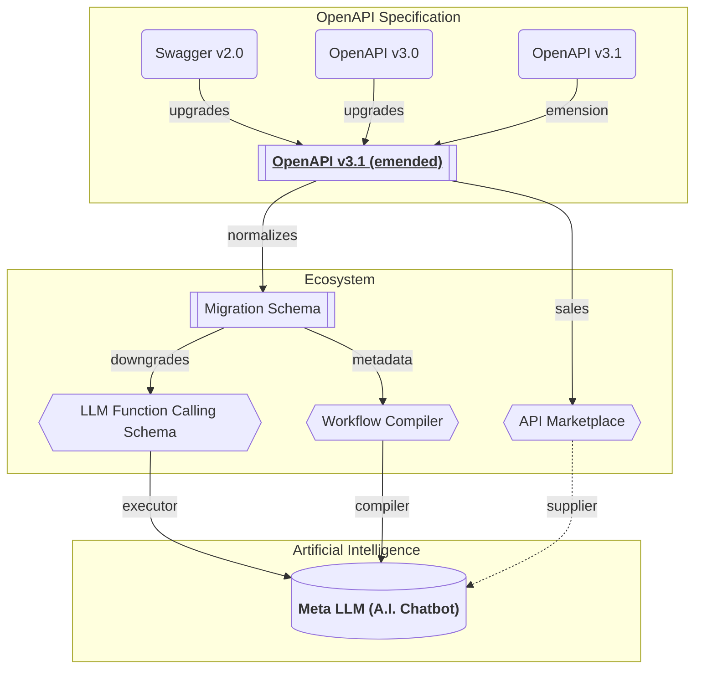
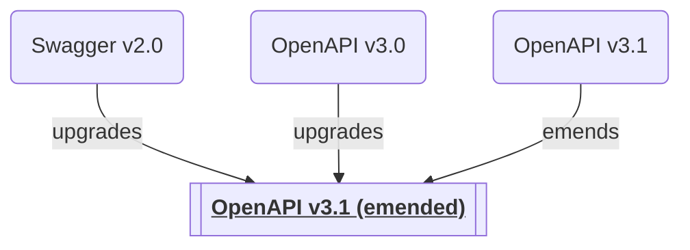
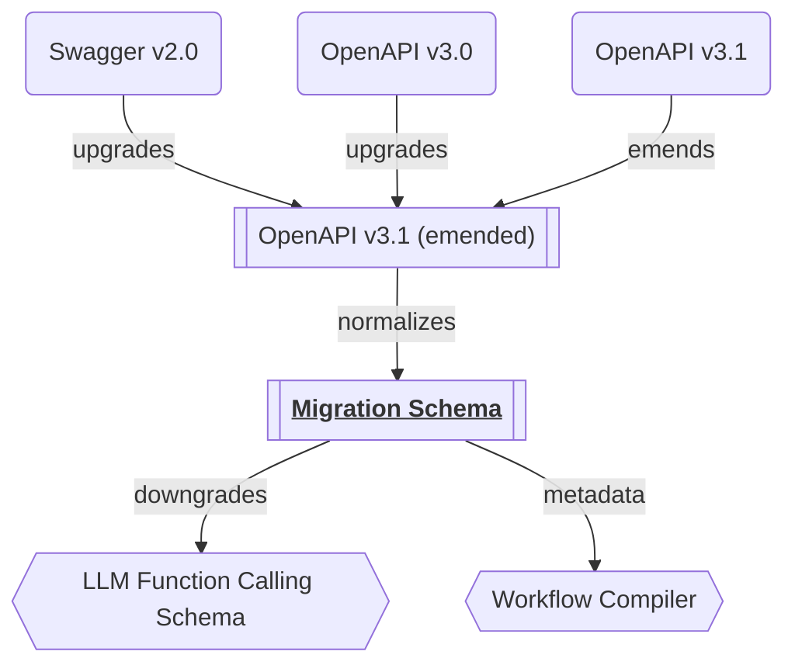
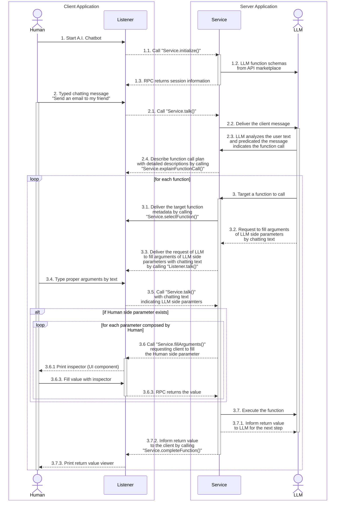

import { Callout, Tabs, Tab } from 'nextra-theme-docs';

## Summary


Summarize LLM function call execution principles.

In this technical documents, the concept of LLM (Large Language Model) funtion call execution is the most important part. Therefore, even though the LLM function call execution concept has been explained detaily in the previous chapters, it would be better to summarize again for the readers who want to understand the concept at a glance.

1. Convert to specific and emended OpenAPI specification
2. Normalize the OpenAPI specification to the migration schema
3. Transform migration schema to the LLM function schema
4. Perform the function call execution through WebSocket RPC communication

<Callout type="info">

**LLM Function Calling**

LLM selects proper function and fill arguments.

In nowadays, most LLM (Large Language Model) like OpenAI are supporting "function calling" feature. The "function calling" means that LLM automatically selects a proper function and compose parameter values from the user's chatting text.

https://platform.openai.com/docs/guides/function-calling

</Callout>


## OpenAPI Emension


Convert to a specific and emended OpenAPI version.

To accomplish the LLM (Large Language Model) function call execution mission, "Wrtn Studio Pro" starts from converting the OpenAPI document to a specific version (v3.1) with emension for clarity and consistency. 

The reason of conversion is, there're many versions in the OpenAPI document specification, and there're too many synonym expression ways even in the same version. By unifying a specific version and emending every synonym types, "Wrtn Studio Pro" acquires consistent API structures, so that get a change to compose the LLM function schema easier and safer than any others.

Also, as "Wrtn Studio Pro" operates [API Marketplace](/tech-specs/marketplace/preface) to supply API operations (functions to call by LLM) to the Meta LLM (A.I. Chatbot), such standardization is essential to provide a stable and reliable service.

  - [**OpenAPI v3.1 emended**](https://github.com/samchon/openapi/blob/master/src/OpenApi.ts)
  - [OpenAPI v3.1](https://github.com/samchon/openapi/blob/master/src/OpenApiV3_1.ts)
  - [OpenAPI v3.0](https://github.com/samchon/openapi/blob/master/src/OpenApiV3.ts)
  - [Swagger v2.0](https://github.com/samchon/openapi/blob/master/src/SwaggerV2.ts)

## Migration Process


Before converting OpenAPI operations to LLM function calling schemas, "Wrtn Studio Pro" transforms the OpenAPI operations to an intermediate structure. The intermediate structure is called migration schema, and normalizes parameters/reponses of the OpenAPI opertion.

In other words, the migration schema is called to a helper schema for RPC (Remote Procedure Call) function conversion from OpenAPI operation. By providing noramlized definitions close to the RPC function, "Wrtn Studio Pro" can easily convert to the LLM function calling schema from the OpenAPI document.

For example, migration schema forces path parameters to have their own names, and combines query/headers to be a single object. Also, separates the response body to success and exceptional cases, and provides a description comment for the RPC function.

- [`IMigrateDocument`](https://github.com/samchon/openapi/blob/master/src/IMigrateDocument.ts)
- [`IMigrateRoute`](https://github.com/samchon/openapi/blob/master/src/IMigrateRoute.ts)


## LLM Function Schema
<Tabs items={[
    <code>IOpenAiDocument</code>,
    <code>IOpenAiFunction</code>,
    <code>IOpenAiSchema</code>,
  ]} selectedIndex={1}>
  <Tab>
```typescript filename="@wrtnio/openai-function-schema" showLineNumbers
/**
 * Document of OpenAI function call metadata.
 *
 * `IOpenAiDocument` is a data structure representing content of
 * {@link IOpenAiDocument.functions OpenAI function call metadata}, composed by
 * {@link OpenAiComposer} from the {@link ISwagger} document, with
 * {@link IOpenAiDocument.errors} and adjusted {@link IOpenAiDocument.options}.
 *
 * The different between `IOpenAiDocument` and its origin source {@link ISwagger}
 * is, `IOpenAiDocument` has converted every {@link ISwaggerOperation API endpoints}
 * to {@link IOpenAiFunction function metadata}. You can execute the function call
 * with OpenAI constructed arguments by using the {@link OpenAiFetcher.execute}
 * function with the function metadata.
 *
 * Also, every type schema informations are casted from {@link ISwaggerSchema} to
 * {@link IOpenAiSchema} to escape {@link ISwaggerSchema.IReference reference types},
 * and downgrade the version of the JSON schema to OpenAPI 3.0. It's because
 * OpenAI function call feature cannot understand both reference types and
 * OpenAPI 3.1 specification.
 *
 * Additionally, if you've composed `IOpenAiDocument` with
 * {@link IOpenAiDocument.IOptions.keyword} configuration (as `true`), number of
 * {@link IOpenAiFunction.parameters} are always 1 and the first parameter's type is
 * always {@link IOpenAiSchema.IObject}. The properties' rule is:
 *
 * - `pathParameters`: Path parameters of {@link ISwaggerMigrateRoute.parameters}
 * - `query`: Query parameter of {@link ISwaggerMigrateRoute.query}
 * - `body`: Body parameter of {@link ISwaggerMigrateRoute.body}
 *
 * ```typescript
 * {
 *   ...pathParameters,
 *   query,
 *   body,
 * }
 * ```
 *
 * Otherwise, the parameters would be multiple, and the sequence of the parameters
 * are following below rules:
 *
 * ```typescript
 * [
 *   ...pathParameters,
 *   ...(query ? [query] : []),
 *   ...(body ? [body] : []),
 * ]
 * ```
 */
export interface IOpenAiDocument {
  /**
   * Version of OpenAPI.
   *
   * OpenAI function call schemas are based on OpenAPI 3.0.3.
   */
  openapi: "3.0.3";

  /**
   * List of function metadata.
   *
   * List of function metadata that can be used for the OpenAI function call.
   *
   * When you want to execute the function with OpenAI constructed arguments,
   * you can do it through {@link OpenAiFetcher.execute} function.
   */
  functions: IOpenAiFunction[];

  /**
   * List of errors occurred during the composition.
   */
  errors: IOpenAiDocument.IError[];

  /**
   * Options for the document.
   *
   * Adjusted options when composing the document through {@link OpenAiComposer}.
   */
  options: IOpenAiDocument.IOptions;
}
export namespace IOpenAiDocument {
  /**
   * Error occurred in the composition.
   */
  export interface IError {
    /**
     * HTTP method of the endpoint.
     */
    method: "get" | "post" | "put" | "patch" | "delete" | "head";

    /**
     * Path of the endpoint.
     */
    path: string;

    /**
     * Error messsages.
     */
    messages: string[];

    /**
     * Get the Swagger operation metadata.
     *
     * Get the Swagger operation metadata, of the source.
     */
    operation: () => ISwaggerOperation;

    /**
     * Get the migration route metadata.
     *
     * Get the migration route metadata, of the source.
     *
     * If the property returns `undefined`, it means that the error has been
     * occured in the migration level, not of OpenAI document composition.
     *
     * @returns Migration route metadata.
     */
    route: () => ISwaggerMigrateRoute | undefined;
  }

  /**
   * Options for composing the OpenAI document.
   */
  export interface IOptions {
    /**
     * Whether the parameters are keyworded or not.
     *
     * If this property value is `true`, length of the
     * {@link IOpenAiDocument.IFunction.parameters} is always 1, and type of the
     * pararameter is always {@link IOpenAiSchema.IObject} type. Also, its
     * properties are following below rules:
     *
     * - `pathParameters`: Path parameters of {@link ISwaggerMigrateRoute.parameters}
     * - `query`: Query parameter of {@link ISwaggerMigrateRoute.query}
     * - `body`: Body parameter of {@link ISwaggerMigrateRoute.body}
     *
     * ```typescript
     * {
     *   ...pathParameters,
     *   query,
     *   body,
     * }
     * ```
     *
     * Otherwise (this property value is `false`), length of the
     * {@link IOpenAiDocument.IFunction.parameters} is variable, and sequence of the
     * parameters are following below rules.
     *
     * ```typescript
     * [
     *   ...pathParameters,
     *   ...(query ? [query] : []),
     *   ...(body ? [body] : []),
     * ]
     * ```
     *
     * @default false
     */
    keyword: boolean;

    /**
     * Separator function for the parameters.
     *
     * When composing parameter arguments through OpenAI function call,
     * there can be a case that some parameters must be composed by human, or
     * LLM cannot understand the parameter. For example, if the parameter type
     * has configured {@link IOpenAiSchema.IString["x-wrtn-secret-key"]}, the
     * secret key value must be composed by human, not by LLM (Large Language Model).
     *
     * In that case, if you configure this property with a function that
     * predicating whether the schema value must be composed by human or not,
     * the parameters would be separated into two parts.
     *
     * - {@link IOpenAiFunction.separated.llm}
     * - {@link IOpenAiFunction.separated.human}
     *
     * When writing the function, note that returning value `true` means to be
     * a human composing the value, and `false` means to LLM composing the value.
     * Also, when predicating the schema, it would better to utilize the
     * {@link OpenAiTypeChecker} features.
     *
     * @param schema Schema to be separated.
     * @returns Whether the schema value must be composed by human or not.
     * @default null
     */
    separate: null | ((schema: IOpenAiSchema) => boolean);
  }
}
```
  </Tab>
  <Tab>
```typescript filename="@wrtnio/openai-function-schema" showLineNumbers
/**
 * OpenAI function metadata.
 *
 * `IOpenAiFunction` is a data structure representing a function,
 * which is provided by Restful API, and used for the OpenAI function call.
 *
 * If you provide this `IOpenAiFunction` instance to the OpenAI, the OpenAI
 * will construct arguments by conversating with the user. Also, you can
 * execute the function call with the OpenAI constructed arguments by using
 * {@link OpenAiFetcher.execute}.
 *
 * For reference, different between `IOpenAiFunction` and its origin source
 * {@link ISwaggerOperation} is, `IOpenAiFunction` has converted every type schema
 * informations from {@link ISwaggerSchema} to {@link IOpenAiSchema} to escape
 * {@link ISwaggerSchema.IReference reference types}, and downgrade the version of
 * the JSON schema to OpenAPI 3.0. It's because OpenAI function call feature cannot
 * understand both reference types and OpenAPI 3.1 specification.
 *
 * Additionally, if you've composed `IOpenAiFunction` with
 * {@link IOpenAiDocument.IOptions.keyword} configuration (as `true`), number of
 * {@link IOpenAiFunction.parameters} are always 1 and the first parameter's type is
 * always {@link IOpenAiSchema.IObject}. The properties' rule is:
 *
 * - `pathParameters`: Path parameters of {@link ISwaggerMigrateRoute.parameters}
 * - `query`: Query parameter of {@link ISwaggerMigrateRoute.query}
 * - `body`: Body parameter of {@link ISwaggerMigrateRoute.body}
 *
 * ```typescript
 * {
 *   ...pathParameters,
 *   query,
 *   body,
 * }
 * ```
 *
 * Otherwise, the parameters would be multiple, and the sequence of the parameters
 * are following below rules:
 *
 * ```typescript
 * [
 *   ...pathParameters,
 *   ...(query ? [query] : []),
 *   ...(body ? [body] : []),
 * ]
 * ```
 */
export interface IOpenAiFunction {
  /**
   * HTTP method of the endpoint.
   */
  method: "get" | "post" | "patch" | "put" | "delete";

  /**
   * Path of the endpoint.
   */
  path: string;

  /**
   * Representative name of the function.
   *
   * The `name` is a repsentative name identifying the function in the
   * {@link IOpenAiDocument}. The `name` value is just composed by joining the
   * {@link IMigrateRoute.accessor} by underscore `_` character.
   *
   * Here is the composition rule of the  {@link IMigrateRoute.accessor}:
   *
   * > The `accessor` is composed with the following rules. At first, namespaces
   * > are composed by static directory names in the {@link path}. Parametric
   * > symbols represented by `:param` or `{param}` cannot be a part of the
   * > namespace.
   * >
   * > Instead, they would be a part of the function name. The function
   * > name is composed with the {@link method HTTP method} and parametric symbols
   * > like `getByParam` or `postByParam`. If there are multiple path parameters,
   * > they would be concatenated by `And` like `getByParam1AndParam2`.
   * >
   * > For refefence, if the {@link operation}'s {@link method} is `delete`, the
   * > function name would be replaced to `erase` instead of `delete`. It is
   * > the reason why the `delete` is a reserved keyword in many programming
   * > languages.
   * >
   * > - Example 1
   * >   - path: `POST /shopping/sellers/sales`
   * >   - accessor: `shopping.sellers.sales.post`
   * > - Example 2
   * >   - endpoint: `GET /shoppings/sellers/sales/:saleId/reviews/:reviewId/comments/:id
   * >   - accessor: `shoppings.sellers.sales.reviews.getBySaleIdAndReviewIdAndCommentId`
   */
  name: string;

  /**
   * Whether the function schema types are strict or not.
   *
   * Newly added specification at 2024-08-07.
   *
   * @reference https://openai.com/index/introducing-structured-outputs-in-the-api/
   */
  strict: true;

  /**
   * List of parameter schemas.
   *
   * If you've configured {@link IOpenAiDocument.IOptions.keyword} (as `true`),
   * number of {@link IOpenAiFunction.parameters} are always 1 and the first parameter's
   * type is always {@link IOpenAiSchema.IObject}. The properties' rule is:
   *
   * - `pathParameters`: Path parameters of {@link IMigrateRoute.parameters}
   * - `query`: Query parameter of {@link IMigrateRoute.query}
   * - `body`: Body parameter of {@link IMigrateRoute.body}
   *
   * ```typescript
   * {
   *   ...pathParameters,
   *   query,
   *   body,
   * }
   * ```
   *
   * Otherwise, the parameters would be multiple, and the sequence of the parameters
   * are following below rules:
   *
   * ```typescript
   * [
   *   ...pathParameters,
   *   ...(query ? [query] : []),
   *   ...(body ? [body] : []),
   * ]
   * ```
   */
  parameters: IOpenAiSchema[];

  /**
   * Collection of separated parameters.
   *
   * Filled only when {@link IOpenAiDocument.IOptions.separate} has been configured.
   */
  separated?: IOpenAiFunction.ISeparated;

  /**
   * Expected return type.
   *
   * If the function returns nothing (`void`), then the output is `undefined`.
   */
  output?: IOpenAiSchema | undefined;

  /**
   * Description of the function.
   *
   * Composed by such rule:
   *
   * 1. Starts from the {@link OpenApi.IOperation.summary} paragraph.
   * 2. The next paragraphs are filled with the {@link OpenApi.IOperation.description}.
   *    By the way, if the first paragraph of {@link OpenApi.IOperation.description} is same
   *    with the {@link OpenApi.IOperation.summary}, it would not be duplicated.
   * 3. Parameters' descriptions are added with `@param` tag.
   * 4. {@link OpenApi.IOperation.security Security requirements} are added with `@security` tag.
   * 5. Tag names are added with `@tag` tag.
   * 6. If {@link OpenApi.IOperation.deprecated}, `@deprecated` tag is added.
   */
  description?: string;

  /**
   * Get the Swagger operation metadata.
   *
   * Get the Swagger operation metadata, of the source.
   *
   * @returns Swagger operation metadata.
   */
  operation: () => ISwaggerOperation;

  /**
   * Get the migration route metadata.
   *
   * Get the migration route metadata, of the source.
   *
   * @returns Migration route metadata.
   */
  route: () => ISwaggerMigrateRoute;
}
export namespace IOpenAiFunction {
  /**
   * Collection of separated parameters.
   */
  export interface ISeparated {
    /**
     * Parameters that would be composed by the OpenAI.
     */
    llm: ISeparatedParameter[];

    /**
     * Parameters that would be composed by the human.
     */
    human: ISeparatedParameter[];
  }

  /**
   * Separated parameter.
   */
  export interface ISeparatedParameter {
    /**
     * Index of the parameter.
     */
    index: number;

    /**
     * Type schema info of the parameter.
     */
    schema: IOpenAiSchema;
  }
}
```
  </Tab>
  <Tab>
```typescript filename="@wrtnio/openai-function-schema" showLineNumbers
/**
 * Type schema info of OpenAI function call.
 *
 * `IOpenAiSchema` is a type schema info of OpenAI function call.
 *
 * `IOpenAiSchema` is basically follows the JSON schema definition of
 * OpenAI v3.0: {@link OpenApiV3.IJsonSchema}. However, `IOpenAiSchema` does not
 * have the reference type {@link OpenApiV3.IJsonSchema.IReference}. It's because
 * the OpenAI cannot compose
 * {@link OpenAiFetcher.IProps.arguments function call arguments} of
 * the reference type.
 *
 * For reference, the OpenAPI v3.0 based JSON schema definition can't express
 * the tuple array type. It has been supported since OpenAPI v3.1. Therefore,
 * it would better to avoid using the tuple array type.
 */
export type IOpenAiSchema =
  | IOpenAiSchema.IBoolean
  | IOpenAiSchema.IInteger
  | IOpenAiSchema.INumber
  | IOpenAiSchema.IString
  | IOpenAiSchema.IArray
  | IOpenAiSchema.IObject
  | IOpenAiSchema.IUnknown
  | IOpenAiSchema.INullOnly
  | IOpenAiSchema.IOneOf;
export namespace IOpenAiSchema {
  /**
   * Boolean type schema info.
   */
  export interface IBoolean extends __ISignificant<"boolean"> {
    /**
     * Default value.
     */
    default?: boolean;

    /**
     * Enumeration values.
     */
    enum?: boolean[];
  }

  /**
   * Integer type schema info.
   */
  export interface IInteger extends __ISignificant<"integer"> {
    /**
     * Default value.
     *
     * @type int64
     */
    default?: number;

    /**
     * Enumeration values.
     *
     * @type int64
     */
    enum?: number[];

    /**
     * Minimum value restriction.
     *
     * @type int64
     */
    minimum?: number;

    /**
     * Maximum value restriction.
     *
     * @type int64
     */
    maximum?: number;

    /**
     * Exclusive minimum value restriction.
     *
     * For reference, even though your Swagger (or OpenAPI) document has
     * defined the `exclusiveMinimum` value as `number`, {@link OpenAiComposer}
     * forcibly converts it to `boolean` type, and assign the numeric value to
     * the {@link minimum} property.
     */
    exclusiveMinimum?: boolean;

    /**
     * Exclusive maximum value restriction.
     *
     * For reference, even though your Swagger (or OpenAPI) document has
     * defined the `exclusiveMaximum` value as `number`, {@link OpenAiComposer}
     * forcibly converts it to `boolean` type, and assign the numeric value to
     * the {@link maximum} property.
     */
    exclusiveMaximum?: boolean;

    /**
     * Multiple of value restriction.
     *
     * @type uint64
     * @exclusiveMinimum 0
     */
    multipleOf?: number;
  }

  /**
   * Number type schema info.
   */
  export interface INumber extends __ISignificant<"number"> {
    /**
     * Default value.
     */
    default?: number;

    /**
     * Enumeration values.
     */
    enum?: number[];

    /**
     * Minimum value restriction.
     */
    minimum?: number;

    /**
     * Maximum value restriction.
     */
    maximum?: number;

    /**
     * Exclusive minimum value restriction.
     *
     * For reference, even though your Swagger (or OpenAPI) document has
     * defined the `exclusiveMinimum` value as `number`, {@link OpenAiComposer}
     * forcibly converts it to `boolean` type, and assign the numeric value to
     * the {@link minimum} property.
     */
    exclusiveMinimum?: boolean;

    /**
     * Exclusive maximum value restriction.
     *
     * For reference, even though your Swagger (or OpenAPI) document has
     * defined the `exclusiveMaximum` value as `number`, {@link OpenAiComposer}
     * forcibly converts it to `boolean` type, and assign the numeric value to
     * the {@link maximum} property.
     */
    exclusiveMaximum?: boolean;

    /**
     * Multiple of value restriction.
     *
     * @exclusiveMinimum 0
     */
    multipleOf?: number;
  }

  /**
   * String type schema info.
   */
  export interface IString extends __ISignificant<"string"> {
    /**
     * Default value.
     */
    default?: string;

    /**
     * Enumeration values.
     */
    enum?: string[];

    /**
     * Format restriction.
     */
    format?:
      | "binary"
      | "byte"
      | "password"
      | "regex"
      | "uuid"
      | "email"
      | "hostname"
      | "idn-email"
      | "idn-hostname"
      | "iri"
      | "iri-reference"
      | "ipv4"
      | "ipv6"
      | "uri"
      | "uri-reference"
      | "uri-template"
      | "url"
      | "date-time"
      | "date"
      | "time"
      | "duration"
      | "json-pointer"
      | "relative-json-pointer"
      | (string & {});

    /**
     * Pattern restriction.
     */
    pattern?: string;

    /**
     * Minimum length restriction.
     *
     * @type uint64
     */
    minLength?: number;

    /**
     * Maximum length restriction.
     *
     * @type uint64
     */
    maxLength?: number;

    /**
     * Content media type restriction.
     */
    contentMediaType?: string;

    /**
     * Secret key for the schema.
     *
     * `x-wrtn-secret-key` is a property means a secret key that is required
     * for the target API endpoint calling. If the secret key is not filled,
     * the API call would be failed.
     */
    "x-wrtn-secret-key"?: string;

    /**
     * Secret scopes for the schema.
     *
     * `x-wrtn-secret-scopes` is a property means a list of secret scopes that
     * are required for the target API endpoint calling. If the secret scopes
     * are not satisfied, the API call would be failed.
     */
    "x-wrtn-secret-scopes"?: string[];
  }

  /**
   * Array type schema info.
   */
  export interface IArray extends __ISignificant<"array"> {
    /**
     * Items type schema info.
     *
     * The `items` means the type of the array elements. In other words, it is
     * the type schema info of the `T` in the TypeScript array type `Array<T>`.
     */
    items: IOpenAiSchema;

    /**
     * Unique items restriction.
     *
     * If this property value is `true`, target array must have unique items.
     */
    uniqueItems?: boolean;

    /**
     * Minimum items restriction.
     *
     * Restriction of minumum number of items in the array.
     *
     * @type uint64
     */
    minItems?: number;

    /**
     * Maximum items restriction.
     *
     * Restriction of maximum number of items in the array.
     *
     * @type uint64
     */
    maxItems?: number;
  }

  /**
   * Object type schema info.
   */
  export interface IObject extends __ISignificant<"object"> {
    /**
     * Properties of the object.
     *
     * The `properties` means a list of key-value pairs of the object's
     * regular properties. The key is the name of the regular property,
     * and the value is the type schema info.
     *
     * If you need additional properties that is represented by dynamic key,
     * you can use the {@link additionalProperties} instead.
     */
    properties?: Record<string, IOpenAiSchema>;

    /**
     * List of key values of the required properties.
     *
     * The `required` means a list of the key values of the required
     * {@link properties}. If some property key is not listed in the `required`
     * list, it means that property is optional. Otherwise some property key
     * exists in the `required` list, it means that the property must be filled.
     *
     * Below is an example of the {@link properties} and `required`.
     *
     * ```typescript
     * interface SomeObject {
     *   id: string;
     *   email: string;
     *   name?: string;
     * }
     * ```
     *
     * As you can see, `id` and `email` {@link properties} are {@link required},
     * so that they are listed in the `required` list.
     *
     * ```json
     * {
     *   "type": "object",
     *   "properties": {
     *     "id": { "type": "string" },
     *     "email": { "type": "string" },
     *     "name": { "type": "string" }
     *   },
     *   "required": ["id", "email"]
     * }
     * ```
     */
    required?: string[];

    /**
     * Additional properties' info.
     *
     * The `additionalProperties` means the type schema info of the additional
     * properties that are not listed in the {@link properties}.
     *
     * If the value is `true`, it means that the additional properties are not
     * restricted. They can be any type. Otherwise, if the value is
     * {@link IOpenAiSchema} type, it means that the additional properties must
     * follow the type schema info.
     *
     * - `true`: `Record<string, any>`
     * - `IOpenAiSchema`: `Record<string, T>`
     */
    additionalProperties?: boolean | IOpenAiSchema;
  }

  /**
   * Unknown type schema info.
   *
   * It means the type of the value is `any`.
   */
  export interface IUnknown extends __IAttribute {
    /**
     * Type is never be defined.
     */
    type?: undefined;
  }

  /**
   * Null only type schema info.
   */
  export interface INullOnly extends __IAttribute {
    /**
     * Type is always `null`.
     */
    type: "null";
  }

  /**
   * One of type schema info.
   *
   * `IOneOf` represents an union type of the TypeScript (`A | B | C`).
   *
   * For reference, even though your Swagger (or OpenAPI) document has
   * defined `anyOf` instead of the `oneOf`, {@link OpenAiComposer} forcibly
   * converts it to `oneOf` type.
   */
  export interface IOneOf extends __IAttribute {
    /**
     * List of the union types.
     */
    oneOf: IOpenAiSchema[];
  }

  /**
   * Significant attributes that can be applied to the most types.
   */
  export interface __ISignificant<Type extends string> extends __IAttribute {
    /**
     * Discriminator value of the type.
     */
    type: Type;

    /**
     * Whether to allow `null` value or not.
     */
    nullable?: boolean;
  }

  /**
   * Common attributes that can be applied to all types.
   */
  export interface __IAttribute {
    /**
     * Title of the schema.
     */
    title?: string;

    /**
     * Detailed description of the schema.
     */
    description?: string;

    /**
     * Whether the type is deprecated or not.
     */
    deprecated?: boolean;

    /**
     * Placeholder value for frontend application.
     *
     * Placeholder means the value to be shown in the input field as a hint.
     * For example, when an email input field exists, the placeholder value
     * would be "Insert your email address here".
     */
    "x-wrtn-placeholder"?: string;

    /**
     * Prerequisite API endpoint for the schema.
     *
     * `x-wrtn-prerequisite` is a property representing the prerequisite API
     * interaction. It means that, the endpoint API should be called before
     * calling the target API, for composing some argument value.
     *
     * @reference https://github.com/wrtnio/decorators/blob/main/src/Prerequisite.ts
     */
    "x-wrtn-prerequisite"?: {
      /**
       * HTTP method to call the endpoint.
       */
      method: "get" | "post" | "patch" | "put" | "delete";

      /**
       * Path of the endpoint.
       */
      path: string;

      /**
       * Function returning transformed values using JMESPath expression.
       *
       * `Prerequisite.Props.jmesPath` is a string typed property that extracts desired values
       * from the prerequisite API response using a JMESPath expression. This property simplifies
       * and replaces the `label`, `value`, and `array` properties.
       *
       * JMESPath expressions are used to extract the desired data based on the API response.
       * The expression must always be a valid JMESPath syntax.
       *
       * - Type: `jmesPath: string`
       * - Example: `"members[*].data.title"`
       * - Usage: `jmespath.search(response, jmesPath)`
       *
       * Note: The `label`, `value`, and `array` properties are no longer in use.
       */
      jmesPath: string;
    }
  }
}
```
  </Tab>
</Tabs>

Transform to the LLM function calling schema.

After converting to OpenAPI v3.1 emended specification, and normalizing to the migration schema, we can finally transform to the LLM function calling schema. The LLM function calling schema is a typical RPC (Remote Procedure Call) structure representing a function which has its own name, description, parameters and return value types.

About the type schema, it is similar with OpenAPI v3.0 speicified JSON schema, however, it does not have reference type (`$ref`). Therefore, LLM function calling schema cannot express recursive types, so that only flat structured OpenAPI operation can be transformed to the LLM function schema.

Additionally, "Wrtn Studio Pro" is separating the parameters of LLM function schema into two parts; Human and LLM. The Human side parameters mean that, the value must be composed by human, not by LLM. For example, secret key value for identifying user or file uploading feature must be composed by Human, and such parameters are separated from the LLM side parameters.


## Meta LLM (A.I. Chatbot)
<Tabs items={[
    "Sequence Diagram", 
    <code>IStudioMetaChatService</code>, 
    <code>IStudioMetaChatListener</code>,
    <code>IStudioMetaChatFunctionCall</code>,
  ]}>
  <Tab>

  </Tab>
  <Tab>
```typescript filename="@wrtn/ecosystem-api" showLineNumbers
/**
 * Set of functions provided by the Meta LLM server to the client.
 * 
 * `IStudioMetaChatService` is an interface that defines the set of functions
 * provided by the **server** to the Meta LLM (Large Language Model) client. The Meta 
 * LLM client remotely calls the server's `IStudioMetaChatService` functions through 
 * this interface with RPC (Remote Procedure Call) paradigm.
 * 
 * Note that the client must call the {@link initialize} function immediately
 * after connecting to the Meta LLM server. If the client tries to skip the
 * {@link initialize} function call and directly call {@link talk}, the function
 * call will fail, so that exception would be thrown.
 */
export interface IStudioMetaChatService {
  /**
   * Publish/restore/initialize the chat session.
   * 
   * The client must call this function once after connecting to the Meta LLM
   * server to publish a new chat session or restore an existing session. If
   * the client tries to skip the {@link initialize} function call and directly
   * call {@link talk}, the function call will fail, so that exception would be
   * thrown.
   * 
   * Also, the returned session would be a new chat session if the client connected
   * to the server via the new chat session API, and the existing session would be
   * restored if the client connected to the server via the continue chat session
   * API.
   *
   * - {@link HubApi.functional.studio.customers.meta.chat.sessions.start}
   * - {@link HubApi.functional.studio.customers.meta.chat.sessions.restart}
   */
  initialize(): Promise<IStudioMetaChatSession>;

  /**
   * User talks to Meta LLM.
   * 
   * A function called by the client to talk to the Meta LLM server.
   * 
   * @param dialogue Dialogue information
   */
  talk(dialogue: IStudioMetaChatDialogue): Promise<void>;
}
```
  </Tab>
  <Tab>
```typescript filename="@wrtn/ecosystem-api" showLineNumbers
/**
 * Set of functions provided by the Meta LLM client to the server.
 * 
 * `IStudioMetaChatListener` is an interface that defines the set of functions
 * provided by the **client** to the Meta LLM (Large Language Model) server. The Meta 
 * LLM server remotely calls the client's `IStudioMetaChatListener` functions through
 * this interface with RPC (Remote Procedure Call) paradigm.
 */
export interface IStudioMetaChatListener {
  /**
   * Meta LLM server talks to the user.
   * 
   * A function called by the Meta LLM server to talk to the user.
   *
   * @param dialogue Dialogue information
   */
  talk(dialogue: IStudioMetaChatDialogue): Promise<void>;

  /**
   * Notify the client of the server's listenability.
   * 
   * The Meta LLM server notifies the client whether it is possible to listen.
   *  
   * In other words, this function informs the client whether it can call
   * {@link IStudioMetaChatService.talk} immediately or not.
   * 
   * Note that when the client calls the server's RPC function
   * {@link IStudioMetaChatService.talk}, the value `false` is passed to this
   * function {@link IStudioMetaChatListener.listenable} immediately. On the
   * other hand, the value `true` is passed to this function in various cases.
   *
   * @param status Listenability status
   */
  listenable(status: boolean): Promise<void>;

  /**
   * Explain the function call plan.
   * 
   * The Meta LLM server explains the function call plan to the user.
   * 
   * The function call plan provided includes a list of functions that LLM
   * wants to execute in order, and a description of the entire plan and the
   * purpose of each function call.
   * 
   * The client can read this and decide whether to proceed with the LLM
   * function call execution. If `true` is returned, the Meta LLM will call
   * the functions according to the plan. Otherwise `false` be returned, the plan
   * would be withdrawn.
   * 
   * @param plan Function call plan
   * @returns Whether to proceed with the plan or not
   */
  explainFunctionCall(plan: IStudioMetaChatFunctionCallPlan): Promise<boolean>;

  /**
   * Select a function to call.
   * 
   * A function called by the Meta LLM server when LLM (Large Language Model) has
   * determined the target function to call during the conversation with the user.
   * 
   * After this function be called, the server will call the {@link fillArguments} 
   * functionns remotely to commpose parameter values, and then call the 
   * {@link completeFunction} function after the function call execution.
   *
   * @param props Information of the target function
   */
  selectFunction(props: IStudioMetaChatFunctionCall.ISelect): Promise<void>;

  /**
   * Fill in the argument of the function call.
   * 
   * A function called by the Meta LLM server when the user needs to fill in 
   * some of the argument for the LLM function call. For example, when the user
   * needs to enter an authentication key for a Google account, or upload a file
   * manually.
   * 
   * `IStudioMetaFunctionCall.arguments` is a function called when the user needs
   * to compose some (or all) of the arguments to be used in the function call
   * directly. The returned value means the value that the client has composed.
   * 
   * The only cases where the client receives input separately from the server
   * in our service are as follows:
   *
   * - {@link IOpenAiSchema.IString["x-wrtn-secret-key"]}
   * - {@link IOpenAiSchema.IString.contentMediaType}
   *
   * @param props Information of the target function and argument types
   * @returns The value composed by the client, or rejection by hin/her
   */
  fillArgument(
    props: IStudioMetaChatFunctionCall.IFillArgument,
  ): Promise<IStudioMetaChatListener.IFillArgumentResult>;

  /**
   * Complete the function call.
   * 
   * A function called by the Meta LLM server to inform the client of the 
   * completion of the LLM function call execution. 
   * 
   * It embodies the `Try<T, E>` structure, so that contains whether the function call 
   * was successful or not. Also, it contains the return value when suceeded, and the
   * exception information when failed.
   *
   * @param props Information of the execution result
   */
  completeFunction(props: IStudioMetaChatFunctionCall.IComplete): Promise<void>;

  /**
   * Workflow has been prepared.
   * 
   * A function called by the Meta LLM server when the workflow creation is ready.
   * Client can decide whether to save the {@link IStudioWorkflow workflow document} 
   * based on the {@link IStudioWorkflowData.ICreate creation information} received 
   * from the server.
   * 
   * If client returns a {@link IStudioMetaChatWorkflowConfirm} instance in this 
   * function, the server will create the workflow at the specified 
   * {@link IStudioRepository repository} location. Otherwise the client returns
   * `null`, the server will not create the workflow.
   *
   * @param data Workflow creation information
   * @param plan Workflow configuration plan including detailed descriptions
   * @returns Whether to create the workflow document or not
   */
  prepareWorkflow(
    data: IStudioWorkflowData.ICreate,
    plan: IStudioMetaChatWorkflowPlan,
  ): Promise<IStudioMetaChatWorkflowConfirm | null>;

  /**
   * Workflow has been created/updated.
   * 
   * A function called by the Meta LLM server when an {@link IStudioWorkflow workflow}
   * has been newly created or updated by the client had returned a non-null value from
   * the {@link prepareWorkflow} function.
   * 
   * Whether the server creates or updates the workflow depends on the return value of
   * the {@link prepareWorkflow} function. If the client orders a new workflow document,
   * it would be created by the server. Otherwise the client directed the existing
   * workflow document, it would be updated.
   * 
   * The provided parameter object is the detailed information of the workflow
   * {@link IStudioWorkflow} and its location information with {@link IStudioRepository}, 
   * so that the client can check it and enter the workflow editor or provide 
   * a preview image.
   *
   * @param workflow Newly created or updated workflow
   * @param related Account and repository information related to the workflow
   */
  completeWorkflow(
    workflow: IStudioWorkflow,
    related: Pick<IStudioMetaChatWorkflowConfirm, "account" | "repository">,
  ): Promise<void>;

  /**
   * Meta LLM server requests the client to terminate.
   * 
   * When the Meta LLM session suddenly died due to the bug from LLM 
   * (Large Language Model) like OpenAI, the server requests the client to terminate 
   * the connection, and retry it again a little bit later.
   *
   * @param error Error from the LLM module
   */
  kill(error?: any): Promise<void>;
}
```
  </Tab>
  <Tab>
```typescript filename="@wrtn/ecosystem-api" showLineNumbers
import { IOpenAiFunction, IOpenAiSchema } from "@wrtnio/openai-function-schema";
import { Primitive, tags } from "typia";
import { OmitNever } from "typia/lib/typings/OmitNever";

export namespace IStudioMetaChatFunctionCall {
  /**
   * Selection information of the function to call.
   * 
   * `IStudioMetaChatFunctionCall.ISelect` is an interface that providing metadata
   * of the target function to call when the Meta LLM server selects a proper function 
   * to call during the conversation with the user.
   * 
   * In the context of RPC (Remote Procedure Call), this `IStudioMetaChatFunctionCall`
   * structure is used in the {@link IStudioMetaChatListener.selectFunction} method.
   * Also after delivering this information. the server will step below sequence:
   * 
   * 1. {@link IStudioMetaChatListener.fillArgument} to compose Human side parameters
   * 2. {@link IStudioMetaChatListener.completeFunction} after function call execution
   */
  export interface ISelect {
    /**
     * Primary Key.
     */
    id: string & tags.Format<"uuid">;

    /**
     * Metadata of the target function to call.
     */
    function: OmitNever<Primitive<IOpenAiFunction>>;
  }

  /**
   * Request of arguments filling of Human side parameter.
   * 
   * `IStudioMetaChatFunctionCall.IFillArgument` is an interface that providing
   * the request to client for composing some of the arguments of the target
   * function that must be filled by Human side, intead of LLM (Large Language Model).
   * 
   * As a case of the values that must be filled by Human side, there are secret key
   * and file upload. In the context of {@link IOpenAiSchema}, those typed values
   * must be filled by Human:
   * 
   * - {@link IOpenAiSchema.IString["x-wrtn-secret-key"]}
   * - {@link IOpenAiSchema.IString.contentMediaType}
   */
  export interface IFillArgument {
    /**
     * Identifier of the target function.
     * 
     * It is same with the {@link IStudioMetaChatFunctionCall.ISelect.id}.
     */
    id: string & tags.Format<"uuid">;

    /**
     * Index of the parameter to fill.
     */
    index: number & tags.Type<"uint32">;

    /**
     * Schema information that must be composed by Human.
     */
    schema: IOpenAiSchema;

    /**
     * Metadata of the parameter that can be filled by LLM.
     * 
     * If this value is `null`, it means that the parameter must be filled only by 
     * Human. Otherwise, LLM (Large Language Model) also can fill the parameter value
     * by analyzing the client's conversation, and Meta LLM merges it with the 
     * Human composed.
     */
    llm: null | {
      /**
       * SChema information that can be filled by LLM.
       */
      schema: IOpenAiSchema;

      /**
       * Actual value filled by LLM.
       */
      value: any;
    };
  }

  /**
   * Result of the function call execution.
   * 
   * `IStudioMetaChatFunctionCall.IComplete` is an interface that providing the
   * result of the function call execution.
   * 
   * In the RPC (Remote Procedure Call) context, this `IStudioMetaChatFunctionCall`
   * structure is used in the {@link IStudioMetaChatListener.completeFunction} method.
   */
  export interface IComplete {
    /**
     * Primary Key.
     * 
     * It is same with the {@link IStudioMetaChatFunctionCall.ISelect.id}.
     */
    id: string & tags.Format<"uuid">;

    /**
     * Arguments list used in the function call.
     */
    arguments: any[];

    /**
     * Whether the function call was successful or not.
     */
    success: boolean;

    /**
     * Returned value as a result of the function call.
     * 
     * If the function call has been failed, this value would be exception instance 
     * thrown by the target function.
     */
    value: any;

    /**
     * Time of the function call start.
     */
    created_at: string & tags.Format<"date-time">;

    /**
     * Time of the function call completion.
     * 
     * If this value is `null`, it means that the connection to the target function
     * (API operation) itself has failed. On the other hand, if the connection has been
     * succeeded but exception has been thrown during the function call, this time
     * would be the time when the exception has been thrown.
     */
    completed_at: null | (string & tags.Format<"date-time">);

    /**
     * Status of the response.
     * 
     * The HTTP protocol response status if the connection has been succeeded.
     * Otherwise the connection has been failed, this value would be `null`.
     */
    status: number | null;
  }
}
```
  </Tab>
</Tabs>

Function call execution through remotely procedure calls in WebSocket protocol.

"Wrtn Studio Pro" is serving Meta LLM (A.I. Chatbot) with WebSocket Protocol. Also, have implemented interaction logic between client and server as RPC (Remote Procedure Call) paradigm. With the RPC paradigm, client can remote call procedures of server provided like its own function, and server also can remotely call procedures of client provided like its own.

- References
  - [Remote Procedure Call](https://tgrid.com/docs/remote-procedure-call/)
  - [Features > RPC Components](https://tgrid.com/docs/features/components/)
  - [Learn from Examples > Remote Function Call](https://tgrid.com/docs/examples/remote-function-call/)
- Providers
  - [`IStudioMetaChatService`](/api/interfaces/structures_studio_meta_IStudioMetaChatService.IStudioMetaChatService-1.html)
  - [`IStudioMetaChatListener`](/api/interfaces/structures_studio_meta_IStudioMetaChatListener.IStudioMetaChatListener-1.html)

In such RPC background, "Wrtn Studio Pro" has accomplished the LLM function calling A.I. chatbot like below:

> The Meta LLM starts by client's `IStudioMetaChatService.initialize()` remotely method calling, so that the chatting session be published (or restored). After that, the client may sends some conversation text to the server by calling `IStudioMetaChatService.talk()` method. This is the start of every function call execution step.
> 
> When Meta LLM server listens the client's chatting text, it analyzes the text and predicts whether the conversation indicates a function call or not. If the conversation is suspicious to requesting some action, Meta LLM server finds proper functions to call. If suceeded to find some functions which can accomplish the user's request, Meta LLM makes a function call execution plan, and explains the plan to the client by calling `IStudioMetaChatListener.explainFunctionCall()` method. If client accepts the plan, so that returns `tue` value in the method, the Meta LLM server starts the function call execution process.
> 
> For each functions to call, at first, Meta LLM server delivers the metadata information of the target function to call to the client by calling `IStudioMetaChatListener.selectFunction()` method. Also, Meta LLM server requests the client to fill parameter arguments. Such request and response would be done by chatting text through `IStudioMetaChatService.talk()` and `IStudioMetaChatListener.talk()` methods. Meta LLM analyzes user replied chatting text, and fill arguments of the target function by itself.
> 
> By the way, some functions may have special arguments that only Human can compose. Secret key and file uploading cases would be such examples. In that case, Meta LLM requests client to fill the Human side arguments by calling `IStudioMetaChatListener.fillArgument()` method per each parameter argument. In the method, client manually composes the argument through `Inspector` component, and returns it. Meta LLM merges the Human composed argument with the LLM composed, and executes the function.
> 
> After the function call execution, Meta LLM server informs the function call result by calling `IStudioMetaChatListener.completeFunction()` method. Parameter of the method (`IStudioMetaChatFunctionCall.IComplete` type) contains everything about the function call result, including whether to suceeded or not, and return value from the target function or thrown exception information. If the returned value is simple, Meta LLM server will describe the result as conversation text. Otherwise, client side Meta LLM application may provide a return value viewer to show the result.