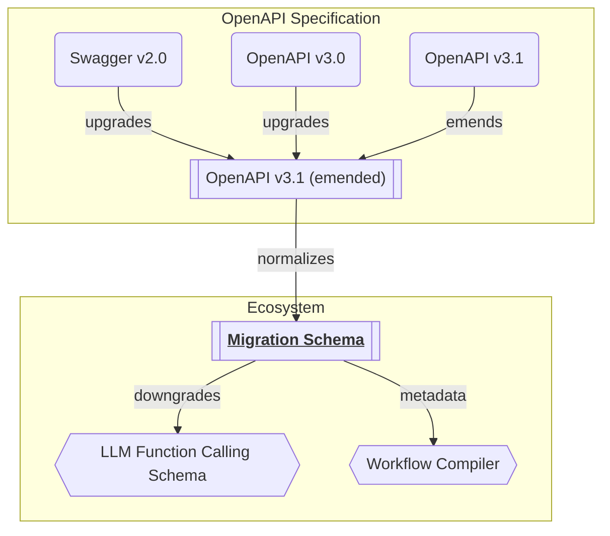

import { Tabs, Tab } from 'nextra-theme-docs';

## Concepts


Convert OpenAPI operations to migration schemas.

Before converting OpenAPI operations to LLM function calling schemas, "Wrtn Studio Pro" transforms the OpenAPI operations to an intermediate structure. The intermediate structure is called migration schema, and normalizes parameters/reponses of the OpenAPI opertion.

In other words, the migration schema is called to a helper schema for RPC (Remote Procedure Call) function conversion from OpenAPI operation. By providing noramlized definitions close to the RPC function, "Wrtn Studio Pro" can easily convert to the LLM function calling schema from the OpenAPI document.

For example, migration schema forces path parameters to have their own names, and combines query/headers to be a single object. Also, separates the response body to success and exceptional cases, and provides a description comment for the RPC function.

- [`IMigrateDocument`](https://github.com/samchon/openapi/blob/master/src/IMigrateDocument.ts)
- [`IMigrateRoute`](https://github.com/samchon/openapi/blob/master/src/IMigrateRoute.ts)


## Document
```typescript filename="@samchon/openapi" showLineNumbers
/**
 * Document of migration.
 *
 * The `IMigrateDocument` interface is a document of migration from
 * {@link OpenAPI.IDocument OpenAPI document} to RPC (Remote Procedure Call)
 * functions; {@link IMigrateRoute}.
 *
 * As the `IMigrateDocument` and {@link IMigrateRoute} have a lot of special
 * stories, when you're developing OpenAPI generator library, please read
 * their descriptions carefully including the description of properties.
 */
export interface IMigrateDocument<
  Schema extends OpenApi.IJsonSchema = OpenApi.IJsonSchema,
  Operation extends OpenApi.IOperation<Schema> = OpenApi.IOperation<Schema>,
> {
  /**
   * List of routes for migration.
   */
  routes: IMigrateRoute<Schema, Operation>[];

  /**
   * List of errors occurred during the migration.
   */
  errors: IMigrateDocument.IError<Operation>[];
}
export namespace IMigrateDocument {
  /**
   * Error of migration in the operation level.
   */
  export interface IError<
    Operation extends
      OpenApi.IOperation<any> = OpenApi.IOperation<OpenApi.IJsonSchema>,
  > {
    /**
     * Target operation causing the error.
     */
    operation: () => Operation;

    /**
     * Method of the operation.
     *
     * If the {@link OpenApi.IOperation.method} is not one of below type
     * values, the operation would be ignored in the migration process for
     * the RPC (Remote Procedure Call) function.
     */
    method: "head" | "get" | "post" | "put" | "patch" | "delete";

    /**
     * Original path from the OpenAPI document.
     */
    path: string;

    /**
     * List of error messages (reasons).
     */
    messages: string[];
  }
}
```

Migration document contains only two properties. 

The first property is `routes`, a list of route schemas that has been succesfully normalized from the OpenAPI operations. The other property is `errors`, a list of target operation and its error messages occured in the normalization process.

For reference, the normalization error means that the target OpenAPI operation is not suitable for the migration process. Here is the list of reasons why the operation could be failed to normalize in the migration process:

1. Content type is not supported. Here is the list of supported content types:
   - Request Body
     - `application/json`
     - `application/x-www-form-urlencoded`
     - `multipart/form-data`
     - `text/plain`
   - Response Body
     - `application/json`
     - `application/x-www-form-urlencoded`
     - `text/plain`
  2. Headers or query parameter cannot be combined as an object
  3. Path parameters is not separated to atomic values
  4. Number of path parameters is not matched with the path


## Route
```typescript filename="@samchon/openapi" showLineNumbers
import { OpenApi } from "./OpenApi";

/**
 * Route information for migration.
 *
 * The `IMigrateRoute` is a structure representing a route information for
 * OpenAPI generated RPC (Remote Procedure Call) function composed from the
 * {@link OpenApi.IOperation OpenAPI operation}.
 *
 * As the `IMigrateRoute` has a lot of speical stories, when you're developing
 * OpenAPI generator library, please read its description carefully including
 * the description of its properties.
 */
export interface IMigrateRoute<
  Schema extends OpenApi.IJsonSchema = OpenApi.IJsonSchema,
  Operation extends OpenApi.IOperation<Schema> = OpenApi.IOperation<Schema>,
> {
  /**
   * Method of the route.
   *
   * If the {@link OpenApi.IOperation.method} is not one of below type
   * values, the operation would be ignored in the migration process for
   * the RPC (Remote Procedure Call) function.
   */
  method: "head" | "get" | "post" | "put" | "patch" | "delete";

  /**
   * Original path from the OpenAPI document.
   */
  path: string;

  /**
   * Emended path for OpenAPI generator libraries.
   *
   * The difference between {@link path} is:
   *
   * 1. Path parameters are replaced with `:param` format.
   * 2. Empty sub-paths are removed.
   * 3. Do not starts with `/`.
   */
  emendedPath: string;

  /**
   * Accessor for the route.
   *
   * The `accessor` is a list of string values that are representing how to
   * access to the OpenAPI generated RPC (Remote Procedure Call) function
   * through namespace(s).
   *
   * The `accessor` is composed with the following rules. At first, namespaces
   * are composed by static directory names in the {@link path}. Parametric
   * symbols represented by `:param` or `{param}` cannot be a part of the
   * namespace.
   *
   * Instead, they would be a part of the function name. The function
   * name is composed with the {@link method HTTP method} and parametric symbols
   * like `getByParam` or `postByParam`. If there are multiple path parameters,
   * they would be concatenated by `And` like `getByParam1AndParam2`.
   *
   * For refefence, if the {@link operation}'s {@link method} is `delete`, the
   * function name would be replaced to `erase` instead of `delete`. It is
   * the reason why the `delete` is a reserved keyword in many programming
   * languages.
   *
   * - Example 1
   *   - path: `POST /shopping/sellers/sales`
   *   - accessor: `shopping.sellers.sales.post`
   * - Example 2
   *   - endpoint: `GET /shoppings/sellers/sales/:saleId/reviews/:reviewId/comments/:id
   *   - accessor: `shoppings.sellers.sales.reviews.getBySaleIdAndReviewIdAndCommentId`
   */
  accessor: string[];

  /**
   * List of path parameters.
   *
   * Note that, not a list of every parameters, but only path parameters.
   */
  parameters: IMigrateRoute.IParameter<Schema>[];

  /**
   * Metadata of headers.
   *
   * The `headers` property is a metadata of HTTP request headers for RPC function,
   * including the parameter variable name and schema.
   *
   * Also, its {@link IMigrateRoute.IHeaders.schema} is always object or reference
   * to object. Even though the original {@link OpenApi.IOperation OpenAPI operation}'s
   * headers are separated to atomic typed properties, the `headers` property forcibly
   * combines them into a single object type.
   *
   * For reference, if the `headers` property has been converted to an object type
   * forcibly, its property {@link IMigrateRoute.IHeaders.name name} and
   * {@link IMigrateRoute.IHeaders.key key} are always "headers".
   */
  headers: IMigrateRoute.IHeaders<Schema> | null;

  /**
   * Metadata of query values.
   *
   * The `query` property is a metadata of HTTP request query values for RPC function,
   * including the parameter variable name and schema.
   *
   * Also, its {@link IMigrateRoute.IQuery.schema} is always object or reference
   * to object. Even though the original {@link OpenApi.IOperation OpenAPI operation}'s
   * query parameters are separated to atomic typed properties, the `query` property
   * forcibly combines them into a single object type.
   *
   * For reference, if the `query` property has been converted to an object type
   * forcibly, its property {@link IMigrateRoute.IQuery.name name} and
   * {@link IMigrateRoute.IQuery.key key} are always "headers".
   */
  query: IMigrateRoute.IQuery<Schema> | null;

  /**
   * Metadata of request body.
   *
   * The `body` property is a metadata of HTTP request body for RPC function,
   * including the parameter variable name, content type, and schema.
   *
   * If the `body` property is `null`, it means the operation does not require
   * the request body data.
   */
  body: IMigrateRoute.IBody<Schema> | null;

  /**
   * Metadata of response body for success case.
   *
   * The `success` property is a metadata of HTTP response body for RPC function,
   * including content type, and schema when status code is `200` or `201`.
   *
   * If the `success` property is `null`, it means the operation does not have
   * the response body data. In other words, the RPC function would return `void`.
   */
  success: IMigrateRoute.IBody<Schema> | null;

  /**
   * Metadata of response body for exceptional status cases.
   *
   * The `exceptions` property is a metadata of HTTP response body for RPC
   * function, including content type, and schema when status code is not `200`
   * or `201`.
   *
   * The key of the `exceptions` property is the status code. It may be a
   * stringified number, but sometimes it could be a string like "default",
   * because the OpenAPI document allows the status code to be a string.
   */
  exceptions: Record<string, IMigrateRoute.IException<Schema>>;

  /**
   * Description comment for the route function.
   *
   * The `comment` is a function returning description comment for the
   * RPC function of OpenAPI generated. The comment is composed with the
   * following rules:
   *
   * 1. Starts from the {@link OpenApi.IOperation.summary} paragraph.
   * 2. The next paragraphs are filled with {@link OpenApi.IOperation.description}.
   * 3. Parameter descriptions are added with `@param` tag.
   * 4. Security requirements are added with `@security` tag.
   * 5. Tag names are added with `@tag` tag.
   * 6. If {@link OpenApi.IOperation.deprecated}, `@deprecated` tag is added.
   */
  comment: () => string;

  /**
   * Original operation from the OpenAPI document.
   *
   * The `operation` is a function returning the original
   * {@link OpenApi.IOperation} from the {@link OpenAPI} document.
   */
  operation: () => Operation;
}
export namespace IMigrateRoute {
  /**
   * Metadata of path parameter.
   */
  export interface IParameter<
    Schema extends OpenApi.IJsonSchema = OpenApi.IJsonSchema,
  > {
    /**
     * Name of the path parameter.
     */
    name: string;

    /**
     * Key of the path parameter.
     */
    key: string;

    /**
     * Metadata of path parameter data type.
     */
    schema: Schema;

    /**
     * Original parameter info from the OpenAPI document.
     *
     * The `parameter` is a function returning the original
     * {@link OpenApi.IOperation.IParameter} from the {@link OpenAPI} document.
     */
    parameter: () => OpenApi.IOperation.IParameter<Schema>;
  }

  /**
   * Metadata of headers.
   */
  export interface IHeaders<
    Schema extends OpenApi.IJsonSchema = OpenApi.IJsonSchema,
  > {
    /**
     * Name of the headers parameter.
     */
    name: string;

    /**
     * Key of the headers parameter.
     */
    key: string;

    /**
     * Metadata of headers data type.
     */
    schema: Schema;
    title: () => string | undefined;
    description: () => string | undefined;
    example: () => any | undefined;
    examples: () => Record<string, any> | undefined;
  }

  /**
   * Metadata of query values.
   */
  export interface IQuery<
    Schema extends OpenApi.IJsonSchema = OpenApi.IJsonSchema,
  > {
    name: string;
    key: string;
    schema: Schema;
    title: () => string | undefined;
    description: () => string | undefined;
    example: () => any | undefined;
    examples: () => Record<string, any> | undefined;
  }

  /**
   * Metadata of request/response body.
   */
  export interface IBody<
    Schema extends OpenApi.IJsonSchema = OpenApi.IJsonSchema,
  > {
    /**
     * Name of the body parameter.
     */
    name: string;

    /**
     * Key of the body parameter.
     */
    key: string;

    /**
     * Content type of the body.
     */
    type:
      | "text/plain"
      | "application/json"
      | "application/x-www-form-urlencoded"
      | "multipart/form-data";

    /**
     * Metadata of response body data type.
     */
    schema: Schema;

    /**
     * Description comment for the request/response body.
     */
    description: () => string | undefined;

    /**
     * Media type of the request/response body.
     */
    media: () => OpenApi.IOperation.IMediaType<Schema>;

    /**
     * Whether the body is encrypted or not.
     */
    "x-nestia-encrypted"?: boolean;
  }

  /**
   * Metadata of response body for exceptional status cases.
   */
  export interface IException<
    Schema extends OpenApi.IJsonSchema = OpenApi.IJsonSchema,
  > {
    /**
     * Metadata of response body data type.
     */
    schema: Schema;

    /**
     * Description comment for the exception.
     */
    response: () => OpenApi.IOperation.IResponse<Schema>;

    /**
     * Media type of the response body.
     */
    media: () => OpenApi.IOperation.IMediaType<Schema>;
  }
}
```

### Description Comment
When transforming OpenAPI operation to migration schema, description is composed by follwing rules.

For reference, the description comment is very important to teach the purpose of the OpenAPI operation to the LLM (Large Language Model), and LLM actually determines which operation to call by the description. Therefore, the description has the highest priority.

1. Starts from the summary paragraph of the OpenAPI operation.
2. The next paragraphs are filled with the `OpenApi.IOperation.description`. By the way, if the first paragraph of `description` is same with the `summary`, it would not be duplicated.
3. Parameters' descriptions are added with `@param` tag.
4. Security requirements (`OpenApi.IOperation.security`) are added with `@security` tag.
5. Tag names are added with `@tag` tag.
6. If `OpenApi.IOperation.deprecated`, `@deprecated` tag is added.

### Path Parameters
<Tabs items={["Migration Schema", "OpenAPI Specification"]}>
  <Tab>
```typescript filename="@samchon/openapi" showLineNumbers
export interface IMigrateRoute<
  Schema extends OpenApi.IJsonSchema = OpenApi.IJsonSchema,
  Operation extends OpenApi.IOperation<Schema> = OpenApi.IOperation<Schema>,
> {
  /**
   * List of path parameters.
   *
   * Note that, not a list of every parameters, but only path parameters.
   */
  parameters: IMigrateRoute.IParameter<Schema>[];
}
export namespace IMigrateRoute {
  /**
   * Metadata of path parameter.
   */
  export interface IParameter<
    Schema extends OpenApi.IJsonSchema = OpenApi.IJsonSchema,
  > {
    /**
     * Name of the path parameter.
     */
    name: string;

    /**
     * Key of the path parameter.
     */
    key: string;

    /**
     * Metadata of path parameter data type.
     */
    schema: Schema;

    /**
     * Original parameter info from the OpenAPI document.
     *
     * The `parameter` is a function returning the original
     * {@link OpenApi.IOperation.IParameter} from the {@link OpenAPI} document.
     */
    parameter: () => OpenApi.IOperation.IParameter<Schema>;
  }
}
```
  </Tab>
  <Tab>
```typescript filename="@samchon/openapi" showLineNumbers {7-18, 37-47}
export namespace OpenApi {
  export namespace IOperation {
    /**
     * Parameter of the operation.
     */
    export interface IParameter<Schema extends IJsonSchema = IJsonSchema> {
      /**
       * Representative name of the parameter.
       *
       * In the most case, the `name` is equivalent to parameter variable name.
       * Therefore, the `name` must be filled with the significant variable name
       * of the parameter.
       *
       * By the way, only when the {@link in} property is `path`, the `name`
       * can be omitted. In that case, the `name` is automatically deduced from
       * the URL path's positional template argument analyzing.
       */
      name?: string;

      /**
       * Location of the parameter.
       *
       * The `in` property is a string that determines the location of the parameter.
       *
       * - `path`: parameter is part of the path of the URL.
       * - `query`: parameter is part of the query string.
       * - `header`: parameter is part of the header.
       * - `cookie`: parameter is part of the cookie.
       */
      in: "path" | "query" | "header" | "cookie";

      /**
       * Type info of the parameter.
       */
      schema: Schema;

      /**
       * Whether the parameter is required for execution or not.
       *
       * If the parameter is required, the value must be filled. Otherwise,
       * it is possible to skip the parameter when executing the APi operation.
       *
       * For reference, the `required` property must be always `true` when the
       * {@link in} property is `path`. Otherwise, the `required` property can
       * be anything of them; `true`, `false` and `undefined`.
       */
      required?: boolean;

      /**
       * Short title of the parameter.
       */
      title?: string;

      /**
       * Verbose explanation of the parameter.
       */
      description?: string;

      /**
       * Example value of the parameter.
       */
      example?: any;

      /**
       * Collection of example values of the parameter with keys.
       */
      examples?: Record<string, IExample>;
    }
  }
}
```
  </Tab>
</Tabs>

Naming emension.

Following the OpenAPI specification, it is possible to omit the path parameter name (`IOpenApi.IOperation.IParameter.name`) in the operation schema. Furthermore, it is possible to configuring the path parameter to be optional (`IOpenApi.IOperation.IParameter.required`). 

However, as the migration schema has been designed for conversion to the RPC (Remote Procedure Call) function implementation, the parameter name must be. Also, considerinng the aspects of the RestAPI, path parameter cannot be optional.

Considering such aspects, the migration process forces the path parameter to have its own name and to be required. If the `OpenApi.IOperation.IParameter.name` is not defined, the migration process automatically deduces the name from the URL path's positional template argument analyzing. 

In the same reason, if path parameter name and actual operation's path is not matched, the migration process will emend the path parameter name by referencing the sequence of the path parameter in the URL path. Also, if path parameter name is out of variable name scope in the programming language, migration process also emends it to be a valid variable name.

### Headers and Query
<Tabs items={["Migration Schema", "OpenAPI Specification"]}>
  <Tab>
```typescript filename="@samchon/openapi" showLineNumbers
export interface IMigrateRoute<
  Schema extends OpenApi.IJsonSchema = OpenApi.IJsonSchema,
  Operation extends OpenApi.IOperation<Schema> = OpenApi.IOperation<Schema>,
> {
  /**
   * Metadata of headers.
   *
   * The `headers` property is a metadata of HTTP request headers for RPC function,
   * including the parameter variable name and schema.
   *
   * Also, its {@link IMigrateRoute.IHeaders.schema} is always object or reference
   * to object. Even though the original {@link OpenApi.IOperation OpenAPI operation}'s
   * headers are separated to atomic typed properties, the `headers` property forcibly
   * combines them into a single object type.
   *
   * For reference, if the `headers` property has been converted to an object type
   * forcibly, its property {@link IMigrateRoute.IHeaders.name name} and
   * {@link IMigrateRoute.IHeaders.key key} are always "headers".
   */
  headers: IMigrateRoute.IHeaders<Schema> | null;

  /**
   * Metadata of query values.
   *
   * The `query` property is a metadata of HTTP request query values for RPC function,
   * including the parameter variable name and schema.
   *
   * Also, its {@link IMigrateRoute.IQuery.schema} is always object or reference
   * to object. Even though the original {@link OpenApi.IOperation OpenAPI operation}'s
   * query parameters are separated to atomic typed properties, the `query` property
   * forcibly combines them into a single object type.
   *
   * For reference, if the `query` property has been converted to an object type
   * forcibly, its property {@link IMigrateRoute.IQuery.name name} and
   * {@link IMigrateRoute.IQuery.key key} are always "headers".
   */
  query: IMigrateRoute.IQuery<Schema> | null;
}
export namespace IMigrateRoute {
  /**
   * Metadata of headers.
   */
  export interface IHeaders<
    Schema extends OpenApi.IJsonSchema = OpenApi.IJsonSchema,
  > {
    /**
     * Name of the headers parameter.
     */
    name: string;

    /**
     * Key of the headers parameter.
     */
    key: string;

    /**
     * Metadata of headers data type.
     */
    schema: Schema;
    title: () => string | undefined;
    description: () => string | undefined;
    example: () => any | undefined;
    examples: () => Record<string, any> | undefined;
  }

  /**
   * Metadata of query values.
   */
  export interface IQuery<
    Schema extends OpenApi.IJsonSchema = OpenApi.IJsonSchema,
  > {
    name: string;
    key: string;
    schema: Schema;
    title: () => string | undefined;
    description: () => string | undefined;
    example: () => any | undefined;
    examples: () => Record<string, any> | undefined;
  }
}
```
  </Tab>
  <Tab>
```typescript filename="@samchon/openapi" showLineNumbers
export namespace OpenApi {
  export namespace IOperation {
    /**
     * Parameter of the operation.
     */
    export interface IParameter<Schema extends IJsonSchema = IJsonSchema> {
      /**
       * Representative name of the parameter.
       *
       * In the most case, the `name` is equivalent to parameter variable name.
       * Therefore, the `name` must be filled with the significant variable name
       * of the parameter.
       *
       * By the way, only when the {@link in} property is `path`, the `name`
       * can be omitted. In that case, the `name` is automatically deduced from
       * the URL path's positional template argument analyzing.
       */
      name?: string;

      /**
       * Location of the parameter.
       *
       * The `in` property is a string that determines the location of the parameter.
       *
       * - `path`: parameter is part of the path of the URL.
       * - `query`: parameter is part of the query string.
       * - `header`: parameter is part of the header.
       * - `cookie`: parameter is part of the cookie.
       */
      in: "path" | "query" | "header" | "cookie";

      /**
       * Type info of the parameter.
       */
      schema: Schema;

      /**
       * Whether the parameter is required for execution or not.
       *
       * If the parameter is required, the value must be filled. Otherwise,
       * it is possible to skip the parameter when executing the APi operation.
       *
       * For reference, the `required` property must be always `true` when the
       * {@link in} property is `path`. Otherwise, the `required` property can
       * be anything of them; `true`, `false` and `undefined`.
       */
      required?: boolean;

      /**
       * Short title of the parameter.
       */
      title?: string;

      /**
       * Verbose explanation of the parameter.
       */
      description?: string;

      /**
       * Example value of the parameter.
       */
      example?: any;

      /**
       * Collection of example values of the parameter with keys.
       */
      examples?: Record<string, IExample>;
    }
  }
}
```
  </Tab>
</Tabs>

To be a single object.

Considering the HTTP specification of headers and query parameters, they are always a key-value paired object. However, in the OpenAPI specification, it is possible to define headers and query parameters as separated parameters with their property names.

In the migration process, the headers and query parameters are forcibly combined to be a single object. Their object casted name is always "headers" and "query" respectively, and archived into the `IMigrateRoute.headers` and `IMigrateRoute.query` properties. 

If no headers or query parameters in the OpenAPI operation, these properties would be `null`.

### Request/Response Body
<Tabs items={["Migration Schema", "OpenAPI Specification"]}>
  <Tab>
```typescript filename="@samchon/openapi" showLineNumbers
export interface IMigrateRoute<
  Schema extends OpenApi.IJsonSchema = OpenApi.IJsonSchema,
  Operation extends OpenApi.IOperation<Schema> = OpenApi.IOperation<Schema>,
> {
  /**
   * Metadata of request body.
   *
   * The `body` property is a metadata of HTTP request body for RPC function,
   * including the parameter variable name, content type, and schema.
   *
   * If the `body` property is `null`, it means the operation does not require
   * the request body data.
   */
  body: IMigrateRoute.IBody<Schema> | null;

  /**
   * Metadata of response body for success case.
   *
   * The `success` property is a metadata of HTTP response body for RPC function,
   * including content type, and schema when status code is `200` or `201`.
   *
   * If the `success` property is `null`, it means the operation does not have
   * the response body data. In other words, the RPC function would return `void`.
   */
  success: IMigrateRoute.IBody<Schema> | null;

  /**
   * Metadata of response body for exceptional status cases.
   *
   * The `exceptions` property is a metadata of HTTP response body for RPC
   * function, including content type, and schema when status code is not `200`
   * or `201`.
   *
   * The key of the `exceptions` property is the status code. It may be a
   * stringified number, but sometimes it could be a string like "default",
   * because the OpenAPI document allows the status code to be a string.
   */
  exceptions: Record<string, IMigrateRoute.IException<Schema>>;
}
export namespace IMigrateRoute {
  /**
   * Metadata of request/response body.
   */
  export interface IBody<
    Schema extends OpenApi.IJsonSchema = OpenApi.IJsonSchema,
  > {
    /**
     * Name of the body parameter.
     */
    name: string;

    /**
     * Key of the body parameter.
     */
    key: string;

    /**
     * Content type of the body.
     */
    type:
      | "text/plain"
      | "application/json"
      | "application/x-www-form-urlencoded"
      | "multipart/form-data";

    /**
     * Metadata of response body data type.
     */
    schema: Schema;

    /**
     * Description comment for the request/response body.
     */
    description: () => string | undefined;

    /**
     * Media type of the request/response body.
     */
    media: () => OpenApi.IOperation.IMediaType<Schema>;

    /**
     * Whether the body is encrypted or not.
     */
    "x-nestia-encrypted"?: boolean;
  }

  /**
   * Metadata of response body for exceptional status cases.
   */
  export interface IException<
    Schema extends OpenApi.IJsonSchema = OpenApi.IJsonSchema,
  > {
    /**
     * Metadata of response body data type.
     */
    schema: Schema;

    /**
     * Description comment for the exception.
     */
    response: () => OpenApi.IOperation.IResponse<Schema>;

    /**
     * Media type of the response body.
     */
    media: () => OpenApi.IOperation.IMediaType<Schema>;
  }
}
```
  </Tab>
  <Tab>
```typescript filename="@samchon/openapi" showLineNumbers
export namespace OpenApi {
  export interface IOperation<Schema extends IJsonSchema = IJsonSchema> {
    /**
     * The request body applicable for this operation.
     */
    requestBody?: IOperation.IRequestBody<Schema>;

    /**
     * The list of possible responses as they are returned from executing this
     * operation. Its key is the HTTP status code, and the value is the metadata of
     * the response in the HTTP status code.
     */
    responses?: Record<string, IOperation.IResponse<Schema>>;
  }
  export namespace IOperation {
    /**
     * Request body of the operation.
     */
    export interface IRequestBody<Schema extends IJsonSchema = IJsonSchema> {
      content?: IContent<Schema>;
      description?: string;
      required?: boolean;
      "x-nestia-encrypted"?: boolean;
    }

    /**
     * Response of the operation.
     */
    export interface IResponse<Schema extends IJsonSchema = IJsonSchema> {
      headers?: Record<string, IOperation.IParameter<Schema>>;
      content?: IContent<Schema>;
      description?: string;
      "x-nestia-encrypted"?: boolean;
    }

    /**
     * List of content types supported in request/response body.
     */
    export interface IContent<Schema extends IJsonSchema = IJsonSchema>
      extends Partial<Record<ContentType, IMediaType<Schema>>> {}

    /**
     * Media type of a request/response body.
     */
    export interface IMediaType<Schema extends IJsonSchema = IJsonSchema> {
      schema?: Schema;
      example?: any;
      examples?: Record<string, IExample>;
    }

    /**
     * List of supported content media types.
     */
    export type ContentType =
      | "text/plain"
      | "application/json"
      | "application/x-www-form-url-encoded"
      | "multipart/form-data"
      | "*/*"
      | (string & {});
  }
}
```
  </Tab>
</Tabs>

To normalize the OpenAPI operation to be function like structure, the migration process separates the response body to success and exceptional cases. Also, remains only one representative content type for the request and response body.

The distinction between the successive return type and exception throwing comes from its status code. For the "POST" HTTP method, "201" status code directs the return type, and the other status codes mean `failures`. For other HTTP methods, 200 status code means the `success`.

If your HTTP operation does not follow the standard status code specification, I'm sorry but there is no way. Justturn back with the standard specification following.

### Accessor
```typescript filename="@samchon/openapi" showLineNumbers
export interface IMigrateRoute<
  Schema extends OpenApi.IJsonSchema = OpenApi.IJsonSchema,
  Operation extends OpenApi.IOperation<Schema> = OpenApi.IOperation<Schema>,
> {
  /**
   * Accessor for the route.
   *
   * The `accessor` is a list of string values that are representing how to
   * access to the OpenAPI generated RPC (Remote Procedure Call) function
   * through namespace(s).
   *
   * The `accessor` is composed with the following rules. At first, namespaces
   * are composed by static directory names in the {@link path}. Parametric
   * symbols represented by `:param` or `{param}` cannot be a part of the
   * namespace.
   *
   * Instead, they would be a part of the function name. The function
   * name is composed with the {@link method HTTP method} and parametric symbols
   * like `getByParam` or `postByParam`. If there are multiple path parameters,
   * they would be concatenated by `And` like `getByParam1AndParam2`.
   *
   * For refefence, if the {@link operation}'s {@link method} is `delete`, the
   * function name would be replaced to `erase` instead of `delete`. It is
   * the reason why the `delete` is a reserved keyword in many programming
   * languages.
   *
   * - Example 1
   *   - path: `POST /shopping/sellers/sales`
   *   - accessor: `shopping.sellers.sales.post`
   * - Example 2
   *   - endpoint: `GET /shoppings/sellers/sales/:saleId/reviews/:reviewId/comments/:id
   *   - accessor: `shoppings.sellers.sales.reviews.getBySaleIdAndReviewIdAndCommentId`
   */
  accessor: string[];
}
```

Namespace composition for RPC function conversion.

`IMigrateRoute.accessor` is a list of string values that are representing how to access to the OpenAPI generated RPC (Remote Procedure Call) function through namespace(s). The namespace is composed by static directory names in the API path. If the API path contains parametric symbols like `:param` or `{param}`, they would be excluded from the namespace composition.

By the way, as `IMigrateRoute` has been desinged to help conversion from OpenAPI operation to RPC (Remote Procedure Call) function  and the `accessor` property represents namespace of the RPC function, every string values in the `accessor` array are valid variable name in the programming language. If the OpenAPI defined path parameter names are not suitable for the variable name, the migration process replaces the parameter names to be a valid variable name.
