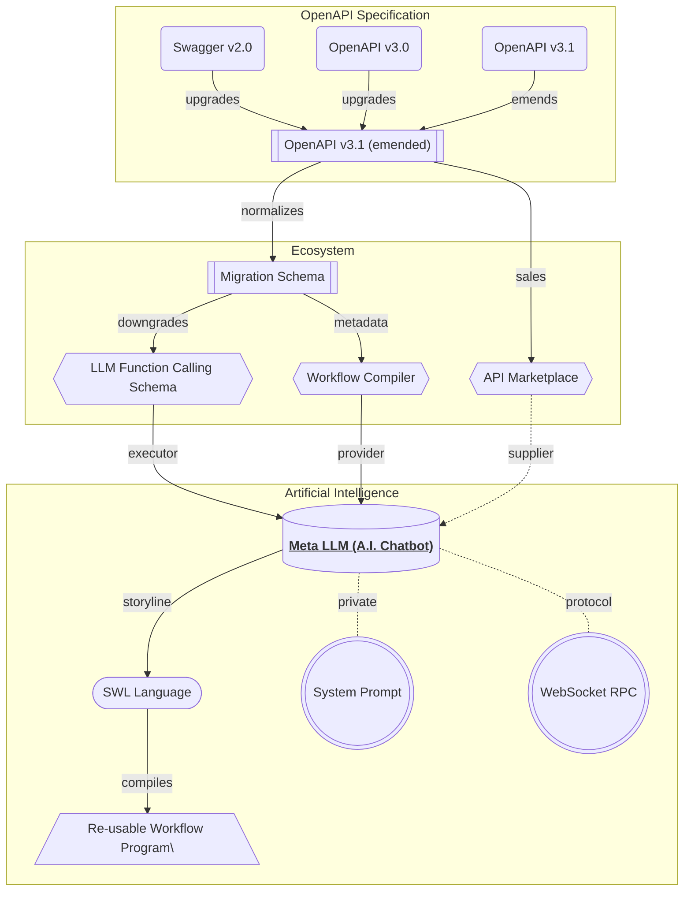
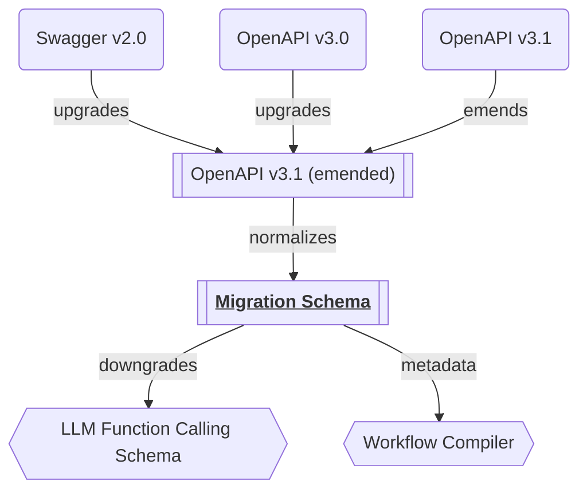
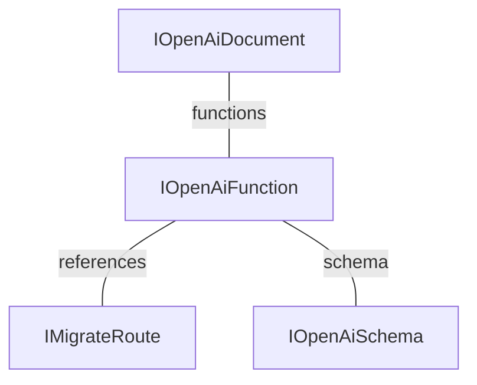
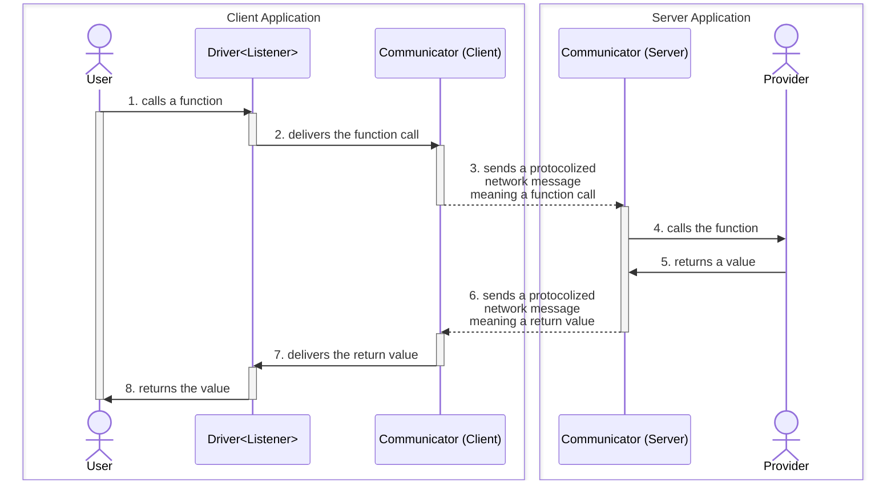
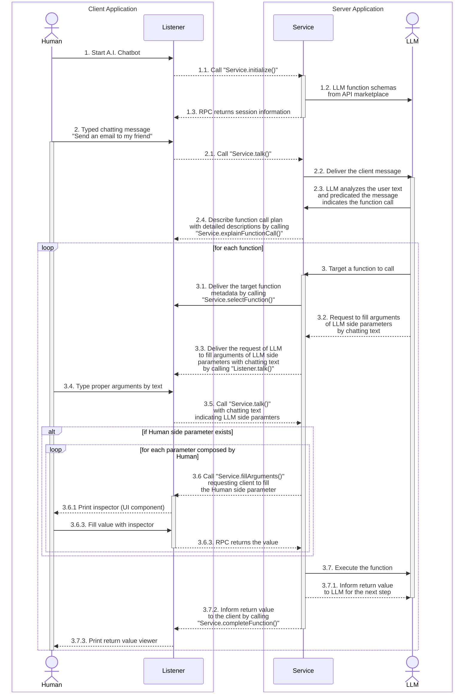

import { Callout } from 'nextra-theme-docs';

## A.I. Chatbot

"Wrtn Studio Pro" provides an A.I. chatbot service called "Meta LLM".

The "Meta LLM" utilizes [LLM (Large Language Model) function calling](https://platform.openai.com/docs/guides/function-calling), and the functions come from the [API marketplace](/tech-specs/marketplace/preface) sales which is following the [OpenAPI specification](/tech-specs/openapi/preface). Also, when user wants to automate his/her chatting scenario as an automated program, "Wrtn Studio Pro" builds it a program function through the [Workflow Compiler](/tech-specs/workflow/preface) with [SWL language](/tech-specs/swl/preface).

By the way, LLM function calling schema appears similar to the OpenAPI specification at first glance, but in reality the specifications are quite different. In such reason, "Wrtn Studio Pro" has a process of converting OpenAPI to [LLM function calling schema](/tech-specs/meta/schema), and at this time, it goes through an intermediate conversion process called [Migration Schema](/tech-specs/meta/migrate).

Also, "Wrtn Studio Pro" has adopted WebSocket protocol when developing the A.I. chatbot service. If explain the WebSocket protocol related story more detaily, "Wrtn Studio Pro" has adopted the [RPC (Remote Procedure Call)](https://tgrid.com/docs/remote-procedure-call) paradigm. It is a structure in which the client and server participating in the chatbot remotely call the functions provided by each other.

At last, when performing function call execution in the "Meta LLM", "Wrtn Studio Pro" separates the parameter arguments composition to both Humand and LLM sides. It's because some arguments must be composed by Human like file uploading or secret key identification.

<Callout type="info">

**LLM Function Calling**

LLM selects proper function and fill arguments.

In nowadays, most LLM (Large Language Model) like OpenAI are supporting "function calling" feature. The "function calling" means that LLM automatically selects a proper function and compose parameter values from the user's chatting text.

https://platform.openai.com/docs/guides/function-calling

</Callout>

## Migration Schema

Intermediate structure for LLM function calling schema conversion.

LLM function calling schema is different with OpenAPi specification. Therefore, "Wrtn Studio Pro" must convert the OpenAPI spefification to the LLM function calling schema. However, the conversion process is not direct, but through the intermediate structure called "Migration Schema".

Purpose of the Migration Schema is to normalize parameters and responses of the OpenAPI operation. By providing the normalized definitions close to the RPC (Remote Procedure Call) function, "Wrtn Studio Pro" can safely convert to the LLM function calling schema from the OpenAPI document.

- [`IMigrateDocument`](https://github.com/samchon/openapi/blob/master/src/IMigrateDocument.ts)
- [`IMigrateRoute`](https://github.com/samchon/openapi/blob/master/src/IMigrateRoute.ts)

## LLM Schema

"Wrtn Studio Pro" has defined full specification of the LLM function calling schema.

It has been converted from the OpenAPI specification bypass the migration process. The OpenAI function calling schema forms a RPC (Remote Procedure Call) structure that can be directly executed by the Meta LLM. 

Its type schema information is similar with OpenAPI v3.0 specification, but reference type does not exist. Therefore, if there's a recursive referrence type exists in an OpenAPI operation, the operation cannot be converted to the LLM function calling schema.

Also, `IOpenAiFunction`'s parameters are separated to two parts; Human and LLM. The Human part is composed by the user's input, and the LLM part is composed by the Meta LLM's output. The reason of such separation is, some parameter values must be composed by Human like file uploading or secret key identification.

- [`IOpenAiDocument`](https://github.com/wrtnio/openai-function-schema/blob/main/src/structures/IOpenAiDocument.ts)
- [`IOpenAiFunction`](https://github.com/wrtnio/openai-function-schema/blob/main/src/structures/IOpenAiFunction.ts)
- [`IOpenAiSchema`](https://github.com/wrtnio/openai-function-schema/blob/main/src/structures/IOpenAiSchema.ts)

## WebSocket RPC

WebSocket protocol with RPC paradigm.

"Wrnt Studio Pro" has adopted WebSocket protocol for the A.I. chatbot service. Also, accepting the WebSocket protocol, "Wrtn Studio Pro" is following the RPC (Remote Procedure Call) paradigm. By the RPC paradigm, the client and server participating in the A.I. chatbot are possible to remotely call the functions provided by each other.

In the business logic level, the Meta LLM WebSocket server is providing `IStudioMetaChatService` interface to the client, so that client can remotely call and get return values from the `IStudioMetaChatService` instance composed by the server. Also, the client is providing `IStudioMetaChatListener` instance and many LLM function call executions are performed with it.

- [RPC (Remote Procedure Call)](https://tgrid.com/docs/remote-procedure-call/)
- [`IStudioMetaChatService`](/api/interfaces/structures_studio_meta_IStudioMetaChatService.IStudioMetaChatService-1.html)
- [`IStudioMetaChatListener`](/api/interfaces/structures_studio_meta_IStudioMetaChatListener.IStudioMetaChatListener-1.html)

## Function Call Execution

Function call execution process.

The function call execution is processed by utilizing every skills listed up to now, including WebSocket protocol with RPC (Remote Procedure Call) paradigm and function call arguments filling by both Human and LLM (Large Language Model) sides. 

When the Meta LLM service has been started and it has delivered function calling schemas to the LLM (Large Language Model), the conversation with Human and LLM begins and LLM sometimes selects a function to call, and then the function call execution story begins.

1. User talks something by chatting text.
2. LLM analyzes the user text content.
3. LLM selects a function, and server informs it to the client.
4. LLM requests Human to type the arguments by chatting text
5. User fills the arguments by chatting text.
6. Server requests clients to fill the Human side arguments.
7. Human fills the arguments by UI component (inspector).
8. Server executes the function and informs the result.