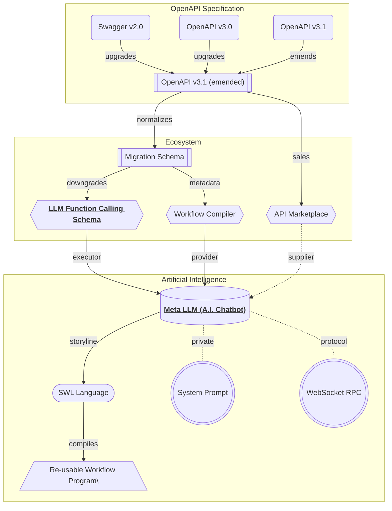

import { Tabs, Tab } from 'nextra-theme-docs';

## Summary


Full specification of the LLM function calling schema.

You know what? In nowadays, most LLM (Large Language Model) like OpenAI are supporting "function calling" feature, and the "function calling" means that LLM automatically selects a proper function and compose parameter values from the user's chatting text.

"Wrtn Studio Pro" has defined full specification of such LLM function calling schema, which is converted from the OpenAPI specification bypass the migration process. The function calling schema embodies an RPC (Remote Procedure Call) structure which can be directly executed by the Meta LLM, and contains metadata information for the function call such as function name description. 

- OpenAI function calling guide: https://platform.openai.com/docs/guides/function-calling
- Schema definitions: 
  - [`IOpenAiDocument`](https://github.com/wrtnio/openai-function-schema/blob/main/src/structures/IOpenAiDocument.ts)
  - [`IOpenAiFunction`](https://github.com/wrtnio/openai-function-schema/blob/main/src/structures/IOpenAiFunction.ts)
  - [`IOpenAiSchema`](https://github.com/wrtnio/openai-function-schema/blob/main/src/structures/IOpenAiSchema.ts)

## Document
```typescript filename="@wrtnio/openai-function-schema" showLineNumbers
/**
 * Document of OpenAI function call metadata.
 *
 * `IOpenAiDocument` is a data structure representing content of
 * {@link IOpenAiDocument.functions OpenAI function call metadata}, composed by
 * {@link OpenAiComposer} from the {@link ISwagger} document, with
 * {@link IOpenAiDocument.errors} and adjusted {@link IOpenAiDocument.options}.
 *
 * The different between `IOpenAiDocument` and its origin source {@link ISwagger}
 * is, `IOpenAiDocument` has converted every {@link ISwaggerOperation API endpoints}
 * to {@link IOpenAiFunction function metadata}. You can execute the function call
 * with OpenAI constructed arguments by using the {@link OpenAiFetcher.execute}
 * function with the function metadata.
 *
 * Also, every type schema informations are casted from {@link ISwaggerSchema} to
 * {@link IOpenAiSchema} to escape {@link ISwaggerSchema.IReference reference types},
 * and downgrade the version of the JSON schema to OpenAPI 3.0. It's because
 * OpenAI function call feature cannot understand both reference types and
 * OpenAPI 3.1 specification.
 *
 * Additionally, if you've composed `IOpenAiDocument` with
 * {@link IOpenAiDocument.IOptions.keyword} configuration (as `true`), number of
 * {@link IOpenAiFunction.parameters} are always 1 and the first parameter's type is
 * always {@link IOpenAiSchema.IObject}. The properties' rule is:
 *
 * - `pathParameters`: Path parameters of {@link ISwaggerMigrateRoute.parameters}
 * - `query`: Query parameter of {@link ISwaggerMigrateRoute.query}
 * - `body`: Body parameter of {@link ISwaggerMigrateRoute.body}
 *
 * ```typescript
 * {
 *   ...pathParameters,
 *   query,
 *   body,
 * }
 * ```
 *
 * Otherwise, the parameters would be multiple, and the sequence of the parameters
 * are following below rules:
 *
 * ```typescript
 * [
 *   ...pathParameters,
 *   ...(query ? [query] : []),
 *   ...(body ? [body] : []),
 * ]
 * ```
 */
export interface IOpenAiDocument {
  /**
   * Version of OpenAPI.
   *
   * OpenAI function call schemas are based on OpenAPI 3.0.3.
   */
  openapi: "3.0.3";

  /**
   * List of function metadata.
   *
   * List of function metadata that can be used for the OpenAI function call.
   *
   * When you want to execute the function with OpenAI constructed arguments,
   * you can do it through {@link OpenAiFetcher.execute} function.
   */
  functions: IOpenAiFunction[];

  /**
   * List of errors occurred during the composition.
   */
  errors: IOpenAiDocument.IError[];

  /**
   * Options for the document.
   *
   * Adjusted options when composing the document through {@link OpenAiComposer}.
   */
  options: IOpenAiDocument.IOptions;
}
export namespace IOpenAiDocument {
  /**
   * Error occurred in the composition.
   */
  export interface IError {
    /**
     * HTTP method of the endpoint.
     */
    method: "get" | "post" | "put" | "patch" | "delete" | "head";

    /**
     * Path of the endpoint.
     */
    path: string;

    /**
     * Error messsages.
     */
    messages: string[];

    /**
     * Get the Swagger operation metadata.
     *
     * Get the Swagger operation metadata, of the source.
     */
    operation: () => ISwaggerOperation;

    /**
     * Get the migration route metadata.
     *
     * Get the migration route metadata, of the source.
     *
     * If the property returns `undefined`, it means that the error has been
     * occured in the migration level, not of OpenAI document composition.
     *
     * @returns Migration route metadata.
     */
    route: () => ISwaggerMigrateRoute | undefined;
  }

  /**
   * Options for composing the OpenAI document.
   */
  export interface IOptions {
    /**
     * Whether the parameters are keyworded or not.
     *
     * If this property value is `true`, length of the
     * {@link IOpenAiDocument.IFunction.parameters} is always 1, and type of the
     * pararameter is always {@link IOpenAiSchema.IObject} type. Also, its
     * properties are following below rules:
     *
     * - `pathParameters`: Path parameters of {@link ISwaggerMigrateRoute.parameters}
     * - `query`: Query parameter of {@link ISwaggerMigrateRoute.query}
     * - `body`: Body parameter of {@link ISwaggerMigrateRoute.body}
     *
     * ```typescript
     * {
     *   ...pathParameters,
     *   query,
     *   body,
     * }
     * ```
     *
     * Otherwise (this property value is `false`), length of the
     * {@link IOpenAiDocument.IFunction.parameters} is variable, and sequence of the
     * parameters are following below rules.
     *
     * ```typescript
     * [
     *   ...pathParameters,
     *   ...(query ? [query] : []),
     *   ...(body ? [body] : []),
     * ]
     * ```
     *
     * @default false
     */
    keyword: boolean;

    /**
     * Separator function for the parameters.
     *
     * When composing parameter arguments through OpenAI function call,
     * there can be a case that some parameters must be composed by human, or
     * LLM cannot understand the parameter. For example, if the parameter type
     * has configured {@link IOpenAiSchema.IString["x-wrtn-secret-key"]}, the
     * secret key value must be composed by human, not by LLM (Large Language Model).
     *
     * In that case, if you configure this property with a function that
     * predicating whether the schema value must be composed by human or not,
     * the parameters would be separated into two parts.
     *
     * - {@link IOpenAiFunction.separated.llm}
     * - {@link IOpenAiFunction.separated.human}
     *
     * When writing the function, note that returning value `true` means to be
     * a human composing the value, and `false` means to LLM composing the value.
     * Also, when predicating the schema, it would better to utilize the
     * {@link OpenAiTypeChecker} features.
     *
     * @param schema Schema to be separated.
     * @returns Whether the schema value must be composed by human or not.
     * @default null
     */
    separate: null | ((schema: IOpenAiSchema) => boolean);
  }
}
```

Document of OpenAI function call metadata.

`IOpenAiDocument` is a data structure collecting the OpenAI function calling schemas, and stores the options that has been adjusted for the OpenAPI document to OpenAI document conversion. Also, it contains error messages occured during the composition.

For reference, the conversion error occured only when the target API operation (`OpenApi.IOperation`) has a recursive type. LLM function calling schema is utilizing JSON schema of OpenAPI v3.0 specification, but it does not support the [reference type](/tech-specs/openapi/json/#reference) (`$ref`). Therefore, if recursive type comes, no way to express it, so that the error occurs and stored to the `IOpenAiDocument.errors` array.

About the options, there're two configurations; `keyword` and `separate`. 

The `keyword` means that gathering every parameters into only one single object with property key name/valur pairs. It has been designed for some Large Language Models which are performing the function calling much better than the multiple parameters case.

The other option `separate` is for separating the parameters to two parts; one is for LLM composing, and the other is for Human composing. It's useful when some parameters must be composed by human, like file uploading or secret key value cases.


## Function
```typescript filename="@wrtnio/openai-function-schema" showLineNumbers
export interface IOpenAiFunction {
  method: "get" | "post" | "patch" | "put" | "delete";
  path: string;
  name: string;
  strict: true;
  parameters: IOpenAiSchema[];
  separated?: IOpenAiFunction.ISeparated;
  output?: IOpenAiSchema | undefined;
  description?: string | undefined;
  operation: () => ISwaggerOperation;
  route: () => ISwaggerMigrateRoute;
}
export namespace IOpenAiFunction {
  export interface ISeparated {
    llm: ISeparatedParameter[];
    human: ISeparatedParameter[];
  }
  export interface ISeparatedParameter {
    index: number;
    schema: IOpenAiSchema;
  }
}
```

Function schema for LLM function call.

`IOpenAiFunction` is a data structure representing a function, which is provided by and converted from the Restful API (`OpenApi.IOperation`), and be used for the LLM (Large Language Model) function calling. It's a typical RPC (Remote Procedure Call) function structure that containing the function name, parameters and return types.

About the type information, LLM function calling schema has daopted the JSON schema of OpenAPI v3.0 specification. However, its detailed specification is a little bit different with the original JSON schema. The difference is between regular JSON schema and of LLMis, LLM excludes the [reference type](/tech-specs/openapi/json/#reference) (`$ref`).

Therefore, if there's a function (Restful API operation) which has recursive type, it can't be used in the LLM (Large Language Model) function calling. AS the target `OpenApi.IOperation` instance cannot be converted to the `IOpenAiFunction` type, it would be just enrolled to the `IOpenAiDocument.errors` array instead.

### Identifier
<Tabs items={[
  "OpenAI Function Schema", 
  "Migration Schema", 
  "OpenAI Operation"]}>
  <Tab>
```typescript filename="@wrtnio/openai-function-schema" showLineNumbers
export interface IOpenAiFunction {
  /**
   * HTTP method of the endpoint.
   */
  method: "get" | "post" | "patch" | "put" | "delete";

  /**
   * Path of the endpoint.
   */
  path: string;

  /**
   * Representative name of the function.
   *
   * The `name` is a repsentative name identifying the function in the
   * {@link IOpenAiDocument}. The `name` value is just composed by joining the
   * {@link IMigrateRoute.accessor} by underscore `_` character.
   *
   * Here is the composition rule of the  {@link IMigrateRoute.accessor}:
   *
   * > The `accessor` is composed with the following rules. At first, namespaces
   * > are composed by static directory names in the {@link path}. Parametric
   * > symbols represented by `:param` or `{param}` cannot be a part of the
   * > namespace.
   * >
   * > Instead, they would be a part of the function name. The function
   * > name is composed with the {@link method HTTP method} and parametric symbols
   * > like `getByParam` or `postByParam`. If there are multiple path parameters,
   * > they would be concatenated by `And` like `getByParam1AndParam2`.
   * >
   * > For refefence, if the {@link operation}'s {@link method} is `delete`, the
   * > function name would be replaced to `erase` instead of `delete`. It is
   * > the reason why the `delete` is a reserved keyword in many programming
   * > languages.
   * >
   * > - Example 1
   * >   - path: `POST /shopping/sellers/sales`
   * >   - accessor: `shopping.sellers.sales.post`
   * > - Example 2
   * >   - endpoint: `GET /shoppings/sellers/sales/:saleId/reviews/:reviewId/comments/:id
   * >   - accessor: `shoppings.sellers.sales.reviews.getBySaleIdAndReviewIdAndCommentId`
   */
  name: string;

  /**
   * Description of the function.
   *
   * Composed by such rule:
   *
   * 1. Starts from the {@link OpenApi.IOperation.summary} paragraph.
   * 2. The next paragraphs are filled with the {@link OpenApi.IOperation.description}.
   *    By the way, if the first paragraph of {@link OpenApi.IOperation.description} is same
   *    with the {@link OpenApi.IOperation.summary}, it would not be duplicated.
   * 3. Parameters' descriptions are added with `@param` tag.
   * 4. {@link OpenApi.IOperation.security Security requirements} are added with `@security` tag.
   * 5. Tag names are added with `@tag` tag.
   * 6. If {@link OpenApi.IOperation.deprecated}, `@deprecated` tag is added.
   */
  description?: string;

  /**
   * Get the Swagger operation metadata.
   *
   * Get the Swagger operation metadata, of the source.
   *
   * @returns Swagger operation metadata.
   */
  operation: () => ISwaggerOperation;

  /**
   * Get the migration route metadata.
   *
   * Get the migration route metadata, of the source.
   *
   * @returns Migration route metadata.
   */
  route: () => ISwaggerMigrateRoute;
}
```
  </Tab>
  <Tab>
```typescript filename="@samchon/openapi" showLineNumbers
export interface IMigrateRoute<
  Schema extends OpenApi.IJsonSchema = OpenApi.IJsonSchema,
  Operation extends OpenApi.IOperation<Schema> = OpenApi.IOperation<Schema>,
> {
  /**
   * Method of the route.
   *
   * If the {@link OpenApi.IOperation.method} is not one of below type
   * values, the operation would be ignored in the migration process for
   * the RPC (Remote Procedure Call) function.
   */
  method: "head" | "get" | "post" | "put" | "patch" | "delete";

  /**
   * Original path from the OpenAPI document.
   */
  path: string;

  /**
   * Accessor for the route.
   *
   * The `accessor` is a list of string values that are representing how to
   * access to the OpenAPI generated RPC (Remote Procedure Call) function
   * through namespace(s).
   *
   * The `accessor` is composed with the following rules. At first, namespaces
   * are composed by static directory names in the {@link path}. Parametric
   * symbols represented by `:param` or `{param}` cannot be a part of the
   * namespace.
   *
   * Instead, they would be a part of the function name. The function
   * name is composed with the {@link method HTTP method} and parametric symbols
   * like `getByParam` or `postByParam`. If there are multiple path parameters,
   * they would be concatenated by `And` like `getByParam1AndParam2`.
   *
   * For refefence, if the {@link operation}'s {@link method} is `delete`, the
   * function name would be replaced to `erase` instead of `delete`. It is
   * the reason why the `delete` is a reserved keyword in many programming
   * languages.
   *
   * - Example 1
   *   - path: `POST /shopping/sellers/sales`
   *   - accessor: `shopping.sellers.sales.post`
   * - Example 2
   *   - endpoint: `GET /shoppings/sellers/sales/:saleId/reviews/:reviewId/comments/:id
   *   - accessor: `shoppings.sellers.sales.reviews.getBySaleIdAndReviewIdAndCommentId`
   */
  accessor: string[];

  /**
   * Description comment for the route function.
   *
   * The `comment` is a function returning description comment for the
   * RPC function of OpenAPI generated. The comment is composed with the
   * following rules:
   *
   * 1. Starts from the {@link OpenApi.IOperation.summary} paragraph.
   * 2. The next paragraphs are filled with {@link OpenApi.IOperation.description}.
   * 3. Parameter descriptions are added with `@param` tag.
   * 4. Security requirements are added with `@security` tag.
   * 5. Tag names are added with `@tag` tag.
   * 6. If {@link OpenApi.IOperation.deprecated}, `@deprecated` tag is added.
   */
  comment: () => string;

  /**
   * Original operation from the OpenAPI document.
   *
   * The `operation` is a function returning the original
   * {@link OpenApi.IOperation} from the {@link OpenAPI} document.
   */
  operation: () => Operation;
}
```
  </Tab>
  <Tab>
```typescript filename="@samchon/openapi" showLineNumbers
export namespace OpenApi {
  export interface IOperation<Schema extends IJsonSchema = IJsonSchema> {
    /**
     * A short summary of what the operation does.
     */
    summary?: string;

    /**
     * A verbose explanation of the operation behavior.
     */
    description?: string;

    /**
     * List of parameters that are applicable for this operation.
     */
    parameters?: IOperation.IParameter<Schema>[];

    /**
     * The request body applicable for this operation.
     */
    requestBody?: IOperation.IRequestBody<Schema>;

    /**
     * List of securities and their scopes that are required for execution.
     *
     * When this property be configured, the Restful API operation requires
     * the matched security value for exection. Its key means security key
     * matched with {@link OpenApi.IDocument.security}.
     *
     * The value means scopes required for the security key when the security
     * type is {@link OpenApi.ISecurityScheme.IOAuth2}. Otherwise the target
     * security type is not {@link OpenApi.ISecurityScheme.IOAuth2}, the value
     * would be empty array.
     */
    security?: Record<string, string[]>[];

    /**
     * Tags for API documentation control.
     */
    tags?: string[];
  }
}
```
  </Tab>
</Tabs>

`IOpenAiFunction` has four identical properties; `method`, `path`, `name` and `description`.

The `method` and `path` properties are used to identify the target API operation and bypassed migration schema. The other property `name` is used to identify the function in the document, and `description` describes the function's purpose so that helps the LLM to select proper function for the user's chatting text.

In detaily, the `name` property is composed by below rule:

  - Rule
    1. Split `OpenApi.IOperation.path` by `/` character
    2. Erase template arguments from the splitted path
    3. Join the splitted and filtered text with `_` character
    4. Attach method name at the last of the joined text
    5. Attach template arguments with `By` prefix pascalized texts at last
  - Example 1
    - endpoint: `POST /shopping/sellers/sales`
    - name: `shopping_sellers_sales_post`
  - Example 2
    - endpoint: `GET /shoppings/sellers/sales/:saleId/reviews/:reviewId/comments/:id`
    - name: `shoppings_sellers_sales_reviews_comments_getBySaleIdAndReviewIdAndId`

Also, `description` is composed by such rule:

  1. Starts from the summary paragraph of the OpenAPI operation.
  2. The next paragraphs are filled with the `OpenApi.IOperation.description`. By the way, if the first paragraph of `description` is same with the `summary`, it would not be duplicated.
  3. Parameters' descriptions are added with `@param` tag.
  4. Security requirements (`OpenApi.IOperation.security`) are added with `@security` tag.
  5. Tag names are added with `@tag` tag.
  6. If `OpenApi.IOperation.deprecated`, `@deprecated` tag is added.

### Parameters
<Tabs items={[
  "OpenAI Function Schema", 
  "Migration Schema", 
  "OpenAI Operation"]}>
  <Tab>
```typescript filename="@wrtnio/openai-function-schema" showLineNumbers
export interface IOpenAiFunction {
  /**
   * List of parameter schemas.
   *
   * If you've configured {@link IOpenAiDocument.IOptions.keyword} (as `true`),
   * number of {@link IOpenAiFunction.parameters} are always 1 and the first parameter's
   * type is always {@link IOpenAiSchema.IObject}. The properties' rule is:
   *
   * - `pathParameters`: Path parameters of {@link IMigrateRoute.parameters}
   * - `query`: Query parameter of {@link IMigrateRoute.query}
   * - `body`: Body parameter of {@link IMigrateRoute.body}
   *
   * ```typescript
   * {
   *   ...pathParameters,
   *   query,
   *   body,
   * }
   * ```
   *
   * Otherwise, the parameters would be multiple, and the sequence of the parameters
   * are following below rules:
   *
   * ```typescript
   * [
   *   ...pathParameters,
   *   ...(query ? [query] : []),
   *   ...(body ? [body] : []),
   * ]
   * ```
   */
  parameters: IOpenAiSchema[];
}
```
  </Tab>
  <Tab>
```typescript filename="@samchon/openapi" showLineNumbers
export interface IMigrateRoute<
  Schema extends OpenApi.IJsonSchema = OpenApi.IJsonSchema,
  Operation extends OpenApi.IOperation<Schema> = OpenApi.IOperation<Schema>,
> {
  /**
   * List of path parameters.
   *
   * Note that, not a list of every parameters, but only path parameters.
   */
  parameters: IMigrateRoute.IParameter<Schema>[];

  /**
   * Metadata of query values.
   *
   * The `query` property is a metadata of HTTP request query values for RPC function,
   * including the parameter variable name and schema.
   *
   * Also, its {@link IMigrateRoute.IQuery.schema} is always object or reference
   * to object. Even though the original {@link OpenApi.IOperation OpenAPI operation}'s
   * query parameters are separated to atomic typed properties, the `query` property
   * forcibly combines them into a single object type.
   *
   * For reference, if the `query` property has been converted to an object type
   * forcibly, its property {@link IMigrateRoute.IQuery.name name} and
   * {@link IMigrateRoute.IQuery.key key} are always "headers".
   */
  query: IMigrateRoute.IQuery<Schema> | null;

  /**
   * Metadata of request body.
   *
   * The `body` property is a metadata of HTTP request body for RPC function,
   * including the parameter variable name, content type, and schema.
   *
   * If the `body` property is `null`, it means the operation does not require
   * the request body data.
   */
  body: IMigrateRoute.IBody<Schema> | null;
}
export namespace IMigrateRoute {
  /**
   * Metadata of path parameter.
   */
  export interface IParameter<
    Schema extends OpenApi.IJsonSchema = OpenApi.IJsonSchema,
  > {
    /**
     * Name of the path parameter.
     */
    name: string;

    /**
     * Key of the path parameter.
     */
    key: string;

    /**
     * Metadata of path parameter data type.
     */
    schema: Schema;

    /**
     * Original parameter info from the OpenAPI document.
     *
     * The `parameter` is a function returning the original
     * {@link OpenApi.IOperation.IParameter} from the {@link OpenAPI} document.
     */
    parameter: () => OpenApi.IOperation.IParameter<Schema>;
  }

  /**
   * Metadata of query values.
   */
  export interface IQuery<
    Schema extends OpenApi.IJsonSchema = OpenApi.IJsonSchema,
  > {
    name: string;
    key: string;
    schema: Schema;
    title: () => string | undefined;
    description: () => string | undefined;
    example: () => any | undefined;
    examples: () => Record<string, any> | undefined;
  }

  /**
   * Metadata of request/response body.
   */
  export interface IBody<
    Schema extends OpenApi.IJsonSchema = OpenApi.IJsonSchema,
  > {
    /**
     * Name of the body parameter.
     */
    name: string;

    /**
     * Key of the body parameter.
     */
    key: string;

    /**
     * Content type of the body.
     */
    type:
      | "text/plain"
      | "application/json"
      | "application/x-www-form-urlencoded"
      | "multipart/form-data";

    /**
     * Metadata of response body data type.
     */
    schema: Schema;

    /**
     * Description comment for the request/response body.
     */
    description: () => string | undefined;

    /**
     * Media type of the request/response body.
     */
    media: () => OpenApi.IOperation.IMediaType<Schema>;

    /**
     * Whether the body is encrypted or not.
     */
    "x-nestia-encrypted"?: boolean;
  }
}
```
  </Tab>
  <Tab>
```typescript filename="@samchon/openapi" showLineNumbers
export namespace OpenApi {
  export interface IOperation<Schema extends IJsonSchema = IJsonSchema> {
    /**
     * List of parameters that are applicable for this operation.
     */
    parameters?: IOperation.IParameter<Schema>[];

    /**
     * The request body applicable for this operation.
     */
    requestBody?: IOperation.IRequestBody<Schema>;
  }
  export namespace IOperation {
    /**
     * Parameter of the operation.
     */
    export interface IParameter<Schema extends IJsonSchema = IJsonSchema> {
      /**
       * Representative name of the parameter.
       *
       * In the most case, the `name` is equivalent to parameter variable name.
       * Therefore, the `name` must be filled with the significant variable name
       * of the parameter.
       *
       * By the way, only when the {@link in} property is `path`, the `name`
       * can be omitted. In that case, the `name` is automatically deduced from
       * the URL path's positional template argument analyzing.
       */
      name?: string;

      /**
       * Location of the parameter.
       *
       * The `in` property is a string that determines the location of the parameter.
       *
       * - `path`: parameter is part of the path of the URL.
       * - `query`: parameter is part of the query string.
       * - `header`: parameter is part of the header.
       * - `cookie`: parameter is part of the cookie.
       */
      in: "path" | "query" | "header" | "cookie";

      /**
       * Type info of the parameter.
       */
      schema: Schema;

      /**
       * Whether the parameter is required for execution or not.
       *
       * If the parameter is required, the value must be filled. Otherwise,
       * it is possible to skip the parameter when executing the APi operation.
       *
       * For reference, the `required` property must be always `true` when the
       * {@link in} property is `path`. Otherwise, the `required` property can
       * be anything of them; `true`, `false` and `undefined`.
       */
      required?: boolean;

      /**
       * Short title of the parameter.
       */
      title?: string;

      /**
       * Verbose explanation of the parameter.
       */
      description?: string;

      /**
       * Example value of the parameter.
       */
      example?: any;

      /**
       * Collection of example values of the parameter with keys.
       */
      examples?: Record<string, IExample>;
    }

    /**
     * Request body of the operation.
     */
    export interface IRequestBody<Schema extends IJsonSchema = IJsonSchema> {
      content?: IContent<Schema>;
      description?: string;
      required?: boolean;
      "x-nestia-encrypted"?: boolean;
    }

    /**
     * List of content types supported in request/response body.
     */
    export interface IContent<Schema extends IJsonSchema = IJsonSchema>
      extends Partial<Record<ContentType, IMediaType<Schema>>> {}

    /**
     * Media type of a request/response body.
     */
    export interface IMediaType<Schema extends IJsonSchema = IJsonSchema> {
      schema?: Schema;
      example?: any;
      examples?: Record<string, IExample>;
    }

    /**
     * List of supported content media types.
     */
    export type ContentType =
      | "text/plain"
      | "application/json"
      | "application/x-www-form-url-encoded"
      | "multipart/form-data"
      | "*/*"
      | (string & {});
  }
}
```
  </Tab>
</Tabs>

Parameters of the function.

`IOpenAiFunction.parameters` are composed with path, query and request body parameters, directly referencing the [`IOpenAISchema`](#iopenaischema). About the query parameters, it is always combined into one single object with key/value paired properties. In other words, the parameters of the LLM function calling schema is composed by listing up `IMigrateRoute.parameters`, `IMigrateRoute.query` and `IMigrateRoute.body` properties as an array.

By the way, such composition rule is valid only when the `IOpenAiDocument.IOptions.keyword` property has not been configured as `true`. If the `keyword` property is `true`, number of the parameters are always 1 by gathering every parameters into only one object with key/value paired properties.

If express such composition rule with TypeScript, it would be like below:

> ```typescript
> // KEYWORD: FALSE
> [
>   ...pathParameters,
>   ...(query ? [query] : []),
>   ...(body ? [body] : []),
> ]
> 
> // KEYWORD: TRUE
> {
>   ...pathParameters,
>   query,
>   body,
> }
> ```

### Output
<Tabs items={[
  "OpenAI Function Schema", 
  "Migration Schema", 
  "OpenAI Operation"]}>
  <Tab>
```typescript filename="@wrtnio/openai-function-schema" showLineNumbers
export interface IOpenAiFunction {
  /**
   * Expected return type.
   *
   * If the function returns nothing (`void`), then the output is `undefined`.
   */
  output?: IOpenAiSchema | undefined;
}
```
  </Tab>
  <Tab>
```typescript filename="@samchon/openapi" showLineNumbers
export interface IMigrateRoute<
  Schema extends OpenApi.IJsonSchema = OpenApi.IJsonSchema,
  Operation extends OpenApi.IOperation<Schema> = OpenApi.IOperation<Schema>,
> {
  /**
   * Metadata of response body for success case.
   *
   * The `success` property is a metadata of HTTP response body for RPC function,
   * including content type, and schema when status code is `200` or `201`.
   *
   * If the `success` property is `null`, it means the operation does not have
   * the response body data. In other words, the RPC function would return `void`.
   */
  success: IMigrateRoute.IBody<Schema> | null;

  /**
   * Metadata of response body for exceptional status cases.
   *
   * The `exceptions` property is a metadata of HTTP response body for RPC
   * function, including content type, and schema when status code is not `200`
   * or `201`.
   *
   * The key of the `exceptions` property is the status code. It may be a
   * stringified number, but sometimes it could be a string like "default",
   * because the OpenAPI document allows the status code to be a string.
   */
  exceptions: Record<string, IMigrateRoute.IException<Schema>>;
}
export namespace IMigrateRoute {
  /**
   * Metadata of request/response body.
   */
  export interface IBody<
    Schema extends OpenApi.IJsonSchema = OpenApi.IJsonSchema,
  > {
    /**
     * Name of the body parameter.
     */
    name: string;

    /**
     * Key of the body parameter.
     */
    key: string;

    /**
     * Content type of the body.
     */
    type:
      | "text/plain"
      | "application/json"
      | "application/x-www-form-urlencoded"
      | "multipart/form-data";

    /**
     * Metadata of response body data type.
     */
    schema: Schema;

    /**
     * Description comment for the request/response body.
     */
    description: () => string | undefined;

    /**
     * Media type of the request/response body.
     */
    media: () => OpenApi.IOperation.IMediaType<Schema>;

    /**
     * Whether the body is encrypted or not.
     */
    "x-nestia-encrypted"?: boolean;
  }

  /**
   * Metadata of response body for exceptional status cases.
   */
  export interface IException<
    Schema extends OpenApi.IJsonSchema = OpenApi.IJsonSchema,
  > {
    /**
     * Metadata of response body data type.
     */
    schema: Schema;

    /**
     * Description comment for the exception.
     */
    response: () => OpenApi.IOperation.IResponse<Schema>;

    /**
     * Media type of the response body.
     */
    media: () => OpenApi.IOperation.IMediaType<Schema>;
  }
}
```
  </Tab>
  <Tab>
```typescript filename="@samchon/openapi" showLineNumbers
export namespace OpenApi {
  export interface IOperation<Schema extends IJsonSchema = IJsonSchema> {
    /**
     * The list of possible responses as they are returned from executing this
     * operation. Its key is the HTTP status code, and the value is the metadata of
     * the response in the HTTP status code.
     */
    responses?: Record<string, IOperation.IResponse<Schema>>;
  }
  export namespace IOperation {
    /**
     * Response of the operation.
     */
    export interface IResponse<Schema extends IJsonSchema = IJsonSchema> {
      headers?: Record<string, IOperation.IParameter<Schema>>;
      content?: IContent<Schema>;
      description?: string;
      "x-nestia-encrypted"?: boolean;
    }

    /**
     * List of content types supported in request/response body.
     */
    export interface IContent<Schema extends IJsonSchema = IJsonSchema>
      extends Partial<Record<ContentType, IMediaType<Schema>>> {}

    /**
     * Media type of a request/response body.
     */
    export interface IMediaType<Schema extends IJsonSchema = IJsonSchema> {
      schema?: Schema;
      example?: any;
      examples?: Record<string, IExample>;
    }

    /**
     * List of supported content media types.
     */
    export type ContentType =
      | "text/plain"
      | "application/json"
      | "application/x-www-form-url-encoded"
      | "multipart/form-data"
      | "*/*"
      | (string & {});
  }
}
```
  </Tab>
</Tabs>

`IOpenAiFunction.output` means a return type of the function.

When converting an OpenAPI operation to a LLM function schema bypass migration process, only the success case of 200 status code (or 201 when POST method) is considered. Also, about the content type, only the first one is remained. The schema information registered in the `IOpenAiFunction.output` comes from such process.

However, looking at the intermediate structure `IMigrateRoute`, you can find that the bypass route is storing not only the `IMigrateRoute.success` typed response body, but also the exceptional status cases in the `IMigrateRoute.exceptions` property. Unfortunately, current LLM function calling does not consider the exceptional cases represented by `Try<T, E>`, the other status codes are not available.

### Separation
```typescript filename="@wrtnio/openai-function-schema" showLineNumbers
export interface IOpenAiFunction {
  /**
   * Collection of separated parameters.
   *
   * Filled only when {@link IOpenAiDocument.IOptions.separate} has been configured.
   */
  separated?: IOpenAiFunction.ISeparated;

  /**
   * List of parameter schemas.
   *
   * If you've configured {@link IOpenAiDocument.IOptions.keyword} (as `true`),
   * number of {@link IOpenAiFunction.parameters} are always 1 and the first parameter's
   * type is always {@link IOpenAiSchema.IObject}. The properties' rule is:
   *
   * - `pathParameters`: Path parameters of {@link IMigrateRoute.parameters}
   * - `query`: Query parameter of {@link IMigrateRoute.query}
   * - `body`: Body parameter of {@link IMigrateRoute.body}
   *
   * ```typescript
   * {
   *   ...pathParameters,
   *   query,
   *   body,
   * }
   * ```
   *
   * Otherwise, the parameters would be multiple, and the sequence of the parameters
   * are following below rules:
   *
   * ```typescript
   * [
   *   ...pathParameters,
   *   ...(query ? [query] : []),
   *   ...(body ? [body] : []),
   * ]
   * ```
   */
  parameters: IOpenAiSchema[];
}
export namespace IOpenAiFunction {
  /**
   * Collection of separated parameters.
   */
  export interface ISeparated {
    /**
     * Parameters that would be composed by the OpenAI.
     */
    llm: ISeparatedParameter[];

    /**
     * Parameters that would be composed by the human.
     */
    human: ISeparatedParameter[];
  }

  /**
   * Separated parameter.
   */
  export interface ISeparatedParameter {
    /**
     * Index of the parameter.
     */
    index: number;

    /**
     * Type schema info of the parameter.
     */
    schema: IOpenAiSchema;
  }
}

export namespace IOpenAiDocument {
  export interface IOptions {
    /**
     * Separator function for the parameters.
     *
     * When composing parameter arguments through OpenAI function call,
     * there can be a case that some parameters must be composed by human, or
     * LLM cannot understand the parameter. For example, if the parameter type
     * has configured {@link IOpenAiSchema.IString["x-wrtn-secret-key"]}, the
     * secret key value must be composed by human, not by LLM (Large Language Model).
     *
     * In that case, if you configure this property with a function that
     * predicating whether the schema value must be composed by human or not,
     * the parameters would be separated into two parts.
     *
     * - {@link IOpenAiFunction.separated.llm}
     * - {@link IOpenAiFunction.separated.human}
     *
     * When writing the function, note that returning value `true` means to be
     * a human composing the value, and `false` means to LLM composing the value.
     * Also, when predicating the schema, it would better to utilize the
     * {@link OpenAiTypeChecker} features.
     *
     * @param schema Schema to be separated.
     * @returns Whether the schema value must be composed by human or not.
     * @default null
     */
    separate: null | ((schema: IOpenAiSchema) => boolean);

    /**
     * Whether the parameters are keyworded or not.
     *
     * If this property value is `true`, length of the
     * {@link IOpenAiDocument.IFunction.parameters} is always 1, and type of the
     * pararameter is always {@link IOpenAiSchema.IObject} type. Also, its
     * properties are following below rules:
     *
     * - `pathParameters`: Path parameters of {@link ISwaggerMigrateRoute.parameters}
     * - `query`: Query parameter of {@link ISwaggerMigrateRoute.query}
     * - `body`: Body parameter of {@link ISwaggerMigrateRoute.body}
     *
     * ```typescript
     * {
     *   ...pathParameters,
     *   query,
     *   body,
     * }
     * ```
     *
     * Otherwise (this property value is `false`), length of the
     * {@link IOpenAiDocument.IFunction.parameters} is variable, and sequence of the
     * parameters are following below rules.
     *
     * ```typescript
     * [
     *   ...pathParameters,
     *   ...(query ? [query] : []),
     *   ...(body ? [body] : []),
     * ]
     * ```
     *
     * @default false
     */
    keyword: boolean;
  }
}
```

Separation of parameters to both LLM and Human sides.

If configure `IOpenAiDocument.IOptions.separate` function when converting OpenAPI document to LLM function calling schemas, `IOpenAiFunction.separated` is activated with two separated parameters; LLM side and Human side. If the configured function returns `true`, the target schema becomes of Human side, otherwise LLM side.

Such separation is useful when some parameter value must be composed by Human, not by LLM. For example, if there's a type indicating the secret key value or file uploading, the value must be constructed by Human, not by LLM automatically composing from the chatting text.

For reference, even if configured `IOpenAiDocument.IOptions.keyword` as `true`, the separation works properly. Here is the example of the separation function to the keyworded parameter, and its result. As you can see, the `separate` function checks every nested schemas, and re-construct the parameters into two separated parts.

> ```typescript showLineNumbers
> const separator: IOpenAiDocument.IOptions["separate"] = schema =>
>   schema.type === "string" && (
>     || schema["x-wrtn-secret-key"] === true
>     || schema.contentMediaType !== undefined
>   );
> const parameters: IOpenAiFunction.ISchema[] = [
>   {
>     type: "object",
>     properties: {
>       file: {
>         type: "string",
>         contentMediaType: "image/png",
>       },
>       title: { type: "string" },
>       notes: {
>         type: "array",
>         items: { type: "string" },
>       },
>     },
>   },
> ];
> const separated: IOpenAiFunction.ISeparated = {
>   llm: [
>     {
>       index: 0,
>       schema: {
>         type: "object",
>         properties: {
>           title: { type: "string" },
>           notes: {
>             type: "array",
>             items: { type: "string" },
>           },
>         },
>       },
>     },
>   ],
>   human: [
>     {
>       index: 0,
>       schema: {
>         type: "object",
>         properties: {
>           file: {
>             type: "string",
>             contentMediaType: "image/png",
>           },
>         },
>       },
>     },
>   ],
> };
> ```


## Schema
<Tabs items={[
  "LLM JSON Schema", 
  "OpenAPI v3.0", 
  "OpenAPI v3.1 (emended)"]}>
  <Tab>
```typescript filename="@wrtnio/openai-function-schema" showLineNumbers
export type IOpenAiSchema =
  | IOpenAiSchema.IBoolean
  | IOpenAiSchema.IInteger
  | IOpenAiSchema.INumber
  | IOpenAiSchema.IString
  | IOpenAiSchema.IArray
  | IOpenAiSchema.IObject
  | IOpenAiSchema.IUnknown
  | IOpenAiSchema.INullOnly
  | IOpenAiSchema.IOneOf;
export namespace IOpenAiSchema {
  export interface IBoolean extends __ISignificant<"boolean"> {
    default?: boolean;
    enum?: boolean[];
  }
  export interface IInteger extends __ISignificant<"integer"> {
    /** @type int64 */ default?: number;
    /** @type int64 */ enum?: number[];
    /** @type int64 */ minimum?: number;
    /** @type int64 */ maximum?: number;
    exclusiveMinimum?: boolean;
    exclusiveMaximum?: boolean;
    /**
     * @type uint64
     * @exclusiveMinimum 0
     */
    multipleOf?: number;
  }
  export interface INumber extends __ISignificant<"number"> {
    default?: number;
    enum?: number[];
    minimum?: number;
    maximum?: number;
    exclusiveMinimum?: boolean;
    exclusiveMaximum?: boolean;
    /** @exclusiveMinimum 0 */ multipleOf?: number;
  }
  export interface IString extends __ISignificant<"string"> {
    default?: string;
    enum?: string[];
    format?:
      | "binary"
      | "byte"
      | "password"
      | "regex"
      | "uuid"
      | "email"
      | "hostname"
      | "idn-email"
      | "idn-hostname"
      | "iri"
      | "iri-reference"
      | "ipv4"
      | "ipv6"
      | "uri"
      | "uri-reference"
      | "uri-template"
      | "url"
      | "date-time"
      | "date"
      | "time"
      | "duration"
      | "json-pointer"
      | "relative-json-pointer"
      | (string & {});
    pattern?: string;
    /** @type uint64 */ minLength?: number;
    /** @type uint64 */ maxLength?: number;
    contentMediaType?: string;
    "x-wrtn-secret-key"?: string;
    "x-wrtn-secret-scopes"?: string[];
  }
  export interface IArray extends __ISignificant<"array"> {
    items: IOpenAiSchema;
    uniqueItems?: boolean;
    minItems?: number;
    maxItems?: number;
  }
  export interface IObject extends __ISignificant<"object"> {
    properties?: Record<string, IOpenAiSchema>;
    required?: string[];
    additionalProperties?: boolean | IOpenAiSchema;
  }

  export interface IUnknown extends __IAttribute {
    type?: undefined;
  }
  export interface INullOnly extends __IAttribute {
    type: "null";
  }
  export interface IOneOf extends __IAttribute {
    oneOf: IOpenAiSchema[];
  }
  export interface __ISignificant<Type extends string> extends __IAttribute {
    type: Type;
    nullable?: boolean;
  }
  export interface __IAttribute {
    title?: string;
    description?: string;
    deprecated?: boolean;
    "x-wrtn-placeholder"?: string;
    "x-wrtn-prerequisite"?: {
      method: "get" | "post" | "patch" | "put" | "delete";
      path: string;
      jmesPath: string;
    };
  }
}
```
  </Tab>
  <Tab>
```typescript filename="@samchon/openapi" showLineNumbers
export namespace OpenApiV3 {
  export type IJsonSchema =
    | IJsonSchema.IBoolean
    | IJsonSchema.IInteger
    | IJsonSchema.INumber
    | IJsonSchema.IString
    | IJsonSchema.IArray
    | IJsonSchema.IObject
    | IJsonSchema.IReference
    | IJsonSchema.IUnknown
    | IJsonSchema.INullOnly
    | IJsonSchema.IAllOf
    | IJsonSchema.IAnyOf
    | IJsonSchema.IOneOf;
  export namespace IJsonSchema {
    export interface IBoolean extends __ISignificant<"boolean"> {
      default?: boolean | null;
      enum?: Array<boolean | null>;
    }
    export interface IInteger extends __ISignificant<"integer"> {
      /** @type int64 */ default?: number | null;
      /** @type int64 */ enum?: Array<number | null>;
      /** @type int64 */ minimum?: number;
      /** @type int64 */ maximum?: number;
      exclusiveMinimum?: boolean;
      exclusiveMaximum?: boolean;
      /**
       * @type uint64
       * @exclusiveMinimum 0
       */
      multipleOf?: number;
    }
    export interface INumber extends __ISignificant<"number"> {
      default?: number | null;
      enum?: Array<number | null>;
      minimum?: number;
      maximum?: number;
      exclusiveMinimum?: boolean;
      exclusiveMaximum?: boolean;
      /** @exclusiveMinimum 0 */ multipleOf?: number;
    }
    export interface IString extends __ISignificant<"string"> {
      default?: string | null;
      enum?: Array<string | null>;
      format?:
        | "binary"
        | "byte"
        | "password"
        | "regex"
        | "uuid"
        | "email"
        | "hostname"
        | "idn-email"
        | "idn-hostname"
        | "iri"
        | "iri-reference"
        | "ipv4"
        | "ipv6"
        | "uri"
        | "uri-reference"
        | "uri-template"
        | "url"
        | "date-time"
        | "date"
        | "time"
        | "duration"
        | "json-pointer"
        | "relative-json-pointer"
        | (string & {});
      pattern?: string;
      /** @type uint64 */ minLength?: number;
      /** @type uint64 */ maxLength?: number;
    }

    export interface IArray extends __ISignificant<"array"> {
      items: IJsonSchema;
      uniqueItems?: boolean;
      /** @type uint64 */ minItems?: number;
      /** @type uint64 */ maxItems?: number;
    }
    export interface IObject extends __ISignificant<"object"> {
      properties?: Record<string, IJsonSchema>;
      required?: string[];
      additionalProperties?: boolean | IJsonSchema;
      maxProperties?: number;
      minProperties?: number;
    }
    export interface IReference<Key = string> extends __IAttribute {
      $ref: Key;
    }

    export interface IUnknown extends __IAttribute {
      type?: undefined;
    }
    export interface INullOnly extends __IAttribute {
      type: "null";
    }
    export interface IAllOf extends __IAttribute {
      allOf: IJsonSchema[];
    }
    export interface IAnyOf extends __IAttribute {
      anyOf: IJsonSchema[];
    }
    export interface IOneOf extends __IAttribute {
      oneOf: IJsonSchema[];
      discriminator?: IOneOf.IDiscriminator;
    }
    export namespace IOneOf {
      export interface IDiscriminator {
        propertyName: string;
        mapping?: Record<string, string>;
      }
    }

    export interface __ISignificant<Type extends string> extends __IAttribute {
      type: Type;
      nullable?: boolean;
    }
    export interface __IAttribute {
      title?: string;
      description?: string;
      deprecated?: boolean;
    }
  }
}
```
  </Tab>
  <Tab>
```typescript filename="@samchon/openapi" showLineNumbers
export namespace OpenApi {
  export type IJsonSchema =
    | IJsonSchema.IConstant
    | IJsonSchema.IBoolean
    | IJsonSchema.IInteger
    | IJsonSchema.INumber
    | IJsonSchema.IString
    | IJsonSchema.IArray
    | IJsonSchema.ITuple
    | IJsonSchema.IObject
    | IJsonSchema.IReference
    | IJsonSchema.IOneOf
    | IJsonSchema.INull
    | IJsonSchema.IUnknown;
  export namespace IJsonSchema {
    export interface IConstant extends __IAttribute {
      const: boolean | number | string;
    }
    export interface IBoolean extends __ISignificant<"boolean"> {
      default?: boolean;
    }
    export interface IInteger extends __ISignificant<"integer"> {
      /** @type int64 */ default?: number;
      /** @type int64 */ minimum?: number;
      /** @type int64 */ maximum?: number;
      exclusiveMinimum?: boolean;
      exclusiveMaximum?: boolean;
      /**
       * @type uint64
       * @exclusiveMinimum 0
       */
      multipleOf?: number;
    }
    export interface INumber extends __ISignificant<"number"> {
      default?: number;
      minimum?: number;
      maximum?: number;
      exclusiveMinimum?: boolean;
      exclusiveMaximum?: boolean;
      /** @exclusiveMinimum 0 */ multipleOf?: number;
    }
    export interface IString extends __ISignificant<"string"> {
      default?: string;
      format?:
        | "binary"
        | "byte"
        | "password"
        | "regex"
        | "uuid"
        | "email"
        | "hostname"
        | "idn-email"
        | "idn-hostname"
        | "iri"
        | "iri-reference"
        | "ipv4"
        | "ipv6"
        | "uri"
        | "uri-reference"
        | "uri-template"
        | "url"
        | "date-time"
        | "date"
        | "time"
        | "duration"
        | "json-pointer"
        | "relative-json-pointer"
        | (string & {});
      pattern?: string;
      contentMediaType?: string;
      /** @type uint64 */ minLength?: number;
      /** @type uint64 */ maxLength?: number;
    }

    export interface IArray<Schema extends IJsonSchema = IJsonSchema>
      extends __ISignificant<"array"> {
      items: Schema;
      uniqueItems?: boolean;
      /** @type uint64 */ minItems?: number;
      /** @type uint64 */ maxItems?: number;
    }
    export interface ITuple<Schema extends IJsonSchema = IJsonSchema>
      extends __ISignificant<"array"> {
      prefixItems: Schema[];
      additionalItems?: boolean | Schema;
      uniqueItems?: boolean;
      /** @type uint64 */ minItems?: number;
      /** @type uint64 */ maxItems?: number;
    }
    export interface IObject<Schema extends IJsonSchema = IJsonSchema>
      extends __ISignificant<"object"> {
      properties?: Record<string, Schema>;
      additionalProperties?: boolean | Schema;
      required?: string[];
    }

    export interface IReference<Key = string> extends __IAttribute {
      $ref: Key;
    }
    export interface IOneOf<Schema extends IJsonSchema = IJsonSchema>
      extends __IAttribute {
      oneOf: Exclude<Schema, IJsonSchema.IOneOf>[];
      discriminator?: IOneOf.IDiscriminator;
    }
    export namespace IOneOf {
      export interface IDiscriminator {
        propertyName: string;
        mapping?: Record<string, string>;
      }
    }
    export interface INull extends __ISignificant<"null"> {
      default?: null;
    }
    export interface IUnknown extends __IAttribute {
      type?: undefined;
    }

    export interface __ISignificant<Type extends string> extends __IAttribute {
      type: Type;
    }
    export interface __IAttribute {
      title?: string;
      description?: string;
      deprecated?: boolean;
    }
  }
}
```
  </Tab>
</Tabs>

Schema types for the LLM function call.

The LLM (Large Language Model) function calling schema is utilizing a specific type schema that is similar to the JSON schema of the OpenAPI v3.0 specification. Only different with the OpenAPI v3.0 JSON schema is, of LLM does not support the `IJsonSchema.IReference` type.

Therefore, looking above type schema definitions of LLM function calling and OpenAPI specifications, you can find that the LLM's type schema type does not contain the reference type in the union `IOpenAiSchema` type. The other things are same with original JSON schema.

Also, if you compare this section with [OpenAPI > Json Schema](/tech-specs/openapi/json) chapter, you may understand the LLM's type system more clearly and easily.

### Common Properties
```typescript filename="@wrtnio/openai-function-schema" showLineNumbers
export namespace IOpenAiSchema {
  /**
   * Common attributes that can be applied to all types.
   */
  export interface __IAttribute {
    /**
     * Title of the schema.
     */
    title?: string;

    /**
     * Detailed description of the schema.
     */
    description?: string;

    /**
     * Whether the type is deprecated or not.
     */
    deprecated?: boolean;

    /**
     * Placeholder value for frontend application.
     *
     * Placeholder means the value to be shown in the input field as a hint.
     * For example, when an email input field exists, the placeholder value
     * would be "Insert your email address here".
     */
    "x-wrtn-placeholder"?: string;

    /**
     * Prerequisite API endpoint for the schema.
     *
     * `x-wrtn-prerequisite` is a property representing the prerequisite API
     * interaction. It means that, the endpoint API should be called before
     * calling the target API, for composing some argument value.
     *
     * @reference https://github.com/wrtnio/decorators/blob/main/src/Prerequisite.ts
     */
    "x-wrtn-prerequisite"?: {
      /**
       * HTTP method to call the endpoint.
       */
      method: "get" | "post" | "patch" | "put" | "delete";

      /**
       * Path of the endpoint.
       */
      path: string;

      /**
       * Function returning transformed values using JMESPath expression.
       *
       * `Prerequisite.Props.jmesPath` is a string typed property that extracts desired values
       * from the prerequisite API response using a JMESPath expression. This property simplifies
       * and replaces the `label`, `value`, and `array` properties.
       *
       * JMESPath expressions are used to extract the desired data based on the API response.
       * The expression must always be a valid JMESPath syntax.
       *
       * - Type: `jmesPath: string`
       * - Example: `"members[*].data.title"`
       * - Usage: `jmespath.search(response, jmesPath)`
       *
       * Note: The `label`, `value`, and `array` properties are no longer in use.
       */
      jmesPath: string;
    };
  }
}
```

Every type schemas in the LLM function call has five properties.

The first `title` is the representative name of the schema, and the meaning "representative" is powerful due to LLM (Large Language Model) is affected by the `title` value when understanding the schema information.

The other `description` is the detailed explanation of the schema. In the LLM side, it is used for understanding the schema more deeply than `title`. Also, LLM utilizes the `description` value to the writing a chatting text that requesting Human to write the function calling arguments by the chatting text.

The next `deprecated` is used to mark the schema as deprecated. If the target schema is optional and marked as `deprecated`, the LLM tends to avoid the target schema's value composition. However, if the schema is essential for function calling, it would be ignored.

At last, there're plugin properties `x-wrtn-placeholder` and `x-wrtn-prerequisite`. It is not a spec for LLM function calling, but for the [Workflow](/tech-specs/workflow/preface) editor side. If you want to know more about these plugin properties, please refer to the [OpenAPI > Plugin Properties](/tech-specs/openapi/plugin) chapter.

### Boolean
<Tabs items={[
  "LLM JSON Schema", 
  "OpenAPI v3.0", 
  "OpenAPI v3.1 (emended)"]}>
  <Tab>
```typescript filename="@wrtnio/openai-function-schema" showLineNumbers
export namespace IOpenAiSchema {
  /**
   * Boolean type schema info.
   */
  export interface IBoolean extends __IAttribute {
    /**
     * Discriminator value of the type.
     */
    type: "boolean";

    /**
     * Enumeration values.
     */
    enum?: boolean[];

    /**
     * Whether to allow `null` value or not.
     */
    nullable?: boolean;

    /**
     * Default value.
     */
    default?: boolean;
  }
}
```
  </Tab>
  <Tab>
```typescript filename="@samchon/openapi" showLineNumbers
export namespace OpenApiV3_0 {
  export namespace IJsonSchema {
    export interface IBoolean extends __IAttribute {
      type: "boolean";
      enum?: Array<boolean | null>;
      nullable?: boolean;
      default?: boolean;
    }
  }
}
```
  </Tab>
  <Tab>
```typescript filename="@samchon/openapi" showLineNumbers
export namespace OpenApi {
  export namespace IJsonSchema {
    export interface IBoolean extends __IAttribute {
      type: "boolean";
      default?: boolean;
    }
    export interface IConstant extends __IAttribute {
      const: boolean | number | string;
    }
    export interface INull extends __IAttribute {
      type: "null";
      default?: null;
    }
  }
}
```
  </Tab>
</Tabs>

In the LLM function calling, the `boolean` type is expressed as above.

Also, if the target type of the schema is not a general `boolean` type, but a specific literal type like `true` or `false`, it would be expressed as `enum` property. Also, if the target type of the schema is nullable, the `nullable` property would be activated.

At last, the `default` property is used to represent the default value of the schema. If the schema is optional and marked as `default`, the LLM tends to compose the default value to the function calling arguments.

> [💻 Playground Link](https://typia.io/playground/?script=JYWwDg9gTgLgBDAnmYBDANHA3g1BzAZzgF84AzKCEOAIiRVRoG4AoFgYwgDsCIAbAKYA6PhDwAKFnATI0QgFa8uQ1GDB9g7VDGDcAPFOlwA2oaNwARhH4DUXdGaNlUfAgIfnpVm3bgAfOC4AVz4+D09vQV8AMlxCIQARAWcQmD1nVwEAPkcAXUxHGgBmIQAGGkMs8QBKB2qmIA)
>
> ```typescript showLineNumbers
> import typia, { tags } from "typia";
> 
> console.log(
>   typia.json.application<
>     [
>       boolean,
>       false,
>       boolean | null,
>       boolean & tags.Default<false>
>     ], 
>     "3.0"
>   >(),
> );
>   // { type: "boolean" },
>   // {
>   //   type: "boolean",
>   //   enum: [false],
>   // },
>   // {
>   //   type: "boolean",
>   //   nullable: true,
>   // },
>   // {
>   //   type: "boolean",
>   //   default: false,
>   // }
> ```

### Integer
<Tabs items={[
  "LLM JSON Schema", 
  "OpenAPI v3.0", 
  "OpenAPI v3.1 (emended)"]}>
  <Tab>
```typescript filename="@wrtnio/openai-function-schema" showLineNumbers
export namespace IOpenAiSchema {
  /**
   * Integer type schema info.
   */
  export interface IInteger extends __IAttribute {
    /**
     * Discriminator value of the type.
     */
    type: "integer";

    /**
     * Enumeration values.
     *
     * @type int64
     */
    enum?: number[];

    /**
     * Whether to allow `null` value or not.
     */
    nullable?: boolean;

    /**
     * Default value.
     *
     * @type int64
     */
    default?: number;

    /**
     * Minimum value restriction.
     *
     * @type int64
     */
    minimum?: number;

    /**
     * Maximum value restriction.
     *
     * @type int64
     */
    maximum?: number;

    /**
     * Exclusive minimum value restriction.
     *
     * For reference, even though your Swagger (or OpenAPI) document has
     * defined the `exclusiveMinimum` value as `number`, {@link OpenAiComposer}
     * forcibly converts it to `boolean` type, and assign the numeric value to
     * the {@link minimum} property.
     */
    exclusiveMinimum?: boolean;

    /**
     * Exclusive maximum value restriction.
     *
     * For reference, even though your Swagger (or OpenAPI) document has
     * defined the `exclusiveMaximum` value as `number`, {@link OpenAiComposer}
     * forcibly converts it to `boolean` type, and assign the numeric value to
     * the {@link maximum} property.
     */
    exclusiveMaximum?: boolean;

    /**
     * Multiple of value restriction.
     *
     * @type uint64
     * @exclusiveMinimum 0
     */
    multipleOf?: number;
  }
}
```
  </Tab>
  <Tab>
```typescript filename="@samchon/openapi" showLineNumbers
export namespace OpenApiV3_0 {
  export namespace IJsonSchema {
    export interface IInteger extends __IAttribute {
      type: "integer";
      nullable?: boolean;
      /** @type int64 */ enum?: Array<number | null>;
      /** @type int64 */ default?: number | null;
      /** @type int64 */ minimum?: number;
      /** @type int64 */ maximum?: number;
      exclusiveMinimum?: boolean;
      exclusiveMaximum?: boolean;
      /**
       * @type uint64
       * @exclusiveMinimum 0
       */
      multipleOf?: number;
    }
  }
}
```
  </Tab>
  <Tab>
```typescript filename="@samchon/openapi" showLineNumbers
export namespace OpenApi {
  export namespace IJsonSchema {
    export interface IInteger extends __IAttribute {
      type: "integer";
      /** @type int64 */ default?: number;
      /** @type int64 */ minimum?: number;
      /** @type int64 */ maximum?: number;
      exclusiveMinimum?: boolean;
      exclusiveMaximum?: boolean;
      /**
       * @type uint64
       * @exclusiveMinimum 0
       */
      multipleOf?: number;
    }
    export interface IConstant extends __IAttribute {
      const: boolean | number | string;
    }
    export interface INull extends __IAttribute {
      type: "null";
      default?: null;
    }
  }
}
```
  </Tab>
</Tabs>

In the LLM function calling, the `integer` type is expressed as above.

Unlike above `boolean` type is, the `integer` type has additional restriction properties. 

At first, `multipleOf` means the value must be multiple of the assigned value. Therefore, if you assign an integer value to the `multipleOf` restricted type, your integer value must be possible to divid by the `multipleOf` value without any remainder.

The other, `minimum` and `maximum` are the range restriction properties, and `exclusiveMinimum` and `exclusiveMaximum` are helper properties describing whether the `minimum` and `maximum` restrictions are prohibiting equal value or not. As default value of `exclusiveMinimum` and `exclusiveMaximum` are `false`, if only `minimum` or `maximum` is assigned, the value is allowed to be equal to the `minimum` or `maximum` value.

> [💻 Playground Link](https://typia.io/playground/?script=JYWwDg9gTgLgBDAnmYBDANHA3g1BzAZzgF84AzKCEOAIiRVRoG4AoOFgYwgDsCIAbAKYA6fhDwAKNgmRphAKz7dhqMGH7AOqGMB4AeANrS4cbgFcQAI0FQ4AMlyFhAFWSC9NM8G4wAzACYaAD57RwJhAFlvUAs9AEYABgSg9GkAXSCJAEpUk3o5DihBbUEASQI9cysbUJh8cNcwd09vP0CQhzqnKO4YkHikoMycliymIA)
>
> ```typescript showLineNumbers
> import typia, { tags } from "typia";
> 
> console.log(
>   typia.json.application<[
>     number & tags.Type<"uint32"> & tags.Minimum<100>,
>   ]>(),
>   typia.createIs<number & tags.Type<"uint32"> & tags.Minimum<100>>(),
> );
> // {
> //   type: "integer",
> //   minimum: 100,
> // }
> //-----------------------
> // (input) => {
> //   return (
> //     "number" === typeof input &&
> //     Math.floor(input) === input &&
> //     -2147483648 <= input &&
> //     100 <= input
> //   );
> // }
> ```

### Number
<Tabs items={[
  "LLM JSON Schema", 
  "OpenAPI v3.0", 
  "OpenAPI v3.1 (emended)"]}>
  <Tab>
```typescript filename="@wrtnio/openai-function-schema" showLineNumbers
export namespace IOpenAiSchema {
  /**
   * Number type schema info.
   */
  export interface INumber extends __IAttribute {
    /**
     * Discriminator value of the type.
     */
    type: "number";

    /**
     * Enumeration values.
     */
    enum?: number[];

    /**
     * Whether to allow `null` value or not.
     */
    nullable?: boolean;

    /**
     * Default value.
     */
    default?: number;

    /**
     * Minimum value restriction.
     */
    minimum?: number;

    /**
     * Maximum value restriction.
     */
    maximum?: number;

    /**
     * Exclusive minimum value restriction.
     *
     * For reference, even though your Swagger (or OpenAPI) document has
     * defined the `exclusiveMinimum` value as `number`, {@link OpenAiComposer}
     * forcibly converts it to `boolean` type, and assign the numeric value to
     * the {@link minimum} property.
     */
    exclusiveMinimum?: boolean;

    /**
     * Exclusive maximum value restriction.
     *
     * For reference, even though your Swagger (or OpenAPI) document has
     * defined the `exclusiveMaximum` value as `number`, {@link OpenAiComposer}
     * forcibly converts it to `boolean` type, and assign the numeric value to
     * the {@link maximum} property.
     */
    exclusiveMaximum?: boolean;

    /**
     * Multiple of value restriction.
     *
     * @exclusiveMinimum 0
     */
    multipleOf?: number;
  }
}
```
  </Tab>
  <Tab>
```typescript filename="@samchon/openapi" showLineNumbers
export namespace OpenApiV3_0 {
  export namespace IJsonSchema {
    export interface INumber extends __IAttribute {
      type: "number";
      enum?: Array<number | null>;
      nullable?: boolean;
      default?: number | null;
      minimum?: number;
      maximum?: number;
      exclusiveMinimum?: boolean;
      exclusiveMaximum?: boolean;
      /** @exclusiveMinimum 0 */ multipleOf?: number;
    }
  }
}
```
  </Tab>
  <Tab>
```typescript filename="@samchon/openapi" showLineNumbers
export namespace OpenApi {
  export namespace IJsonSchema {
    export interface INumber extends __IAttribute {
      type: "number";
      default?: number;
      minimum?: number;
      maximum?: number;
      exclusiveMinimum?: boolean;
      exclusiveMaximum?: boolean;
      /** @exclusiveMinimum 0 */ multipleOf?: number;
    }
    export interface IConstant extends __IAttribute {
      const: boolean | number | string;
    }
    export interface INull extends __IAttribute {
      type: "null";
      default?: null;
    }
  }
}
```
  </Tab>
</Tabs>

In the LLM function calling, the `number` type is expressed as above.

Only one thing different with `number` and `integer` type is, whether to allow the decimal point or not. The `number` type allows the decimal point, but the `integer` type does not allow the decimal point. Therefore, member properties of `number` type are exactly same with `integer` type.

>> Description in the `integer` type is also applied to the `number` type.
>
> At first, `multipleOf` means the value must be multiple of the assigned value. Therefore, if you assign an integer value to the `multipleOf` restricted type, your integer value must be possible to divid by the `multipleOf` value without any remainder.
>
> The other, `minimum` and `maximum` are the range restriction properties, and `exclusiveMinimum` and `exclusiveMaximum` are helper properties describing whether the `minimum` and `maximum` restrictions are prohibiting equal value or not. As default value of `exclusiveMinimum` and `exclusiveMaximum` are `false`, if only `minimum` or `maximum` is assigned, the value is allowed to be equal to the `minimum` or `maximum` value.
> 
>> [💻 Playground Link](https://typia.io/playground/?script=JYWwDg9gTgLgBDAnmYBDANHA3g1BzAZzgF84AzKCEOAIiRVRoG4AoOFgYwgDsCIAbAKYA6fhDwAKNgmRphAKz7dhqMGH7AOqGMB4AeaXDgBtONwCuIAEaCocAGS5CwgLLn+O9YIDyZPQFZhfwA+AF10Q1oAZmEABhppYIkASgijejkOKEFtQQBJAj0La1sHJwJXd08hXwCg4KTUlmSmIA)
> 
> ```typescript showLineNumbers
> import typia, { tags } from "typia";
> 
> console.log(
>   typia.json.application<
>     [ number & tags.MultipleOf<5.5>],
>     "3.0"
>   >(),
>   typia.createIs<number & tags.MultipleOf<5.5>>(),
> );
>   // {
>   //   type: "number",
>   //   multipleOf: 5.5,
>   // }
>   //-----------------------
>   // (input) => {
>   //   return "number" === typeof input && input % 5.5 === 0;
>   // }
> ```

### String
<Tabs items={[
  "LLM JSON Schema", 
  "OpenAPI v3.0", 
  "OpenAPI v3.1 (emended)"]}>
  <Tab>
```typescript filename="@wrtnio/openai-function-schema" showLineNumbers
export namespace IOpenAiSchema {
  /**
   * String type schema info.
   */
  export interface IString extends __IAttribute {
    /**
     * Discriminator value of the type.
     */
    type: "string";

    /**
     * Enumeration values.
     */
    enum?: string[];

    /**
     * Whether to allow `null` value or not.
     */
    nullable?: boolean;

    /**
     * Default value.
     */
    default?: string;

    /**
     * Format restriction.
     */
    format?:
      | "binary"
      | "byte"
      | "password"
      | "regex"
      | "uuid"
      | "email"
      | "hostname"
      | "idn-email"
      | "idn-hostname"
      | "iri"
      | "iri-reference"
      | "ipv4"
      | "ipv6"
      | "uri"
      | "uri-reference"
      | "uri-template"
      | "url"
      | "date-time"
      | "date"
      | "time"
      | "duration"
      | "json-pointer"
      | "relative-json-pointer"
      | (string & {});

    /**
     * Pattern restriction.
     */
    pattern?: string;

    /**
     * Minimum length restriction.
     *
     * @type uint64
     */
    minLength?: number;

    /**
     * Maximum length restriction.
     *
     * @type uint64
     */
    maxLength?: number;

    /**
     * Content media type restriction.
     */
    contentMediaType?: string;

    /**
     * Secret key for the schema.
     *
     * `x-wrtn-secret-key` is a property means a secret key that is required
     * for the target API endpoint calling. If the secret key is not filled,
     * the API call would be failed.
     */
    "x-wrtn-secret-key"?: string;

    /**
     * Secret scopes for the schema.
     *
     * `x-wrtn-secret-scopes` is a property means a list of secret scopes that
     * are required for the target API endpoint calling. If the secret scopes
     * are not satisfied, the API call would be failed.
     */
    "x-wrtn-secret-scopes"?: string[];
  }
}
```
  </Tab>
  <Tab>
```typescript filename="@samchon/openapi" showLineNumbers
export namespace OpenApiV3_0 {
  export namespace IJsonSchema {
    export interface IString extends __IAttribute {
      type: "string";
      enum?: Array<string | null>;
      nullable?: boolean;
      default?: string | null;
      format?:
        | "binary"
        | "byte"
        | "password"
        | "regex"
        | "uuid"
        | "email"
        | "hostname"
        | "idn-email"
        | "idn-hostname"
        | "iri"
        | "iri-reference"
        | "ipv4"
        | "ipv6"
        | "uri"
        | "uri-reference"
        | "uri-template"
        | "url"
        | "date-time"
        | "date"
        | "time"
        | "duration"
        | "json-pointer"
        | "relative-json-pointer"
        | (string & {});
      pattern?: string;
      /** @type uint64 */ minLength?: number;
      /** @type uint64 */ maxLength?: number;
    }
  }
}
```
  </Tab>
  <Tab>
```typescript filename="@samchon/openapi" showLineNumbers
export namespace OpenApi {
  export namespace IJsonSchema {
    export interface IString extends __IAttribute {
      type: "string";
      default?: string;
      format?:
        | "binary"
        | "byte"
        | "password"
        | "regex"
        | "uuid"
        | "email"
        | "hostname"
        | "idn-email"
        | "idn-hostname"
        | "iri"
        | "iri-reference"
        | "ipv4"
        | "ipv6"
        | "uri"
        | "uri-reference"
        | "uri-template"
        | "url"
        | "date-time"
        | "date"
        | "time"
        | "duration"
        | "json-pointer"
        | "relative-json-pointer"
        | (string & {});
      pattern?: string;
      contentMediaType?: string;
      /** @type uint64 */ minLength?: number;
      /** @type uint64 */ maxLength?: number;
    }
    export interface IConstant extends __IAttribute {
      const: boolean | number | string;
    }
    export interface INull extends __IAttribute {
      type: "null";
      default?: null;
    }
  }
}
```
  </Tab>
</Tabs>

In the LLM function calling, the `string` type is expressed as above.

As `integer` and `number` type have `minimum` and `miximum` properties, the `string` type has `minLength` and `maxLength` properties to restrict the length of the string. Also, the `string` type has special properties that other types do not have, such as `format`, `pattern`, and `contentMediaType`.

The `pattern` is used for restricting the string value by the regular exression. If the string value does not match the regular expression, the value is not valid.

The `format` is used for restricting the string value by the format. The `format` property is not a regular expression, but a predefined format string. If you want to see the predefined format strings, please refer to below links.

  - [JSON schema string `format`](https://json-schema.org/understanding-json-schema/reference/string#format)
  - [Regular expressions for `format`](https://github.com/samchon/typia/blob/master/src/tags/internal/FormatCheatSheet.ts)

The last `contentMediaType` is designed for restricting the media type of the string content. It can be used only when the `format` property is one of them. For reference, the `contentMediaType` does not affect to the string value validation, but just used for the documentation reason.

  - `binary`
  - `byte`
  - `uri`
  - `url`

> [💻 Playground Link](https://typia.io/playground/?script=JYWwDg9gTgLgBDAnmYBDANHA3g1BzAZzgF84AzKCEOAIiRVRoG4AoOFgYwgDsCIAbAKYA6fhDwAKNgmRphAKz7dhqMGH7AOqGMB4AeaXDgBtONwCuIAEaCocAGS5CwgLLn+O9YIDyZPQFZhfwA+AF10Q1oAZmEABhppYIkASgijejkOKEFtQQBJAj0La1sHJwJXd08hXwCg4KTUlmSmIA)
> ```typescript showLineNumbers
> import typia, { tags } from "typia";
> 
> console.log(
>   typia.json.application<
>     [string & tags.Format<"uuid"> & tags.MinLength<5> & tags.MaxLength<255>],
>     "3.0"
>   >(),
>   typia.createIs<
>     string & tags.Format<"uuid"> & tags.MinLength<5> & tags.MaxLength<255>
>   >(),
> );
>   // {
>   //   type: "string",
>   //   format: "uuid",
>   //   minLength: 5,
>   //   maxLength: 255,
>   // }
>   //-----------------------
>   // (input) => {
>   //   return (
>   //     "string" === typeof input &&
>   //     /^(?:urn:uuid:)?[0-9a-f]{8}-(?:[0-9a-f]{4}-){3}[0-9a-f]{12}$/i.test(
>   //       input,
>   //     ) &&
>   //     5 <= input.length &&
>   //     input.length <= 255
>   //   );
>   // }
> ```

### Array
<Tabs items={[
  "LLM JSON Schema", 
  "OpenAPI v3.0", 
  "OpenAPI v3.1 (emended)"]}>
  <Tab>
```typescript filename="@wrtnio/openai-function-schema" showLineNumbers
export namespace IOpenAiSchema {
  /**
   * Array type schema info.
   */
  export interface IArray extends __IAttribute {
    /**
     * Discriminator value of the type.
     */
    type: "string";

    /**
     * Whether to allow `null` value or not.
     */
    nullable?: boolean;

    /**
     * Items type schema info.
     *
     * The `items` means the type of the array elements. In other words, it is
     * the type schema info of the `T` in the TypeScript array type `Array<T>`.
     */
    items: IOpenAiSchema;

    /**
     * Unique items restriction.
     *
     * If this property value is `true`, target array must have unique items.
     */
    uniqueItems?: boolean;

    /**
     * Minimum items restriction.
     *
     * Restriction of minumum number of items in the array.
     *
     * @type uint64
     */
    minItems?: number;

    /**
     * Maximum items restriction.
     *
     * Restriction of maximum number of items in the array.
     *
     * @type uint64
     */
    maxItems?: number;
  }
}
```
  </Tab>
  <Tab>
```typescript filename="@samchon/openapi" showLineNumbers
export namespace OpenApiV3_0 {
  export namespace IJsonSchema {
    export interface IArray extends __IAttribute {
      type: "array";
      nullable?: boolean;
      items: IJsonSchema;
      uniqueItems?: boolean;
      /** @type uint64 */ minItems?: number;
      /** @type uint64 */ maxItems?: number;
    }
  }
}
```
  </Tab>
  <Tab>
```typescript filename="@samchon/openapi" showLineNumbers
export namespace OpenApi {
  export namespace IJsonSchema {
    export interface IArray<Schema extends IJsonSchema = IJsonSchema>
      extends __IAttribute {
      type: "array";
      items: Schema;
      uniqueItems?: boolean;
      /** @type uint64 */ minItems?: number;
      /** @type uint64 */ maxItems?: number;
    }
    export interface ITuple<Schema extends IJsonSchema = IJsonSchema>
      extends __IAttribute {
      type: "array";
      prefixItems: Schema[];
      additionalItems?: boolean | Schema;
      uniqueItems?: boolean;
      /** @type uint64 */ minItems?: number;
      /** @type uint64 */ maxItems?: number;
    }
    export interface INull extends __IAttribute {
      type: "null";
      default?: null;
    }
  }
}
```
  </Tab>
</Tabs>

In the LLM function calling, the `array` type is expressed as above.

At first, `items` property is used for describing the type of the array elements. In the TypeScript, it is the type schema info of the `T` element type in the TypeScript array type `Array<T>`.

The `uniqueItems` property is used for describing whether the array elements are unique or not. If the `uniqueItems` property is `true`, the array elements must be unique. Otherwise `false` or `undefined`, the array elements are not restricted to be unique.

Also, `minItems` and `maxItems` properties are used for restricting the number of the array elements. The `minItems` property is used for describing the minimum number of the array elements, and the `maxItems` property is used for describing the maximum number of the array elements.

By the way, as LLM function calling's type system is based on the OpenAPI v3.0 JSON schema specification, it is not possible to express TypeScript tuple type like `[string, number, ...boolean[]]` type. If you still enforce to express the tuple type, it would be expressed as an union type on the `IOpenAiSchema.IArray.items` property.

> [💻 Playground Link](https://typia.io/playground/?script=JYWwDg9gTgLgBDAnmYBDANHA3g1BzAZzgF84AzKCEOAIiRVRoG4AoFgYwgDsCIAbAKYA6PhDwAKFnATI0QgFa8uQ1GDB9g7VDGDcAPAG0p0uAEEoUVIj0EYUYFzxwAZLkJCAYtBDa9NAK7+wAAmNAB8YS5uBEIAsg4AkjACIAR6AIxh6MbS5pbWXP4gAEYCUJGuMPgxAKpcwACO-gJJKQTZJnAGtvaOmIUlZZhCI8UQ-AKoXAYAujMdcPO0AMxCAAzh4gCU2VtMQA)
> 
> ```typescript showLineNumbers
> import typia, { tags } from "typia";
> 
> console.log(
>   typia.json.application<[
>     Array<string & tags.Format<"uuid">> & tags.MinItems<1>,
>     Array<number> & tags.UniqueItems,
>     [string, number, ...boolean[]],
>   ], "3.0">(),
> );
>   // {
>   //   type: "array",
>   //   items: {
>   //     type: "string",
>   //     format: "uuid",
>   //   },
>   //   minItems: 1,
>   // },
>   // {
>   //   type: "array",
>   //   items: { type: "number" },
>   //   uniqueItems: true,
>   // },
>   // {
>   //   type: "array",
>   //   items: {
>   //     oneOf: [
>   //       { type: "string" },
>   //       { type: "number" },
>   //       { type: "boolean" },
>   //     ],
>   //   },
>   //   minItems: 2,
>   // }
> ```

### Object
<Tabs items={[
  "LLM JSON Schema", 
  "OpenAPI v3.0", 
  "OpenAPI v3.1 (emended)"]}>
  <Tab>
```typescript filename="@wrtnio/openai-function-schema" showLineNumbers
export namespace IOpenAiSchema {
  /**
   * Object type schema info.
   */
  export interface IObject extends __IAttribute {
    /**
     * Discriminator value of the type.
     */
    type: "string";

    /**
     * Whether to allow `null` value or not.
     */
    nullable?: boolean;

    /**
     * Properties of the object.
     *
     * The `properties` means a list of key-value pairs of the object's
     * regular properties. The key is the name of the regular property,
     * and the value is the type schema info.
     *
     * If you need additional properties that is represented by dynamic key,
     * you can use the {@link additionalProperties} instead.
     */
    properties?: Record<string, IOpenAiSchema>;

    /**
     * List of key values of the required properties.
     *
     * The `required` means a list of the key values of the required
     * {@link properties}. If some property key is not listed in the `required`
     * list, it means that property is optional. Otherwise some property key
     * exists in the `required` list, it means that the property must be filled.
     *
     * Below is an example of the {@link properties} and `required`.
     *
     * ```typescript
     * interface SomeObject {
     *   id: string;
     *   email: string;
     *   name?: string;
     * }
     * ```
     *
     * As you can see, `id` and `email` {@link properties} are {@link required},
     * so that they are listed in the `required` list.
     *
     * ```json
     * {
     *   "type": "object",
     *   "properties": {
     *     "id": { "type": "string" },
     *     "email": { "type": "string" },
     *     "name": { "type": "string" }
     *   },
     *   "required": ["id", "email"]
     * }
     * ```
     */
    required?: string[];

    /**
     * Additional properties' info.
     *
     * The `additionalProperties` means the type schema info of the additional
     * properties that are not listed in the {@link properties}.
     *
     * If the value is `true`, it means that the additional properties are not
     * restricted. They can be any type. Otherwise, if the value is
     * {@link IOpenAiSchema} type, it means that the additional properties must
     * follow the type schema info.
     *
     * - `true`: `Record<string, any>`
     * - `IOpenAiSchema`: `Record<string, T>`
     */
    additionalProperties?: boolean | IOpenAiSchema;
  }
}
```
  </Tab>
  <Tab>
```typescript filename="@samchon/openapi" showLineNumbers
export namespace OpenApiV3_0 {
  export namespace IJsonSchema {
    export interface IObject extends __IAttribute {
      type: "object",
      nullable?: boolean;
      properties?: Record<string, IJsonSchema>;
      required?: string[];
      additionalProperties?: boolean | IJsonSchema;
      maxProperties?: number;
      minProperties?: number;
    }
  }
}
```
  </Tab>
  <Tab>
```typescript filename="@samchon/openapi" showLineNumbers
export namespace OpenApi {
  export namespace IJsonSchema {
    export interface IObject<Schema extends IJsonSchema = IJsonSchema>
      extends __IAttribute {
      type: "object";
      properties?: Record<string, Schema>;
      additionalProperties?: boolean | Schema;
      required?: string[];
    }
    export interface INull extends __IAttribute {
      type: "null";
      default?: null;
    }
  }
}
```
  </Tab>
</Tabs>

In the LLM function calling, the `object` type is expressed as above.

The `object` type has `properties` and `required` properties. The `properties` property is used for describing the regular properties of the object, and the `required` property is used for describing the required properties of the object.

For example, above example code in the second tab contains a TypeScript object type. In the type, there are four regular properties; `id`, `name`, `age` and `configurations`. In the above example TypeScript object definition, only `id` and `configurations` properties are required, and the others are optional. Therefore, the `required` property is configured as `["id", "configurations"]`.

Also, the `configurations` property is a special property that is represented by the dynamic key-value pairs. The `additionalProperties` property is used for describing the type schema info of the additional properties that are not listed in the `properties` property; `Record<string, T>`.

For reference, if you configure the `additionalProperties` property just as `true`, it means that type of the additional properties are not restricted, so that it is equivalent to the `any` type case; `Record<string, any>`. Otherwise the `additionalProperties` property configured as `false`, it means the object type does not allow any superfluous properties. In the `undefined` value case, it means that does not consider and validatea the superfluous properties.

> [💻 Playground Link](https://typia.io/playground/?script=JYWwDg9gTgLgBDAnmYBDANHA3g1BzAZzgF84AzKCEOAIiRVRoG4AoOFgYwgDsCIAbAKYA6fhDwAKNgmRphAKz7dhqMGH7AOqGMB4AeANrS42YybjAAJgC44BGFGDc8cAGS5CwgGLQQ2vTQAroFWNAB8rObm3KggggD8tvaOzpFRcPgJttyBIABGglBuHgTCACrIggEh3DAAzABM4WlRXNxkwHiBUNq6vLZYZlEGANaCiEkOTngAurZ5EAKCqNwt5sRrxNIzmDR1wgAM4RIAlOgsJ0xAA)
> 
> ```typescript showLineNumbers
> import typia, { tags } from "typia";
> 
> console.log(
>   typia.json.application<[
>     {
>       id: string & tags.Format<"uuid">;
>       name?: string;
>       age?: number & tags.Type<"uint32">;
>       configurations: {
>         [key: string]: boolean;
>       };
>     }
>   ], "3.0">(),
> );
>   // {
>   //   type: "object",
>   //   properties: {
>   //     id: {
>   //       type: "string",
>   //       format: "uuid",
>   //     },
>   //     name?: {
>   //       type: "string",
>   //     },
>   //     age: {
>   //       type: "integer",
>   //       minimum: 0,
>   //     },
>   //     configurations: {
>   //       type: "object",
>   //       properties: {},
>   //       additionalProperties: {
>   //         type: "boolean",
>   //       },
>   //     },
>   //   },
>   //   required: ["id", "configurations"],
>   // }
> ```

### OneOf
<Tabs items={[
  "LLM JSON Schema", 
  "OpenAPI v3.0", 
  "OpenAPI v3.1 (emended)"]}>
  <Tab>
```typescript filename="@wrtnio/openai-function-schema" showLineNumbers
export namespace IOpenAiSchema {
  /**
   * One of type schema info.
   *
   * `IOneOf` represents an union type of the TypeScript (`A | B | C`).
   *
   * For reference, even though your Swagger (or OpenAPI) document has
   * defined `anyOf` instead of the `oneOf`, {@link OpenAiComposer} forcibly
   * converts it to `oneOf` type.
   */
  export interface IOneOf extends __IAttribute {
    /**
     * List of the union types.
     */
    oneOf: IOpenAiSchema[];
  }
}
```
  </Tab>
  <Tab>
```typescript filename="@samchon/openapi" showLineNumbers
export namespace OpenApiV3_0 {
  export namespace IJsonSchema {
    export interface IOneOf extends __IAttribute {
      oneOf: IJsonSchema[];
      discriminator?: IOneOf.IDiscriminator;
    }
    export namespace IOneOf {
      export interface IDiscriminator {
        propertyName: string;
        mapping?: Record<string, string>;
      }
    }
    export interface IReference<Key = string> extends __IAttribute {
      $ref: Key;
    }
  }
}
```
  </Tab>
  <Tab>
```typescript filename="@samchon/openapi" showLineNumbers
export namespace OpenApi {
  export namespace IJsonSchema {
    export interface IOneOf<Schema extends IJsonSchema = IJsonSchema>
      extends __IAttribute {
      oneOf: Exclude<Schema, IJsonSchema.IOneOf>[];
      discriminator?: IOneOf.IDiscriminator;
    }
    export namespace IOneOf {
      export interface IDiscriminator {
        propertyName: string;
        mapping?: Record<string, string>;
      }
    }
    export interface IReference<Key = string> extends __IAttribute {
      $ref: Key;
    }
  }
}
```
  </Tab>
</Tabs>

In the LLM function calling, the `oneOf` type is expressed as above.

The `oneOf` type is used for representing the union type of the TypeScript (`A | B | C`). 

By the way, as LLM function calling's type schema does not support the reference type (`$ref`), `IOpenAiSchema.IOneOf` type does not have the `discriminator` property which points the discriminator property in the `oneOf` type.

### Unknown
```typescript filename="@wrtnio/openai-function-schema" showLineNumbers
export namespace IOpenAiSchema {
  /**
   * Unknown type schema info.
   *
   * It means the type of the value is `any`.
   */
  export interface IUnknown extends __IAttribute {
    /**
     * Type is never be defined.
     */
    type?: undefined;
  }
}
```

In the LLM function calling schema, `unknown` type is expressed as above.

Within framework of the TypeScript definition, it is equivalent `any` and `unknown` types.

Of course, as the type is literally `unknown`, LLM cannot compose proper value for the type. Therefore, it would better to avoid to using the `unknown` (`any`) type when you are considering an API to be utilized by the LLM function calling.