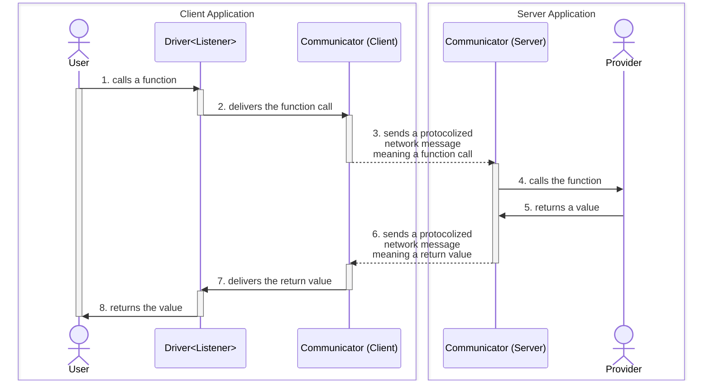
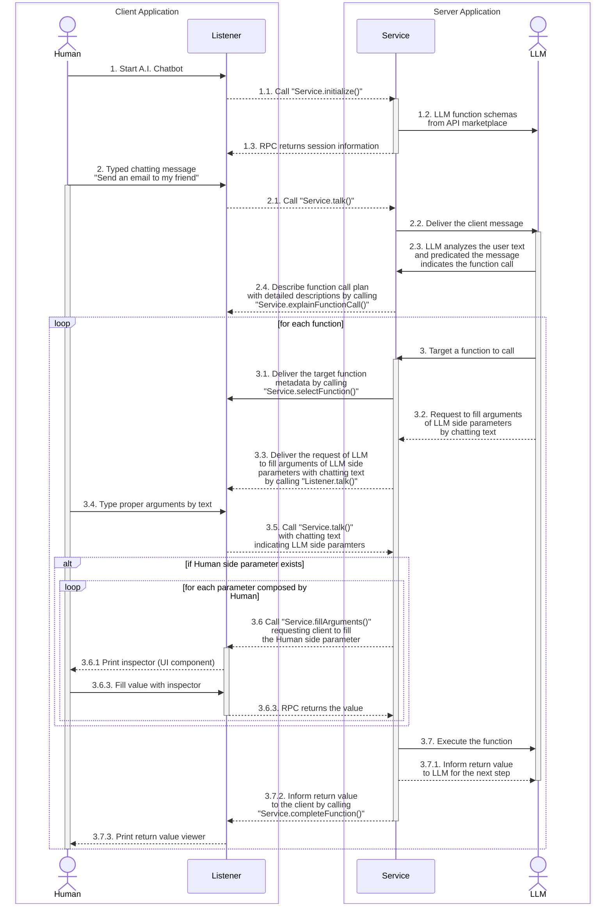

import { Tabs, Tab } from 'nextra-theme-docs';

## Concept
WebSocket protocol with RPC paradigm for A.I. chatbot.

"Wrtn Studio Pro" has developed A.I. chatbot application with WebSocket protocol. Also, in the WebSocket protocol, "Meta LLM" has adopted the RPC (Remote Procedure Call) paradigm. By the RPC paradigm, client appliation of "Meta LLM" can call the server application's functions remotely. Of course, the server application can remotely call the client functions too.

The WebSocket RPC (Remote Procedure Call) module is composed with four components: `Communicator`, `Header`, `Provider` and `Driver`. The `Communicator` is a class that taking responsibility of network communication and `Provider` is a collection of functions that providing to the remote system. At last, `Driver` is the RPC driver which can remotely call the functions of the remote system's `Provider`.

In our "Meta LLM" system, there are two provides; `IStudioMetaChatService` and `IStudioMetaChatListener`. `IStudioMetaChatService` is a type of provider from server to client, and `IStudioMetaChatListener` is a type of provider from client to server. Also, `IStudioMetaChatListener` is providing many LLM function call related functions, so that Meta LLM server accomplishes the function call execution by calling the functions of `IStudioMetaChatListener` remotely.

- References
  - [Remote Procedure Call](https://tgrid.com/docs/remote-procedure-call/)
  - [Features > RPC Components](https://tgrid.com/docs/features/components/)
  - [Learn from Examples > Remote Function Call](https://tgrid.com/docs/examples/remote-function-call/)
- Providers
  - [`IStudioMetaChatService`](/api/interfaces/structures_studio_meta_IStudioMetaChatService.IStudioMetaChatService-1.html)
  - [`IStudioMetaChatListener`](/api/interfaces/structures_studio_meta_IStudioMetaChatListener.IStudioMetaChatListener-1.html)


## RPC Components
Components of the Remote Procedure Call (RPC) paradigm.

- [`Communicator`](#communicator): network communication with remote system
- [`Header`](#header): header value directly delivered after the connection
- [`Provider`](#provider): object provided for remote system
- [`Driver`](#driver): proxy instance for remotely function calling to `Provider`



### `Communicator`
Communicates with a remote system.

`Communicator` is a class taking full responsibility to network communication with remote system. You can register a Provider, an object would be provided to the remote system, to the `Communicator`. Also, [`Driver<Remote>`](#driver), which can access to the remote system's [Provider](#provider), is created by this `Communicator`.

In the WebSocket protocol, `WebSocketConnector` and `WebAcceptor` are the classes responsible for the network communication. Also, this RPC paradigm is used not only in n the Meta LLM side with WebSocket protocol, but also in the Workflow Studio side with worker protocol.

Here is the list of every communicator classes following the RPC paradigm.

Protocol | Client | Server
---------|--------|--------
Web Socket | [`WebSocketConnector`](https://tgrid.com/docs/features/websocket/#websocketconnector) | [`WebSocketAcceptor`](https://tgrid.com/docs/features/websocket/#websocketacceptor)
Dedicated Worker | [`WorkerConnector`](https://tgrid.com/docs/features/worker/#workerconnector) | [`WorkerServer`](https://tgrid.com/docs/features/worker/#workerserver)
Shared Worker | [`SharedWorkerConnector`](https://tgrid.com/docs/features/worker/#sharedworkerconnector) | [`SharedWorkerAcceptor`](https://tgrid.com/docs/features/worker/#sharedworkeracceptor)

### `Header`
<Tabs items={["Client Program", "WebSocket Server", "Worker Server"]}>
  <Tab>
```typescript filename="examples/websocket/src/client.ts" showLineNumbers {18}
import { Driver, WebSocketConnector } from "tgrid";

import { ICalcConfig } from "./interfaces/ICalcConfig";
import { ICalcEvent } from "./interfaces/ICalcEvent";
import { ICalcEventListener } from "./interfaces/ICalcEventListener";
import { ICompositeCalculator } from "./interfaces/ICompositeCalculator";

export const webSocketClientMain = async () => {
  const stack: ICalcEvent[] = [];
  const listener: ICalcEventListener = {
    on: (evt: ICalcEvent) => stack.push(evt),
  };
  const connector: WebSocketConnector<
    ICalcConfig,
    ICalcEventListener,
    ICompositeCalculator
  > = new WebSocketConnector(
    { precision: 2 }, // header
    listener, // provider for remote server
  );
  await connector.connect("ws://127.0.0.1:37000/composite");

  const remote: Driver<ICompositeCalculator> = connector.getDriver();
  console.log(
    await driver.plus(10, 20), // returns 30
    await driver.multiplies(3, 4), // returns 12
    await driver.divides(5, 3), // returns 1.67
    await driver.scientific.sqrt(2), // returns 1.41
    await driver.statistics.mean(1, 3, 9), // returns 4.33
  );

  await connector.close();
  console.log(stack);
};
```
  </Tab>
  <Tab>
```typescript filename="examples/websocket/src/server.ts" showLineNumbers {21}
import { Driver, WebSocketServer } from "tgrid";

import { ICalcConfig } from "./interfaces/ICalcConfig";
import { ICalcEventListener } from "./interfaces/ICalcEventListener";
import { CompositeCalculator } from "./providers/CompositeCalculator";
import { ScientificCalculator } from "./providers/ScientificCalculator";
import { SimpleCalculator } from "./providers/SimpleCalculator";
import { StatisticsCalculator } from "./providers/StatisticsCalculator";

export const webSocketServerMain = async () => {
  const server: WebSocketServer<
    ICalcConfig,
    | CompositeCalculator
    | SimpleCalculator
    | StatisticsCalculator
    | ScientificCalculator,
    ICalcEventListener
  > = new WebSocketServer();
  await server.open(37_000, async (acceptor) => {
    // LIST UP PROPERTIES
    const config: ICalcConfig = acceptor.header;
    const listener: Driver<ICalcEventListener> = acceptor.getDriver();

    // ACCEPT OR REJECT
    if (acceptor.path === "/composite")
      await acceptor.accept(new CompositeCalculator(config, listener));
    else if (acceptor.path === "/simple")
      await acceptor.accept(new SimpleCalculator(config, listener));
    else if (acceptor.path === "/statistics")
      await acceptor.accept(new StatisticsCalculator(config, listener));
    else if (acceptor.path === "/scientific")
      await acceptor.accept(new ScientificCalculator(config, listener));
    else {
      await acceptor.reject(1002, `WebSocket API endpoint not found.`);
      return;
    }

    // PING REPEATEDLY TO KEEP CONNECTION
    acceptor.ping(15_000);
  });
  return server;
};
```
  </Tab>
  <Tab>
```typescript filename="examples/worker/src/server.ts" showLineNumbers {14}
import { Driver, WorkerServer } from "tgrid";

import { ICalcConfig } from "./interfaces/ICalcConfig";
import { ICalcEventListener } from "./interfaces/ICalcEventListener";
import { CompositeCalculator } from "./providers/CompositeCalculator";

const main = async () => {
  const server: WorkerServer<
    ICalcConfig,
    CompositeCalculator,
    ICalcEventListener
  > = new WorkerServer();

  const header: ICalcConfig = await server.getHeader();
  const listener: Driver<ICalcEventListener> = server.getDriver();
  const provider: CompositeCalculator = new CompositeCalculator(
    header,
    listener,
  );
  await server.open(provider);
};
main().catch((exp) => {
  console.error(exp);
  process.exit(-1);
});
```
  </Tab>
</Tabs>

Header value delivered after the connection.

`Header` is a value, delivered from client to server directly, after the connection.

Server can get the `Header` value through acceptor's `header` property.

  - [`WebSocketAcceptor.header`](https://tgrid.com/api/classes/WebSocketAcceptor-1.html#header-1)
  - [`SharedWorkerAcceptor.header`](https://tgrid.com/api/classes/SharedWorkerAcceptor-1.html#header-1)
  - [`WorkerServer.getHeader()`](https://tgrid.com/api/classes/WorkerServer-1.html#getHeader)

### `Provider`
```typescript filename="examples/websocket/src/server.ts" showLineNumbers {26, 28, 30, 32}
import { Driver, WebSocketServer } from "tgrid";

import { ICalcConfig } from "./interfaces/ICalcConfig";
import { ICalcEventListener } from "./interfaces/ICalcEventListener";
import { CompositeCalculator } from "./providers/CompositeCalculator";
import { ScientificCalculator } from "./providers/ScientificCalculator";
import { SimpleCalculator } from "./providers/SimpleCalculator";
import { StatisticsCalculator } from "./providers/StatisticsCalculator";

export const webSocketServerMain = async () => {
  const server: WebSocketServer<
    ICalcConfig,
    | CompositeCalculator
    | SimpleCalculator
    | StatisticsCalculator
    | ScientificCalculator,
    ICalcEventListener
  > = new WebSocketServer();
  await server.open(37_000, async (acceptor) => {
    // LIST UP PROPERTIES
    const config: ICalcConfig = acceptor.header;
    const listener: Driver<ICalcEventListener> = acceptor.getDriver();

    // ACCEPT OR REJECT
    if (acceptor.path === "/composite")
      await acceptor.accept(new CompositeCalculator(config, listener));
    else if (acceptor.path === "/simple")
      await acceptor.accept(new SimpleCalculator(config, listener));
    else if (acceptor.path === "/statistics")
      await acceptor.accept(new StatisticsCalculator(config, listener));
    else if (acceptor.path === "/scientific")
      await acceptor.accept(new ScientificCalculator(config, listener));
    else {
      await acceptor.reject(1002, `WebSocket API endpoint not found.`);
      return;
    }

    // PING REPEATEDLY TO KEEP CONNECTION
    acceptor.ping(15_000);
  });
  return server;
};
```

Object provided for remote system.

`Provider` is an object provided for the remote system.

The remote system can call the `Provider`'s functions through [`Driver<Remote>`](#driver).

### `Driver`
```typescript filename="examples/websocket/src/client.ts" showLineNumbers {23-30}
import { Driver, WebSocketConnector } from "tgrid";

import { ICalcConfig } from "./interfaces/ICalcConfig";
import { ICalcEvent } from "./interfaces/ICalcEvent";
import { ICalcEventListener } from "./interfaces/ICalcEventListener";
import { ICompositeCalculator } from "./interfaces/ICompositeCalculator";

export const webSocketClientMain = async () => {
  const stack: ICalcEvent[] = [];
  const listener: ICalcEventListener = {
    on: (evt: ICalcEvent) => stack.push(evt),
  };
  const connector: WebSocketConnector<
    ICalcConfig,
    ICalcEventListener,
    ICompositeCalculator
  > = new WebSocketConnector(
    { precision: 2 }, // header
    listener, // provider for remote server
  );
  await connector.connect("ws://127.0.0.1:37000/composite");

  const remote: Driver<ICompositeCalculator> = connector.getDriver();
  console.log(
    await driver.plus(10, 20), // returns 30
    await driver.multiplies(3, 4), // returns 12
    await driver.divides(5, 3), // returns 1.67
    await driver.scientific.sqrt(2), // returns 1.41
    await driver.statistics.mean(1, 3, 9), // returns 4.33
  );

  await connector.close();
  console.log(stack);
};
```

> ```bash filename="Terminal"
> $ npm start
> 30 12 1.67 1.41 4.33
> [
>   { type: 'plus', input: [ 10, 20 ], output: 30 },
>   { type: 'multiplies', input: [ 3, 4 ], output: 12 },
>   { type: 'divides', input: [ 5, 3 ], output: 1.67 },
>   { type: 'sqrt', input: [ 2 ], output: 1.41 },
>   { type: 'mean', input: [ 1, 3, 9 ], output: 4.33 }
> ]
> ```

Driver of RPC (Remote Procedure Call).

`Driver` is a proxy instance designed to call functions of the remote system. It has a generic argument `Remote` which means the type of remote system's [Provider](#provider), and you can remotely call the functions of the [Provider](#provider) asynchronously through the `Drive<Remote>` instance.

When you call some function of remote [Provider](#provider) by the `Driver<Listener>` instance, it hooks the function call expression, and delivers the function name and arguments (parameter values) to the remote system through the [Communicator](#communicator). If the remote system suceeded to reply the result of the function call, [Communicator](#communicator) resolves the promise of the function call expression with the result, so that makes `Driver<Remote>` working.

Otherwise exception is thrown in the remote [Provider](#provider) function, [Communicator](#communicator) deliveries the exception instance instead to the remote system, so that actual exception being thrown from the `Driver<Remote>` instance.

> [💻 Playground Link](https://stackblitz.com/~/github.com/samchon/tgrid.example.websocket?file=src/client.ts&view=editor)


## Meta LLM Protocol
### `IStudioMetaChatService`
```typescript filename="@wrtn/ecosystem-api" showLineNumbers
/**
 * Set of functions provided by the Meta LLM server to the client.
 * 
 * `IStudioMetaChatService` is an interface that defines the set of functions
 * provided by the **server** to the Meta LLM (Large Language Model) client. The Meta 
 * LLM client remotely calls the server's `IStudioMetaChatService` functions through 
 * this interface with RPC (Remote Procedure Call) paradigm.
 * 
 * Note that the client must call the {@link initialize} function immediately
 * after connecting to the Meta LLM server. If the client tries to skip the
 * {@link initialize} function call and directly call {@link talk}, the function
 * call will fail, so that exception would be thrown.
 */
export interface IStudioMetaChatService {
  /**
   * Publish/restore/initialize the chat session.
   * 
   * The client must call this function once after connecting to the Meta LLM
   * server to publish a new chat session or restore an existing session. If
   * the client tries to skip the {@link initialize} function call and directly
   * call {@link talk}, the function call will fail, so that exception would be
   * thrown.
   * 
   * Also, the returned session would be a new chat session if the client connected
   * to the server via the new chat session API, and the existing session would be
   * restored if the client connected to the server via the continue chat session
   * API.
   *
   * - {@link HubApi.functional.studio.customers.meta.chat.sessions.start}
   * - {@link HubApi.functional.studio.customers.meta.chat.sessions.restart}
   */
  initialize(): Promise<IStudioMetaChatSession>;

  /**
   * User talks to Meta LLM.
   * 
   * A function called by the client to talk to the Meta LLM server.
   * 
   * @param dialogue Dialogue information
   */
  talk(dialogue: IStudioMetaChatDialogue): Promise<void>;
}
```

Provider from server to client for chatting.
p
"Meta LLM" server is providing an `IStudioMetaChatService` typed instane to the client. 

It provides only two functions: `initialize()` and `talk()`. At first, `initialize()` is a function that the client must call once after connecting to the Meta LLM server to publish a new chat session or restore an existing session. If the client tries to skip the `initialize()` function call and directly call `talk()`, the function call will fail, so that exception would be thrown.

The other `talk()` is a function called by the client to talk to the Meta LLM server. When client talks to the Meta LLM server, LLM reads and analyzes the message, and do something proper behavior calling the remotely provided functions of `IStudioMetaChatListener`.

### `IStudioMetaChatListener`
```typescript filename="@wrtn/ecosystem-api" showLineNumbers
/**
 * Set of functions provided by the Meta LLM client to the server.
 * 
 * `IStudioMetaChatListener` is an interface that defines the set of functions
 * provided by the **client** to the Meta LLM (Large Language Model) server. The Meta 
 * LLM server remotely calls the client's `IStudioMetaChatListener` functions through
 * this interface with RPC (Remote Procedure Call) paradigm.
 */
export interface IStudioMetaChatListener {
  /**
   * Meta LLM server talks to the user.
   * 
   * A function called by the Meta LLM server to talk to the user.
   *
   * @param dialogue Dialogue information
   */
  talk(dialogue: IStudioMetaChatDialogue): Promise<void>;

  /**
   * Notify the client of the server's listenability.
   * 
   * The Meta LLM server notifies the client whether it is possible to listen.
   *  
   * In other words, this function informs the client whether it can call
   * {@link IStudioMetaChatService.talk} immediately or not.
   * 
   * Note that when the client calls the server's RPC function
   * {@link IStudioMetaChatService.talk}, the value `false` is passed to this
   * function {@link IStudioMetaChatListener.listenable} immediately. On the
   * other hand, the value `true` is passed to this function in various cases.
   *
   * @param status Listenability status
   */
  listenable(status: boolean): Promise<void>;

  /**
   * Explain the function call plan.
   * 
   * The Meta LLM server explains the function call plan to the user.
   * 
   * The function call plan provided includes a list of functions that LLM
   * wants to execute in order, and a description of the entire plan and the
   * purpose of each function call.
   * 
   * The client can read this and decide whether to proceed with the LLM
   * function call execution. If `true` is returned, the Meta LLM will call
   * the functions according to the plan. Otherwise `false` be returned, the plan
   * would be withdrawn.
   * 
   * @param plan Function call plan
   * @returns Whether to proceed with the plan or not
   */
  explainFunctionCall(plan: IStudioMetaChatFunctionCallPlan): Promise<boolean>;

  /**
   * Select a function to call.
   * 
   * A function called by the Meta LLM server when LLM (Large Language Model) has
   * determined the target function to call during the conversation with the user.
   * 
   * After this function be called, the server will call the {@link fillArguments} 
   * functionns remotely to commpose parameter values, and then call the 
   * {@link completeFunction} function after the function call execution.
   *
   * @param props Information of the target function
   */
  selectFunction(props: IStudioMetaChatFunctionCall.ISelect): Promise<void>;

  /**
   * Fill in the argument of the function call.
   * 
   * A function called by the Meta LLM server when the user needs to fill in 
   * some of the argument for the LLM function call. For example, when the user
   * needs to enter an authentication key for a Google account, or upload a file
   * manually.
   * 
   * `IStudioMetaFunctionCall.arguments` is a function called when the user needs
   * to compose some (or all) of the arguments to be used in the function call
   * directly. The returned value means the value that the client has composed.
   * 
   * The only cases where the client receives input separately from the server
   * in our service are as follows:
   *
   * - {@link IOpenAiSchema.IString["x-wrtn-secret-key"]}
   * - {@link IOpenAiSchema.IString.contentMediaType}
   *
   * @param props Information of the target function and argument types
   * @returns The value composed by the client, or rejection by hin/her
   */
  fillArgument(
    props: IStudioMetaChatFunctionCall.IFillArgument,
  ): Promise<IStudioMetaChatListener.IFillArgumentResult>;

  /**
   * Complete the function call.
   * 
   * A function called by the Meta LLM server to inform the client of the 
   * completion of the LLM function call execution. 
   * 
   * It embodies the `Try<T, E>` structure, so that contains whether the function call 
   * was successful or not. Also, it contains the return value when suceeded, and the
   * exception information when failed.
   *
   * @param props Information of the execution result
   */
  completeFunction(props: IStudioMetaChatFunctionCall.IComplete): Promise<void>;

  /**
   * Workflow has been prepared.
   * 
   * A function called by the Meta LLM server when the workflow creation is ready.
   * Client can decide whether to save the {@link IStudioWorkflow workflow document} 
   * based on the {@link IStudioWorkflowData.ICreate creation information} received 
   * from the server.
   * 
   * If client returns a {@link IStudioMetaChatWorkflowConfirm} instance in this 
   * function, the server will create the workflow at the specified 
   * {@link IStudioRepository repository} location. Otherwise the client returns
   * `null`, the server will not create the workflow.
   *
   * @param data Workflow creation information
   * @param plan Workflow configuration plan including detailed descriptions
   * @returns Whether to create the workflow document or not
   */
  prepareWorkflow(
    data: IStudioWorkflowData.ICreate,
    plan: IStudioMetaChatWorkflowPlan,
  ): Promise<IStudioMetaChatWorkflowConfirm | null>;

  /**
   * Workflow has been created/updated.
   * 
   * A function called by the Meta LLM server when an {@link IStudioWorkflow workflow}
   * has been newly created or updated by the client had returned a non-null value from
   * the {@link prepareWorkflow} function.
   * 
   * Whether the server creates or updates the workflow depends on the return value of
   * the {@link prepareWorkflow} function. If the client orders a new workflow document,
   * it would be created by the server. Otherwise the client directed the existing
   * workflow document, it would be updated.
   * 
   * The provided parameter object is the detailed information of the workflow
   * {@link IStudioWorkflow} and its location information with {@link IStudioRepository}, 
   * so that the client can check it and enter the workflow editor or provide 
   * a preview image.
   *
   * @param workflow Newly created or updated workflow
   * @param related Account and repository information related to the workflow
   */
  completeWorkflow(
    workflow: IStudioWorkflow,
    related: Pick<IStudioMetaChatWorkflowConfirm, "account" | "repository">,
  ): Promise<void>;

  /**
   * Meta LLM server requests the client to terminate.
   * 
   * When the Meta LLM session suddenly died due to the bug from LLM 
   * (Large Language Model) like OpenAI, the server requests the client to terminate 
   * the connection, and retry it again a little bit later.
   *
   * @param error Error from the LLM module
   */
  kill(error?: any): Promise<void>;
}
```

Provider from client to server for chatting.

"Meta LLM" client is providing an `IStudioMetaChatListener` typed instance to the server. 

It provides many listener methods for the server for interaction. At first, it providers `talk()` and `listenable()` methods. The `talk()` method is designed to listen what the LLM server is saying, and the `listenable()` method informs the client to whether the server is ready to listen client's talk or not. If server has delivered `false` value to the `listenable()` method, the client must not call the `talk()` method until the server delivers `true` value to the `listenable()` method.

When user writes a chatting text, so that client remotely calls `IStudioMetaChatService.talk()` method, LLM (Large Language Model) analyzes the chatting text. Sometimes, the LLM predicates the chatting text indicates the LLM function call. In that case, LLM server starts the [function call execution](#function-call-execution) process by calling the `explainFunctionCall()` method remotely. In the process, server fills the LLM side parameters by user's chatting text, and fill Human side parameters by calling `fillArgument()` method. 

At last, if client request to create a reusable program function about the chatting by text input delivered by remotely calling `IStudioMetaChatService.talk()` method, LLM server composes the Workflow document with SWL language, and delivers it to the client by calling the `prepareWorkflow()` function remotely. If client returns the `IStudioMetaChatWorkflowConfirm` instance, LLM server actually creates the Workflow document at the specified repository location, and then delivers the created Workflow document to the `completeWorkflow()` method.

### Parameter Structures
#### `Dialogue`
```typescript filename="@wrtn/ecosystem-api" showLineNumbers
/**
 * Conversion in the Meta LLM chat.
 * 
 * `IStudioMetaChatDialogue` is a union type that represents the 
 * conversation information occured in the Meta LLM (A.I. chatbot).
 * 
 * Currently, only text conversation type exists, but in the future, it 
 * may be possible to add voice, image, or composite types. It's because 
 * OpenAI GPT-4o model has started supporting the voice input.
 */
export type IStudioMetaChatDialogue = IStudioMetaChatDialogue.IText;
export namespace IStudioMetaChatDialogue {
  /**
   * Text conversation information.
   */
  export interface IText {
    /**
     * Discriminator of union type.
     */
    kind: "text";

    /**
     * The text input by Human or LLM.
     */
    text: string;
  }
}
```

Chat dialogue information.

When Human or LLM sends chatting text to the other, client or server remotely call the `IStudioMetaChatListener.talk()` or `IStudioMetaChatService.talk()` method, and their sole parameter type is `IStudioMetaChatDialogue` of above.

#### `FunctionCallPlan`
```typescript filename="@wrtn/ecosystem-api" showLineNumbers
/**
 * Explanation of the function call plan.
 * 
 * `IStudioMetaChatFunctionCallPlan` is an interface that describes the plan
 * of function calls in the Meta LLM chat session when the server explains the
 * plan to the client. 
 * 
 * It contains the list of functions to be called, the overall/development-level 
 * description of the plan, and the description list for each function call.
 * 
 * In the RPC (Remote Procedure Call) context, this structure 
 * `IStudioMetaChatFunctionCallPlan` is used in the
 * {@link IStudioMetaChatListener.explainFunctionCall} method. After the method be
 * called, each function in the plan would be excuted by below sequence:
 * 
 * 1. {@link IStudioMetaChatListener.selectFunction} to inform function metadata
 * 2. {@link IStudioMetaChatListener.fillArgument} per each argument of Human side
 * 3. {@link IStudioMetaChatListener.completeFunction} after function call execution
 */
export interface IStudioMetaChatFunctionCallPlan {
  /**
   * List of functions to call.
   * 
   * Do not provide all metadata of the functions, but only identifier 
   * ({@link method} and {@link path}) of the function, and its {@link summary} and 
   * {@link descriptions}.
   */
  functions: IStudioMetaChatFunctionCallPlan.IFunction[];

  /**
   * General description of the entire plan.
   */
  general: string;

  /**
   * Individual description list for each function call.
   */
  steps: string[];
}
export namespace IStudioMetaChatFunctionCallPlan {
  export interface IFunction {
    method: "get" | "post" | "patch" | "put" | "delete";
    path: string;
    summary?: string;
    description?: string;
    icon?: string & tags.Format<"uri">;
  }
}
```

Description of the function call plan.

`IStudioMetaChatFunctionCallPlan` is an interface that describes the plan of function calls in the Meta LLM chat session when the server explains the plan to the client. It contains the list of functions to be called, the overall/development-level description of the plan, and the description list for each function call.

In the RPC (Remote Procedure Call) context, this structure `IStudioMetaChatFunctionCallPlan` is used in the `IStudioMetaChatListener.explainFunctionCall()` method. After the method be called, each function in the plan would be excuted by below sequence:

1. `IStudioMetaChatListener.selectFunction()` to inform function metadata
2. `IStudioMetaChatListener.fillArgument()` per each argument of Human side
3. `IStudioMetaChatListener.completeFunction()` after function call execution

#### `FunctionCall`
```typescript filename="@wrtn/ecosystem-api" showLineNumbers
import { IOpenAiFunction, IOpenAiSchema } from "@wrtnio/openai-function-schema";
import { Primitive, tags } from "typia";
import { OmitNever } from "typia/lib/typings/OmitNever";

export namespace IStudioMetaChatFunctionCall {
  /**
   * Selection information of the function to call.
   * 
   * `IStudioMetaChatFunctionCall.ISelect` is an interface that providing metadata
   * of the target function to call when the Meta LLM server selects a proper function 
   * to call during the conversation with the user.
   * 
   * In the context of RPC (Remote Procedure Call), this `IStudioMetaChatFunctionCall`
   * structure is used in the {@link IStudioMetaChatListener.selectFunction} method.
   * Also after delivering this information. the server will step below sequence:
   * 
   * 1. {@link IStudioMetaChatListener.fillArgument} to compose Human side parameters
   * 2. {@link IStudioMetaChatListener.completeFunction} after function call execution
   */
  export interface ISelect {
    /**
     * Primary Key.
     */
    id: string & tags.Format<"uuid">;

    /**
     * Metadata of the target function to call.
     */
    function: OmitNever<Primitive<IOpenAiFunction>>;
  }

  /**
   * Request of arguments filling of Human side parameter.
   * 
   * `IStudioMetaChatFunctionCall.IFillArgument` is an interface that providing
   * the request to client for composing some of the arguments of the target
   * function that must be filled by Human side, intead of LLM (Large Language Model).
   * 
   * As a case of the values that must be filled by Human side, there are secret key
   * and file upload. In the context of {@link IOpenAiSchema}, those typed values
   * must be filled by Human:
   * 
   * - {@link IOpenAiSchema.IString["x-wrtn-secret-key"]}
   * - {@link IOpenAiSchema.IString.contentMediaType}
   */
  export interface IFillArgument {
    /**
     * Identifier of the target function.
     * 
     * It is same with the {@link IStudioMetaChatFunctionCall.ISelect.id}.
     */
    id: string & tags.Format<"uuid">;

    /**
     * Index of the parameter to fill.
     */
    index: number & tags.Type<"uint32">;

    /**
     * Schema information that must be composed by Human.
     */
    schema: IOpenAiSchema;

    /**
     * Metadata of the parameter that can be filled by LLM.
     * 
     * If this value is `null`, it means that the parameter must be filled only by 
     * Human. Otherwise, LLM (Large Language Model) also can fill the parameter value
     * by analyzing the client's conversation, and Meta LLM merges it with the 
     * Human composed.
     */
    llm: null | {
      /**
       * SChema information that can be filled by LLM.
       */
      schema: IOpenAiSchema;

      /**
       * Actual value filled by LLM.
       */
      value: any;
    };
  }

  /**
   * Result of the function call execution.
   * 
   * `IStudioMetaChatFunctionCall.IComplete` is an interface that providing the
   * result of the function call execution.
   * 
   * In the RPC (Remote Procedure Call) context, this `IStudioMetaChatFunctionCall`
   * structure is used in the {@link IStudioMetaChatListener.completeFunction} method.
   */
  export interface IComplete {
    /**
     * Primary Key.
     * 
     * It is same with the {@link IStudioMetaChatFunctionCall.ISelect.id}.
     */
    id: string & tags.Format<"uuid">;

    /**
     * Arguments list used in the function call.
     */
    arguments: any[];

    /**
     * Whether the function call was successful or not.
     */
    success: boolean;

    /**
     * Returned value as a result of the function call.
     * 
     * If the function call has been failed, this value would be exception instance 
     * thrown by the target function.
     */
    value: any;

    /**
     * Time of the function call start.
     */
    created_at: string & tags.Format<"date-time">;

    /**
     * Time of the function call completion.
     * 
     * If this value is `null`, it means that the connection to the target function
     * (API operation) itself has failed. On the other hand, if the connection has been
     * succeeded but exception has been thrown during the function call, this time
     * would be the time when the exception has been thrown.
     */
    completed_at: null | (string & tags.Format<"date-time">);

    /**
     * Status of the response.
     * 
     * The HTTP protocol response status if the connection has been succeeded.
     * Otherwise the connection has been failed, this value would be `null`.
     */
    status: number | null;
  }
}
```

Structure for function call execution.

After the Meta LLM server has explained the function call plan to the client by remotely calling the `IStudioMetaChatListener.explainFunctionCall()` method with `IStudioMetaChatFunctionCallPlan` typed parameter, the Meta LLM server steps the function call execution process by calling below methods.

1. `IStudioMetaChatListener.selectFunction()` to inform function metadata
2. `IStudioMetaChatListener.fillArgument()` per each argument of Human side
3. `IStudioMetaChatListener.completeFunction()` after function call execution

At first, `IStudioMetaChatFunctionCall.ISelect` is an interface that providing metadata of the target function to call with `IStudioMetaChatListener.selectFunction()` method, when the Meta LLM server selects a proper function to call during the conversation with the user.

At next, `IStudioMetaChatFunctionCall.IFillArgument` is an interface that providing the request to client for composing some of the arguments of the target function that must be filled by Human side, intead of LLM (Large Language Model), by `IStudioMetaChatListener.selectFunction()` method. As a case of the values that must be filled by Human side, there are secret key and file uploading.

At last. `IStudioMetaChatFunctionCall.IComplete` is an interface that providing the result of the function call execution by `IStudioMetaChatListener.completeFunction()` method. It contains the argument values used for function call execution, and the result value from target function. If the function call has been failed, the result value would be exception instance thrown by the target function.

#### `WorkflowPlan`
```typescript filename="@wrtn/ecosystem-api" showLineNumbers
/**
 * Description of workflow composition plan.
 * 
 * `IStudioMetaChatWorkflowPlan` is an interface that describes the plan of
 * the workflow composition in the Meta LLM chat session. The server explains
 * how to compose the workflow document in the general level, and also provides
 * the detailed description of each step.
 * 
 * In the RPC (Remote Procedure Call) context, this structure 
 * `IStudioMetaChatWorkflowPlan` is used in the 
 * `IStudioMetaChatListener.prepareWorkflow` function, and the client determines
 * whether to actually build the workflow document or not based on this plan.
 */
export interface IStudioMetaChatWorkflowPlan {
  /**
   * General description of the entire plan.
   */
  general: string;

  /**
   * Detailed description list for each step.
   */
  steps: string[];

  /**
   * Title of the workflow.
   */
  title: string;

  /**
   * Summary of the workflow.
   * 
   * This `summary` is different with the {@link general} description. The 
   * {@link general} description is the overall description of the entire plan,
   * and this `summary` would be written in the workflow document when it compiled
   * to a resuable program function.
   * 
   * In other words, this `summary` would be assigned to 
   * {@link OpenApi.IOperation.summary} in the API level, and written on the 
   * programming comment in the source code level.
   */
  summary: string;

  /**
   * Description of the workflow.
   * 
   * This `description` is different with the {@link general} description. The
   * {@link general} description is the overall description of the entire plan,
   * and this `description` would be written in the workflow document when it 
   * compiled to a resuable program function.
   * 
   * In other words, this `description` would be assigned to 
   * {@link OpenApi.IOperation.description} in the API level, and written on the
   * programming comment in the source code level.
   */
  description: string;
}
```

Description of the workflow composition plan.

When user requests to create a reusable program function from a chatting session, Meta LLM collects entire function call histories, and introduces the workflow composition plan before the actual workflow document creation. `IStudioMetaChatWorkflowPlan` is the interface providing the workflow composition plan with `IStudoMetaCatListener.prepareWorkflow()` method.

In the `IStudoMetaCatListener.prepareWorkflow()` method, if client accepts the workflow composition plan and returns somewhere place to save the workflow document, the server actually creates the workflow document bypass SWL language, and delivers the created workflow document to the `IStudioMetaChatListener.completeWorkflow()` method.

#### `WorkflowConfirm`
```typescript filename="@wrtn/ecosystem-api" showLineNumbers
/**
 * Confirmation of the workflow creation.
 * 
 * `IStudioMetaChatWorkflowConfirm` is an interface that accepting the 
 * workflow creation with location to save the workflow document
 * including target {@link IStudioAccount account}, 
 * {@link IStudioRepository repository}, {@link IStudioRepositoryCommit commit} 
 * and {@link IStudioWorkflow.path path} information.
 * 
 * In the RPC (Remote Procedure Call) context, this structure
 * `IStudioMetaChatWorkflowConfirm` is used in the 
 * {@link IStudioMetaChatListener.prepareWorkflow} function, and the client
 * returns this typed instance acceptinng the workflow creation
 */
export interface IStudioMetaChatWorkflowConfirm {
  /**
   * Belonged account's {@link IStudioAccount.code}.
   */
  account: string;

  /**
   * Belonged repository's {@link IStudioRepository.code}.
   */
  repository: string;

  /**
   * Target commit.
   * 
   * Create a new commit or update to an existing commit.
   */
  commit:
    | IStudioMetaChatWorkflowConfirm.ICommitCreate
    | IStudioMetaChatWorkflowConfirm.ICommitUpdate;

  /**
   * Workflow to create.
   * 
   * Information of workflow where to save, including path and file name.
   */
  workflow: Omit<
    IStudioWorkflow.ICreate,
    "data" | "title" | "summary" | "description"
  >;
}
export namespace IStudioMetaChatWorkflowConfirm {
  /**
   * Create new commit.
   */
  export interface ICommitCreate
    extends Omit<
      IStudioRepositoryCommit.ICreate,
      "creates" | "updates" | "erases"
    > {
    /**
     * Discriminator of union type.
     */
    kind: "create";
  }

  /**
   * Update to existing commit.
   */
  export interface ICommitUpdate
    extends Omit<
      IStudioRepositoryCommit.IUpdate,
      "creates" | "updates" | "erases"
    > {
    /**
     * Discriminator of union type.
     */
    kind: "update";

    /**
     * Target commit's {@link IStudioRepositoryCommit.id}.
     */
    commit_id: "latest" | (string & tags.Format<"uuid">);
  }
}
```

Confirmation of workflow document creation.

When Meta LLM server explains the workflow composition plan to the client by remotely calling `IStudioMetaChatListener.prepareWorkflow()` method, the client can decide whether to actually build the workflow document or not based on the plan. If client returns `IStudioMetaChatWorkflowConfirm` typed instance in the method, the server actually builds the workflow document through SWL language, and inform the completion by calling `IStudioMetaChatListener.completeWorkflow()` method.

`IStudioMetaChatWorkflowConfirm` is such an interface that accepting the workflow creation. The `IStudioMetaChatWorkflowConfirm` contains somewhere location to save the workflow document including target account, repository, commit and file path.


## Function Call Execution
<Tabs items={[
    "Sequence Diagram", 
    <code>IStudioMetaChatService</code>, 
    <code>IStudioMetaChatListener</code>,
    <code>IStudioMetaChatFunctionCall</code>,
  ]}>
  <Tab>

  </Tab>
  <Tab>
```typescript filename="@wrtn/ecosystem-api" showLineNumbers
/**
 * Set of functions provided by the Meta LLM server to the client.
 * 
 * `IStudioMetaChatService` is an interface that defines the set of functions
 * provided by the **server** to the Meta LLM (Large Language Model) client. The Meta 
 * LLM client remotely calls the server's `IStudioMetaChatService` functions through 
 * this interface with RPC (Remote Procedure Call) paradigm.
 * 
 * Note that the client must call the {@link initialize} function immediately
 * after connecting to the Meta LLM server. If the client tries to skip the
 * {@link initialize} function call and directly call {@link talk}, the function
 * call will fail, so that exception would be thrown.
 */
export interface IStudioMetaChatService {
  /**
   * Publish/restore/initialize the chat session.
   * 
   * The client must call this function once after connecting to the Meta LLM
   * server to publish a new chat session or restore an existing session. If
   * the client tries to skip the {@link initialize} function call and directly
   * call {@link talk}, the function call will fail, so that exception would be
   * thrown.
   * 
   * Also, the returned session would be a new chat session if the client connected
   * to the server via the new chat session API, and the existing session would be
   * restored if the client connected to the server via the continue chat session
   * API.
   *
   * - {@link HubApi.functional.studio.customers.meta.chat.sessions.start}
   * - {@link HubApi.functional.studio.customers.meta.chat.sessions.restart}
   */
  initialize(): Promise<IStudioMetaChatSession>;

  /**
   * User talks to Meta LLM.
   * 
   * A function called by the client to talk to the Meta LLM server.
   * 
   * @param dialogue Dialogue information
   */
  talk(dialogue: IStudioMetaChatDialogue): Promise<void>;
}
```
  </Tab>
  <Tab>
```typescript filename="@wrtn/ecosystem-api" showLineNumbers
/**
 * Set of functions provided by the Meta LLM client to the server.
 * 
 * `IStudioMetaChatListener` is an interface that defines the set of functions
 * provided by the **client** to the Meta LLM (Large Language Model) server. The Meta 
 * LLM server remotely calls the client's `IStudioMetaChatListener` functions through
 * this interface with RPC (Remote Procedure Call) paradigm.
 */
export interface IStudioMetaChatListener {
  /**
   * Meta LLM server talks to the user.
   * 
   * A function called by the Meta LLM server to talk to the user.
   *
   * @param dialogue Dialogue information
   */
  talk(dialogue: IStudioMetaChatDialogue): Promise<void>;

  /**
   * Notify the client of the server's listenability.
   * 
   * The Meta LLM server notifies the client whether it is possible to listen.
   *  
   * In other words, this function informs the client whether it can call
   * {@link IStudioMetaChatService.talk} immediately or not.
   * 
   * Note that when the client calls the server's RPC function
   * {@link IStudioMetaChatService.talk}, the value `false` is passed to this
   * function {@link IStudioMetaChatListener.listenable} immediately. On the
   * other hand, the value `true` is passed to this function in various cases.
   *
   * @param status Listenability status
   */
  listenable(status: boolean): Promise<void>;

  /**
   * Explain the function call plan.
   * 
   * The Meta LLM server explains the function call plan to the user.
   * 
   * The function call plan provided includes a list of functions that LLM
   * wants to execute in order, and a description of the entire plan and the
   * purpose of each function call.
   * 
   * The client can read this and decide whether to proceed with the LLM
   * function call execution. If `true` is returned, the Meta LLM will call
   * the functions according to the plan. Otherwise `false` be returned, the plan
   * would be withdrawn.
   * 
   * @param plan Function call plan
   * @returns Whether to proceed with the plan or not
   */
  explainFunctionCall(plan: IStudioMetaChatFunctionCallPlan): Promise<boolean>;

  /**
   * Select a function to call.
   * 
   * A function called by the Meta LLM server when LLM (Large Language Model) has
   * determined the target function to call during the conversation with the user.
   * 
   * After this function be called, the server will call the {@link fillArguments} 
   * functionns remotely to commpose parameter values, and then call the 
   * {@link completeFunction} function after the function call execution.
   *
   * @param props Information of the target function
   */
  selectFunction(props: IStudioMetaChatFunctionCall.ISelect): Promise<void>;

  /**
   * Fill in the argument of the function call.
   * 
   * A function called by the Meta LLM server when the user needs to fill in 
   * some of the argument for the LLM function call. For example, when the user
   * needs to enter an authentication key for a Google account, or upload a file
   * manually.
   * 
   * `IStudioMetaFunctionCall.arguments` is a function called when the user needs
   * to compose some (or all) of the arguments to be used in the function call
   * directly. The returned value means the value that the client has composed.
   * 
   * The only cases where the client receives input separately from the server
   * in our service are as follows:
   *
   * - {@link IOpenAiSchema.IString["x-wrtn-secret-key"]}
   * - {@link IOpenAiSchema.IString.contentMediaType}
   *
   * @param props Information of the target function and argument types
   * @returns The value composed by the client, or rejection by hin/her
   */
  fillArgument(
    props: IStudioMetaChatFunctionCall.IFillArgument,
  ): Promise<IStudioMetaChatListener.IFillArgumentResult>;

  /**
   * Complete the function call.
   * 
   * A function called by the Meta LLM server to inform the client of the 
   * completion of the LLM function call execution. 
   * 
   * It embodies the `Try<T, E>` structure, so that contains whether the function call 
   * was successful or not. Also, it contains the return value when suceeded, and the
   * exception information when failed.
   *
   * @param props Information of the execution result
   */
  completeFunction(props: IStudioMetaChatFunctionCall.IComplete): Promise<void>;

  /**
   * Workflow has been prepared.
   * 
   * A function called by the Meta LLM server when the workflow creation is ready.
   * Client can decide whether to save the {@link IStudioWorkflow workflow document} 
   * based on the {@link IStudioWorkflowData.ICreate creation information} received 
   * from the server.
   * 
   * If client returns a {@link IStudioMetaChatWorkflowConfirm} instance in this 
   * function, the server will create the workflow at the specified 
   * {@link IStudioRepository repository} location. Otherwise the client returns
   * `null`, the server will not create the workflow.
   *
   * @param data Workflow creation information
   * @param plan Workflow configuration plan including detailed descriptions
   * @returns Whether to create the workflow document or not
   */
  prepareWorkflow(
    data: IStudioWorkflowData.ICreate,
    plan: IStudioMetaChatWorkflowPlan,
  ): Promise<IStudioMetaChatWorkflowConfirm | null>;

  /**
   * Workflow has been created/updated.
   * 
   * A function called by the Meta LLM server when an {@link IStudioWorkflow workflow}
   * has been newly created or updated by the client had returned a non-null value from
   * the {@link prepareWorkflow} function.
   * 
   * Whether the server creates or updates the workflow depends on the return value of
   * the {@link prepareWorkflow} function. If the client orders a new workflow document,
   * it would be created by the server. Otherwise the client directed the existing
   * workflow document, it would be updated.
   * 
   * The provided parameter object is the detailed information of the workflow
   * {@link IStudioWorkflow} and its location information with {@link IStudioRepository}, 
   * so that the client can check it and enter the workflow editor or provide 
   * a preview image.
   *
   * @param workflow Newly created or updated workflow
   * @param related Account and repository information related to the workflow
   */
  completeWorkflow(
    workflow: IStudioWorkflow,
    related: Pick<IStudioMetaChatWorkflowConfirm, "account" | "repository">,
  ): Promise<void>;

  /**
   * Meta LLM server requests the client to terminate.
   * 
   * When the Meta LLM session suddenly died due to the bug from LLM 
   * (Large Language Model) like OpenAI, the server requests the client to terminate 
   * the connection, and retry it again a little bit later.
   *
   * @param error Error from the LLM module
   */
  kill(error?: any): Promise<void>;
}
```
  </Tab>
  <Tab>
```typescript filename="@wrtn/ecosystem-api" showLineNumbers
import { IOpenAiFunction, IOpenAiSchema } from "@wrtnio/openai-function-schema";
import { Primitive, tags } from "typia";
import { OmitNever } from "typia/lib/typings/OmitNever";

export namespace IStudioMetaChatFunctionCall {
  /**
   * Selection information of the function to call.
   * 
   * `IStudioMetaChatFunctionCall.ISelect` is an interface that providing metadata
   * of the target function to call when the Meta LLM server selects a proper function 
   * to call during the conversation with the user.
   * 
   * In the context of RPC (Remote Procedure Call), this `IStudioMetaChatFunctionCall`
   * structure is used in the {@link IStudioMetaChatListener.selectFunction} method.
   * Also after delivering this information. the server will step below sequence:
   * 
   * 1. {@link IStudioMetaChatListener.fillArgument} to compose Human side parameters
   * 2. {@link IStudioMetaChatListener.completeFunction} after function call execution
   */
  export interface ISelect {
    /**
     * Primary Key.
     */
    id: string & tags.Format<"uuid">;

    /**
     * Metadata of the target function to call.
     */
    function: OmitNever<Primitive<IOpenAiFunction>>;
  }

  /**
   * Request of arguments filling of Human side parameter.
   * 
   * `IStudioMetaChatFunctionCall.IFillArgument` is an interface that providing
   * the request to client for composing some of the arguments of the target
   * function that must be filled by Human side, intead of LLM (Large Language Model).
   * 
   * As a case of the values that must be filled by Human side, there are secret key
   * and file upload. In the context of {@link IOpenAiSchema}, those typed values
   * must be filled by Human:
   * 
   * - {@link IOpenAiSchema.IString["x-wrtn-secret-key"]}
   * - {@link IOpenAiSchema.IString.contentMediaType}
   */
  export interface IFillArgument {
    /**
     * Identifier of the target function.
     * 
     * It is same with the {@link IStudioMetaChatFunctionCall.ISelect.id}.
     */
    id: string & tags.Format<"uuid">;

    /**
     * Index of the parameter to fill.
     */
    index: number & tags.Type<"uint32">;

    /**
     * Schema information that must be composed by Human.
     */
    schema: IOpenAiSchema;

    /**
     * Metadata of the parameter that can be filled by LLM.
     * 
     * If this value is `null`, it means that the parameter must be filled only by 
     * Human. Otherwise, LLM (Large Language Model) also can fill the parameter value
     * by analyzing the client's conversation, and Meta LLM merges it with the 
     * Human composed.
     */
    llm: null | {
      /**
       * SChema information that can be filled by LLM.
       */
      schema: IOpenAiSchema;

      /**
       * Actual value filled by LLM.
       */
      value: any;
    };
  }

  /**
   * Result of the function call execution.
   * 
   * `IStudioMetaChatFunctionCall.IComplete` is an interface that providing the
   * result of the function call execution.
   * 
   * In the RPC (Remote Procedure Call) context, this `IStudioMetaChatFunctionCall`
   * structure is used in the {@link IStudioMetaChatListener.completeFunction} method.
   */
  export interface IComplete {
    /**
     * Primary Key.
     * 
     * It is same with the {@link IStudioMetaChatFunctionCall.ISelect.id}.
     */
    id: string & tags.Format<"uuid">;

    /**
     * Arguments list used in the function call.
     */
    arguments: any[];

    /**
     * Whether the function call was successful or not.
     */
    success: boolean;

    /**
     * Returned value as a result of the function call.
     * 
     * If the function call has been failed, this value would be exception instance 
     * thrown by the target function.
     */
    value: any;

    /**
     * Time of the function call start.
     */
    created_at: string & tags.Format<"date-time">;

    /**
     * Time of the function call completion.
     * 
     * If this value is `null`, it means that the connection to the target function
     * (API operation) itself has failed. On the other hand, if the connection has been
     * succeeded but exception has been thrown during the function call, this time
     * would be the time when the exception has been thrown.
     */
    completed_at: null | (string & tags.Format<"date-time">);

    /**
     * Status of the response.
     * 
     * The HTTP protocol response status if the connection has been succeeded.
     * Otherwise the connection has been failed, this value would be `null`.
     */
    status: number | null;
  }
}
```
  </Tab>
</Tabs>

LLM function call execution with RPC paradigm.

Until now, we have learned principle of RPC (Remote Procedure Call), and how Meta LLM (A.I. chatbot) is utilizing the paradigm with detailed structures. Now, let's see how the LLM (Large Language Model) function call execution is being done with the RPC paradigm. Above sequence diagram would be helpful to understand the entire process.

The Meta LLM starts by client's `IStudioMetaChatService.initialize()` remotely method calling, so that the chatting session be published (or restored). After that, the client may sends some conversation text to the server by calling `IStudioMetaChatService.talk()` method. This is the start of every function call execution step.

When Meta LLM server listens the client's chatting text, it analyzes the text and predicts whether the conversation indicates a function call or not. If the conversation is suspicious to requesting some action, Meta LLM server finds proper functions to call. If suceeded to find some functions which can accomplish the user's request, Meta LLM makes a function call execution plan, and explains the plan to the client by calling `IStudioMetaChatListener.explainFunctionCall()` method. If client accepts the plan, so that returns `tue` value in the method, the Meta LLM server starts the function call execution process.

For each functions to call, at first, Meta LLM server delivers the metadata information of the target function to call to the client by calling `IStudioMetaChatListener.selectFunction()` method. Also, Meta LLM server requests the client to fill parameter arguments. Such request and response would be done by chatting text through `IStudioMetaChatService.talk()` and `IStudioMetaChatListener.talk()` methods. Meta LLM analyzes user replied chatting text, and fill arguments of the target function by itself.

By the way, some functions may have special arguments that only Human can compose. Secret key and file uploading cases would be such examples. In that case, Meta LLM requests client to fill the Human side arguments by calling `IStudioMetaChatListener.fillArgument()` method per each parameter argument. In the method, client manually composes the argument through `Inspector` component, and returns it. Meta LLM merges the Human composed argument with the LLM composed, and executes the function.

After the function call execution, Meta LLM server informs the function call result by calling `IStudioMetaChatListener.completeFunction()` method. Parameter of the method (`IStudioMetaChatFunctionCall.IComplete` type) contains everything about the function call result, including whether to suceeded or not, and return value from the target function or thrown exception information. If the returned value is simple, Meta LLM server will describe the result as conversation text. Otherwise, client side Meta LLM application may provide a return value viewer to show the result.