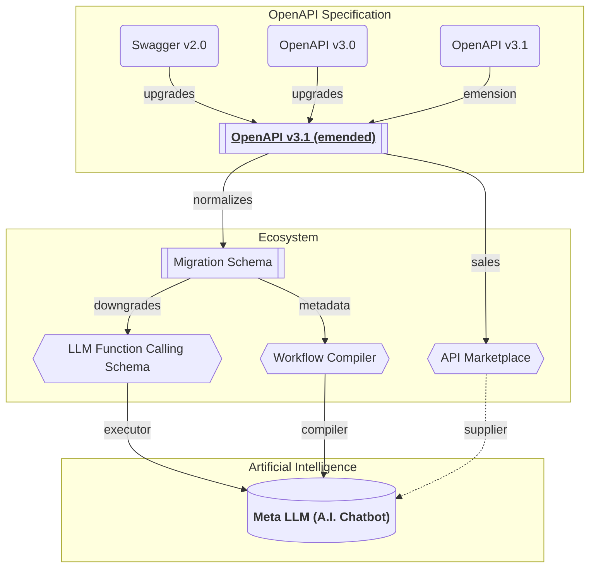
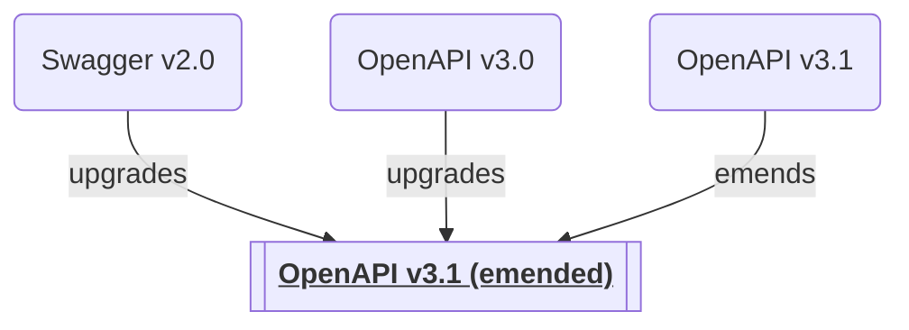

## Everywhere


"Wrtn Studio Pro" is utilizing OpenAPI specifications everywhere.

"Wrtn Studio Pro" is a service providing a [Meta LLM (A.I. Chatbot)](/tech-specs/meta/preface) which can perform various function callings from [API marketplace sales](/tech-specs/marketplace/preface), and an [Workflow Compiler](/tech-specs/workflow/preface) (with [SWL language](/tech-specs/swl/preface)) that automates the Meta LLM scenario as an re-usable and executable program function with visual diagrams.

By the way, "Wrtn Studio Pro" is utilizing OpenAPI specifications for standard schema/operation definitions, so that the OpenAPI specifications are used in every part of the "Wrtn Studio Pro"; LLM function calling, Workflow schema definitions, and API marketplace documentation.

Therefore, if you want to learn the principles of "Wrtn Studio Pro", you have to understand the OpenAPI specifications. Let's start to see how the "Wrtn Studio Pro" defines and utilizes the OpenAPI specifications. Also, if you're planning to participant in "Wrtn Studio Pro" as an API provider, it would better to read the appendix article: [Contract Driven Development](/tech-specs/appendix/cdd).


## Specification


"Wrtn Studio Pro" has adopted OpenAPI v3.1 specifications, but emended it for clarity and consistency.

If user of API marketplace uploads a different version of OpenAPI specifications, "Wrtn Studio Pro" will convert it to the internal "emended 3.1" version of OpenAPI specifications. Below is the list of the OpenAPI specifications including the emended version of ours.

  - [**OpenAPI v3.1 emended**](https://github.com/samchon/openapi/blob/master/src/OpenApi.ts)
  - [OpenAPI v3.1](https://github.com/samchon/openapi/blob/master/src/OpenApiV3_1.ts)
  - [OpenAPI v3.0](https://github.com/samchon/openapi/blob/master/src/OpenApiV3.ts)
  - [Swagger v2.0](https://github.com/samchon/openapi/blob/master/src/SwaggerV2.ts)


## Plugins
"Wrtn Studio Pro" has defined additional OpenAPI plugin properties for special purposes.

For example, `x-wrtn-secret-key` and `x-wrtn-secret-scopes` are plugin properties that indicating the user (or LLM) must assign the secret key value and the secret value must satisfy the scopes to the target `string` typed (`OpenApi.IJsonSchema.IString`) schema value. 

  - [Operation Schema Plugin](https://github.com/wrtnio/synonym/blob/main/src/structures/ISwaggerOperation.ts)
  - [JSON Schema Plugins](https://github.com/wrtnio/synonym/blob/main/src/structures/ISwaggerSchema.ts)

```json filename="examples/json-schema/string-plugin.json" showLineNumbers
{
  "type": "string",
  "x-wrtn-secret-key": "google",
  "x-wrtn-secret-scopes": ["https://mail.google.com/"]
}
```


## Conversion
```typescript filename="src/openapi/converters/assert.ts" showLineNumbers
import { OpenApi, OpenApiV3, OpenApiV3_1, SwaggerV2 } from "@samchon/openapi";
import typia from "typia";

const main = async (): Promise<void> => {
  // GET YOUR OPENAPI DOCUMENT
  const response: Response = await fetch(
    "https://raw.githubusercontent.com/samchon/openapi/master/examples/v3.0/openai.json"
  );
  const document: any = await response.json();

  // TYPE ASSERTION
  typia.assertGuard<
    | OpenApiV3_1.IDocument
    | OpenApiV3.IDocument
    | SwaggerV2.IDocument
  >(document);

  // CONVERT TO EMENDED
  const emended: OpenApi.IDocument = OpenApi.convert(document);
  console.log(emended);
};
main().catch(console.error);
```

> [💻 Playground Link](https://typia.io/playground/?script=JYWwDg9gTgLgBAbzgeTAUwHYEEzADQrra4BqAzAapjsOQPoCMBAygO4CGA5p2lCQExwAvnABmUCCDgAiAAIBndiADGACwgYA9BCLtc0gNwAoUJFhwYAT1zsxEqdKs3DRo8o3z4IdsAxwAvHDs8pYYynAAFACUAFxwAAr2wPJoADwAbhDAACYAfAH5CEZwcJqacADiAKIAKnAAmsgAqgBKKPFVAHJY8QCScAAiyADCTQCyXTXFcO4YnnBQaPKQc2hxLUsrKQFBHMDwomgwahHTJdKqMDBg8jFlUOysAHSc+6oArgBG7ylQszCYGBPdwgTSKFTqLQ6TB6YCabyeXiaNAADyUYAANktNOkyE8AAzaXTAJ4AK3kGmk0yixhKs3m2QgyneIEBcXYGEsO0ePngi2WHjQZIpGGixmmZTgNXqHTgWGYzCqLRqvWQnWmTmA7CewV+MAq73YUGyqTOcAAPoRqKQyIwnr0BkyWYCzZaqMRaHiHU7WRgYK64GwuDw+Px7Y7mb7-SVchFGZHATTXCVJcM1SQlXUasg4FUJp0BlUBtN6fA0L7smhsnF3TRwz7ATta7hgRp0rwYHGG36k3SPBAsU9fKIIBFy5hK9kk0JjN5fNFgexjqoIvSB0LeBIoDSgA)

Manual conversion to "emended OpenAPI v3.1 specification".

When you upload OpenAPI document to the "Wrtn Studio Pro", the uploaded OpenAPI document would be automatically converted to the "emended OpenAPI v3.1 specification". It does not matter whatever your OpenAPI document version is.

By the way, if you want to pre-convert it to the "emended OpenAPI v3.1 specification" manually for testing, you can do it like above example code. Also, by following the above example TypeScript code, you can validate your OpenAPI document before the conversion, too.