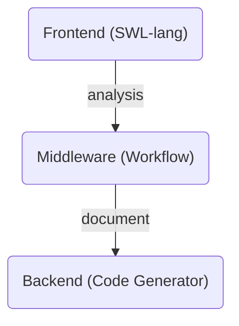

import { Callout } from 'nextra-theme-docs';

## Summary

When you've succeded to complete the workflow document composing, or Meta LLM (A.I. Chatbot) has generated the workflow document by analyzing the LLM function call histories, the workflow document will be delivered to the compiler backend part of the workflow engine. 

The compiler backend of the workflow engine generates TypeScript code. And the typescript code is served by a `Worker` instance, and the main system of the "Wrtn Studio Pro" executes the compiled `Worker` instance with RPC (Remote Procedure Call) protocol.

Also, you can enroll the compiled workflow programs to the API marketplace, so that it is possible to let Meta LLM (A.I. Chatbot) to perform LLM function calling to your workflow programs. It's because "Wrtn Studio Pro" provides the OpenAPI document from the workflow programs.

<Callout type="info">

**What compiler backend is?**

The backend of a compiler plays a crucial role in transforming source code into machine code. A compiler typically consists of three main stages, and the backend is responsible for converting intermediate representations (IR) into final machine code. Here are the key functions and components of the backend:

Intermediate Representation (IR):

The backend uses an intermediate representation generated from the analysis of the source code. IR serves as an abstract form between the source code and machine code, facilitating optimization and code generation.
Optimization:

The backend applies various optimization techniques to enhance the performance of the code. This includes eliminating unnecessary code, loop optimizations, and register allocation optimizations. Optimization helps improve execution speed and reduce memory usage.
Code Generation:

Based on the optimized IR, the backend generates actual machine code. This process involves using the instruction set specific to the CPU architecture to write the final code. It includes tasks such as register allocation, instruction selection, and memory address calculation.
Target Architecture:

The backend generates code tailored to a specific hardware architecture. This can vary based on different CPU architectures (e.g., x86, ARM), requiring different implementations.
Error Handling:

The backend also includes functionality for handling errors that may occur during the code generation process. This encompasses issues like incorrect instruction usage or memory access errors.
The backend is a critical part of the compiler that significantly influences its performance and efficiency, requiring a deep understanding of various optimization techniques and architecture-specific details.

</Callout>

## Code Generator
Transform workflow document to TypeScript code.

## Workflow Executor
RPC (Remote Procedure Call) in Worker.

## OpenAPI Provider
Workflow programs to OpenAPI document.

