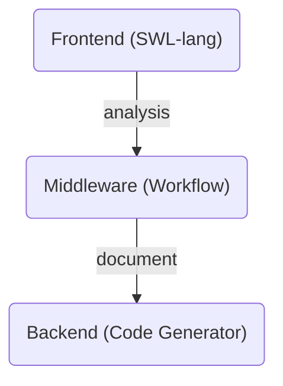

import { Callout, Tabs, Tab } from 'nextra-theme-docs';

## Summary


When you've succeded to complete the workflow document composing, or Meta LLM (A.I. Chatbot) has generated the workflow document by analyzing the LLM function call histories, the workflow document will be delivered to the compiler backend part of the workflow engine. 

The compiler backend of the workflow engine generates TypeScript code. And the typescript code is served by a `Worker` instance, and the main system of the "Wrtn Studio Pro" executes the compiled `Worker` instance with RPC (Remote Procedure Call) protocol.

Also, you can enroll the compiled workflow programs to the API marketplace, so that it is possible to let Meta LLM (A.I. Chatbot) to perform LLM function calling to your workflow programs. It's because "Wrtn Studio Pro" provides the OpenAPI document from the workflow programs.

<Callout type="info">

**What compiler backend is?**

The backend of a compiler plays a crucial role in transforming source code into machine code. A compiler typically consists of three main stages, and the backend is responsible for converting intermediate representations (IR) into final machine code. Here are the key functions and components of the backend:

1. Intermediate Representation (IR):
   - The backend uses an intermediate representation generated from the analysis of the source code. IR serves as an abstract form between the source code and machine code, facilitating optimization and code generation.
2. Optimization:
   - The backend applies various optimization techniques to enhance the performance of the code. This includes eliminating unnecessary code, loop optimizations, and register allocation optimizations. Optimization helps improve execution speed and reduce memory usage.
3. Code Generation:
   - Based on the optimized IR, the backend generates actual machine code. This process involves using the instruction set specific to the CPU architecture to write the final code. It includes tasks such as register allocation, instruction selection, and memory address calculation.
4. Target Architecture:
   - The backend generates code tailored to a specific hardware architecture. This can vary based on different CPU architectures (e.g., x86, ARM), requiring different implementations.
5. Error Handling:
   - The backend also includes functionality for handling errors that may occur during the code generation process. This encompasses issues like incorrect instruction usage or memory access errors.

The backend is a critical part of the compiler that significantly influences its performance and efficiency, requiring a deep understanding of various optimization techniques and architecture-specific details.

</Callout>


## TypeScript Generator
Transform workflow document to TypeScript code.

Compiler backend of the workflow engine generates TypeScript code by converting the workflow statements and their children expressions to the correspond TypeScript statements and expressions. By generating the TypeScript code from the workflow document, the workflow document actual can be an executable program in the JavaScript runtime with `rollup` bundling.

Here is an example workflow document sending an email by using the Gmail connector, and its TypeScript code by the compilation (in the compiler backend side). As you can see, in generated TypeScript code composing the workflow program, the main function of the workflow program (`Workflow.main()`) is asserting the parameter types by `typia.assert()` function. 

And then, the `Workflow.main()` function is calling the connector APIf function, and asserting the result of the API function call too. About the connector API function, it is also generated by the compiler backend including its DTO (Data Transfer Object) types and metadata of the API operation.

<Tabs items={[
    <code>__main__.ts</code>,
    <code>__StudioWorkflow~.ts</code>,
    <code>IStudioWorkflowDebugger.ts</code>,
  ]}>
  <Tab>
```typescript filename="__main__.ts" showLineNumbers
import { IConnection } from '@nestia/fetcher';
import { PlainFetcher } from '@nestia/fetcher/lib/PlainFetcher';
import typia, { tags } from 'typia';
import { WorkerServer } from 'tgrid';

import { __StudioWorkflowDebugger } from './__StudioWorkflowDebugger';
import { __StudioWorkflowGlobal } from './__StudioWorkflowGlobal';
import { __StudioWorkflowUtil } from './__StudioWorkflowUtil';
import { IStudioWorkflowDebugger } from './IStudioWorkflowDebugger';

export namespace Workflow {
  export async function main(
    _param_0: string,
    _param_1: string,
    _param_2: string
  ) {
    typia.assert(_param_0);
    typia.assert(_param_1);
    typia.assert(_param_2);
    const fetcher = __StudioWorkflowUtil.fetch({
      retry: Number(__StudioWorkflowUtil.getEnvironment('FETCH_RETRY_COUNT')),
      limit: Number(__StudioWorkflowUtil.getEnvironment('FETCH_LIMIT_COUNT')),
      debug: true,
    });
    await fetcher({
      statement_id: 'dbfc3a59-14b0-409b-a692-76f4be01e36b',
      task: _namespace_swlmc_builtin.__swager_endpoint_post_connector_gmail_draft,
      connection: {
        host: 'https://studio-connector-poc.dev.wrtn.club',
        options: {
          referrer: __StudioWorkflowGlobal.referrer,
        },
      },
      arguments: [
        {
          to: [_param_0],
          subject: _param_1,
          body: '<html><body>' + _param_2 + '</body></html>',
          secretKey: 'your_secret_key_here',
        },
      ],
    });
    const _call_statement_result_e806c8da_44bb_47da_a311_3ec03b473b84: _namespace_swlmc_builtin.IGmail.ISendMailOutput =
      await fetcher({
        statement_id: 'e806c8da-44bb-47da-a311-3ec03b473b84',
        task: _namespace_swlmc_builtin.__swager_endpoint_post_connector_gmail_send,
        connection: {
          host: 'https://studio-connector-poc.dev.wrtn.club',
          options: {
            referrer: __StudioWorkflowGlobal.referrer,
          },
        },
        arguments: [
          {
            to: [_param_0],
            subject: _param_1,
            body: '<html><body>' + _param_2 + '</body></html>',
            secretKey: await __StudioWorkflowDebugger.listener.sandbox(
              'google'
            ),
          },
        ],
      });
    typia.assert(_call_statement_result_e806c8da_44bb_47da_a311_3ec03b473b84);
  }
}
export namespace _namespace_swlmc_builtin {
  /**
   * GMAIL 전송.
   * 
   * 메일을 전송합니다.
   *
   * 지메일(gmail)은 Google에서 제공하는 무료 웹 기반 이메일 서비스입니다.
   *
   * 이 커넥터는 이메일 보내는 용도이며,
   * 단순 텍스트로 보낼 경우에는 문장이 한 줄로 길게 보여지기 때문에 줄바꿈 문자를 넣어주셔야 합니다.
   * 현재 형식은 content-type으로 `text/html; charset=utf-8`을 사용하고 있습니다.
   * 경우에 따라 html 형식을 사용할 수도 있습니다.
   *
   * @param body 메일을 보내기 위해 필요한 정보.
   * @path connector/gmail/send
   * @nestia Generated by Nestia - https://github.com/samchon/nestia
   */
  export async function __swager_endpoint_post_connector_gmail_send(
    connection: IConnection,
    body: __swager_endpoint_post_connector_gmail_send.Input
  ): Promise<__swager_endpoint_post_connector_gmail_send.Output> {
    return PlainFetcher.fetch(
      {
        ...connection,
        headers: {
          ...connection.headers,
          'Content-Type': 'application/json',
        },
      },
      {
        ...__swager_endpoint_post_connector_gmail_send.METADATA,
        path: __swager_endpoint_post_connector_gmail_send.path(),
        status: null,
      },
      body
    );
  }
  export namespace __swager_endpoint_post_connector_gmail_send {
    export type Input = _namespace_swlmc_builtin.IGmail.ICreateMailInput;
    export type Output = _namespace_swlmc_builtin.IGmail.ISendMailOutput;

    export const METADATA = {
      method: 'POST',
      path: '/connector/gmail/send',
      request: {
        type: 'application/json',
        encrypted: false,
      },
      response: {
        type: 'application/json',
        encrypted: false,
      },
    } as const;

    export const path = () => '/connector/gmail/send';
  }
}
export namespace _namespace_swlmc_builtin {
  export namespace IGmail {
    /**
     * @title 메일 전송 결과
     */
    export type ISendMailOutput = {
      /**
       * 보낸 메일의 id.
       *
       * @title 보낸 메일의 id.
       */
      id: string;
    };
    /**
     * @title 메일을 보내기 위해 필요한 정보
     */
    export type ICreateMailInput = {
      /**
       * 메일을 받는 사람의 이메일 주소.
       *
       * @title 받는 사람 이메일 주소.
       */
      to: string[];
      /**
       * 보낼 메일의 제목.
       *
       * @title 이메일 제목.
       */
      subject: string;
      /**
       * 보낼 메일의 본문.
       *
       * html로 작성해야 합니다. 그렇지 않으면 본문이 제대로 표시되지 않을 수 있습니다.
       *
       * gmail에서 적용가능한 css 형식을 적용해주세요.
       *
       * html 길이가 너무 길지 않게 작성해주세요. 길이가 너무 길면 전송이 되지 않을 수 있습니다.
       *
       * @title 이메일 본문.
       */
      body: string;
      /**
       * 참조할 사람 이메일 주소.
       *
       * @title 참조할 사람 이메일.
       */
      cc?: string[];
      /**
       * 숨은참조할 사람 이메일 주소.
       *
       * @title 숨은참조할 사람 이메일.
       */
      Bcc?: string[];
      /**
       * secret key.
       *
       * @title 인증 정보 선택
       */
      secretKey: string &
        tags.JsonSchemaPlugin<{
          'x-wrtn-secret-key': 'google';
          'x-wrtn-secret-scopes': ['https://mail.google.com/'];
        }>;
    };
  }
}
const main = async () => {
  const worker = new WorkerServer<typeof __StudioWorkflowGlobal, any, any>();
  Object.assign(__StudioWorkflowGlobal, await worker.getHeader());
  __StudioWorkflowDebugger.listener =
    worker.getDriver<IStudioWorkflowDebugger.__IExecutionListener>();
  await worker.open(Workflow);
};
main();
```
  </Tab>
  <Tab>
```typescript filename="__StudioWorkflow~.ts" showLineNumbers
//--------------------------------------------------------------------
// __StudioWorkflowDebugger.ts
//--------------------------------------------------------------------
import { Driver } from "tgrid";

import { IStudioWorkflowDebugger } from "./IStudioWorkflowDebugger";

export const __StudioWorkflowDebugger = {
  listener: null! as Driver<IStudioWorkflowDebugger.__IExecutionListener>,
};

//--------------------------------------------------------------------
// __StudioWorkflowGlobal.ts
//--------------------------------------------------------------------
export const __StudioWorkflowGlobal = {
  environments: {} as Record<string, string>,
  secrets: {} as Record<string, string[]>,
  referrer: undefined as string | undefined,
  metadata: {} as Record<string, any>,
};

//--------------------------------------------------------------------
// __StudioWorkflowUtil.ts
//--------------------------------------------------------------------
import { IConnection } from '@nestia/fetcher';

import { __StudioWorkflowDebugger } from './__StudioWorkflowDebugger';
import { __StudioWorkflowGlobal } from './__StudioWorkflowGlobal';

export namespace __StudioWorkflowUtil {
  export const fetch = (config: {
    retry: number;
    limit: number;
    debug: boolean;
  }) => {
    let count: number = 0;
    return async <Arguments extends any[], Output>(props: {
      statement_id: string;
      task: (connection: IConnection, ...args: Arguments) => Promise<Output>;
      connection: IConnection;
      arguments: Arguments;
    }): Promise<Output> => {
      if (config.debug === true)
        __StudioWorkflowDebugger.listener
          .on({
            statement_id: props.statement_id,
            type: 'call-start',
            arguments: props.arguments,
            time: new Date().toISOString(),
          })
          .catch(() => {});
      if (++count > config.limit)
        throw new Error(`Reached to API function call limit: ${count}.`);

      const execute = async () => {
        const value: Output = await props.task(
          props.connection,
          ...props.arguments
        );
        if (config.debug === true)
          __StudioWorkflowDebugger.listener
            .on({
              statement_id: props.statement_id,
              type: 'call-complete',
              value,
              time: new Date().toISOString(),
            })
            .catch(() => {});
        return value;
      };
      for (let i: number = 1; i < config.retry; ++i)
        try {
          return await execute();
        } catch {
          continue;
        }
      try {
        return await execute();
      } catch (exp) {
        if (config.debug === true)
          __StudioWorkflowDebugger.listener
            .on({
              statement_id: props.statement_id,
              type: 'call-error',
              error: exp,
              time: new Date().toISOString(),
            })
            .catch(() => {});
        throw exp;
      }
    };
  };

  export const getEnvironment = (key: string): string => {
    const value: string | undefined = __StudioWorkflowGlobal.environments[key];
    if (value === undefined)
      throw new Error(
        `Studio system has not confiured the environment variable: (key: ${JSON.stringify(
          key
        )}).`
      );
    return value;
  };

  export const getMetadata = (key: string): any =>
    __StudioWorkflowGlobal.metadata[key];
}
```
  </Tab>
  <Tab>
```typescript filename="IStudioWorkflowDebugger.ts" showLineNumbers
import { tags } from "typia";

/**
 * Collection of workflow debugger interfaces.
 *
 * @author Samchon
 */
export namespace IStudioWorkflowDebugger {
  /**
   * 무언가를 실행한 결과값.
   */
  export type IResult<T> = ISuccess<T> | IFailure;
  export interface ISuccess<T> {
    success: true;
    value: T;
  }
  export interface IFailure {
    success: false;
    error: any;
  }

  // @todo -> add breakpoint features on props and method as real-time
  export interface IExecutor {
    /**
     * 워크플로우를 컴파일한다.
     *
     * 이미 컴파일한 경우, 다시 컴파일하지 않고, 그대로 반환한다.
     */
    compile(): Promise<IResult<undefined>>;

    /**
     * 워크플로우를 실행한다.
     *
     * 대상 {@link IStudioWorkflow 워크플로우} 함수를 디버깅 모드로 실행하며,
     * 워크플로우의 진행 과정을 기 등록한 {@link IListener} 를 통하여 전달받는다.
     *
     * 참고로 {@link execute} 함수는 반복하여 재 실행할 수 있다. 다만, 기 실행한
     * 워크플로우가 아직 진행 중인 상황에서는 그리할 수 없으며, 이 경우에는 에러가
     * 발생한다. 따라서 기 실행한 워크플로우가 있거든, 그것이 끝날 때까지 기다리던가,
     * 아니면 {@link terminate} 함수를 통하여 강제로 중단시키고 다시 실행해야 한다.
     *
     * @param props 함수 실행에 필요한 인자값들
     * @returns 실행 결과값
     */
    execute(props: IExecutor.IProps): Promise<IResult<any>>;

    /**
     * 워크플로우 실행을 중단한다.
     *
     * 대상 {@link IStudioWorkflow 워크플로우}에 대한 {@link execute 실행}을 중단한다.
     *
     * 만일 기존에 실행한 워크플로우 함수가 이미 완료되었거나, 또는 이미 취소한 바
     * 있다면, 이 함수는 에러를 발생시킨다.
     *
     * @returns 중단 결과값
     */
    terminate(): Promise<IResult<undefined>>;
  }
  export namespace IExecutor {
    /**
     * 워크플로우 실행에 필요한 인자값들.
     */
    export interface IProps {
      /**
       * 파라미터 값 리스트.
       */
      arguments: any[];
    }
  }

  /**
   * @internal
   */
  export interface __IExecutionListener extends IListener {
    sandbox(key: string, index?: number): string;
  }

  /**
   * 이벤트 수신기.
   *
   * {@link IExecutor.execute} 함수를 통하여 실행되는 워크플로우의 디버깅 과정을
   * 수신하는 수신기 인터페이스.
   *
   * 프론트 엔드에서 이 인터페이스를 구현함으로써, 워크플로우 실행 과정을 실시간으로
   * 확인할 수 있다.
   */
  export interface IListener {
    /**
     * 이벤트를 수신한다.
     *
     * @param event 이벤트 객체
     */
    on(event: IListener.IEvent): void;
  }
  export namespace IListener {
    export type IEvent =
      | IBranchEvent
      | IBreakEvent
      | ICallCompleteEvent
      | ICallErrorEvent
      | ICallStartEvent
      | IContinueEvent
      | IForEachCompleteEvent
      | IForEachStepEvent
      | IRepeatCompleteEvent
      | IRepeatStepEvent
      | IReturnEvent
      | ISetEvent
      | IWhileCompleteEvent
      | IWhileStepEvent;
    export interface IBranchEvent extends IEventBase<"branch"> {
      condition: boolean;
    }
    export interface IBreakEvent extends IEventBase<"break"> {}
    export interface ICallStartEvent extends IEventBase<"call-start"> {
      arguments: unknown[];
    }
    export interface ICallCompleteEvent extends IEventBase<"call-complete"> {
      value: any;
    }
    export interface ICallErrorEvent extends IEventBase<"call-error"> {
      error: unknown;
    }
    export interface IContinueEvent extends IEventBase<"continue"> {}
    export interface IForEachStepEvent extends IEventBase<"for-each-step"> {
      i: number;
      length: number | undefined;
    }
    export interface IForEachCompleteEvent
      extends IEventBase<"for-each-complete"> {}
    export interface IRepeatStepEvent extends IEventBase<"repeat-step"> {
      i: number;
      length: number;
    }
    export interface IRepeatCompleteEvent
      extends IEventBase<"repeat-complete"> {}
    export interface IReturnEvent extends IEventBase<"return"> {
      value: unknown;
    }
    export interface ISetEvent extends IEventBase<"set"> {
      value: unknown;
    }
    export interface IWhileStepEvent extends IEventBase<"while-step"> {
      i: number;
    }
    export interface IWhileCompleteEvent extends IEventBase<"while-complete"> {}

    interface IEventBase<Type extends string> {
      type: Type;
      statement_id: string;
      time: string & tags.Format<"date-time">;
    }
  }
}
```
  </Tab>
</Tabs>


## Workflow Executor
RPC (Remote Procedure Call) in Worker.

If you look at the example TypeScript code generated from the workflow document again, you may find that the workflow program is running on an `Worker` instance by creating the [`WorkerServer`](https://tgrid.com/docs/features/worker/) instance. Also, the [`WorkerServer`](https://tgrid.com/docs/features/worker/) is opening itself with the `Workflow` namespace for the client application (master application/thread). 

The `Workflow` instance would be provided to the master thread of the "Wrtn Studio Pro", and the master application/thread of the "Wrtn Studio Pro" will remotely call the `Workflow.main()` function through the RPC (Remote Procedure Call) protocol, just like [WebSocket RPC](/tech-specs/meta/websocket/) did.

For reference, the master application does not mean only backend system of the "Wrtn Studio Pro". The actual client/frontend application can be the master application too, so that the workflow program can be executed in the client application's runtime environment. The client application will open an `Worker` instance and remotely call the `Workflow.main()` function through the RPC (Remote Procedure Call) protocol.

  - References
    - [Remote Procedure Call](https://tgrid.com/docs/remote-procedure-call/)
    - [Features > RPC Components](https://tgrid.com/docs/features/components/)
    - [Features > Worker Protocol](https://tgrid.com/docs/features/worker/)

```typescript filename="__main__.ts" showLineNumbers
import { IConnection } from '@nestia/fetcher';
import { PlainFetcher } from '@nestia/fetcher/lib/PlainFetcher';
import typia, { tags } from 'typia';
import { WorkerServer } from 'tgrid';

import { __StudioWorkflowDebugger } from './__StudioWorkflowDebugger';
import { __StudioWorkflowGlobal } from './__StudioWorkflowGlobal';
import { __StudioWorkflowUtil } from './__StudioWorkflowUtil';
import { IStudioWorkflowDebugger } from './IStudioWorkflowDebugger';

namespace Workflow {
  export async function main(
    _param_0: string,
    _param_1: string,
    _param_2: string
  ): Promise<void>;
}

const main = async () => {
  const worker = new WorkerServer<typeof __StudioWorkflowGlobal, any, any>();
  Object.assign(__StudioWorkflowGlobal, await worker.getHeader());
  __StudioWorkflowDebugger.listener =
    worker.getDriver<IStudioWorkflowDebugger.__IExecutionListener>();
  await worker.open(Workflow);
};
```


## OpenAPI Provider
Workflow programs to OpenAPI document.

You can register your workflow programs to the [API marketplace](/tech-specs/marketplace/preface) which is following the [OpenAPI specification](/tech-specs/openapi/preface). It's because "Wrtn Studio Pro" supports the OpenAPI document generation from the workflow programs, actually serving them through a RestAPI operation with specific URL (path) pattern.

In means that, you can let [Meta LLM (A.I. Chatbot)](/tech-specs/meta/preface) to perform LLM function calling to your workflow programs. The story is still valid even if you've registered workflow programs are borned from the Meta LLM with [SWL language](/tech-specs/swl/preface). 