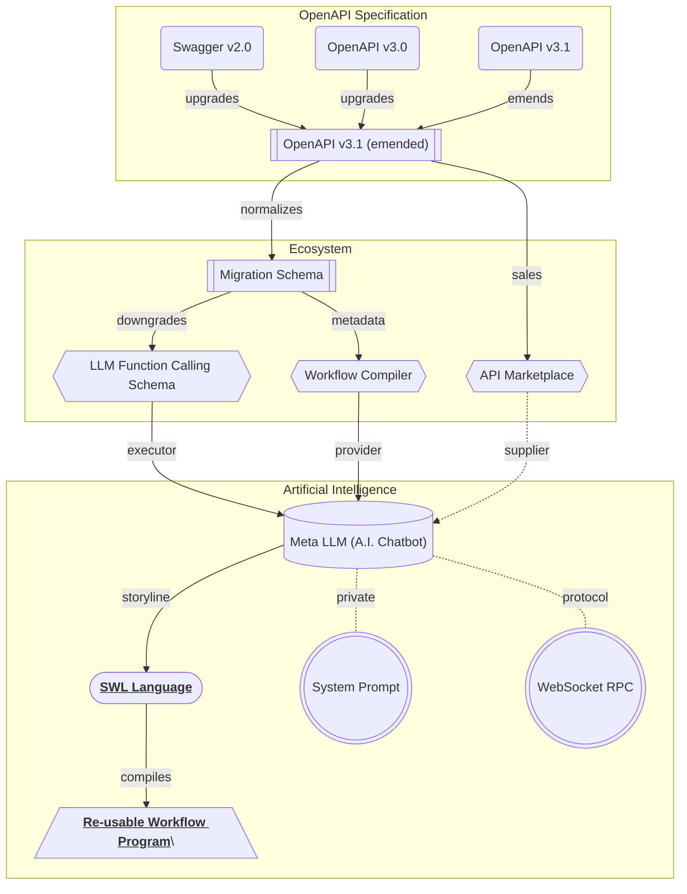

## Workflow Engine

Workflow engine for re-usable program generation.

"Wrtn Studio Pro" provides an "Workflow Engine" which can build a re-usable program function. The workflow can be generated by two ways. The first is analyzing the user's utternance and LLM function call histories in the [Meta LLM (A.I. Chatbot)](/tech-specs/meta/preface) and constructs the workflow by [SWL Language](/tech-specs/swl/preface). The second way is using the [Workflow Editor](/tech-specs/workflow/editor) manually which can build the workflow with visual diagrams. Of course, generating workflow by the first way and updating it by the second way is also possible.

When you've succeded to build a workflow program (function), you can execute it in two ways. The first way is to executing the workflow program manually by configuring the parameter values by yourself. The other way is to registering the to a scheduler, so that the workflow program can be executed automatically at the scheduled time by the system.

For reference, the workflow program also belongs to the ecosystem of the "Wrtn Studio Pro". The workflow program can be re-executed by the [Meta LLM (A.I. Chatbot)](/tech-specs/meta/preface) with LLM function calling. If you enroll your workflow program to the [API Marketplace](/tech-specs/marketplace/preface), the workflow program can be re-used by the many other users.

## Workflow Schema

Compiler + Repository.

"Workflow Engine" is a type of compiler which generates a re-usable program function. And the workflow document must be archived into somewhere repository of some account. Therefore, workflow schemas are categorized into three parts; compiler, repository and belonged account.

At first, the compiler category schemas are represented by AST (Abstract Syntax Tree). The AST is a tree representation of the abstract syntactic structure of source code written in a programming language. The AST is used in the compiler backend to generate the executable program function.

At second, account and repository categorized schemas are similar to the Github account/repository structures. The account schema is literally an account innformation of user or enterprise, and the repository schema is a storage for the workflow documents including commit histories for version control.

## Compiler Backend
Build executable program from workflow document.

When you've built an workflow document by manually or [Meta LLM (A.I. Chatbot)](/tech-specs/meta/preface), compiler backend of "Workflow Engine" transforms the workflow document into an executable program function. The compiler backend is a kind of interpreter which reads the workflow document and generates the program function.

The result of the compilation is a TypeScript/JavaScript source code, and it is mounted on an `Worker` instance. When you (or scheduler) call the workflow program function, it would be called by the RPC (Remote Procedure Call) protocol.

If you've published the workflow program to the [API Marketplace](/tech-specs/marketplace/preface), the workflow program would be wrapped into an API endpoint of [OpenAPI specification](/tech-specs/openapi/preface). Therefore, the workflow program can be called by the HTTP protocol as well.

## Workflow Editor

"Workflow Engine" is a type of visual compiler.

## JSON Schema Renderer
UI components based on JSON schema.