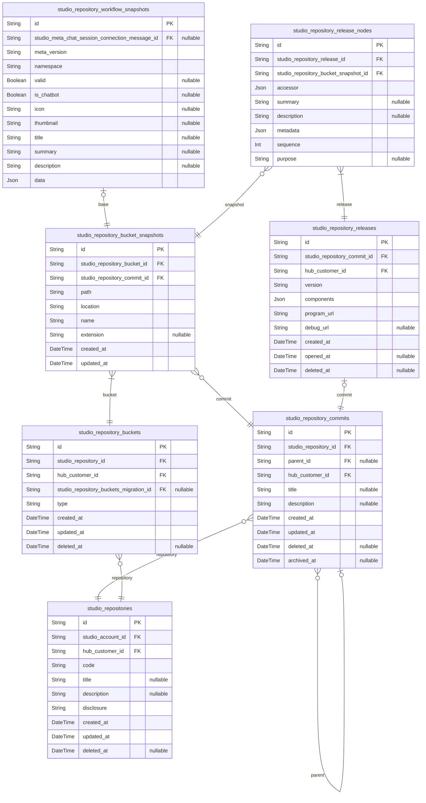

## Workflow
  - [`IStudioWorkflow`](https://wrtn.ai/studio-pro/api/interfaces/structures_studio_workflows_IStudioWorkflow.IStudioWorkflow-1.html)
  - [`IStudioWorkflowData`](https://wrtn.ai/studio-pro/api/interfaces/structures_studio_workflows_IStudioWorkflowData.IStudioWorkflowData-1.html)
  - [`IStudioWorkflowParameter`](https://wrtn.ai/studio-pro/api/interfaces/structures_studio_workflows_IStudioWorkflowParameter.IStudioWorkflowParameter.html)
  - [`IStudioWorkflowSwagger`](https://wrtn.ai/studio-pro/api/types/structures_studio_workflows_connectors_IStudioWorkflowSwagger.IStudioWorkflowSwagger-1.html)

## Statements
  - [`IStudioWorkflowBlockStatement`](https://wrtn.ai/studio-pro/api/interfaces/structures_studio_workflows_nodes_IStudioWorkflowBlockStatement.IStudioWorkflowBlockStatement.html)
  - [`IStudioWorkflowBranchStatement`](https://wrtn.ai/studio-pro/api/interfaces/structures_studio_workflows_nodes_IStudioWorkflowBranchStatement.IStudioWorkflowBranchStatement.html)
  - [`IStudioWorkflowCallStatement`](https://wrtn.ai/studio-pro/api/interfaces/structures_studio_workflows_nodes_IStudioWorkflowCallStatement.IStudioWorkflowCallStatement-1.html)
  - [`IStudioWorkflowSetStatement`](https://wrtn.ai/studio-pro/api/interfaces/structures_studio_workflows_nodes_IStudioWorkflowSetStatement.IStudioWorkflowSetStatement.html)
  - [`IStudioWorkflowForEachStatement`](https://wrtn.ai/studio-pro/api/interfaces/structures_studio_workflows_nodes_IStudioWorkflowForEachStatement.IStudioWorkflowForEachStatement.html)
  - [`IStudioWorkflowWhileStatement`](https://wrtn.ai/studio-pro/api/interfaces/structures_studio_workflows_nodes_IStudioWorkflowWhileStatement.IStudioWorkflowWhileStatement.html)
  - [`IStudioWorkflowRepeatStatement`](https://wrtn.ai/studio-pro/api/interfaces/structures_studio_workflows_nodes_IStudioWorkflowRepeatStatement.IStudioWorkflowRepeatStatement.html)
  - [`IStudioWorkflowReturnStatement`](https://wrtn.ai/studio-pro/api/interfaces/structures_studio_workflows_nodes_IStudioWorkflowReturnStatement.IStudioWorkflowReturnStatement.html)
  - [`IStudioWorkflowSetReturnValueStatement`](https://wrtn.ai/studio-pro/api/interfaces/structures_studio_workflows_nodes_IStudioWorkflowSetReturnValueStatement.IStudioWorkflowSetReturnValueStatement.html)
  - [`IStudioWorkflowBreakStatement`](https://wrtn.ai/studio-pro/api/interfaces/structures_studio_workflows_nodes_IStudioWorkflowBreakStatement.IStudioWorkflowBreakStatement.html)
  - [`IStudioWorkflowContinueStatement`](https://wrtn.ai/studio-pro/api/interfaces/structures_studio_workflows_nodes_IStudioWorkflowContinueStatement.IStudioWorkflowContinueStatement.html)

## Expressions
  - [`IAstArrayLiteralExpression`](https://wrtn.ai/studio-pro/api/interfaces/structures_ast_expressions_IAstArrayLiteralExpression.IAstArrayLiteralExpression.html)
  - [`IAstBinaryExpression`](https://wrtn.ai/studio-pro/api/interfaces/structures_ast_expressions_IAstBinaryExpression.IAstBinaryExpression-1.html)
  - [`IAstCallExpression`](https://wrtn.ai/studio-pro/api/interfaces/structures_ast_expressions_IAstCallExpression.IAstCallExpression.html)
  - [`IAstConditionalExpression`](https://wrtn.ai/studio-pro/api/interfaces/structures_ast_expressions_IAstConditionalExpression.IAstConditionalExpression.html)
  - [`IAstElementAccessExpression`](https://wrtn.ai/studio-pro/api/interfaces/structures_ast_expressions_IAstElementAccessExpression.IAstElementAccessExpression.html)
  - [`IAstNonNullExpression`](https://wrtn.ai/studio-pro/api/interfaces/structures_ast_expressions_IAstNonNullExpression.IAstNonNullExpression.html)
  - [`IAstObjectLiteralExpression`](https://wrtn.ai/studio-pro/api/interfaces/structures_ast_expressions_IAstObjectLiteralExpression.IAstObjectLiteralExpression.html)
  - [`IAstParenthesizedExpression`](https://wrtn.ai/studio-pro/api/interfaces/structures_ast_expressions_IAstParenthesizedExpression.IAstParenthesizedExpression.html)
  - [`IAstPrefixUnaryExpression`](https://wrtn.ai/studio-pro/api/interfaces/structures_ast_expressions_IAstPrefixUnaryExpression.IAstPrefixUnaryExpression-1.html)
  - [`IAstPostfixUnaryExpression`](https://wrtn.ai/studio-pro/api/interfaces/structures_ast_expressions_IAstPostfixUnaryExpression.IAstPostfixUnaryExpression-1.html)
  - [`IAstPropertyAccessExpression`](https://wrtn.ai/studio-pro/api/interfaces/structures_ast_expressions_IAstPropertyAccessExpression.IAstPropertyAccessExpression.html)
  - [`IAstSpreadElementExpression`](https://wrtn.ai/studio-pro/api/interfaces/structures_ast_expressions_IAstSpreadElementExpression.IAstSpreadElementExpression.html)
  - [`IAstTemplateExpression`](https://wrtn.ai/studio-pro/api/interfaces/structures_ast_expressions_IAstTemplateExpression.IAstTemplateExpression.html)
  - [`IAstIdentifier`](https://wrtn.ai/studio-pro/api/interfaces/structures_ast_composite_IAstIdentifier.IAstIdentifier.html)
  - [`IAstTrueLiteral`](https://wrtn.ai/studio-pro/api/interfaces/structures_ast_composite_IAstTrueLiteral.IAstTrueLiteral.html)
  - [`IAstFalseLiteral`](https://wrtn.ai/studio-pro/api/interfaces/structures_ast_composite_IAstFalseLiteral.IAstFalseLiteral.html)
  - [`IAstNumericLiteral`](https://wrtn.ai/studio-pro/api/interfaces/structures_ast_composite_IAstNumericLiteral.IAstNumericLiteral.html)
  - [`IAstNoSubstitutionTemplateLiteral`](https://wrtn.ai/studio-pro/api/interfaces/structures_ast_composite_IAstNoSubstitutionTemplateLiteral.IAstNoSubstitutionTemplateLiteral.html)
  - [`IAstStringLiteral`](https://wrtn.ai/studio-pro/api/interfaces/structures_ast_composite_IAstStringLiteral.IAstStringLiteral.html)
  - [`IAstNullLiteral`](https://wrtn.ai/studio-pro/api/interfaces/structures_ast_composite_IAstNullLiteral.IAstNullLiteral.html)
  - [`IAstArrayFilterExpression`](https://wrtn.ai/studio-pro/api/interfaces/structures_ast_expressions_IAstArrayFilterExpression.IAstArrayFilterExpression.html)
  - [`IAstArrayFlatExpression`](https://wrtn.ai/studio-pro/api/interfaces/structures_ast_expressions_IAstArrayFlatExpression.IAstArrayFlatExpression.html)
  - [`IAstArrayFunctionParameterIdentifier`](https://wrtn.ai/studio-pro/api/interfaces/structures_ast_composite_IAstArrayFunctionParameterIdentifier.IAstArrayFunctionParameterIdentifier.html)
  - [`IAstArrayFunctionIndexIdentifier`](https://wrtn.ai/studio-pro/api/interfaces/structures_ast_composite_IAstArrayFunctionIndexIdentifier.IAstArrayFunctionIndexIdentifier.html)
  - [`IAstArrayMapExpression`](https://wrtn.ai/studio-pro/api/interfaces/structures_ast_expressions_IAstArrayMapExpression.IAstArrayMapExpression.html)
  - [`IAstObjectFlatExpression`](https://wrtn.ai/studio-pro/api/interfaces/structures_ast_expressions_IAstObjectFlatExpression.IAstObjectFlatExpression.html)
  - [`IAstObjectEntriesExpression`](https://wrtn.ai/studio-pro/api/interfaces/structures_ast_expressions_IAstObjectEntriesExpression.IAstObjectEntriesExpression.html)
  - [`IAstWorkflowParameterIdentifier`](https://wrtn.ai/studio-pro/api/interfaces/structures_ast_composite_IAstWorkflowParameterIdentifier.IAstWorkflowParameterIdentifier.html)
  - [`IAstWorkflowVariableIdentifier`](https://wrtn.ai/studio-pro/api/interfaces/structures_ast_composite_IAstWorkflowVariableIdentifier.IAstWorkflowVariableIdentifier.html)
  - [`IAstWorkflowCallStatementResultIdentifier`](https://wrtn.ai/studio-pro/api/interfaces/structures_ast_composite_IAstWorkflowCallStatementResultIdentifier.IAstWorkflowCallStatementResultIdentifier.html)
  - [`IAstWorkflowEnvironmentVariableIdentifier`](https://wrtn.ai/studio-pro/api/interfaces/structures_ast_composite_IAstWorkflowEnvironmentVariableIdentifier.IAstWorkflowEnvironmentVariableIdentifier.html)
  - [`IAstWorkflowLoopStatementElementIdentifier`](https://wrtn.ai/studio-pro/api/interfaces/structures_ast_composite_IAstWorkflowLoopStatementElementIdentifier.IAstWorkflowLoopStatementElementIdentifier.html)
  - [`IAstWorkflowLoopStatementResultIdentifier`](https://wrtn.ai/studio-pro/api/interfaces/structures_ast_composite_IAstWorkflowLoopStatementResultIdentifier.IAstWorkflowLoopStatementResultIdentifier.html)
  - [`IAstWorkflowSecretIdentifier`](https://wrtn.ai/studio-pro/api/interfaces/structures_ast_composite_IAstWorkflowSecretIdentifier.IAstWorkflowSecretIdentifier.html)
  - [`IAstWorkflowMetadataIdentifier`](https://wrtn.ai/studio-pro/api/interfaces/structures_ast_composite_IAstWorkflowMetadataIdentifier.IAstWorkflowMetadataIdentifier.html)

## Repository Schema


### `studio_repositories`
스튜디오 저장소.

`studio_repositories` 는 스튜디오 시스템 내 개별 저장소를 형상화한 엔티티로써,
온라인 서비스 상 깃허브의 저장소 같은 개념이다. 그리고 물리적으로는
디스크 드라이브에 비유될 수 있는 개념이다.

그리고 저장소는 특정 [계정](#studio_accounts)에 귀속되며, 각각의 저장소를
소유한 계정주는 [회원](#hub_members)일 수도 있고,
[기업](#studio_enterprises)일 수도 있다. 더하여, 저장소를 생성한 계정주는
그 자신 외에도, 저장소의 [접근 권한 제어](#studio_repository_accesses)를
통하여, 동료 [회원](#hub_members)이나
[팀원](#studio_enterprise_teams)들과 해당 저장소를 함께 사용할 수 있다.

**Properties**
  - `id`: Primary Key.
  - `studio_account_id`: 귀속 계정의 [studio_accounts.id](#studio_accounts)
  - `hub_customer_id`: 저장소를 생성한 최초 고객의 [hub_customers.id](#hub_customers)
  - `code`
    > 식별자 코드.
    > 
    > 서비스 상 저장소 URL 주소의 일부 경로에 해당하는 부분.
  - `title`: 저장소 제목
  - `description`: 저장소에 대한 상세 설명
  - `disclosure`
    > 저장소의 공개 수준.
    > 
    > - `public`: 모든 회원이 열람 가능한 공개 저장소.
    > - `protected`: 직원들만 열람 가능한 보호 저장소.
    > - `private`: 권한을 부여받은 이들만 열람 가능한 비공개 저장소.
  - `created_at`: 저장소 생성 일시.
  - `updated_at`: 저장소 편집 일시.
  - `deleted_at`: 저장소 삭제 일시.

### `studio_repository_commits`
저장소의 커밋 정보.

[저장소](#studio_repositories)를 구성하는 각각의
[버킷](#studio_repository_buckets)들을 편집하고, 그 이력을 기록하는 행위를
커밋이라고 한다. 그리고 `studio_repository_commits` 는 저장소에
[쓰기 권한](#studio_repository_accesses)을 가진
[고객](#hub_customers)이 행한 커밋 행위를 형상화한 엔티티이다.

즉 본 커밋 레코드가 하나 생성되었다는 것은, 최소 한 개 이상의 버킷이 수정되었고,
그리하여 그들에 대한 [스냅샷 레코드](#studio_repository_bucket_snapshots)들이
새로이 생성되었다는 것을 뜻한다.

단 커밋을 발행하였다하여, 그것이 곧 커밋의 완결을 뜻하는 것은 아니다. 커밋은
그것의 기록 확정 일시를 뜻하는 `archived_at` 속성이 `null` 인 경우에는
버킷들을 계속 수정할 수 있으며, 심지어 현재 수정 중인 커밋을 취소하고 삭제할
수도 있다.

**Properties**
  - `id`: Primary Key.
  - `studio_repository_id`: 귀속 저장소의 [studio_repositories.id](#studio_repositories)
  - `parent_id`: 부모 커밋의 [id](#studio_repository_commits)
  - `hub_customer_id`: 커밋을 푸시한 고객의 [hub_customers.id](#hub_customers)
  - `title`: 커밋의 제목.
  - `description`: 커밋에 대한 설명 서술부.
  - `created_at`: 레코드 생성 일시.
  - `updated_at`: 레코드 수정 일시.
  - `deleted_at`: 레코드 삭제 일시.
  - `archived_at`
    > 커밋 기록 확정 일시.
    > 
    > 커밋의 모든 변경사항을 서버에 기록함으로써, 이를 확정하고 완결짓는다.
    > 
    > 커밋을 기록한 이후로는, 일절 수정 및 삭제가 불가능하다.

### `studio_repository_buckets`
저장소 내 버킷 정보.

`studio_repository_buckets` 는 저장소 내 존재하는 버킷을 형상화한 것으로써,
여기서 말하는 버킷이란 곧, 저장소 내에 배치되는 다양한 폴더 및 파일들을 뜻한다.

그리고 버킷은 최초 생성시, 그리고 그것을 수정하거나 경로를 변경할 때마다, 그
내역을 모두 [스냅샷](#studio_repository_bucket_snapshots)이라는 단위로
저장하여 이를 추적한다. 때문에 버킷의 주 정보 또한 하위
[studio_repository_bucket_snapshots](#studio_repository_bucket_snapshots) 엔티티에 기록되어, 실제로
파일명이나 확장자 및 배치 폴더, 그리고 주 컨텐츠 등의 속성이 모두 스냅샷에
속한다. 또한, 이러한 버킷의 수정은 모두
[커밋](#studio_repository_commits)이라는 단위에 묶여, 한 번에 이루어진다.

또한 여기서 말하는 파일이란, 일반적인 파일 뿐 아니라,
[워크플로우 문서](#studio_repository_bucket_snapshots) 등 특수목적용
파일도 함께 포함된다. 다만 이들에 대한 세부 서브타입 역시, 본 엔티티가 아닌
하위 [studio_repository_bucket_snapshots](#studio_repository_bucket_snapshots) 엔티티로부터 파생된다.

**Properties**
  - `id`: Primary Key.
  - `studio_repository_id`: 귀속 저장소의 [studio_repositories.id](#studio_repositories)
  - `hub_customer_id`: 버킷을 생성한 고객의 [hub_customers.id](#hub_customers)
  - `studio_repository_buckets_migration_id`: Studio1.0 마이그레이션 테이블의 [studio_repository_buckets_migration.id](#studio_repository_buckets_migration)
  - `type`
    > 파일의 유형.
    > 
    > 파일의 타입에 관하여 discriminator 역할을 수행하는 속성이다.
    > 
    > - directory: 디렉터리
    > - file: 일반적인 파일, 커넥터용 TS 소스 파일들도 포함됨
    > - workflow: 워크플로우 문서
  - `created_at`: 레코드 생성 일시.
  - `updated_at`: 레코드 수정 일시.
  - `deleted_at`: 레코드 삭제 일시.

### `studio_repository_bucket_snapshots`
버킷의 스냅샷 정보.

`studio_repository_bucket_snapshots` 는 저장소 내 버킷의 스냅샷을 형상화한
엔티티로써, [고객](#hub_customers)이 [저장소](#studio_repositories)에
[버킷](#studio_repository_buckets)을 새로이 생성하거나 혹은 편집을 가할
때마다 생성된다.

물론, 버킷의 생성 및 수정 등 스냅샷이 변경되는 사건은 개개별별 독립적으로
이루어지는 게 아니라, [커밋](#studio_repository_commits) 단위에 묶여 한번에
이루어진다.

또한 버킷이 그러하였듯, 스냅샷 또한 그 종류에 따라 하위 서브타입들을 가진다.

- [studio_repository_file_snapshots](#studio_repository_file_snapshots): 일반 파일
- [studio_repository_workflow_snapshots](#studio_repository_workflow_snapshots): 워크플로우 문서 파일
- 폴더는 별도 서브타입 레코드 없음

**Properties**
  - `id`: Primary Key.
  - `studio_repository_bucket_id`: 귀속 버킷의 [studio_repository_buckets.id](#studio_repository_buckets)
  - `studio_repository_commit_id`: 귀속 커밋의 [studio_repository_commits.id](#studio_repository_commits)
  - `path`: 버킷의 전체 경로.
  - `location`
    > 버킷의 폴더상 경로.
    > 
    > 참고로 여기서 말하는 폴더상 경로는, 파일의 이름 및 확장자를 제외한 것을 뜻한다.
    > 
    > "foo/bar/baz.tz" 라는 파일이 있다면, 이 중 location 값은 "foo/bar" 인 것.
  - `name`
    > 파일의 이름.
    > 
    > `LICENSE` 와 같이, 파일명을 생략하는 파일의 경우에는 `""` 값 할당.
  - `extension`
    > 파일의 확장자.
    > 
    > `LICENSE` 와 같이, 확장자를 생략하는 파일의 경우에는 `null` 값 할당.
    > 
    > 물론 버킷의 타입이 디렉터리인 경우 또한 그러하다.
  - `created_at`: 레코드 생성 일시.
  - `updated_at`: 레코드 수정 일시.

### `studio_repository_workflow_snapshots`
워크플로우 문서의 스냅샷 레코드.

`studio_repository_workflow_snapshots` 는 워크플로우 문서 파일의 스냅샷을
형상화한 엔티티로써, [studio](#studio) 의 서브타입이다. 문자 그대로 워크플로우
문서의 편집 내역을 기록하여, 워크플로우 문서 파일이 새로이 생성되거나 혹은 수정을
가할 때마다 생성된다.

물론, 워크플로우 문서 파일의 생성 및 수정 등 스냅샷이 변경되는 사건은 개개별별
독립적으로 이루어지는 게 아니라, [커밋](#studio_repository_commits) 단위에
묶여 한 번에 이루어진다.

**Properties**
  - `id`: Primary Key.
  - `studio_meta_chat_session_connection_message_id`
    > 귀속 Meta LLM 채팅 세션 메시지의 [studio_meta_chat_session_connections.id](#studio_meta_chat_session_connections)
    > 
    > 만일 본 워크플로우가 Meta LLM 채팅으로부터 비롯된 것이라면, 해당 
    > [채팅 세션](#studio_meta_chat_sessions)에서 워크플로우를 구성한 
    > [메시지의 ID](#studio_meta_chat_session_connection_messages) 를
    > 기록해주도록 한다.
  - `meta_version`
    > 메타데이터 버전.
    > 
    > 사용자가 정의한 스냅샷의 식별 버전이 아니다. 워크플로우 문서의 자료구조에
    > 대한 버전으로써, 뤼튼의 Studio 시스템이 직접 관리하는 단위.
    > 
    > 다만, Studio 프로젝트가 업그레이드되면서, 구 버전의 워크플로우 문서들도
    > 스케쥴러가 일괄 최신 버전으로 업데이트 해 주기에, 클라이언트 개발자는
    > 이 버전을 굳이 신경 쓸 필요가 없다.
  - `namespace`: 워크플로우 네임스페이스 식별자.
  - `valid`
    > 유효성 여부.
    > 
    > 워크플로우가 실행 가능한 지 여부를 나타낸다.
    > 
    > 최소 compile 이나 execute 함수를 실행해야 그 유효성을 확인할 수 있으며,
    > 그 전까지 본 속성의 값은 `null` 이다.
    > 
    > 물론, 릴리즈된 워크플로우라면, 이 값은 무조건 `true` 일 수 밖에 없다.
  - `is_chatbot`: 챗봇을 위한 워크플로우인지 여부.
  - `icon`: 워크플로우 대표 아이콘 URL.
  - `thumbnail`
    > 워크플로우 썸네일 이미지.
    > 
    > 워크플로우 에디터 상 미니맵 혹은 축소 버전 이미지에 해당한다.
  - `title`: 워크플로우 제목.
  - `summary`: 워크플로우 함수에 대한 요약 설명.
  - `description`: 워크플로우 함수에 대한 상세 설명.
  - `data`
    > 문서 데이터.
    > 
    > DTO 상 `IStudioWorkflowData.ICreate` 타입에 해당.

### `studio_repository_releases`
저장소로부터의 배포 프로그램 정보.

`studio_repository_releases` 는 [저장소](#studio_repositories)에서
특징 [커밋](#hub_repository_commits)을 대상으로 배포한 프로그램을
형상화한 엔티티이다.

따라서 본 `studio_repository_releases` 엔티티에는 저장소를 구성하는 각
파일 버킷의 노드 중, [고객](#hub_customers)이 선택한 요소들을 기점으로
하여 [studio_repository_release_nodes](#studio_repository_release_nodes) 레코드들이 구성된다. 그리고
이들에 대한 메타데이터 (타입) 정보와 함께, 컴파일 및 번들링된 결과물이
저장된다.

이들을 널리 배포하는 것이 바로 릴리즈인 것.

**Properties**
  - `id`: Primary Key.
  - `studio_repository_commit_id`: 배포 대상 커밋의 [studio_repository_commits.id](#studio_repository_commits)
  - `hub_customer_id`: 배포를 실시한 고객의 [hub_customers.id](#hub_customers)
  - `version`: 배포 버전.
  - `components`
    > JSON 스키마 컴포넌트.
    > 
    > 네임드 타입들의 집합.
  - `program_url`
    > 프로그램의 URL 주소.
    > 
    > 현재 구조에서는 프로그램에 해당하는 script가 저장되어있는 s3 uri 주소.
  - `debug_url`: 디버깅 프로그램의 URL 주소.
  - `created_at`: 레코드 생성 일시.
  - `opened_at`: 배포 개시 일시.
  - `deleted_at`: 레코드 삭제 일시.

### `studio_repository_release_nodes`
저장소 배포 프로그램을 구성하는 개별 노드.

`studio_repository_release_nodes` 는 저장소에서 배포한 프로그램 내,
사용자가 지정하여 배출 (`export`) 한 프로그래밍 노드들을 형상화한 엔티티이다.

참고로 배출 가능한 노드의 종류로는 사용자 정의 함수와, 워크플로우 문서가 있다.
물론 [워크플로우 문서](#studio_repository_workflow_snapshots) 또한 
빌드 결과물이 단일 함수로 귀결되기에, 결국 노드란 곧 본 저장소로부터 배출된
재사용 가능한 함수를 뜻한다.

또한, 배출된 노드는 각각이 고유한 Rest API 상 endpoint 를 가진다. 따라서
저장소의 각 노드는 다른 프로그램에서 `import` 하여 사용할 수도 있지만,
Rest API 를 통하여 외부에서 호출하는 것도 가능하다. 그리고 이를
Generative Hub 의 [매물](#hub_sales)로 등록, 판매하는 것도 가능하다.

**Properties**
  - `id`: Primary Key.
  - `studio_repository_release_id`: 귀속 릴리즈 레코드의 [studio_repository_releases.id](#studio_repository_releases)
  - `studio_repository_bucket_snapshot_id`: 대상 버킷 스냅샷의 [studio_repository_buckets.id](#studio_repository_buckets)
  - `accessor`
    > 대상 함수에의 접근자.
    > 
    > 노드가 대상으로 하는 객체의 접근자를 `IAstExpression` 타입으로 표현한 것.
    > 
    > 가령 대상 객체(함수)의 이름이 "compute" 인데, 해당 파일로부터 최상위
    > 스코프에서 바로 export 된 것이라면, 그 타입은 `IAstIdentifier 가 된다.
    > 반대로 re-export 되었거나 혹은 특정 namespace 로부터 export 되었다면,
    > 그 때는 `IAstPropertyAccessExpression` 이 되거나 하는 식이다.
    > 
    > ```typescript
    > { type: "Identifier", text: "compute" }
    > {
    > type: "PropertyAccessExpression",
    > expression: { type: "Identifier", text: "Mathmatics" },
    > questionDotToken: null,
    > name: { type: "Identifier", text: "compute" },
    > }
    > ```
  - `summary`: 요약 설명문.
  - `description`: 상세 설명문.
  - `metadata`
    > 메타데이터 정보.
    > 
    > 대상 노드가 함수인 경우에는 파라미터와 리턴 타입 등의 정보가 담긴다.
    > 
    > 자세한 내용은 관련 DTO 를 참고할 것.
  - `sequence`: 귀속 릴리즈 내 배치 순서.
  - `purpose`: 추출 목적