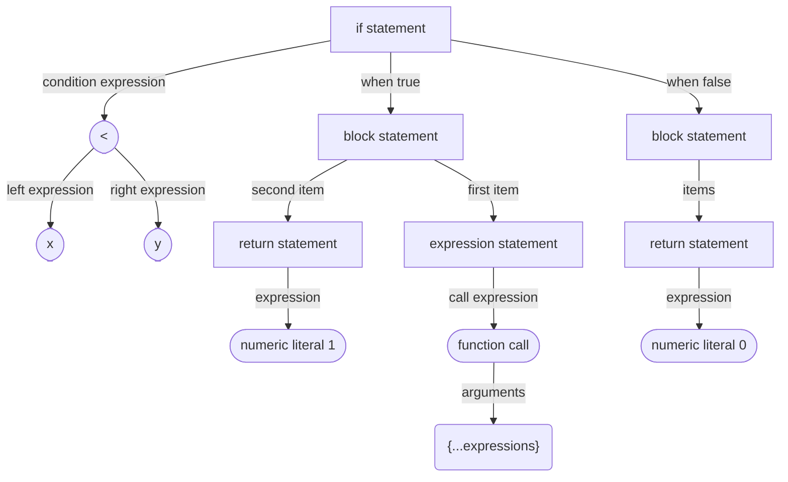
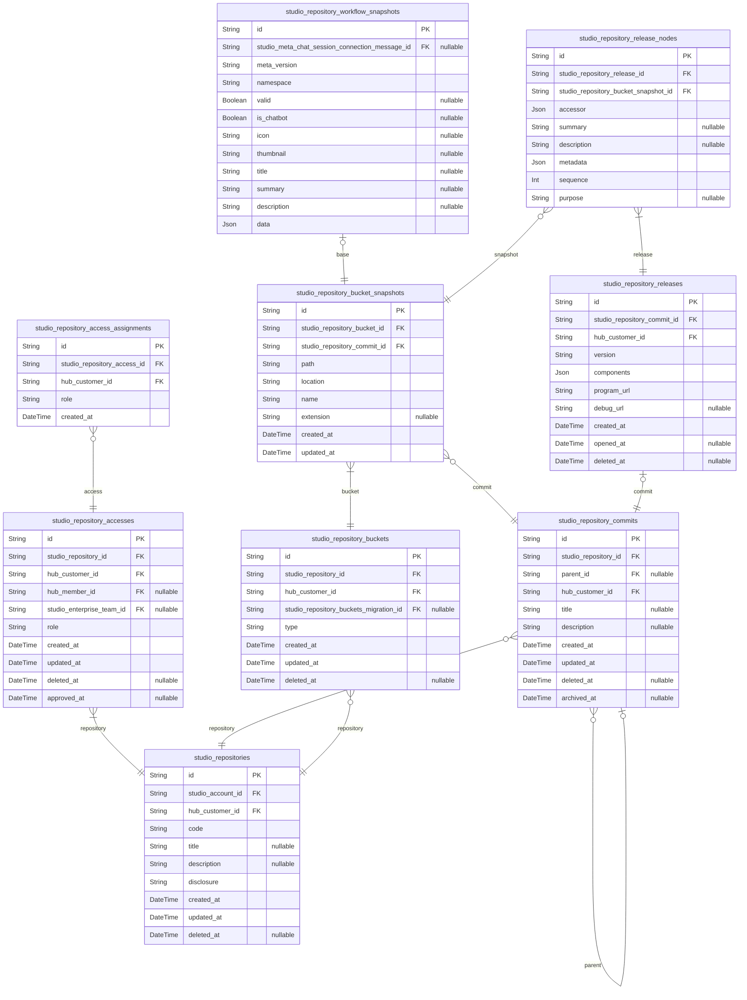
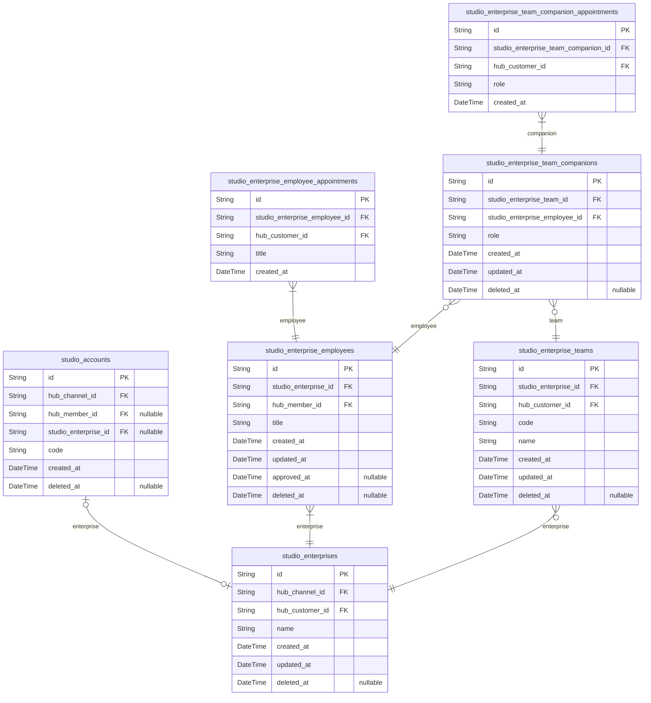

## Summary
In here chapter, we will learn about the schema of the workflow engine.

The "Workflow Engine" is a type of compiler which generates a re-usable program function. And the workflow document must be archived into somewhere repository of some account. Therefore, workflow schemas are categorized into three parts; compiler, repository and belonged account.

At first, the compiler category schemas are represented by AST (Abstract Syntax Tree). The AST is a tree representation of the abstract syntactic structure of source code written in a programming language. The AST is used in the compiler backend to generate the executable program function.

At second, account and repository categorized schemas are similar to the Github account/repository structures. The account schema is literally an account innformation of user or enterprise, and the repository schema is a storage for the workflow documents including commit histories for version control.

By the way, even though the workflow schemas are separated to three parts (compiler, repository and account), they are all started from and interconnected in the workflow document. Therefore, we will learn from the workflow document, the [`IStudioWorkflow`](/api/interfaces/structures_studio_workflows_IStudioWorkflow.IStudioWorkflow-1.html) type.


## Workflow


Workflow document with function metadata.

  - [`IStudioWorkflow`](/api/interfaces/structures_studio_workflows_IStudioWorkflow.IStudioWorkflow-1.html): Workflow document (file)
  - [`IStudioWorkflowData`](/api/interfaces/structures_studio_workflows_IStudioWorkflowData.IStudioWorkflowData-1.html): Function metadata with AST nodes
  - [`IStudioWorkflowParameter`](/api/interfaces/structures_studio_workflows_IStudioWorkflowParameter.IStudioWorkflowParameter.html): Metadata of parameter types
  - [`IStudioWorkflowSwagger`](/api/types/structures_studio_workflows_connectors_IStudioWorkflowSwagger.IStudioWorkflowSwagger-1.html): OpenAPI document used in the workflow for (LLM) function calling

Workflow document is a type of file which is stored into a repository. It is represented by the [`IStudioWorkflow`](/api/interfaces/structures_studio_workflows_IStudioWorkflow.IStudioWorkflow-1.html) type, and contains the `location`, file `name` and `extension` of the workflow document.

The workflow document also has been designed to compile to a re-usable program function. Therefore, the workflow document contains the metadata of the goal function to be compiled. These function metadata informations are stored in the [`IStudioWorkflowData`](/api/interfaces/structures_studio_workflows_IStudioWorkflowData.IStudioWorkflowData-1.html) type, and includes the [parameter types](/api/interfaces/structures_studio_workflows_IStudioWorkflowParameter.IStudioWorkflowParameter.html), return type and description of the function including the AST nodes.

In the workflow document function data, there would be some function call statements to the OpenAPI operations obtained from the [OpenAPI Marketplace](/tech-specs/marketplace/preface). If the workflow document has been generated by [Meta LLM (A.I. Chatbot)](/tech-specs/meta/preface) through [SWL language](/tech-specs/swl/preface), the function call statement must be. In the workflow document, such OpenAPI documents are capsuled into the [`IStudioWorkflowSwagger`](/api/types/structures_studio_workflows_connectors_IStudioWorkflowSwagger.IStudioWorkflowSwagger-1.html) type and their operations are wrapped into the [`IStudioWorkflowSwaggerOperation`](/api/interfaces/structures_studio_workflows_connectors_IStudioWorkflowSwaggerOperation.IStudioWorkflowSwaggerOperation.html) type.


## Statements


AST Statements with geometry info.

  - [`IStudioWorkflowBlockStatement`](/api/interfaces/structures_studio_workflows_nodes_IStudioWorkflowBlockStatement.IStudioWorkflowBlockStatement.html)
  - [`IStudioWorkflowBranchStatement`](/api/interfaces/structures_studio_workflows_nodes_IStudioWorkflowBranchStatement.IStudioWorkflowBranchStatement.html)
  - [`IStudioWorkflowCallStatement`](/api/interfaces/structures_studio_workflows_nodes_IStudioWorkflowCallStatement.IStudioWorkflowCallStatement-1.html)
  - [`IStudioWorkflowSetStatement`](/api/interfaces/structures_studio_workflows_nodes_IStudioWorkflowSetStatement.IStudioWorkflowSetStatement.html)
  - [`IStudioWorkflowForEachStatement`](/api/interfaces/structures_studio_workflows_nodes_IStudioWorkflowForEachStatement.IStudioWorkflowForEachStatement.html)
  - [`IStudioWorkflowWhileStatement`](/api/interfaces/structures_studio_workflows_nodes_IStudioWorkflowWhileStatement.IStudioWorkflowWhileStatement.html)
  - [`IStudioWorkflowRepeatStatement`](/api/interfaces/structures_studio_workflows_nodes_IStudioWorkflowRepeatStatement.IStudioWorkflowRepeatStatement.html)
  - [`IStudioWorkflowReturnStatement`](/api/interfaces/structures_studio_workflows_nodes_IStudioWorkflowReturnStatement.IStudioWorkflowReturnStatement.html)
  - [`IStudioWorkflowSetReturnValueStatement`](/api/interfaces/structures_studio_workflows_nodes_IStudioWorkflowSetReturnValueStatement.IStudioWorkflowSetReturnValueStatement.html)
  - [`IStudioWorkflowBreakStatement`](/api/interfaces/structures_studio_workflows_nodes_IStudioWorkflowBreakStatement.IStudioWorkflowBreakStatement.html)
  - [`IStudioWorkflowContinueStatement`](/api/interfaces/structures_studio_workflows_nodes_IStudioWorkflowContinueStatement.IStudioWorkflowContinueStatement.html)
  - [<i>**`IGeometry2D`**</i>](/api/interfaces/structures_common_IGeometry2D.IGeometry2D.html)

Here is the every statements defined in the workflow document data.

For reference, a statement in the context of an Abstract Syntax Tree (AST) refers to a syntactic construct that represents a single instruction or command in a programming language. Statements are the building blocks of a program's logic and control flow. They can include various types of operations, such as:

  - Assignment Statements: Assigning a value to a variable (e.g., x = 5).
  - Control Flow Statements: Directing the flow of execution (e.g., if, for, while).
  - Function Calls: Invoking a function (e.g., print("Hello, World!")).
  - Return Statements: Specifying the value to be returned from a function (e.g., return x).

In an AST, each statement is represented as a node, and the relationships between statements can be depicted through parent-child connections, reflecting the structure and flow of the program. This representation allows for easier analysis and manipulation of the code during various stages of compilation or interpretation.

By the way, as workflow embodies a visual diagram, the statements are also have the geometry information represented by the [`IGeometry2D`](/api/interfaces/structures_common_IGeometry2D.IGeometry2D.html) type. As the [`IGeometry2D`](/api/interfaces/structures_common_IGeometry2D.IGeometry2D.html) has the position and scale properties, every statement nodes in the workflow diagram can be placed and scaled in the visual editor.


## Expressions
AST Expressions.

  - [`IAstArrayLiteralExpression`](/api/interfaces/structures_ast_expressions_IAstArrayLiteralExpression.IAstArrayLiteralExpression.html)
  - [`IAstBinaryExpression`](/api/interfaces/structures_ast_expressions_IAstBinaryExpression.IAstBinaryExpression-1.html)
  - [`IAstCallExpression`](/api/interfaces/structures_ast_expressions_IAstCallExpression.IAstCallExpression.html)
  - [`IAstConditionalExpression`](/api/interfaces/structures_ast_expressions_IAstConditionalExpression.IAstConditionalExpression.html)
  - [`IAstElementAccessExpression`](/api/interfaces/structures_ast_expressions_IAstElementAccessExpression.IAstElementAccessExpression.html)
  - [`IAstNonNullExpression`](/api/interfaces/structures_ast_expressions_IAstNonNullExpression.IAstNonNullExpression.html)
  - [`IAstObjectLiteralExpression`](/api/interfaces/structures_ast_expressions_IAstObjectLiteralExpression.IAstObjectLiteralExpression.html)
  - [`IAstParenthesizedExpression`](/api/interfaces/structures_ast_expressions_IAstParenthesizedExpression.IAstParenthesizedExpression.html)
  - [`IAstPrefixUnaryExpression`](/api/interfaces/structures_ast_expressions_IAstPrefixUnaryExpression.IAstPrefixUnaryExpression-1.html)
  - [`IAstPostfixUnaryExpression`](/api/interfaces/structures_ast_expressions_IAstPostfixUnaryExpression.IAstPostfixUnaryExpression-1.html)
  - [`IAstPropertyAccessExpression`](/api/interfaces/structures_ast_expressions_IAstPropertyAccessExpression.IAstPropertyAccessExpression.html)
  - [`IAstSpreadElementExpression`](/api/interfaces/structures_ast_expressions_IAstSpreadElementExpression.IAstSpreadElementExpression.html)
  - [`IAstTemplateExpression`](/api/interfaces/structures_ast_expressions_IAstTemplateExpression.IAstTemplateExpression.html)
  - [`IAstIdentifier`](/api/interfaces/structures_ast_composite_IAstIdentifier.IAstIdentifier.html)
  - [`IAstTrueLiteral`](/api/interfaces/structures_ast_composite_IAstTrueLiteral.IAstTrueLiteral.html)
  - [`IAstFalseLiteral`](/api/interfaces/structures_ast_composite_IAstFalseLiteral.IAstFalseLiteral.html)
  - [`IAstNumericLiteral`](/api/interfaces/structures_ast_composite_IAstNumericLiteral.IAstNumericLiteral.html)
  - [`IAstNoSubstitutionTemplateLiteral`](/api/interfaces/structures_ast_composite_IAstNoSubstitutionTemplateLiteral.IAstNoSubstitutionTemplateLiteral.html)
  - [`IAstStringLiteral`](/api/interfaces/structures_ast_composite_IAstStringLiteral.IAstStringLiteral.html)
  - [`IAstNullLiteral`](/api/interfaces/structures_ast_composite_IAstNullLiteral.IAstNullLiteral.html)
  - [`IAstArrayFilterExpression`](/api/interfaces/structures_ast_expressions_IAstArrayFilterExpression.IAstArrayFilterExpression.html)
  - [`IAstArrayFlatExpression`](/api/interfaces/structures_ast_expressions_IAstArrayFlatExpression.IAstArrayFlatExpression.html)
  - [`IAstArrayFunctionParameterIdentifier`](/api/interfaces/structures_ast_composite_IAstArrayFunctionParameterIdentifier.IAstArrayFunctionParameterIdentifier.html)
  - [`IAstArrayFunctionIndexIdentifier`](/api/interfaces/structures_ast_composite_IAstArrayFunctionIndexIdentifier.IAstArrayFunctionIndexIdentifier.html)
  - [`IAstArrayMapExpression`](/api/interfaces/structures_ast_expressions_IAstArrayMapExpression.IAstArrayMapExpression.html)
  - [`IAstObjectFlatExpression`](/api/interfaces/structures_ast_expressions_IAstObjectFlatExpression.IAstObjectFlatExpression.html)
  - [`IAstObjectEntriesExpression`](/api/interfaces/structures_ast_expressions_IAstObjectEntriesExpression.IAstObjectEntriesExpression.html)
  - [`IAstWorkflowParameterIdentifier`](/api/interfaces/structures_ast_composite_IAstWorkflowParameterIdentifier.IAstWorkflowParameterIdentifier.html)
  - [`IAstWorkflowVariableIdentifier`](/api/interfaces/structures_ast_composite_IAstWorkflowVariableIdentifier.IAstWorkflowVariableIdentifier.html)
  - [`IAstWorkflowCallStatementResultIdentifier`](/api/interfaces/structures_ast_composite_IAstWorkflowCallStatementResultIdentifier.IAstWorkflowCallStatementResultIdentifier.html)
  - [`IAstWorkflowEnvironmentVariableIdentifier`](/api/interfaces/structures_ast_composite_IAstWorkflowEnvironmentVariableIdentifier.IAstWorkflowEnvironmentVariableIdentifier.html)
  - [`IAstWorkflowLoopStatementElementIdentifier`](/api/interfaces/structures_ast_composite_IAstWorkflowLoopStatementElementIdentifier.IAstWorkflowLoopStatementElementIdentifier.html)
  - [`IAstWorkflowLoopStatementResultIdentifier`](/api/interfaces/structures_ast_composite_IAstWorkflowLoopStatementResultIdentifier.IAstWorkflowLoopStatementResultIdentifier.html)
  - [`IAstWorkflowSecretIdentifier`](/api/interfaces/structures_ast_composite_IAstWorkflowSecretIdentifier.IAstWorkflowSecretIdentifier.html)
  - [`IAstWorkflowMetadataIdentifier`](/api/interfaces/structures_ast_composite_IAstWorkflowMetadataIdentifier.IAstWorkflowMetadataIdentifier.html)

Here is the every expressions defined in the workflow document data.

For reference, in the context of an Abstract Syntax Tree (AST), an expression is a structure that evaluates to a value. Expressions can range from simple values or variables to complex forms that include operations, function calls, and other expressions. Common types of expressions include:

  - Literal Expressions: Direct values like numbers or strings (e.g., `42`, `"Hello"`).
  - Variable Expressions: References to variables (e.g., `x`).
  - Arithmetic Expressions: Combinations of values and operators (e.g., `x + y, 3 * (a - b)`).
  - Function Call Expressions: Calls to functions that return values (e.g., `max(x, y)`)

Also, as workflow embodies a visual diagram, depth of the expression cannot be infinite like text programming language, and too much complicate structures cannot be drawn by the visual components either. In such reason, you can find some additional expressions in the above list, which does not exist in the text programming languages.

The [`IAstArrayFunctionParameterIdentifier`](/api/interfaces/structures_ast_composite_IAstArrayFunctionParameterIdentifier.IAstArrayFunctionParameterIdentifier.html) type is one of the example case which resolves too much complicated structure for visual expression. It can be combined by many expressions and statements in the text programming language like below, but "Wrtn Studio Pro" resolved it to a single expression for simple visual expression.

```typescript
someArray.forEach((item, i) => {});

// - `CallExpression`
//   - `PropertyAccessExpression`
//     - `Identifier`: someArray
//     - `Identifier`: forEach
//   - `ArrowFunction`
//     - `ParameterDeclaration`: item
//       - `Identifier`
//     - `ParameterDeclaration`: i
//       - `Identifier`
//     - `EqualsGreaterThanToken`
//     - `Block`
```


## Repository Schema


### `studio_repositories`
스튜디오 저장소.

`studio_repositories` 는 스튜디오 시스템 내 개별 저장소를 형상화한 엔티티로써,
온라인 서비스 상 깃허브의 저장소 같은 개념이다. 그리고 물리적으로는
디스크 드라이브에 비유될 수 있는 개념이다.

그리고 저장소는 특정 [계정](#studio_accounts)에 귀속되며, 각각의 저장소를
소유한 계정주는 [회원](#hub_members)일 수도 있고,
[기업](#studio_enterprises)일 수도 있다. 더하여, 저장소를 생성한 계정주는
그 자신 외에도, 저장소의 [접근 권한 제어](#studio_repository_accesses)를
통하여, 동료 [회원](#hub_members)이나
[팀원](#studio_enterprise_teams)들과 해당 저장소를 함께 사용할 수 있다.

**Properties**
  - `id`: Primary Key.
  - `studio_account_id`: 귀속 계정의 [studio_accounts.id](#studio_accounts)
  - `hub_customer_id`: 저장소를 생성한 최초 고객의 [hub_customers.id](#hub_customers)
  - `code`
    > 식별자 코드.
    > 
    > 서비스 상 저장소 URL 주소의 일부 경로에 해당하는 부분.
  - `title`: 저장소 제목
  - `description`: 저장소에 대한 상세 설명
  - `disclosure`
    > 저장소의 공개 수준.
    > 
    > - `public`: 모든 회원이 열람 가능한 공개 저장소.
    > - `protected`: 직원들만 열람 가능한 보호 저장소.
    > - `private`: 권한을 부여받은 이들만 열람 가능한 비공개 저장소.
  - `created_at`: 저장소 생성 일시.
  - `updated_at`: 저장소 편집 일시.
  - `deleted_at`: 저장소 삭제 일시.

### `studio_repository_accesses`
저장소 접근 권한 정보.

`studio_repository_accesses` 는 저장소의 접근 권한 정보를 형상화한 엔티티로써,
[계정주](#studio_accounts)가 [저장소](#studio_accounts)의 권한을 타
[회원](#hub_members)이나 기업의 [팀](#studio_enterprise_teams)에게
나눠줄 때 기록되는 엔티티이다.

참고로 저장소를 생성한 계정주 또한, 접근 권한 제어에 기록되는 대상이다. 즉,
계정주가 저장소를 생성한 그 즉시로, 본 테이블 레코드가 하나 생성되고 시작하는
것.

**Properties**
  - `id`: Primary Key.
  - `studio_repository_id`: 귀속 저장소의 [studio_repositories.id](#studio_repositories)
  - `hub_customer_id`: 접근 권한 제어를 생성한 고객의 [hub_customers.id](#hub_customers)
  - `hub_member_id`: 권한을 공여받은 회원의 [hub_members.id](#hub_members)
  - `studio_enterprise_team_id`: 권한을 공여받은 팀의 [studio_enterprise_teams.id](#studio_enterprise_teams)
  - `role`
    > 부여한 역할.
    > 
    > - `owner`: 저장소의 소유자. 모든 권한을 가진다
    > - `manager`: 저장소의 매니저, 일반 구성원에 대한 권한을 가진다
    > - `member`: 일반 구성원
    > - `observer`: 저장소의 관람자, 오직 읽기만 가능
  - `created_at`: 레코드 생성 일시.
  - `updated_at`: 레코드 편집 일시.
  - `deleted_at`: 레코드 삭제 일시.
  - `approved_at`: 저장소 초대 승인 일시.

### `studio_repository_access_assignments`
저장소의 접근 권한 부여 정보.

`studio_repository_access_assignments` 는 [저장소](#studio_repositories)에
대한 [접근 권한](#studio_repository_accesses) 부여 이력 정보를 형상화한
엔티티이다.

따라서 본 엔티티는 특정 [회원](#hub_members) 또는
[기업 팀](#studio_enterprise_teams)을 대상으로 저장소에 대한 접근 권한을
부여할 때 최초 1회 생명되며, 이후로 해당 권한의 역할을 변경할 때마다 누적된다.

**Properties**
  - `id`: Primary Key.
  - `studio_repository_access_id`: 귀속 저장소 접근 권한 정보의 [studio_repository_accesses.id](#studio_repository_accesses)
  - `hub_customer_id`: 새 역할을 부여한 고객의 [hub_customers.id](#hub_customers).
  - `role`: 새 역할.
  - `created_at`: 레코드 생성 일시.

### `studio_repository_commits`
저장소의 커밋 정보.

[저장소](#studio_repositories)를 구성하는 각각의
[버킷](#studio_repository_buckets)들을 편집하고, 그 이력을 기록하는 행위를
커밋이라고 한다. 그리고 `studio_repository_commits` 는 저장소에
[쓰기 권한](#studio_repository_accesses)을 가진
[고객](#hub_customers)이 행한 커밋 행위를 형상화한 엔티티이다.

즉 본 커밋 레코드가 하나 생성되었다는 것은, 최소 한 개 이상의 버킷이 수정되었고,
그리하여 그들에 대한 [스냅샷 레코드](#studio_repository_bucket_snapshots)들이
새로이 생성되었다는 것을 뜻한다.

단 커밋을 발행하였다하여, 그것이 곧 커밋의 완결을 뜻하는 것은 아니다. 커밋은
그것의 기록 확정 일시를 뜻하는 `archived_at` 속성이 `null` 인 경우에는
버킷들을 계속 수정할 수 있으며, 심지어 현재 수정 중인 커밋을 취소하고 삭제할
수도 있다.

**Properties**
  - `id`: Primary Key.
  - `studio_repository_id`: 귀속 저장소의 [studio_repositories.id](#studio_repositories)
  - `parent_id`: 부모 커밋의 [id](#studio_repository_commits)
  - `hub_customer_id`: 커밋을 푸시한 고객의 [hub_customers.id](#hub_customers)
  - `title`: 커밋의 제목.
  - `description`: 커밋에 대한 설명 서술부.
  - `created_at`: 레코드 생성 일시.
  - `updated_at`: 레코드 수정 일시.
  - `deleted_at`: 레코드 삭제 일시.
  - `archived_at`
    > 커밋 기록 확정 일시.
    > 
    > 커밋의 모든 변경사항을 서버에 기록함으로써, 이를 확정하고 완결짓는다.
    > 
    > 커밋을 기록한 이후로는, 일절 수정 및 삭제가 불가능하다.

### `studio_repository_buckets`
저장소 내 버킷 정보.

`studio_repository_buckets` 는 저장소 내 존재하는 버킷을 형상화한 것으로써,
여기서 말하는 버킷이란 곧, 저장소 내에 배치되는 다양한 폴더 및 파일들을 뜻한다.

그리고 버킷은 최초 생성시, 그리고 그것을 수정하거나 경로를 변경할 때마다, 그
내역을 모두 [스냅샷](#studio_repository_bucket_snapshots)이라는 단위로
저장하여 이를 추적한다. 때문에 버킷의 주 정보 또한 하위
[studio_repository_bucket_snapshots](#studio_repository_bucket_snapshots) 엔티티에 기록되어, 실제로
파일명이나 확장자 및 배치 폴더, 그리고 주 컨텐츠 등의 속성이 모두 스냅샷에
속한다. 또한, 이러한 버킷의 수정은 모두
[커밋](#studio_repository_commits)이라는 단위에 묶여, 한 번에 이루어진다.

또한 여기서 말하는 파일이란, 일반적인 파일 뿐 아니라,
[워크플로우 문서](#studio_repository_bucket_snapshots) 등 특수목적용
파일도 함께 포함된다. 다만 이들에 대한 세부 서브타입 역시, 본 엔티티가 아닌
하위 [studio_repository_bucket_snapshots](#studio_repository_bucket_snapshots) 엔티티로부터 파생된다.

**Properties**
  - `id`: Primary Key.
  - `studio_repository_id`: 귀속 저장소의 [studio_repositories.id](#studio_repositories)
  - `hub_customer_id`: 버킷을 생성한 고객의 [hub_customers.id](#hub_customers)
  - `studio_repository_buckets_migration_id`: Studio1.0 마이그레이션 테이블의 [studio_repository_buckets_migration.id](#studio_repository_buckets_migration)
  - `type`
    > 파일의 유형.
    > 
    > 파일의 타입에 관하여 discriminator 역할을 수행하는 속성이다.
    > 
    > - directory: 디렉터리
    > - file: 일반적인 파일, 커넥터용 TS 소스 파일들도 포함됨
    > - workflow: 워크플로우 문서
  - `created_at`: 레코드 생성 일시.
  - `updated_at`: 레코드 수정 일시.
  - `deleted_at`: 레코드 삭제 일시.

### `studio_repository_bucket_snapshots`
버킷의 스냅샷 정보.

`studio_repository_bucket_snapshots` 는 저장소 내 버킷의 스냅샷을 형상화한
엔티티로써, [고객](#hub_customers)이 [저장소](#studio_repositories)에
[버킷](#studio_repository_buckets)을 새로이 생성하거나 혹은 편집을 가할
때마다 생성된다.

물론, 버킷의 생성 및 수정 등 스냅샷이 변경되는 사건은 개개별별 독립적으로
이루어지는 게 아니라, [커밋](#studio_repository_commits) 단위에 묶여 한번에
이루어진다.

또한 버킷이 그러하였듯, 스냅샷 또한 그 종류에 따라 하위 서브타입들을 가진다.

- [studio_repository_file_snapshots](#studio_repository_file_snapshots): 일반 파일
- [studio_repository_workflow_snapshots](#studio_repository_workflow_snapshots): 워크플로우 문서 파일
- 폴더는 별도 서브타입 레코드 없음

**Properties**
  - `id`: Primary Key.
  - `studio_repository_bucket_id`: 귀속 버킷의 [studio_repository_buckets.id](#studio_repository_buckets)
  - `studio_repository_commit_id`: 귀속 커밋의 [studio_repository_commits.id](#studio_repository_commits)
  - `path`: 버킷의 전체 경로.
  - `location`
    > 버킷의 폴더상 경로.
    > 
    > 참고로 여기서 말하는 폴더상 경로는, 파일의 이름 및 확장자를 제외한 것을 뜻한다.
    > 
    > "foo/bar/baz.tz" 라는 파일이 있다면, 이 중 location 값은 "foo/bar" 인 것.
  - `name`
    > 파일의 이름.
    > 
    > `LICENSE` 와 같이, 파일명을 생략하는 파일의 경우에는 `""` 값 할당.
  - `extension`
    > 파일의 확장자.
    > 
    > `LICENSE` 와 같이, 확장자를 생략하는 파일의 경우에는 `null` 값 할당.
    > 
    > 물론 버킷의 타입이 디렉터리인 경우 또한 그러하다.
  - `created_at`: 레코드 생성 일시.
  - `updated_at`: 레코드 수정 일시.

### `studio_repository_workflow_snapshots`
워크플로우 문서의 스냅샷 레코드.

`studio_repository_workflow_snapshots` 는 워크플로우 문서 파일의 스냅샷을
형상화한 엔티티로써, [studio](#studio) 의 서브타입이다. 문자 그대로 워크플로우
문서의 편집 내역을 기록하여, 워크플로우 문서 파일이 새로이 생성되거나 혹은 수정을
가할 때마다 생성된다.

물론, 워크플로우 문서 파일의 생성 및 수정 등 스냅샷이 변경되는 사건은 개개별별
독립적으로 이루어지는 게 아니라, [커밋](#studio_repository_commits) 단위에
묶여 한 번에 이루어진다.

**Properties**
  - `id`: Primary Key.
  - `studio_meta_chat_session_connection_message_id`
    > 귀속 Meta LLM 채팅 세션 메시지의 [studio_meta_chat_session_connections.id](#studio_meta_chat_session_connections)
    > 
    > 만일 본 워크플로우가 Meta LLM 채팅으로부터 비롯된 것이라면, 해당 
    > [채팅 세션](#studio_meta_chat_sessions)에서 워크플로우를 구성한 
    > [메시지의 ID](#studio_meta_chat_session_connection_messages) 를
    > 기록해주도록 한다.
  - `meta_version`
    > 메타데이터 버전.
    > 
    > 사용자가 정의한 스냅샷의 식별 버전이 아니다. 워크플로우 문서의 자료구조에
    > 대한 버전으로써, 뤼튼의 Studio 시스템이 직접 관리하는 단위.
    > 
    > 다만, Studio 프로젝트가 업그레이드되면서, 구 버전의 워크플로우 문서들도
    > 스케쥴러가 일괄 최신 버전으로 업데이트 해 주기에, 클라이언트 개발자는
    > 이 버전을 굳이 신경 쓸 필요가 없다.
  - `namespace`: 워크플로우 네임스페이스 식별자.
  - `valid`
    > 유효성 여부.
    > 
    > 워크플로우가 실행 가능한 지 여부를 나타낸다.
    > 
    > 최소 compile 이나 execute 함수를 실행해야 그 유효성을 확인할 수 있으며,
    > 그 전까지 본 속성의 값은 `null` 이다.
    > 
    > 물론, 릴리즈된 워크플로우라면, 이 값은 무조건 `true` 일 수 밖에 없다.
  - `is_chatbot`: 챗봇을 위한 워크플로우인지 여부.
  - `icon`: 워크플로우 대표 아이콘 URL.
  - `thumbnail`
    > 워크플로우 썸네일 이미지.
    > 
    > 워크플로우 에디터 상 미니맵 혹은 축소 버전 이미지에 해당한다.
  - `title`: 워크플로우 제목.
  - `summary`: 워크플로우 함수에 대한 요약 설명.
  - `description`: 워크플로우 함수에 대한 상세 설명.
  - `data`
    > 문서 데이터.
    > 
    > DTO 상 `IStudioWorkflowData.ICreate` 타입에 해당.

### `studio_repository_releases`
저장소로부터의 배포 프로그램 정보.

`studio_repository_releases` 는 [저장소](#studio_repositories)에서
특징 [커밋](#hub_repository_commits)을 대상으로 배포한 프로그램을
형상화한 엔티티이다.

따라서 본 `studio_repository_releases` 엔티티에는 저장소를 구성하는 각
파일 버킷의 노드 중, [고객](#hub_customers)이 선택한 요소들을 기점으로
하여 [studio_repository_release_nodes](#studio_repository_release_nodes) 레코드들이 구성된다. 그리고
이들에 대한 메타데이터 (타입) 정보와 함께, 컴파일 및 번들링된 결과물이
저장된다.

이들을 널리 배포하는 것이 바로 릴리즈인 것.

**Properties**
  - `id`: Primary Key.
  - `studio_repository_commit_id`: 배포 대상 커밋의 [studio_repository_commits.id](#studio_repository_commits)
  - `hub_customer_id`: 배포를 실시한 고객의 [hub_customers.id](#hub_customers)
  - `version`: 배포 버전.
  - `components`
    > JSON 스키마 컴포넌트.
    > 
    > 네임드 타입들의 집합.
  - `program_url`
    > 프로그램의 URL 주소.
    > 
    > 현재 구조에서는 프로그램에 해당하는 script가 저장되어있는 s3 uri 주소.
  - `debug_url`: 디버깅 프로그램의 URL 주소.
  - `created_at`: 레코드 생성 일시.
  - `opened_at`: 배포 개시 일시.
  - `deleted_at`: 레코드 삭제 일시.

### `studio_repository_release_nodes`
저장소 배포 프로그램을 구성하는 개별 노드.

`studio_repository_release_nodes` 는 저장소에서 배포한 프로그램 내,
사용자가 지정하여 배출 (`export`) 한 프로그래밍 노드들을 형상화한 엔티티이다.

참고로 배출 가능한 노드의 종류로는 사용자 정의 함수와, 워크플로우 문서가 있다.
물론 [워크플로우 문서](#studio_repository_workflow_snapshots) 또한 
빌드 결과물이 단일 함수로 귀결되기에, 결국 노드란 곧 본 저장소로부터 배출된
재사용 가능한 함수를 뜻한다.

또한, 배출된 노드는 각각이 고유한 Rest API 상 endpoint 를 가진다. 따라서
저장소의 각 노드는 다른 프로그램에서 `import` 하여 사용할 수도 있지만,
Rest API 를 통하여 외부에서 호출하는 것도 가능하다. 그리고 이를
Generative Hub 의 [매물](#hub_sales)로 등록, 판매하는 것도 가능하다.

**Properties**
  - `id`: Primary Key.
  - `studio_repository_release_id`: 귀속 릴리즈 레코드의 [studio_repository_releases.id](#studio_repository_releases)
  - `studio_repository_bucket_snapshot_id`: 대상 버킷 스냅샷의 [studio_repository_buckets.id](#studio_repository_buckets)
  - `accessor`
    > 대상 함수에의 접근자.
    > 
    > 노드가 대상으로 하는 객체의 접근자를 `IAstExpression` 타입으로 표현한 것.
    > 
    > 가령 대상 객체(함수)의 이름이 "compute" 인데, 해당 파일로부터 최상위
    > 스코프에서 바로 export 된 것이라면, 그 타입은 `IAstIdentifier 가 된다.
    > 반대로 re-export 되었거나 혹은 특정 namespace 로부터 export 되었다면,
    > 그 때는 `IAstPropertyAccessExpression` 이 되거나 하는 식이다.
    > 
    > ```typescript
    > { type: "Identifier", text: "compute" }
    > {
    > type: "PropertyAccessExpression",
    > expression: { type: "Identifier", text: "Mathmatics" },
    > questionDotToken: null,
    > name: { type: "Identifier", text: "compute" },
    > }
    > ```
  - `summary`: 요약 설명문.
  - `description`: 상세 설명문.
  - `metadata`
    > 메타데이터 정보.
    > 
    > 대상 노드가 함수인 경우에는 파라미터와 리턴 타입 등의 정보가 담긴다.
    > 
    > 자세한 내용은 관련 DTO 를 참고할 것.
  - `sequence`: 귀속 릴리즈 내 배치 순서.
  - `purpose`: 추출 목적


## Account Schema


### `studio_accounts`
계정 엔티티.

`studio_accounts` 는 스튜디오 시스템의 계정을 형상화한 엔티티이다. 계정은 고유
식별자 코드를 가지는 하나의 주체 단위로써, [저장소](#studio_repositories)
등을 소유할 수 있다. 가령 깃허브에서 특정 저장소의 주소가
https://github.com/samchon/typia 라면, 이 중 `samchon` 이 계정의
식별자이자, `typia` 라는 저장소의 소유 주체인 것.

그리고 여기서 말하는 계정이란, 그 주체가 반드시 사람을 지칭하지 않는다.
계정주가 [회원](#hub_members)일 수도 있지만,
[기업](#studio_enterprises)일 수도 있기 때문이다. 예를 들어
https://github.com/Microsoft/TypeScript 의 경우, 계정주가 사람이 아닌,
기업인 마이크로소프트가 된다.

이외에 계정은 그 소유주를 바꿀 수 있다. 그리고 소유주를 바꿀 때, 그 주체가
개인에서 기업으로 변경되는 것 또한 가능하다. 예를 들어 개인으로 시작했던
계정과 저장소가 흥행하여, 향후 기업으로 승격하는 경우가 그러하다.

**Properties**
  - `id`: Primary Key.
  - `hub_channel_id`: 귀속 채널의 [hub_channels.id](#hub_channels)
  - `hub_member_id`: 계정주 회원의 [hub_members.id](#hub_members) ID.
  - `studio_enterprise_id`: 계정주 기업의 [studio_enterprises.id](#studio_enterprises) ID.
  - `code`
    > 식별자 코드.
    > 
    > 서비스 상, URL 주소의 일부 경로에 해당하는 부분.
  - `created_at`: 계정 생성 일시.
  - `deleted_at`: 레코드 삭제 일시.

### `studio_enterprises`
기업 엔티티.

`studio_enterprises` 는 기업을 형상화한 엔티티로써, 문자 그대로 회사 단위로
본 스튜디오 시스템에 참여하는 주체를 뜻한다. 그리고 기업의 경우는
[회원](#hub_members) 때와 달리, 반드시 [계정](#studio_accounts)을
소유하고 있어야 한다.

또한 기업은 하위 엔티티로, [직원](#studio_enterprise_employees) 및
그들로 구성된 [팀](#studio_enterprise_teams)을 가진다. 그리고 이 중
팀은 그 [구성원](#studio_enterprise_team_companions)들이 단체로 기업
귀속 [저장소](#studio_repositories)의 동일한
[접근 권한](#studio_repository_accesses)을 가질 수 있다.

**Properties**
  - `id`: Primary Key.
  - `hub_channel_id`: 귀속 채널의 [hub_channels.id](#hub_channels)
  - `hub_customer_id`: 기업을 생성한 고객의 [hub_customers.id](#hub_customers)
  - `name`: 기업명.
  - `created_at`: 레코드 생성 일시.
  - `updated_at`: 레코드 편집 일시.
  - `deleted_at`: 레코드 삭제 일시.

### `studio_enterprise_employees`
기업 내 직원 엔티티.

`studio_enterprise_employees` 는 기업에 소속된 직원을 형상화한 엔티티이다.
직원은 기업 내 각 [팀](#studio_enterprise_team)에
[소속](#studio_enterprise_team_commpanions)되어 활동하며, 팀 단위로 기업의
[저장소](#studio_repositories)로부터 [권한](#studio_repository_accesses)을
부여받는다.

참고로 직원은 오직, 본 스튜디오 시스템에 [회원](#hub_members)으로써 가입한
사람만이 [임명](#studio_enterprise_employee_appointments)될 수 있으며,
한 사람이 여러 회사에 동시에 직원으로 소속되는 것이 가능하다.

**Properties**
  - `id`: Primary Key.
  - `studio_enterprise_id`: 귀속 기업의 [studio_enterprises.id](#studio_enterprises)
  - `hub_member_id`: 대상 직원의 회원 [hub_members.id](#hub_members)
  - `title`
    > 직책.
    > 
    > - `owner`: 기업의 소유자. 모든 권한을 가진다
    > - `manager`: 기업의 매니저, 일반 구성원에 대한 권한을 가진다
    > - `member`: 일반 구성원
    > - `observer`: 관람자, 오직 읽기만 가능
  - `created_at`: 직원 최초 초대 일시.
  - `updated_at`: 레코드 수정 일시.
  - `approved_at`: 직원 초대 수락 일시.
  - `deleted_at`: 레코드 삭제 일시.

### `studio_enterprise_employee_appointments`
직원 임명 정보.

`studio_enterprise_employee_appointments` 는 [기업](#studio_enterprises) 내
[직원](#studio_enterprise_employees)의 임명 및 직책 변경 정보에 대한 이력을
형상화한 엔티티이다.

따라서 본 엔티티 레코드는 기업이 직원을 임명할 때 최초 1회 생성되며,
이후로 직원의 직책을 변경할 때마다 누적된다.

**Properties**
  - `id`: Primary Key.
  - `studio_enterprise_employee_id`: 대상 직원의 [studio_enterprise_employees.id](#studio_enterprise_employees)
  - `hub_customer_id`: 직원을 임명 또는 직책 변경한 고객의 [hub_customers.id](#hub_customers)
  - `title`: 부여한 직책.
  - `created_at`: 레코드 생성 일시.

### `studio_enterprise_teams`
기업 내 팀 정보.

`studio_enterprise_teams` 는 [기업](#studio_enterprises) 내 팀을 형상화한 엔티티이다.
팀은 [구성원](#studio_enterprise_team_companions)으로써
[직원](#hub_employees)들을 거느리며, 팀 단위로 기업의
[저장소](#studio_repositories)로부터 [권한](#studio_repository_accesses)을
부여받아 활동할 수 있다.

**Properties**
  - `id`: Primary Key.
  - `studio_enterprise_id`: 귀속 기업의 [studio_enterprises.id](#studio_enterprises)
  - `hub_customer_id`: 팀을 생성한 고객의 [hub_customers.id](#hub_customers)
  - `code`
    > 팀의 식별자 코드.
    > 
    > 팀 페이지의 URL 주소상 경로의 일부분에 해당.
  - `name`: 팀명.
  - `created_at`: 레코드 생성 일시.
  - `updated_at`: 레코드 수정 일시.
  - `deleted_at`: 레코드 삭제 일시.

### `studio_enterprise_team_companions`
기업 내 팀의 구성원 정보.

`studio_enterprise_team_companions` 는 [기업](#studio_enterprises)을 구성하는 각
[팀](#studio_enterprise_teams)에, 어떤 [직원](#studio_enterprise_employees)들이
구성원으로 참여하는 지를 형상화한 엔티티이다.

참고로 직원은 팀에 구성원으로 참여하며, 모종의 역할을 부여받는데, 이는 그들의 고유
직책과 상이할 수 있다. 또한 기업의 직원은, 동시에 여러 팀에 소속되는 것이 가능하다.
이는 한 명의 [회원](#hub_members)이 여러 회사에 동시에 직원으로 임명되는게
가능했던 것과 유사.

**Properties**
  - `id`: Primary Key.
  - `studio_enterprise_team_id`: 귀속 팀의 [studio_enterprise_teams.id](#studio_enterprise_teams)
  - `studio_enterprise_employee_id`: 대상 직원의 [studio_enterprise_employees.id](#studio_enterprise_employees)
  - `role`
    > 부여된 역할.
    > 
    > - `chief`: 팀장
    > - `manager`: 매니저, 일반 구성원에 대한 권한을 가짐
    > - `member`: 일반 구성원
    > - `observer`: 관람자, 오직 읽기만 가능
  - `created_at`: 레코드 생성 일시.
  - `updated_at`: 레코드 수정 일시.
  - `deleted_at`: 레코드 삭제 일시.

### `studio_enterprise_team_companion_appointments`
기업 내 팀 구성원의 임명 정보.

`studio_enterprise_team_companion_appointments` 는 [기업](#studio_enterprises) 내
[팀 구성원](#studio_enterprise_team_companions)의 임명 및 역할 변경 정보에 대한
이력을 형상화한 엔티티이다.

따라서 본 엔티티 레코드는 팀이 구성원을 임명할 때 최초로 생명되며, 이후로 구성원의
역할을 변경할 때마다 누적된다.

**Properties**
  - `id`: Primary Key.
  - `studio_enterprise_team_companion_id`: 대상 팀 구성원의 [studio_enterprise_team_companions.id](#studio_enterprise_team_companions)
  - `hub_customer_id`: 팀 구성원을 임명 또는 역할 변경한 고객의 [hub_customers.id](#hub_customers)
  - `role`: 부여한 역할.
  - `created_at`: 레코드 생성 일시.